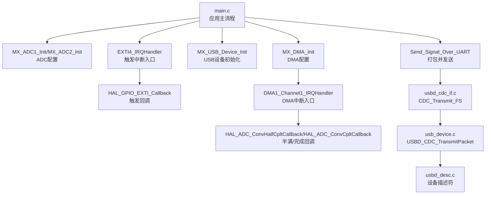
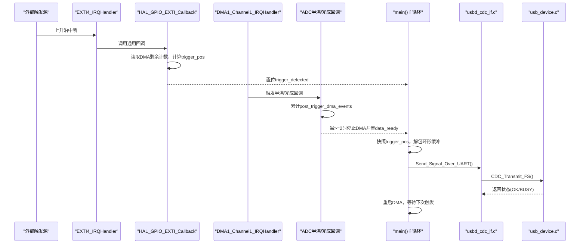
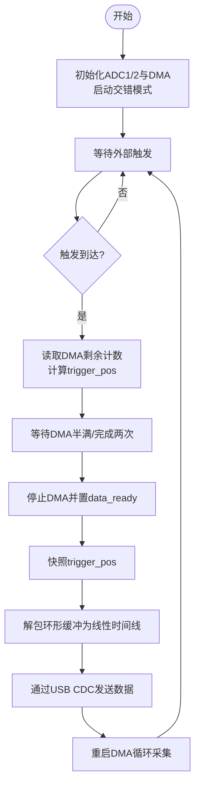
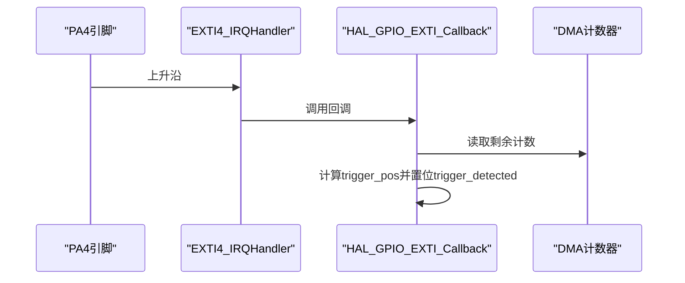
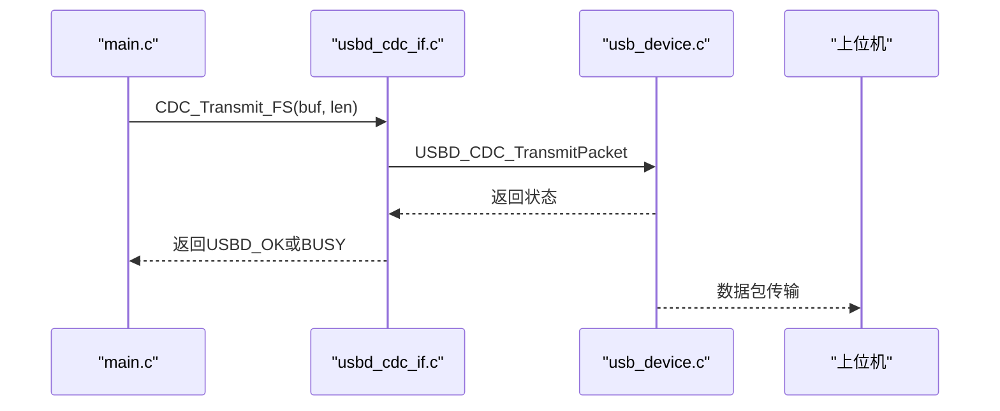
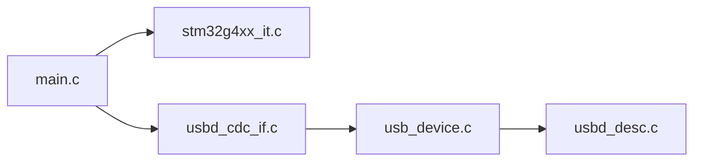

# 项目介绍和目标

<cite>
**本文引用的文件列表**   
- [Core/Src/main.c](file://Core/Src/main.c)
- [Core/Inc/main.h](file://Core/Inc/main.h)
- [Core/Src/stm32g4xx_it.c](file://Core/Src/stm32g4xx_it.c)
- [USB_Device/App/usbd_cdc_if.c](file://USB_Device/App/usbd_cdc_if.c)
- [USB_Device/App/usb_device.c](file://USB_Device/App/usb_device.c)
- [USB_Device/App/usbd_desc.c](file://USB_Device/App/usbd_desc.c)
- [CMakeLists.txt](file://CMakeLists.txt)
</cite>

## 目录
1. [引言](#引言)
2. [项目结构](#项目结构)
3. [核心组件](#核心组件)
4. [架构总览](#架构总览)
5. [详细组件分析](#详细组件分析)
6. [依赖关系分析](#依赖关系分析)
7. [性能考量](#性能考量)
8. [故障排查指南](#故障排查指南)
9. [结论](#结论)

## 引言
本项目面向高性能超声波信号采集与实时传输需求，基于STM32G474微控制器实现：
- 双通道交错ADC采样，等效采样率可达8 MSPS（每通道）
- 亚微秒级触发检测精度，利用外部中断捕获触发时刻
- DMA环形缓冲管理，避免CPU参与数据搬运
- USB CDC虚拟串口实时数据传输，便于上位机接收与分析

系统采用“硬件触发 + DMA循环采集 + 中断后处理”的架构，在保证低延迟的同时降低CPU占用，适用于需要高精度时间戳和连续波形记录的工业检测、无损探伤、测距等场景。

## 项目结构
工程由应用层、外设驱动层与USB设备库组成，主要目录与职责如下：
- Core：应用主程序、时钟与外设初始化、中断服务函数
- Drivers：HAL/LL驱动与CMSIS内核支持
- Middlewares：USB设备库核心与CDC类实现
- USB_Device：应用侧USB设备初始化、描述符与CDC接口适配
- CMake构建脚本：定义编译选项、链接与生成HEX/BIN

图表来源
- [Core/Src/main.c:219-290](file://Core/Src/main.c#L219-L290)
- [Core/Src/stm32g4xx_it.c:205-228](file://Core/Src/stm32g4xx_it.c#L205-L228)
- [USB_Device/App/usbd_cdc_if.c:281-293](file://USB_Device/App/usbd_cdc_if.c#L281-L293)
- [USB_Device/App/usb_device.c:66-88](file://USB_Device/App/usb_device.c#L66-L88)
- [USB_Device/App/usbd_desc.c:132-141](file://USB_Device/App/usbd_desc.c#L132-L141)

章节来源
- [Core/Src/main.c:219-290](file://Core/Src/main.c#L219-L290)
- [CMakeLists.txt:1-77](file://CMakeLists.txt#L1-L77)

## 核心组件
- 双通道交错ADC（ADC1/ADC2）
  - 模式：双通道交错（INTERL），单通道12位分辨率，右对齐
  - 时钟分频：PCLK同步分频为1，确保最高转换速率
  - 连续转换：开启，配合DMA持续写入环形缓冲
  - 通道：两通道均配置为差分输入，采样时间极短以降低孔径误差
- DMA环形缓冲
  - 使用DMA1通道1将ADC1/ADC2交错结果打包为32位字（低16位=ADC1，高16位=ADC2）
  - 缓冲区大小120个uint32_t，对应240个样本（交错）
  - 半满与完成中断用于统计触发后的数据量，保证至少80个后置样本
- 外部触发与时间戳
  - PA4上升沿触发，进入EXTI4中断
  - 在ISR中读取DMA剩余计数，计算环形缓冲中的触发位置，实现亚微秒级时间戳
- USB CDC实时传输
  - 设备枚举为虚拟串口，提供CDC_Transmit_FS接口
  - 主循环将解码后的线性时间线转换为十进制字符串，逐行发送

章节来源
- [Core/Src/main.c:344-464](file://Core/Src/main.c#L344-L464)
- [Core/Src/main.c:469-481](file://Core/Src/main.c#L469-L481)
- [Core/Src/main.c:488-520](file://Core/Src/main.c#L488-L520)
- [Core/Src/main.c:52-70](file://Core/Src/main.c#L52-L70)
- [USB_Device/App/usbd_cdc_if.c:281-293](file://USB_Device/App/usbd_cdc_if.c#L281-L293)

## 架构总览
系统以“事件驱动+DMA零拷贝”为核心思想：
- 启动阶段：初始化系统时钟、GPIO、DMA、ADC1/2、USB CDC，并启动交错ADC的DMA循环采集
- 运行阶段：
  - 外部触发到达时，EXTI ISR快速记录触发位置
  - DMA半满/完成回调累计后置样本数，达到阈值后停止DMA并置位数据就绪标志
  - 主循环检测到数据就绪后，快照触发位置，解包环形缓冲为线性时间线，并通过USB CDC批量发送
  - 完成后重启DMA，等待下一次触发

图表来源
- [Core/Src/stm32g4xx_it.c:205-228](file://Core/Src/stm32g4xx_it.c#L205-L228)
- [Core/Src/main.c:91-149](file://Core/Src/main.c#L91-L149)
- [Core/Src/main.c:259-290](file://Core/Src/main.c#L259-L290)
- [USB_Device/App/usbd_cdc_if.c:281-293](file://USB_Device/App/usbd_cdc_if.c#L281-L293)
- [USB_Device/App/usb_device.c:66-88](file://USB_Device/App/usb_device.c#L66-L88)

## 详细组件分析

### 双通道交错ADC与DMA环形缓冲
- 设计要点
  - 交错模式使两个ADC在同一转换周期内交替工作，提升有效采样率
  - DMA将两通道结果打包为32位字，低16位为ADC1，高16位为ADC2，简化后续解包
  - 环形缓冲避免溢出，触发后可根据位置回溯前置样本
- 关键参数
  - 缓冲区大小：120个uint32_t（240个样本）
  - 前置样本：约80个（10 us @ 8 MSPS）
  - 后置样本：约160个（20 us @ 8 MSPS）
- 复杂度
  - 解包过程O(N)，N为缓冲区长度；由于N固定且较小，开销可控

图表来源
- [Core/Src/main.c:344-464](file://Core/Src/main.c#L344-L464)
- [Core/Src/main.c:469-481](file://Core/Src/main.c#L469-L481)
- [Core/Src/main.c:52-70](file://Core/Src/main.c#L52-L70)
- [Core/Src/main.c:156-171](file://Core/Src/main.c#L156-L171)
- [Core/Src/main.c:259-290](file://Core/Src/main.c#L259-L290)

章节来源
- [Core/Src/main.c:344-464](file://Core/Src/main.c#L344-L464)
- [Core/Src/main.c:469-481](file://Core/Src/main.c#L469-L481)
- [Core/Src/main.c:52-70](file://Core/Src/main.c#L52-L70)
- [Core/Src/main.c:156-171](file://Core/Src/main.c#L156-L171)
- [Core/Src/main.c:259-290](file://Core/Src/main.c#L259-L290)

### 触发检测与时间戳
- 触发路径
  - PA4配置为上升沿中断，优先级设为最高，确保最小抖动与延迟
  - EXTI4_IRQHandler调用HAL通用回调，在回调中读取DMA剩余计数并计算触发位置
- 防抖与重入保护
  - 在UART传输期间忽略触发，避免回波误触发
  - 首次触发后屏蔽后续边沿，直到数据处理完成
- 后置样本保障
  - 通过DMA半满与完成回调计数，确保至少80个后置样本后再停止DMA

图表来源
- [Core/Src/stm32g4xx_it.c:205-214](file://Core/Src/stm32g4xx_it.c#L205-L214)
- [Core/Src/main.c:91-113](file://Core/Src/main.c#L91-L113)

章节来源
- [Core/Src/stm32g4xx_it.c:205-214](file://Core/Src/stm32g4xx_it.c#L205-L214)
- [Core/Src/main.c:91-113](file://Core/Src/main.c#L91-L113)

### USB CDC实时数据传输
- 设备描述符
  - 厂商、产品、序列号等字符串描述符由usbd_desc.c提供
  - 设备类设置为CDC，接口类型为虚拟串口
- 传输流程
  - 应用层构造输出缓冲区（每个样本一行十进制字符串）
  - 调用CDC_Transmit_FS进行非阻塞发送，若端点忙则重试
  - USB底层通过USBD_CDC_TransmitPacket将数据推送到主机

图表来源
- [USB_Device/App/usbd_cdc_if.c:281-293](file://USB_Device/App/usbd_cdc_if.c#L281-L293)
- [USB_Device/App/usb_device.c:66-88](file://USB_Device/App/usb_device.c#L66-L88)
- [USB_Device/App/usbd_desc.c:132-141](file://USB_Device/App/usbd_desc.c#L132-L141)

章节来源
- [USB_Device/App/usbd_cdc_if.c:281-293](file://USB_Device/App/usbd_cdc_if.c#L281-L293)
- [USB_Device/App/usb_device.c:66-88](file://USB_Device/App/usb_device.c#L66-L88)
- [USB_Device/App/usbd_desc.c:132-141](file://USB_Device/App/usbd_desc.c#L132-L141)

### 系统时钟与电源
- 内部振荡器HSI与HSI48启用，PLL倍频至系统所需频率
- 电压调节器设置为Scale1，平衡功耗与性能
- SYSCLK、AHB、APB分频均为1，确保外设时钟满足高速ADC与USB需求

章节来源
- [Core/Src/main.c:296-337](file://Core/Src/main.c#L296-L337)

## 依赖关系分析
- main.c依赖
  - HAL库：ADC、DMA、GPIO、USB PCD
  - USB设备库：CDC类与描述符
  - 中断向量表：EXTI4、DMA1_Channel1、USB_LP
- 模块耦合
  - main.c与stm32g4xx_it.c通过全局变量与回调函数通信
  - USB层通过函数指针注册接口，保持松耦合

图表来源
- [Core/Src/main.c:219-290](file://Core/Src/main.c#L219-L290)
- [Core/Src/stm32g4xx_it.c:205-228](file://Core/Src/stm32g4xx_it.c#L205-L228)
- [USB_Device/App/usbd_cdc_if.c:281-293](file://USB_Device/App/usbd_cdc_if.c#L281-L293)
- [USB_Device/App/usb_device.c:66-88](file://USB_Device/App/usb_device.c#L66-L88)
- [USB_Device/App/usbd_desc.c:132-141](file://USB_Device/App/usbd_desc.c#L132-L141)

章节来源
- [Core/Src/main.c:219-290](file://Core/Src/main.c#L219-L290)
- [Core/Src/stm32g4xx_it.c:205-228](file://Core/Src/stm32g4xx_it.c#L205-L228)
- [USB_Device/App/usbd_cdc_if.c:281-293](file://USB_Device/App/usbd_cdc_if.c#L281-L293)
- [USB_Device/App/usb_device.c:66-88](file://USB_Device/App/usb_device.c#L66-L88)
- [USB_Device/App/usbd_desc.c:132-141](file://USB_Device/App/usbd_desc.c#L132-L141)

## 性能考量
- 采样率与时钟
  - 双通道交错模式下，ADC时钟分频为1，可接近芯片极限采样率
  - 建议在实际应用中验证HSI/PLL稳定性，必要时引入外部晶振以提升时序精度
- DMA与内存访问
  - 环形缓冲位于RAM，避免频繁读写Flash
  - 解包过程尽量精简，减少主循环耗时
- USB带宽与吞吐
  - 全速USB CDC最大理论带宽约1.5 Mbps，实际受主机与线缆影响
  - 建议在上位机侧进行批处理与缓存，避免频繁小帧导致丢包
- 触发抖动与噪声抑制
  - 硬件前端需具备合适的滤波与放大电路，降低触发抖动
  - 可在软件层面增加迟滞比较或数字滤波，提高鲁棒性

[本节为通用指导，不直接分析具体文件]

## 故障排查指南
- 无数据输出
  - 检查USB设备是否被识别为虚拟串口，确认描述符配置正确
  - 查看CDC_Transmit_FS返回值是否为USBD_OK，若为BUSY需重试
- 触发无效或重复触发
  - 确认PA4中断优先级设置与去抖逻辑
  - 检查uart_busy标志是否正确屏蔽传输期间的触发
- 数据不完整或错位
  - 核对DMA环形缓冲大小与触发位置计算逻辑
  - 验证半满/完成回调计数是否达到阈值再停止DMA
- 系统异常复位
  - 检查Error_Handler是否被调用，定位错误码
  - 确认堆栈与中断嵌套未超出限制

章节来源
- [Core/Src/main.c:530-539](file://Core/Src/main.c#L530-L539)
- [USB_Device/App/usbd_cdc_if.c:281-293](file://USB_Device/App/usbd_cdc_if.c#L281-L293)
- [Core/Src/main.c:91-149](file://Core/Src/main.c#L91-L149)

## 结论
本项目以STM32G474为核心，结合双通道交错ADC、DMA环形缓冲与USB CDC，实现了高性能、低延迟的超声波信号采集与实时传输方案。其设计理念强调“硬件触发+DMA零拷贝+中断后处理”，在保证亚微秒级触发精度的同时，显著降低CPU负载，适合对时间与带宽有严格要求的应用场景。对于初学者，可从理解触发路径与DMA数据流入手；对于有经验的开发者，可进一步优化时钟与USB吞吐，扩展多通道与更复杂的信号处理算法。