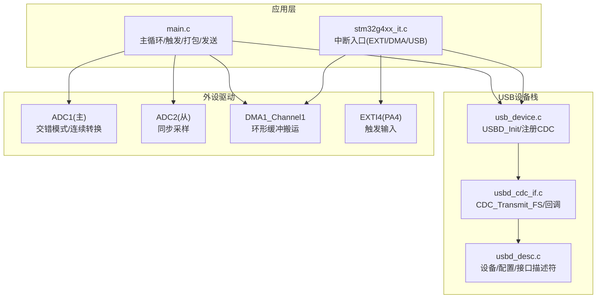
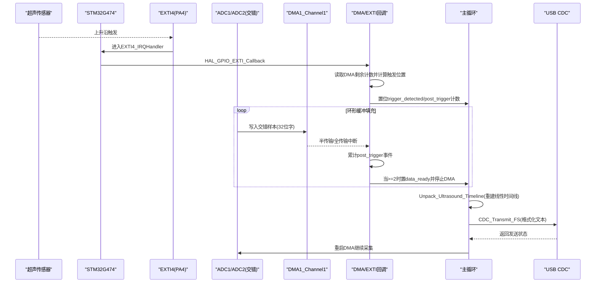
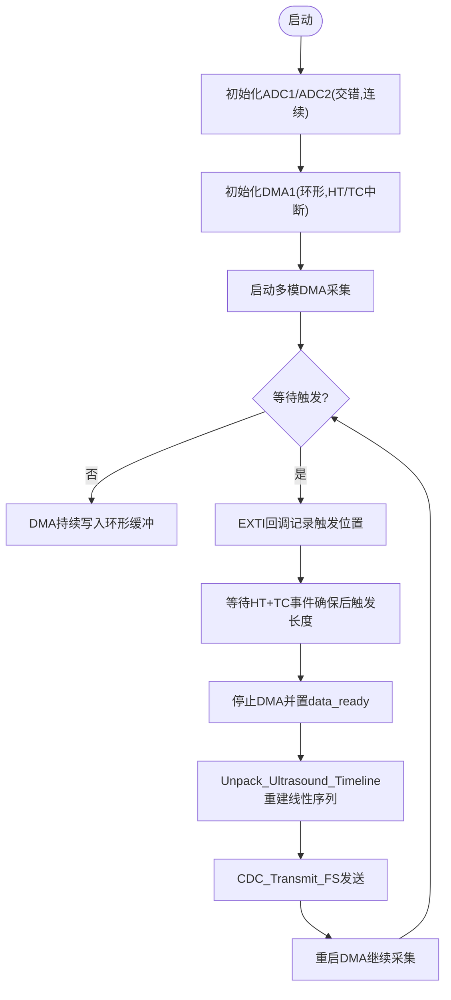
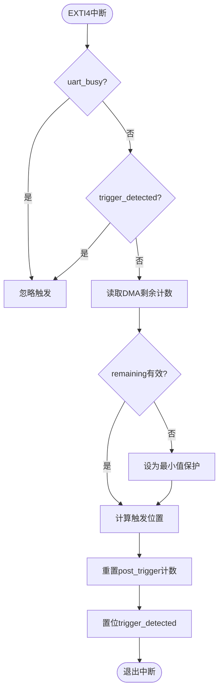
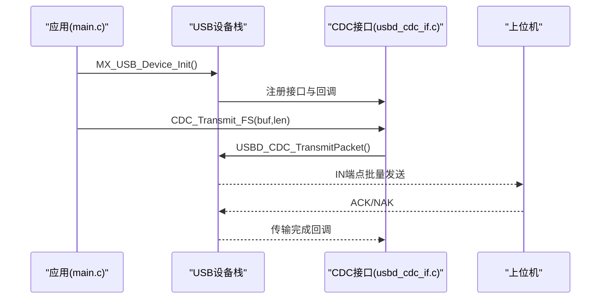
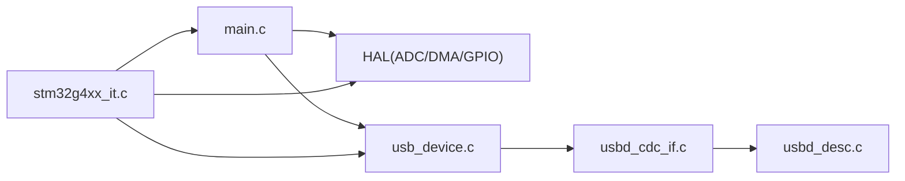

# 项目概述

<cite>
**本文引用的文件**   
- [Core/Src/main.c](file://Core/Src/main.c)
- [Core/Inc/main.h](file://Core/Inc/main.h)
- [Core/Src/stm32g4xx_it.c](file://Core/Src/stm32g4xx_it.c)
- [USB_Device/App/usbd_cdc_if.c](file://USB_Device/App/usbd_cdc_if.c)
- [USB_Device/App/usb_device.c](file://USB_Device/App/usb_device.c)
- [USB_Device/App/usbd_desc.c](file://USB_Device/App/usbd_desc.c)
- [CMakeLists.txt](file://CMakeLists.txt)
- [CMakePresets.json](file://CMakePresets.json)
- [cmake/gcc-arm-none-eabi.cmake](file://cmake/gcc-arm-none-eabi.cmake)
</cite>

## 目录
1. [简介](#简介)
2. [项目结构](#项目结构)
3. [核心组件](#核心组件)
4. [架构总览](#架构总览)
5. [详细组件分析](#详细组件分析)
6. [依赖关系分析](#依赖关系分析)
7. [性能与实时性考量](#性能与实时性考量)
8. [故障排查指南](#故障排查指南)
9. [结论](#结论)
10. [附录：快速开始](#附录快速开始)

## 简介
本项目面向STM32G474的超声波信号采集，目标是在不占用CPU的前提下完成高吞吐、低延迟的数据采集与传输。系统采用双通道交错ADC（ADC1主/ADC2从）实现等效8MSPS采样率，结合DMA环形缓冲与EXTI硬件触发，在检测到超声回波前沿后捕获“预触发+后触发”时间窗内的完整波形，并通过USB CDC将数据以文本形式发送到上位机进行可视化与分析。

关键特性
- 8MSPS双通道交错ADC采样（ADC1/ADC2交替采样，单通道12位分辨率）
- 实时触发检测（EXTI上升沿捕获，精确记录触发时刻在环形缓冲中的位置）
- DMA环形缓冲管理（半传输/全传输中断保障后触发数据完整性）
- USB CDC数据传输（每帧约240个样本，逐行十进制字符串输出）

适用对象
- 初学者：提供概念性说明与快速上手步骤
- 有经验的开发者：给出数据流、时序与关键实现细节

## 项目结构
工程基于STM32CubeMX生成，采用分层组织方式：
- Core：应用主循环、外设初始化、中断处理
- Drivers：HAL/LL库与CMSIS内核支持
- Middlewares：USB设备库（CDC类）
- USB_Device：USB设备描述符、CDC接口适配
- cmake：构建工具链与预设

图表来源
- [Core/Src/main.c:219-290](file://Core/Src/main.c#L219-L290)
- [Core/Src/stm32g4xx_it.c:205-228](file://Core/Src/stm32g4xx_it.c#L205-L228)
- [USB_Device/App/usb_device.c:66-88](file://USB_Device/App/usb_device.c#L66-L88)
- [USB_Device/App/usbd_cdc_if.c:281-293](file://USB_Device/App/usbd_cdc_if.c#L281-L293)
- [USB_Device/App/usbd_desc.c:132-141](file://USB_Device/App/usbd_desc.c#L132-L141)

章节来源
- [Core/Src/main.c:219-290](file://Core/Src/main.c#L219-L290)
- [USB_Device/App/usb_device.c:66-88](file://USB_Device/App/usb_device.c#L66-L88)

## 核心组件
- 数据采集路径
  - ADC1/ADC2配置为双通道交错模式，时钟分频使能，连续转换，DMA持续请求
  - DMA1将交错后的32位字写入环形缓冲：低16位=ADC1，高16位=ADC2
- 触发与时间窗
  - PA4外部中断（上升沿）作为触发源；ISR中读取DMA剩余计数，计算触发点在环形缓冲中的索引
  - 通过半传输/全传输事件计数确保至少采集到足够的后触发样本
- 数据处理与传输
  - 主循环等待“数据就绪”标志，按触发快照重建线性时间线（前/后触发窗口）
  - 将240个样本格式化为十进制字符串，调用CDC_Transmit_FS一次性发送

章节来源
- [Core/Src/main.c:344-464](file://Core/Src/main.c#L344-L464)
- [Core/Src/main.c:469-481](file://Core/Src/main.c#L469-L481)
- [Core/Src/main.c:488-520](file://Core/Src/main.c#L488-L520)
- [Core/Src/main.c:91-113](file://Core/Src/main.c#L91-L113)
- [Core/Src/main.c:119-131](file://Core/Src/main.c#L119-L131)
- [Core/Src/main.c:156-171](file://Core/Src/main.c#L156-L171)
- [Core/Src/main.c:178-212](file://Core/Src/main.c#L178-L212)
- [Core/Src/main.c:259-290](file://Core/Src/main.c#L259-L290)

## 架构总览
下图展示从传感器触发到USB输出的端到端数据流。

图表来源
- [Core/Src/main.c:91-113](file://Core/Src/main.c#L91-L113)
- [Core/Src/main.c:119-131](file://Core/Src/main.c#L119-L131)
- [Core/Src/main.c:156-171](file://Core/Src/main.c#L156-L171)
- [Core/Src/main.c:178-212](file://Core/Src/main.c#L178-L212)
- [Core/Src/main.c:259-290](file://Core/Src/main.c#L259-L290)
- [USB_Device/App/usbd_cdc_if.c:281-293](file://USB_Device/App/usbd_cdc_if.c#L281-L293)

## 详细组件分析

### 数据采集与DMA环形缓冲
- 双通道交错模式
  - ADC1为主，ADC2为从，模式设置为交错，采样间隔最小化，保证等效8MSPS
  - 每个DMA字包含两个12位样本（ADC1低16位，ADC2高16位）
- DMA配置
  - 使用DMA1通道1，NVIC优先级最高，开启半传输/全传输中断
  - 环形缓冲大小固定，覆盖足够的前/后触发窗口
- 缓冲区布局
  - 环形缓冲：adc_raw_buffer[CIRCULAR_BUFFER_SIZE]
  - 线性时间线：decoded_signal[TOTAL_SAMPLES]用于后续处理与发送

图表来源
- [Core/Src/main.c:344-464](file://Core/Src/main.c#L344-L464)
- [Core/Src/main.c:469-481](file://Core/Src/main.c#L469-L481)
- [Core/Src/main.c:250-255](file://Core/Src/main.c#L250-L255)
- [Core/Src/main.c:156-171](file://Core/Src/main.c#L156-L171)

章节来源
- [Core/Src/main.c:344-464](file://Core/Src/main.c#L344-L464)
- [Core/Src/main.c:469-481](file://Core/Src/main.c#L469-L481)
- [Core/Src/main.c:250-255](file://Core/Src/main.c#L250-L255)
- [Core/Src/main.c:156-171](file://Core/Src/main.c#L156-L171)

### 实时触发检测
- 触发源
  - PA4配置为上升沿外部中断，NVIC优先级最高，避免漏触发
- 触发处理
  - 在EXTI回调中读取DMA剩余计数，计算触发点在环形缓冲中的索引
  - 设置触发标志，并在DMA半/全传输事件中累计计数，达到阈值后停止DMA并通知主循环
- 防抖与互斥
  - 在UART发送期间屏蔽触发，防止回波自激干扰
  - 单次触发保护，避免重复进入

图表来源
- [Core/Src/main.c:91-113](file://Core/Src/main.c#L91-L113)
- [Core/Src/main.c:119-131](file://Core/Src/main.c#L119-L131)
- [Core/Src/main.c:488-520](file://Core/Src/main.c#L488-L520)

章节来源
- [Core/Src/main.c:91-113](file://Core/Src/main.c#L91-L113)
- [Core/Src/main.c:119-131](file://Core/Src/main.c#L119-L131)
- [Core/Src/main.c:488-520](file://Core/Src/main.c#L488-L520)

### USB CDC数据传输
- 设备初始化
  - 初始化USB设备栈，注册CDC类与接口，启动设备枚举
- 数据发送
  - 主循环将解码后的样本转换为十进制字符串，每行一个数值，调用CDC_Transmit_FS
  - 若端点忙则重试，直到成功入队
- 描述符
  - 定义设备、配置、接口等标准描述符，产品名标识为虚拟串口

图表来源
- [USB_Device/App/usb_device.c:66-88](file://USB_Device/App/usb_device.c#L66-L88)
- [USB_Device/App/usbd_cdc_if.c:281-293](file://USB_Device/App/usbd_cdc_if.c#L281-L293)
- [USB_Device/App/usbd_desc.c:132-141](file://USB_Device/App/usbd_desc.c#L132-L141)

章节来源
- [USB_Device/App/usb_device.c:66-88](file://USB_Device/App/usb_device.c#L66-L88)
- [USB_Device/App/usbd_cdc_if.c:281-293](file://USB_Device/App/usbd_cdc_if.c#L281-L293)
- [USB_Device/App/usbd_desc.c:132-141](file://USB_Device/App/usbd_desc.c#L132-L141)

### 中断与异常处理
- 中断入口
  - EXTI4_IRQHandler转发至HAL回调
  - DMA1_Channel1_IRQHandler转发至HAL DMA处理
  - USB_LP_IRQHandler转发至PCD处理
- 错误处理
  - Error_Handler关闭全局中断并挂起，便于调试定位

章节来源
- [Core/Src/stm32g4xx_it.c:205-228](file://Core/Src/stm32g4xx_it.c#L205-L228)
- [Core/Src/stm32g4xx_it.c:233-242](file://Core/Src/stm32g4xx_it.c#L233-L242)
- [Core/Src/main.c:530-539](file://Core/Src/main.c#L530-L539)

## 依赖关系分析
- 模块耦合
  - main.c依赖HAL外设（ADC/DMA/GPIO）、USB设备栈与CDC接口
  - usb_device.c负责USB设备生命周期与CDC类注册
  - usbd_cdc_if.c暴露CDC_Transmit_FS供上层调用
  - stm32g4xx_it.c集中所有外设中断入口
- 外部依赖
  - CMSIS与HAL库
  - STM32 USB Device Library（CDC类）
  - CMake构建系统与ARM GCC工具链

图表来源
- [Core/Src/main.c:219-290](file://Core/Src/main.c#L219-L290)
- [USB_Device/App/usb_device.c:66-88](file://USB_Device/App/usb_device.c#L66-L88)
- [USB_Device/App/usbd_cdc_if.c:281-293](file://USB_Device/App/usbd_cdc_if.c#L281-L293)
- [Core/Src/stm32g4xx_it.c:205-228](file://Core/Src/stm32g4xx_it.c#L205-L228)

章节来源
- [Core/Src/main.c:219-290](file://Core/Src/main.c#L219-L290)
- [USB_Device/App/usb_device.c:66-88](file://USB_Device/App/usb_device.c#L66-L88)
- [USB_Device/App/usbd_cdc_if.c:281-293](file://USB_Device/App/usbd_cdc_if.c#L281-L293)
- [Core/Src/stm32g4xx_it.c:205-228](file://Core/Src/stm32g4xx_it.c#L205-L228)

## 性能与实时性考量
- 采样率与时钟
  - 双通道交错模式下，ADC1/ADC2交替采样，等效采样率为单通道两倍；时钟分频与采样周期需满足8MSPS需求
- DMA与中断开销
  - DMA搬运零拷贝，降低CPU负载；仅在中断中进行轻量级操作（记录触发位置、计数）
- 触发精度
  - 通过读取DMA剩余计数计算触发位置，避免软件轮询带来的抖动
- 传输带宽
  - 每次发送约240行文本，建议上位机以批处理方式接收，减少频繁读写造成的阻塞

[本节为通用指导，无需特定文件引用]

## 故障排查指南
- 无数据输出
  - 检查USB是否被识别为虚拟串口，确认CDC_Transmit_FS返回值非BUSY
  - 确认主循环已执行Send_Signal_Over_UART且data_ready被置位
- 触发无效或重复触发
  - 检查PA4引脚配置与上拉/下拉设置
  - 确认uart_busy与trigger_detected标志逻辑正确
- 数据错位或不完整
  - 核对环形缓冲大小与前/后触发样本数匹配
  - 验证DMA半/全传输事件计数是否达到阈值再停止DMA
- 系统卡死
  - 查看Error_Handler是否被调用，必要时添加LED指示或日志

章节来源
- [Core/Src/main.c:178-212](file://Core/Src/main.c#L178-L212)
- [Core/Src/main.c:91-113](file://Core/Src/main.c#L91-L113)
- [Core/Src/main.c:119-131](file://Core/Src/main.c#L119-L131)
- [Core/Src/main.c:530-539](file://Core/Src/main.c#L530-L539)

## 结论
本方案利用STM32G474的双通道交错ADC与DMA环形缓冲，实现了8MSPS的高吞吐采集与实时触发检测，并通过USB CDC将波形数据稳定传输至上位机。整体架构清晰、模块化良好，适合扩展更多通道或增加在线处理算法。

[本节为总结性内容，无需特定文件引用]

## 附录：快速开始
- 环境准备
  - 安装ARM GCC工具链（arm-none-eabi-gcc），并确保在PATH中
  - 安装CMake与Ninja
- 构建
  - 使用CMake预设生成构建系统并编译
    - 配置：cmake --preset Debug
    - 构建：cmake --build build/Debug
  - 或使用Release预设优化体积与速度
- 烧录
  - 使用ST-Link或J-Link将生成的G4test.hex或G4test.bin烧录至STM32G474
- 基本使用
  - 连接PA4至超声传感器的触发输出端
  - 通过USB连接开发板，打开串口终端（波特率由CDC默认配置决定）
  - 触发一次超声回波，终端应打印一行一行的十进制样本值（共240行）
- 注意事项
  - 首次运行请确保USB设备枚举成功
  - 若出现BUSY，稍后再试或调整上位机接收策略

章节来源
- [CMakeLists.txt:70-76](file://CMakeLists.txt#L70-L76)
- [CMakePresets.json:1-38](file://CMakePresets.json#L1-L38)
- [cmake/gcc-arm-none-eabi.cmake:1-47](file://cmake/gcc-arm-none-eabi.cmake#L1-L47)
- [USB_Device/App/usbd_desc.c:65-72](file://USB_Device/App/usbd_desc.c#L65-L72)