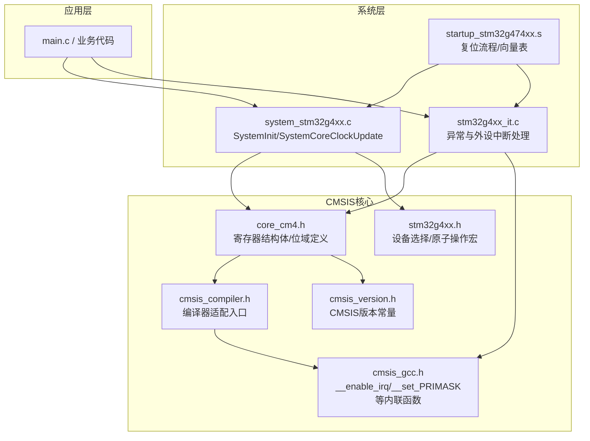
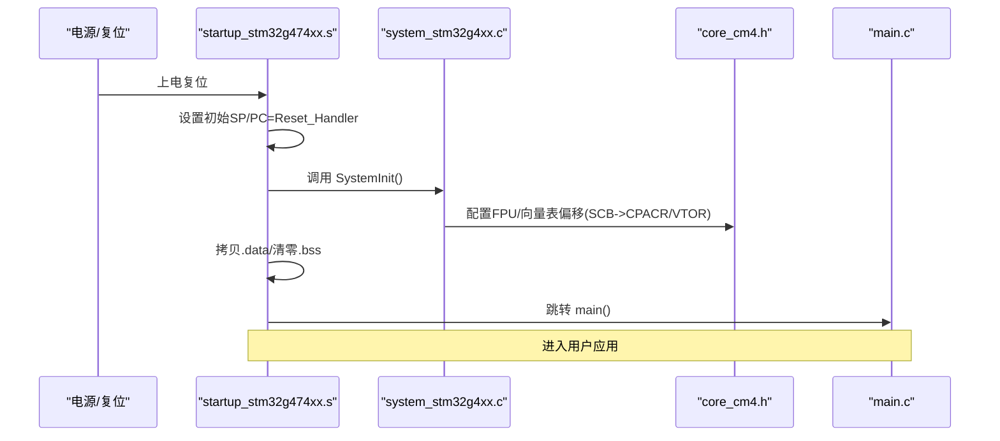
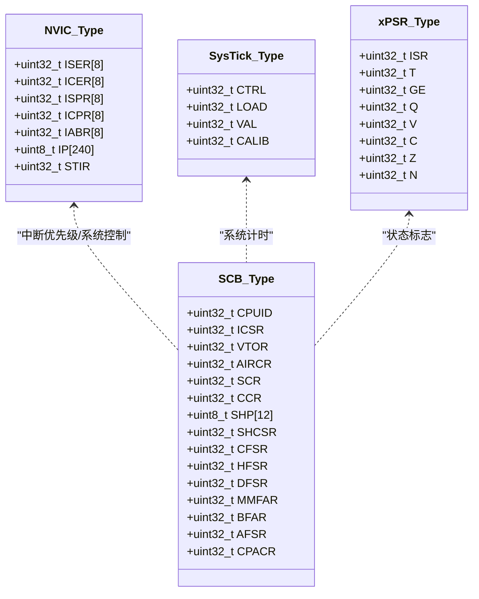
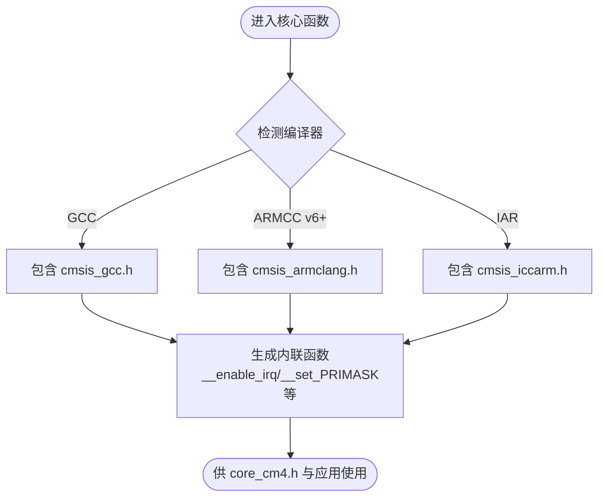
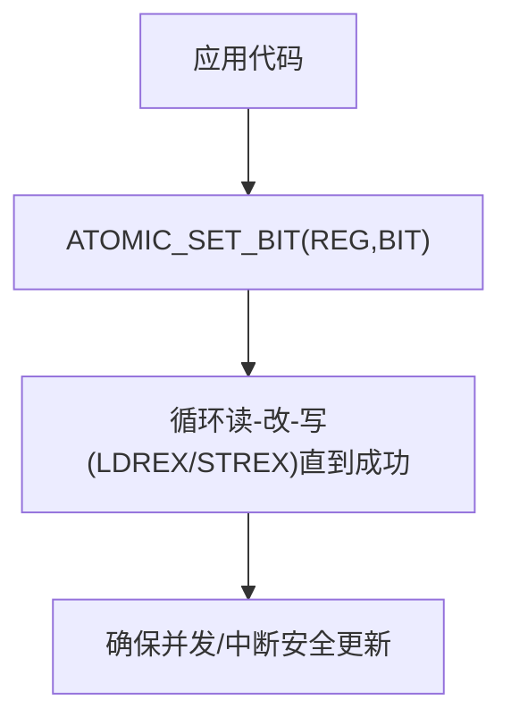
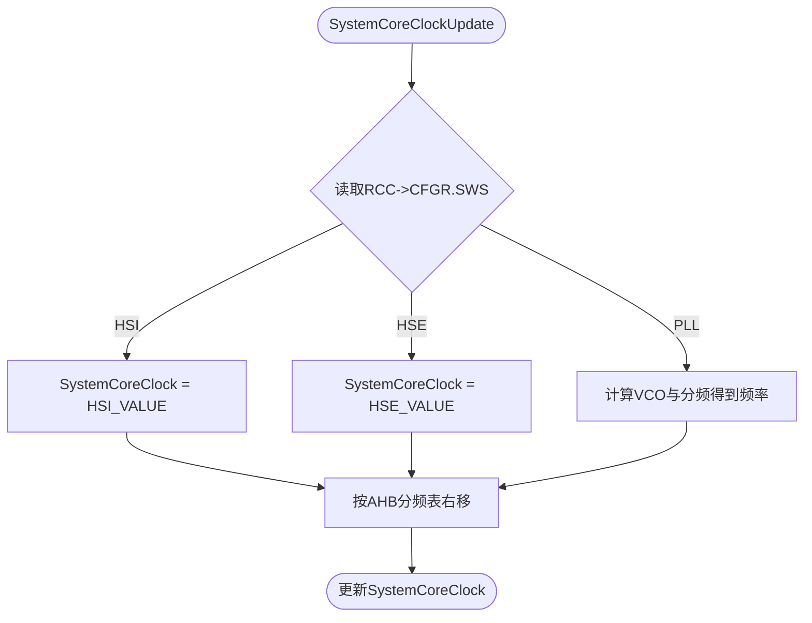
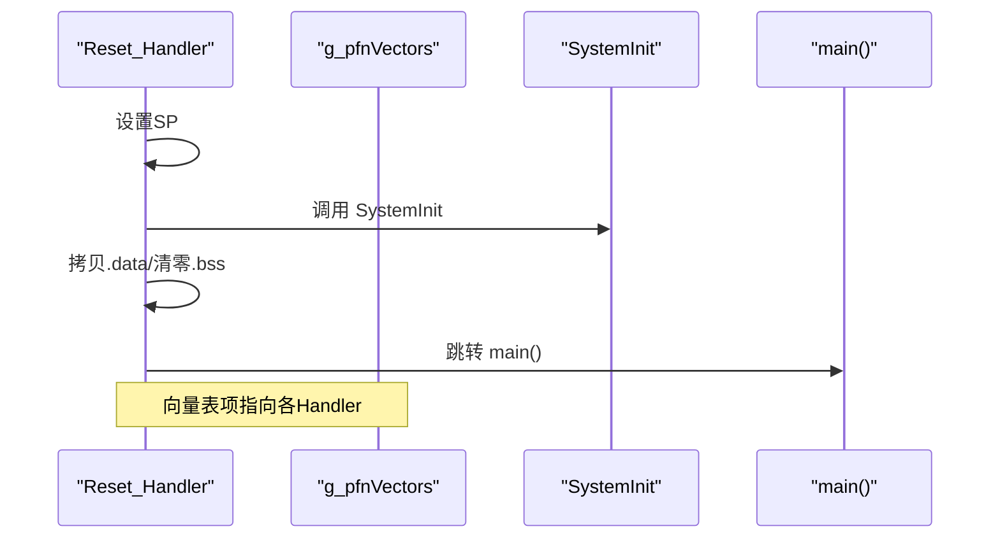
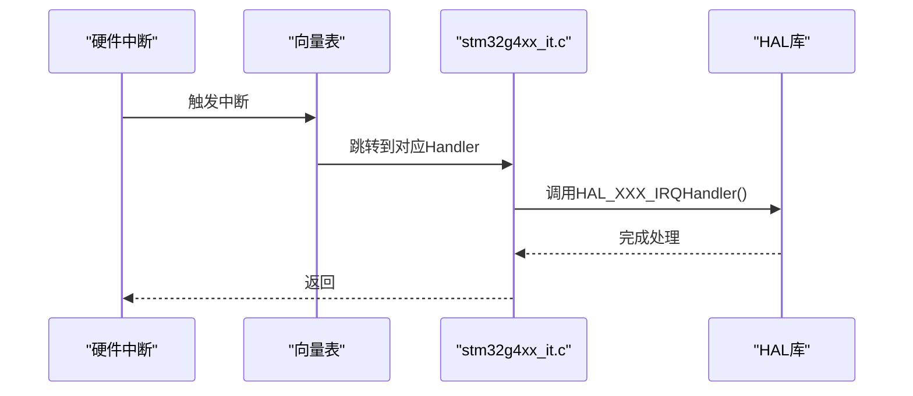
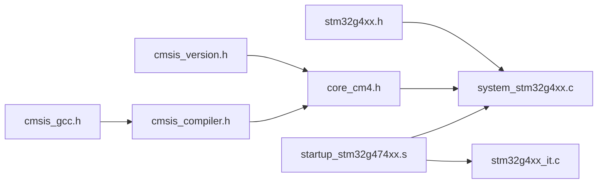
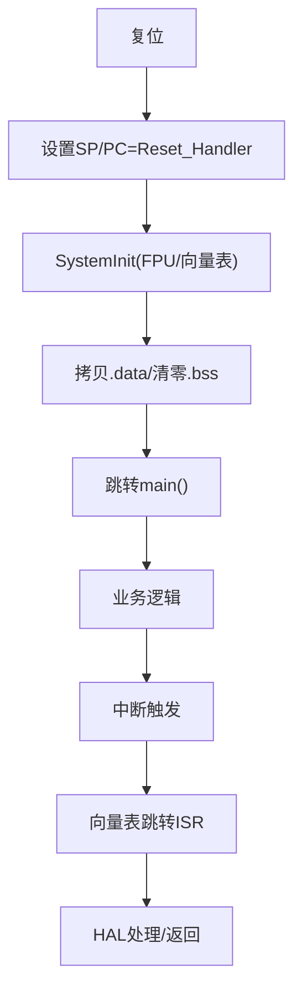

# CMSIS核心接口

<cite>
**本文引用的文件**   
- [core_cm4.h](file://Drivers/CMSIS/Include/core_cm4.h)
- [cmsis_compiler.h](file://Drivers/CMSIS/Include/cmsis_compiler.h)
- [cmsis_gcc.h](file://Drivers/CMSIS/Include/cmsis_gcc.h)
- [cmsis_version.h](file://Drivers/CMSIS/Include/cmsis_version.h)
- [stm32g4xx.h](file://Drivers/CMSIS/Device/ST/STM32G4xx/Include/stm32g4xx.h)
- [system_stm32g4xx.c](file://Core/Src/system_stm32g4xx.c)
- [startup_stm32g474xx.s](file://startup_stm32g474xx.s)
- [stm32g4xx_it.c](file://Core/Src/stm32g4xx_it.c)
</cite>

## 目录
1. [简介](#简介)
2. [项目结构](#项目结构)
3. [核心组件](#核心组件)
4. [架构总览](#架构总览)
5. [详细组件分析](#详细组件分析)
6. [依赖关系分析](#依赖关系分析)
7. [性能与优化建议](#性能与优化建议)
8. [故障排查指南](#故障排查指南)
9. [结论](#结论)
10. [附录](#附录)

## 简介
本技术参考文档围绕CMSIS（Cortex Microcontroller Software Interface Standard）核心接口，结合当前STM32G4工程中的实际实现，系统阐述：
- CMSIS标准架构与设计原理
- ARM Cortex-M4内核寄存器访问方法与内核功能调用接口
- CMSIS数据类型、编译器相关宏与工具链支持
- 核心API使用指南：中断管理、内存管理、调试接口等
- 架构图与寄存器映射图，说明标准接口与具体芯片实现的层次关系
- 面向初学者的概念介绍与入门用法，以及面向高级开发者的内核级编程与优化技巧

## 项目结构
本项目采用分层组织方式：
- Core层：包含系统初始化、中断服务程序入口、启动脚本等
- Drivers\CMSIS层：提供ARM官方CMSIS核心头文件与设备特定头文件
- Drivers\STM32G4xx_HAL_Driver层：HAL驱动（本参考聚焦CMSIS核心）
- 应用与中间件：USB设备等上层逻辑

图表来源
- [core_cm4.h:1-200](file://Drivers/CMSIS/Include/core_cm4.h#L1-L200)
- [cmsis_compiler.h:1-120](file://Drivers/CMSIS/Include/cmsis_compiler.h#L1-L120)
- [cmsis_gcc.h:196-210](file://Drivers/CMSIS/Include/cmsis_gcc.h#L196-L210)
- [cmsis_version.h:34-39](file://Drivers/CMSIS/Include/cmsis_version.h#L34-L39)
- [stm32g4xx.h:110-138](file://Drivers/CMSIS/Device/ST/STM32G4xx/Include/stm32g4xx.h#L110-L138)
- [system_stm32g4xx.c:181-192](file://Core/Src/system_stm32g4xx.c#L181-L192)
- [startup_stm32g474xx.s:58-102](file://startup_stm32g474xx.s#L58-L102)
- [stm32g4xx_it.c:184-193](file://Core/Src/stm32g4xx_it.c#L184-L193)

章节来源
- [core_cm4.h:1-200](file://Drivers/CMSIS/Include/core_cm4.h#L1-L200)
- [cmsis_compiler.h:1-120](file://Drivers/CMSIS/Include/cmsis_compiler.h#L1-L120)
- [cmsis_gcc.h:196-210](file://Drivers/CMSIS/Include/cmsis_gcc.h#L196-L210)
- [cmsis_version.h:34-39](file://Drivers/CMSIS/Include/cmsis_version.h#L34-L39)
- [stm32g4xx.h:110-138](file://Drivers/CMSIS/Device/ST/STM32G4xx/Include/stm32g4xx.h#L110-L138)
- [system_stm32g4xx.c:181-192](file://Core/Src/system_stm32g4xx.c#L181-L192)
- [startup_stm32g474xx.s:58-102](file://startup_stm32g474xx.s#L58-L102)
- [stm32g4xx_it.c:184-193](file://Core/Src/stm32g4xx_it.c#L184-L193)

## 核心组件
- CMSIS核心头文件（core_cm4.h）：定义Cortex-M4内核寄存器结构体、位域与偏移常量，提供NVIC、SCB、SysTick等核心模块的抽象。
- 编译器适配层（cmsis_compiler.h + cmsis_gcc.h）：屏蔽不同编译器差异，统一暴露__enable_irq/__disable_irq/__get_xPSR/__set_PRIMASK等内联函数。
- 设备头文件（stm32g4xx.h）：选择具体STM32G4子型号，并提供原子操作宏（ATOMIC_SET_BIT等）与常用读写宏。
- 系统初始化（system_stm32g4xx.c）：在复位后配置FPU、向量表偏移、计算并维护SystemCoreClock。
- 启动脚本（startup_stm32g474xx.s）：设置初始栈指针、调用SystemInit、拷贝.data、清零.bss、跳转main，并定义中断向量表。
- 中断服务程序（stm32g4xx_it.c）：集中实现NMI/HardFault/MemManage/BusFault/UsageFault/SVC/PendSV/SysTick及外设中断入口。

章节来源
- [core_cm4.h:233-800](file://Drivers/CMSIS/Include/core_cm4.h#L233-L800)
- [cmsis_compiler.h:33-70](file://Drivers/CMSIS/Include/cmsis_compiler.h#L33-L70)
- [cmsis_gcc.h:196-210](file://Drivers/CMSIS/Include/cmsis_gcc.h#L196-L210)
- [stm32g4xx.h:174-243](file://Drivers/CMSIS/Device/ST/STM32G4xx/Include/stm32g4xx.h#L174-L243)
- [system_stm32g4xx.c:181-192](file://Core/Src/system_stm32g4xx.c#L181-L192)
- [startup_stm32g474xx.s:58-102](file://startup_stm32g474xx.s#L58-L102)
- [stm32g4xx_it.c:70-193](file://Core/Src/stm32g4xx_it.c#L70-L193)

## 架构总览
下图展示了从复位到用户程序的执行路径，以及CMSIS核心与设备层的交互关系。

图表来源
- [startup_stm32g474xx.s:58-102](file://startup_stm32g474xx.s#L58-L102)
- [system_stm32g4xx.c:181-192](file://Core/Src/system_stm32g4xx.c#L181-L192)
- [core_cm4.h:440-463](file://Drivers/CMSIS/Include/core_cm4.h#L440-L463)

## 详细组件分析

### 1) 内核寄存器抽象（core_cm4.h）
- 状态寄存器：APSR/IPSR/xPSR，提供位域结构与位掩码常量，便于条件标志读取与修改。
- 控制寄存器：CONTROL，用于线程模式特权位、堆栈选择、FPCA标志等。
- NVIC_Type：嵌套向量中断控制器寄存器组，含使能/清使能、挂起/清挂起、优先级、软件触发等。
- SCB_Type：系统控制块，含CPUID、中断控制与状态、向量表偏移、AIRCR、SCR、CCR、SHCSR、CFSR/HFSR/DFSR等。
- SysTick_Type：系统滴答定时器，含CTRL/LOAD/VAL/CALIB。

图表来源
- [core_cm4.h:406-421](file://Drivers/CMSIS/Include/core_cm4.h#L406-L421)
- [core_cm4.h:440-463](file://Drivers/CMSIS/Include/core_cm4.h#L440-L463)
- [core_cm4.h:759-765](file://Drivers/CMSIS/Include/core_cm4.h#L759-L765)
- [core_cm4.h:316-334](file://Drivers/CMSIS/Include/core_cm4.h#L316-L334)

章节来源
- [core_cm4.h:259-393](file://Drivers/CMSIS/Include/core_cm4.h#L259-L393)
- [core_cm4.h:406-421](file://Drivers/CMSIS/Include/core_cm4.h#L406-L421)
- [core_cm4.h:440-463](file://Drivers/CMSIS/Include/core_cm4.h#L440-L463)
- [core_cm4.h:759-765](file://Drivers/CMSIS/Include/core_cm4.h#L759-L765)

### 2) 编译器适配与核心函数（cmsis_compiler.h + cmsis_gcc.h）
- cmsis_compiler.h根据编译环境选择对应实现（GCC/ARMCC/IAR等），统一暴露__ASM/__INLINE/__WEAK/__PACKED等宏。
- cmsis_gcc.h提供大量内联函数，如：
  - 中断控制：__enable_irq/__disable_irq/__enable_fault_irq/__disable_fault_irq
  - 寄存器访问：__get_xPSR/__set_PRIMASK/__get_BASEPRI/__set_FAULTMASK等
  - 栈指针：__get_PSP/__set_PSP/__get_MSP/__set_MSP
  - 启动辅助：__PROGRAM_START、__VECTOR_TABLE等

图表来源
- [cmsis_compiler.h:33-70](file://Drivers/CMSIS/Include/cmsis_compiler.h#L33-L70)
- [cmsis_gcc.h:196-210](file://Drivers/CMSIS/Include/cmsis_gcc.h#L196-L210)
- [cmsis_gcc.h:449-482](file://Drivers/CMSIS/Include/cmsis_gcc.h#L449-L482)

章节来源
- [cmsis_compiler.h:33-70](file://Drivers/CMSIS/Include/cmsis_compiler.h#L33-L70)
- [cmsis_gcc.h:196-210](file://Drivers/CMSIS/Include/cmsis_gcc.h#L196-L210)
- [cmsis_gcc.h:449-482](file://Drivers/CMSIS/Include/cmsis_gcc.h#L449-L482)

### 3) 设备选择与原子操作（stm32g4xx.h）
- 通过宏选择具体STM32G4子型号（如STM32G474xx），并引入对应的寄存器定义头文件。
- 提供原子操作宏（基于LDREX/STREX），用于多核或中断环境下安全地修改寄存器位：
  - ATOMIC_SET_BIT/ATOMIC_CLEAR_BIT/ATOMIC_MODIFY_REG
  - 16位变体：ATOMIC_SETH_BIT/ATOMIC_CLEARH_BIT/ATOMIC_MODIFYH_REG

图表来源
- [stm32g4xx.h:110-138](file://Drivers/CMSIS/Device/ST/STM32G4xx/Include/stm32g4xx.h#L110-L138)
- [stm32g4xx.h:192-243](file://Drivers/CMSIS/Device/ST/STM32G4xx/Include/stm32g4xx.h#L192-L243)

章节来源
- [stm32g4xx.h:110-138](file://Drivers/CMSIS/Device/ST/STM32G4xx/Include/stm32g4xx.h#L110-L138)
- [stm32g4xx.h:192-243](file://Drivers/CMSIS/Device/ST/STM32G4xx/Include/stm32g4xx.h#L192-L243)

### 4) 系统初始化与时钟更新（system_stm32g4xx.c）
- SystemInit：
  - 若启用FPU，则开启CP10/CP11全访问权限（SCB->CPACR）
  - 可选重定向向量表（SCB->VTOR）
- SystemCoreClockUpdate：
  - 根据RCC时钟源（HSI/HSE/PLL）与分频系数计算SystemCoreClock
  - 维护AHB/APB分频表，保证后续SysTick/外设定时准确

图表来源
- [system_stm32g4xx.c:181-192](file://Core/Src/system_stm32g4xx.c#L181-L192)
- [system_stm32g4xx.c:230-272](file://Core/Src/system_stm32g4xx.c#L230-L272)

章节来源
- [system_stm32g4xx.c:181-192](file://Core/Src/system_stm32g4xx.c#L181-L192)
- [system_stm32g4xx.c:230-272](file://Core/Src/system_stm32g4xx.c#L230-L272)

### 5) 启动流程与中断向量表（startup_stm32g474xx.s）
- Reset_Handler：设置初始SP、调用SystemInit、拷贝.data、清零.bss、调用main
- g_pfnVectors：定义完整的异常与中断向量表，包括HardFault/MemManage/BusFault/UsageFault/SVC/PendSV/SysTick及各外设IRQ

图表来源
- [startup_stm32g474xx.s:58-102](file://startup_stm32g474xx.s#L58-L102)
- [startup_stm32g474xx.s:133-200](file://startup_stm32g474xx.s#L133-L200)

章节来源
- [startup_stm32g474xx.s:58-102](file://startup_stm32g474xx.s#L58-L102)
- [startup_stm32g474xx.s:133-200](file://startup_stm32g474xx.s#L133-L200)

### 6) 中断服务程序（stm32g4xx_it.c）
- 系统异常：NMI/HardFault/MemManage/BusFault/UsageFault/SVC/PendSV/SysTick
- 外设中断：EXTI/DMA/USB等，通常转发至HAL层处理

图表来源
- [stm32g4xx_it.c:70-193](file://Core/Src/stm32g4xx_it.c#L70-L193)

章节来源
- [stm32g4xx_it.c:70-193](file://Core/Src/stm32g4xx_it.c#L70-L193)

## 依赖关系分析
- core_cm4.h依赖cmsis_version.h与cmsis_compiler.h；后者再选择具体编译器实现（如cmsis_gcc.h）。
- stm32g4xx.h负责设备选择，并在启用USE_HAL_DRIVER时引入HAL头文件。
- system_stm32g4xx.c依赖stm32g4xx.h提供的寄存器定义与宏。
- startup_stm32g474xx.s与stm32g4xx_it.c共同构成中断体系，前者定义向量表，后者实现具体ISR。

图表来源
- [core_cm4.h:63-64](file://Drivers/CMSIS/Include/core_cm4.h#L63-L64)
- [cmsis_compiler.h:33-70](file://Drivers/CMSIS/Include/cmsis_compiler.h#L33-L70)
- [cmsis_gcc.h:196-210](file://Drivers/CMSIS/Include/cmsis_gcc.h#L196-L210)
- [stm32g4xx.h:110-138](file://Drivers/CMSIS/Device/ST/STM32G4xx/Include/stm32g4xx.h#L110-L138)
- [system_stm32g4xx.c:181-192](file://Core/Src/system_stm32g4xx.c#L181-L192)
- [startup_stm32g474xx.s:58-102](file://startup_stm32g474xx.s#L58-L102)
- [stm32g4xx_it.c:184-193](file://Core/Src/stm32g4xx_it.c#L184-L193)

章节来源
- [core_cm4.h:63-64](file://Drivers/CMSIS/Include/core_cm4.h#L63-L64)
- [cmsis_compiler.h:33-70](file://Drivers/CMSIS/Include/cmsis_compiler.h#L33-L70)
- [cmsis_gcc.h:196-210](file://Drivers/CMSIS/Include/cmsis_gcc.h#L196-L210)
- [stm32g4xx.h:110-138](file://Drivers/CMSIS/Device/ST/STM32G4xx/Include/stm32g4xx.h#L110-L138)
- [system_stm32g4xx.c:181-192](file://Core/Src/system_stm32g4xx.c#L181-L192)
- [startup_stm32g474xx.s:58-102](file://startup_stm32g474xx.s#L58-L102)
- [stm32g4xx_it.c:184-193](file://Core/Src/stm32g4xx_it.c#L184-L193)

## 性能与优化建议
- 使用CMSIS内联函数访问核心寄存器与开关中断，避免直接硬编码汇编，提升可移植性与可读性。
- 在中断临界区使用__get_PRIMASK/__set_PRIMASK进行细粒度屏蔽，减少全局关中断时间。
- 对共享寄存器的位修改优先使用原子操作宏（ATOMIC_SET_BIT/ATOMIC_CLEAR_BIT），避免竞态条件。
- 合理设置NVIC优先级分组（SCB_AIRCR.PRIGROUP），平衡响应延迟与上下文切换开销。
- 使用SystemCoreClockUpdate确保SysTick与延时函数精度，尤其在动态调整时钟源后。

[本节为通用指导，不直接分析具体文件]

## 故障排查指南
- HardFault/MemManage/BusFault/UsageFault：检查SCB_SHCSR与CFSR/HFSR/DFSR等状态位，定位错误类型与地址（MMFAR/BFAR）。
- SysTick未触发：确认SysTick_CTRL.TICKINT与ENABLE位，核对SystemCoreClock值是否正确。
- 中断无法进入：检查NVIC_ISER/ICER使能位、IP优先级、SCB_ICSR.PENDx挂起位，以及向量表是否重定位正确。
- FPU不可用：确认__FPU_PRESENT与__FPU_USED宏，且SystemInit中已开启CPACR。

章节来源
- [core_cm4.h:567-608](file://Drivers/CMSIS/Include/core_cm4.h#L567-L608)
- [core_cm4.h:610-678](file://Drivers/CMSIS/Include/core_cm4.h#L610-L678)
- [core_cm4.h:767-796](file://Drivers/CMSIS/Include/core_cm4.h#L767-L796)
- [system_stm32g4xx.c:181-192](file://Core/Src/system_stm32g4xx.c#L181-L192)
- [stm32g4xx_it.c:85-140](file://Core/Src/stm32g4xx_it.c#L85-L140)

## 结论
CMSIS为核心提供了统一的寄存器抽象与编译器无关的内联函数，配合设备头文件与系统初始化代码，形成“标准内核接口—设备实现—应用”的分层架构。掌握core_cm4.h的寄存器结构、cmsis_gcc.h的核心函数、system_stm32g4xx.c的系统初始化流程，以及启动脚本与中断服务程序的协作关系，是高效开发与稳定运行的关键。

[本节为总结，不直接分析具体文件]

## 附录

### A. 常用CMSIS核心函数速查（GCC）
- 中断控制：__enable_irq/__disable_irq/__enable_fault_irq/__disable_fault_irq
- 寄存器访问：__get_xPSR/__get_IPSR/__get_APSR/__get_CONTROL/__set_PRIMASK/__set_BASEPRI/__set_FAULTMASK
- 栈指针：__get_PSP/__set_PSP/__get_MSP/__set_MSP

章节来源
- [cmsis_gcc.h:196-210](file://Drivers/CMSIS/Include/cmsis_gcc.h#L196-L210)
- [cmsis_gcc.h:218-251](file://Drivers/CMSIS/Include/cmsis_gcc.h#L218-L251)
- [cmsis_gcc.h:272-306](file://Drivers/CMSIS/Include/cmsis_gcc.h#L272-L306)
- [cmsis_gcc.h:314-401](file://Drivers/CMSIS/Include/cmsis_gcc.h#L314-L401)
- [cmsis_gcc.h:449-482](file://Drivers/CMSIS/Include/cmsis_gcc.h#L449-L482)

### B. 启动与中断流程图（复习）

图表来源
- [startup_stm32g474xx.s:58-102](file://startup_stm32g474xx.s#L58-L102)
- [stm32g4xx_it.c:184-193](file://Core/Src/stm32g4xx_it.c#L184-L193)