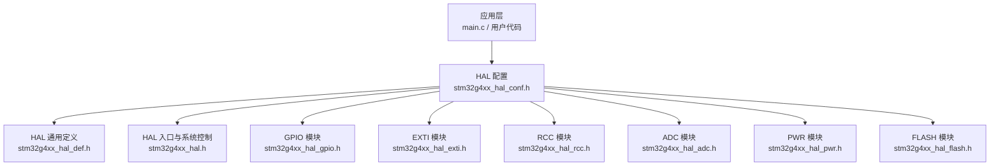
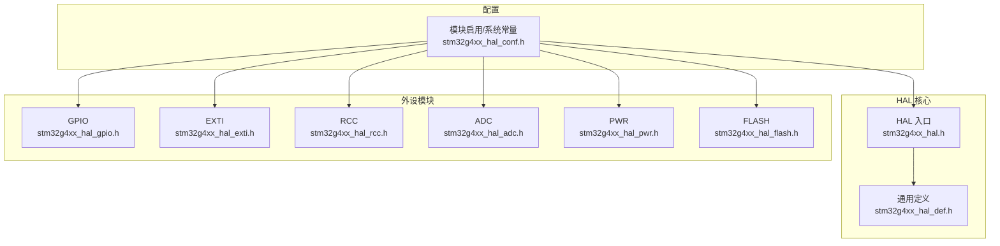
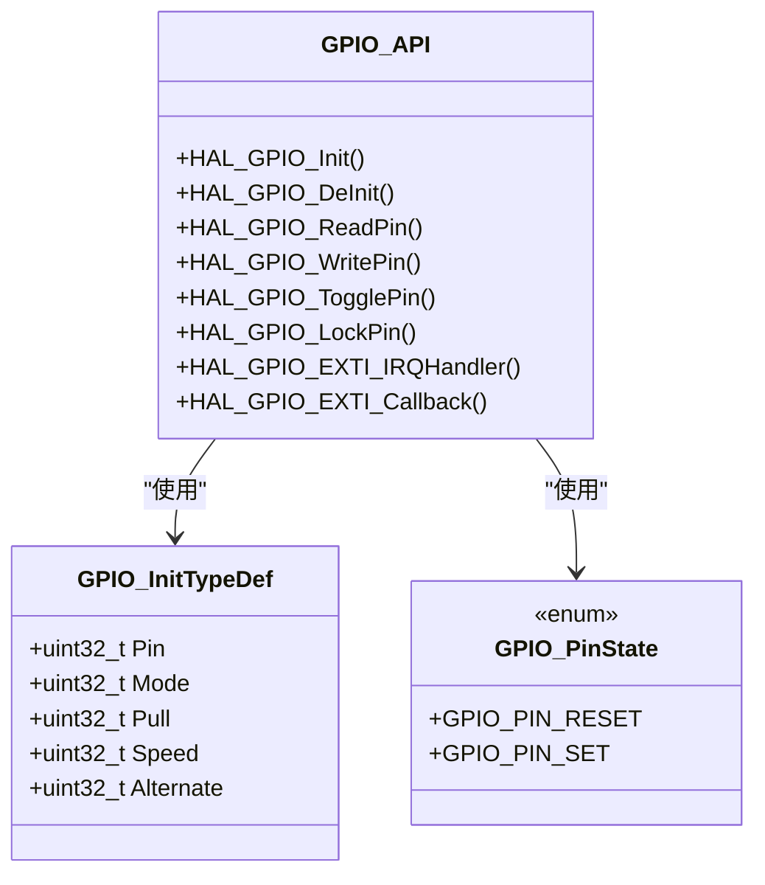
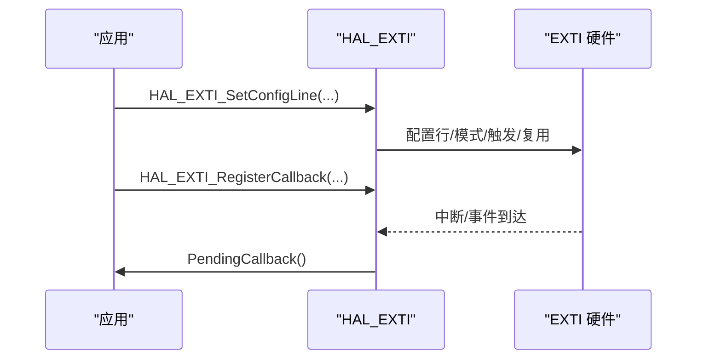
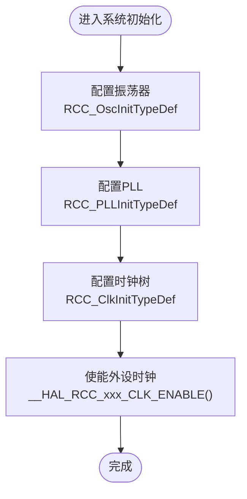
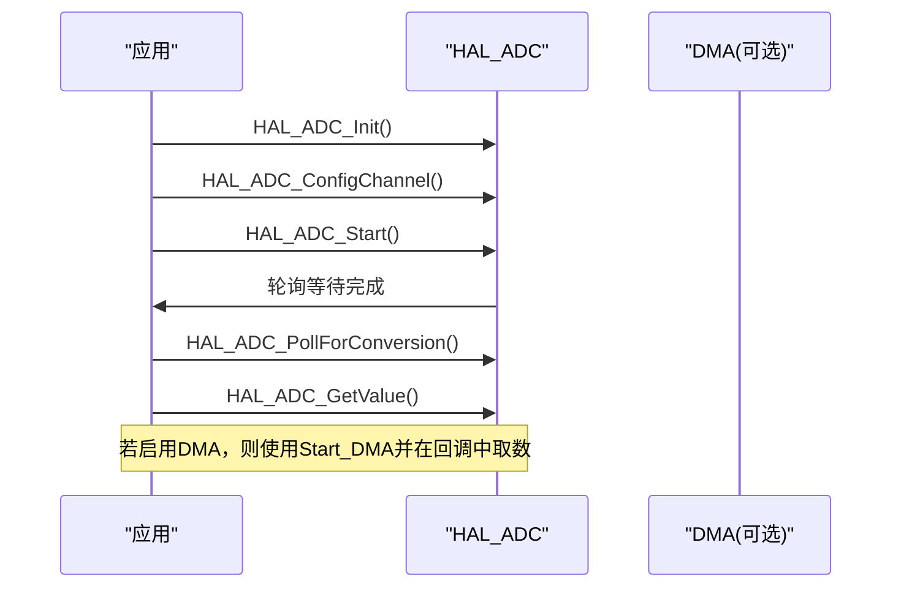
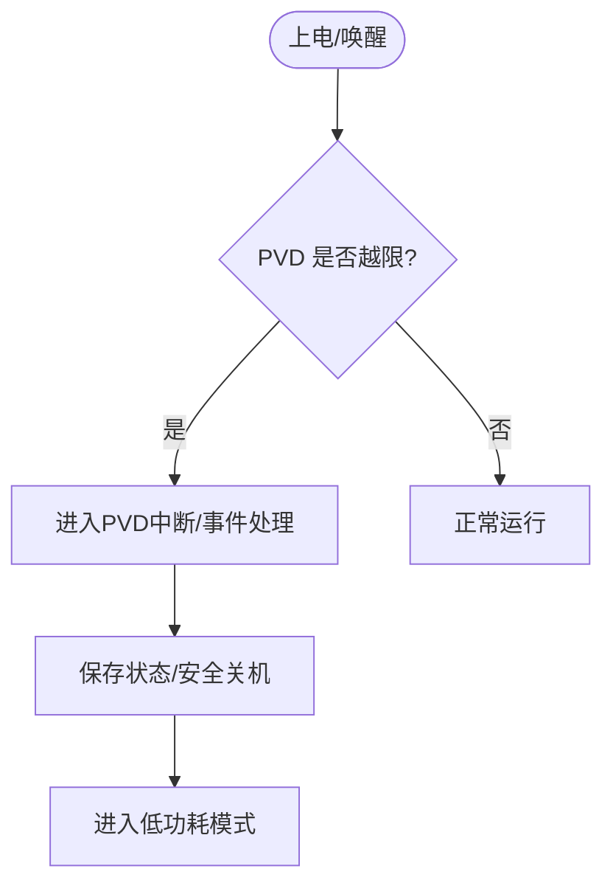
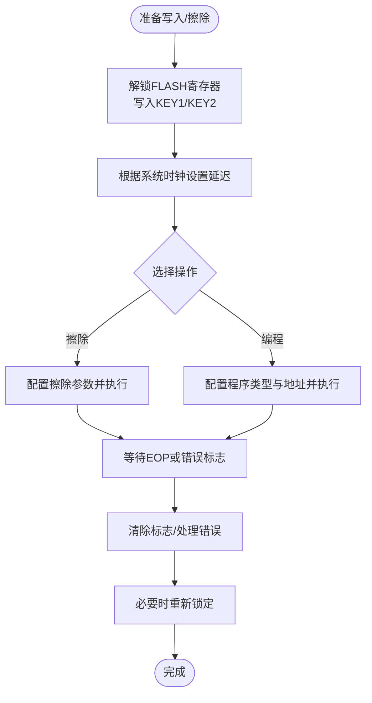
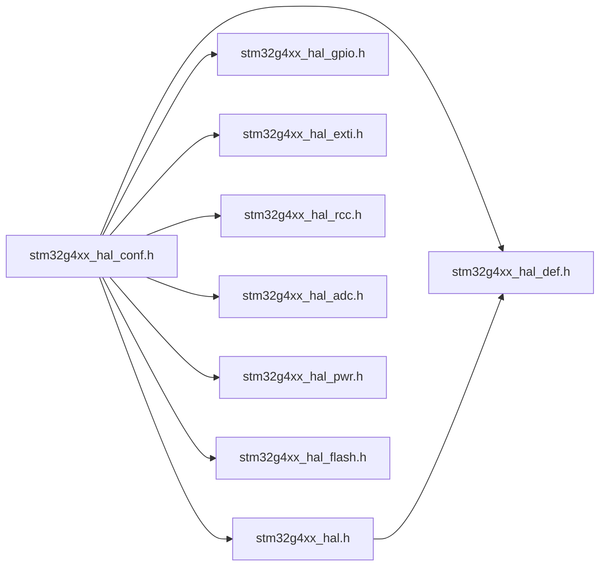

# HAL API参考手册

<cite>
**本文引用的文件**   
- [stm32g4xx_hal.h](file://Drivers/STM32G4xx_HAL_Driver/Inc/stm32g4xx_hal.h)
- [stm32g4xx_hal_def.h](file://Drivers/STM32G4xx_HAL_Driver/Inc/stm32g4xx_hal_def.h)
- [stm32g4xx_hal_conf.h](file://Core/Inc/stm32g4xx_hal_conf.h)
- [stm32g4xx_hal_gpio.h](file://Drivers/STM32G4xx_HAL_Driver/Inc/stm32g4xx_hal_gpio.h)
- [stm32g4xx_hal_exti.h](file://Drivers/STM32G4xx_HAL_Driver/Inc/stm32g4xx_hal_exti.h)
- [stm32g4xx_hal_rcc.h](file://Drivers/STM32G4xx_HAL_Driver/Inc/stm32g4xx_hal_rcc.h)
- [stm32g4xx_hal_adc.h](file://Drivers/STM32G4xx_HAL_Driver/Inc/stm32g4xx_hal_adc.h)
- [stm32g4xx_hal_pwr.h](file://Drivers/STM32G4xx_HAL_Driver/Inc/stm32g4xx_hal_pwr.h)
- [stm32g4xx_hal_flash.h](file://Drivers/STM32G4xx_HAL_Driver/Inc/stm32g4xx_hal_flash.h)
</cite>

## 目录
1. [简介](#简介)
2. [项目结构](#项目结构)
3. [核心组件](#核心组件)
4. [架构总览](#架构总览)
5. [详细组件分析](#详细组件分析)
6. [依赖关系分析](#依赖关系分析)
7. [性能与功耗考虑](#性能与功耗考虑)
8. [故障排查指南](#故障排查指南)
9. [结论](#结论)
10. [附录：API检索索引](#附录api检索索引)

## 简介
本手册面向使用 STM32G4xx HAL 驱动的开发者，系统化整理并说明 HAL 库的公共接口、数据类型、枚举与宏定义，覆盖初始化与控制、外设模块（GPIO、EXTI、RCC、ADC、PWR、FLASH）等。文档以“按功能模块组织”的方式呈现，便于快速定位；同时提供错误码与状态返回值的详细说明、最佳实践与常见陷阱提示，帮助开发者高效、稳定地使用 HAL API。

## 项目结构
本项目采用标准 STM32CubeMX 工程布局，HAL 驱动位于 Drivers/STM32G4xx_HAL_Driver，应用代码位于 Core/Src 与 Core/Inc，配置头文件 stm32g4xx_hal_conf.h 用于启用/禁用各 HAL 模块与系统常量。

**图示来源**
- [stm32g4xx_hal_conf.h:32-76](file://Core/Inc/stm32g4xx_hal_conf.h#L32-L76)
- [stm32g4xx_hal_def.h:33-53](file://Drivers/STM32G4xx_HAL_Driver/Inc/stm32g4xx_hal_def.h#L33-L53)
- [stm32g4xx_hal.h:515-611](file://Drivers/STM32G4xx_HAL_Driver/Inc/stm32g4xx_hal.h#L515-L611)

**章节来源**
- [stm32g4xx_hal_conf.h:32-76](file://Core/Inc/stm32g4xx_hal_conf.h#L32-L76)
- [stm32g4xx_hal_def.h:33-53](file://Drivers/STM32G4xx_HAL_Driver/Inc/stm32g4xx_hal_def.h#L33-L53)
- [stm32g4xx_hal.h:515-611](file://Drivers/STM32G4xx_HAL_Driver/Inc/stm32g4xx_hal.h#L515-L611)

## 核心组件
本节概述 HAL 通用类型、状态与锁机制，以及系统级初始化与时钟节拍相关接口。

- 通用状态与锁
  - HAL_StatusTypeDef：统一的状态返回值（成功、错误、忙、超时）。
  - HAL_LockTypeDef：资源锁定状态（解锁、加锁）。
  - 常用宏：__HAL_LOCK/__HAL_UNLOCK、__HAL_RESET_HANDLE_STATE、UNUSED、对齐与内联属性宏等。

- 系统初始化与 Tick
  - HAL_Init/HAL_DeInit：HAL 初始化与反初始化。
  - HAL_MspInit/HAL_MspDeInit：底层硬件平台初始化钩子。
  - HAL_InitTick/HAL_SetTickFreq/HAL_GetTickFreq：滴答定时器优先级与频率设置。
  - HAL_IncTick/HAL_Delay/HAL_GetTick/HAL_SuspendTick/HAL_ResumeTick：时间基准与延时。
  - HAL_GetHalVersion/HAL_GetREVID/HAL_GetDEVID/HAL_GetUIDwX：版本与设备信息读取。

- SYSCFG 控制
  - 内存映射切换宏与函数：主 Flash、系统 Flash、SRAM、FMC、QuadSPI 映射。
  - CCMSRAM 写保护与擦除宏与函数。
  - VREFBUF 电压缩放、高阻模式、微调与使能/禁用（条件编译）。
  - IO 开关增强器与 VDD 选择宏与函数。
  - DBGMCU 调试冻结/解冻宏（TIMx、RTC、WWDG、IWDG、I2Cx、LPTIM、HRTIM 等）。

**章节来源**
- [stm32g4xx_hal_def.h:38-109](file://Drivers/STM32G4xx_HAL_Driver/Inc/stm32g4xx_hal_def.h#L38-L109)
- [stm32g4xx_hal.h:525-611](file://Drivers/STM32G4xx_HAL_Driver/Inc/stm32g4xx_hal.h#L525-L611)
- [stm32g4xx_hal.h:197-444](file://Drivers/STM32G4xx_HAL_Driver/Inc/stm32g4xx_hal.h#L197-L444)

## 架构总览
下图展示 HAL 顶层入口与各模块的关系，以及配置头如何按需包含具体模块头文件。

**图示来源**
- [stm32g4xx_hal_conf.h:211-357](file://Core/Inc/stm32g4xx_hal_conf.h#L211-L357)
- [stm32g4xx_hal.h:515-611](file://Drivers/STM32G4xx_HAL_Driver/Inc/stm32g4xx_hal.h#L515-L611)

## 详细组件分析

### GPIO 模块
- 关键数据结构
  - GPIO_InitTypeDef：引脚、模式、上下拉、速度、复用选择。
  - GPIO_PinState：SET/RESET。
- 重要常量
  - 引脚掩码与全引脚宏、模式（输入/输出推挽/开漏/复用/模拟）、中断/事件触发组合、速度档位、上下拉选项。
- 导出函数
  - 初始化/反初始化：HAL_GPIO_Init/HAL_GPIO_DeInit。
  - IO 操作：读/写/翻转/锁定引脚。
  - EXTI 集成：HAL_GPIO_EXTI_IRQHandler/HAL_GPIO_EXTI_Callback。
- 常用宏
  - __HAL_GPIO_EXTI_GET_FLAG/CLEAR_FLAG/GIT/CLEAR_IT/GENERATE_SWIT。

**图示来源**
- [stm32g4xx_hal_gpio.h:47-73](file://Drivers/STM32G4xx_HAL_Driver/Inc/stm32g4xx_hal_gpio.h#L47-L73)
- [stm32g4xx_hal_gpio.h:285-303](file://Drivers/STM32G4xx_HAL_Driver/Inc/stm32g4xx_hal_gpio.h#L285-L303)

**章节来源**
- [stm32g4xx_hal_gpio.h:47-73](file://Drivers/STM32G4xx_HAL_Driver/Inc/stm32g4xx_hal_gpio.h#L47-L73)
- [stm32g4xx_hal_gpio.h:84-156](file://Drivers/STM32G4xx_HAL_Driver/Inc/stm32g4xx_hal_gpio.h#L84-L156)
- [stm32g4xx_hal_gpio.h:285-303](file://Drivers/STM32G4xx_HAL_Driver/Inc/stm32g4xx_hal_gpio.h#L285-L303)

### EXTI 模块
- 关键数据结构
  - EXTI_HandleTypeDef：行号与回调指针。
  - EXTI_ConfigTypeDef：行、模式（中断/事件）、触发边沿、GPIO 复用选择。
- 重要常量
  - 行号宏（0~43）、模式与触发组合、GPIO 端口选择。
- 导出函数
  - 配置获取/清除/注册回调/句柄获取。
  - 中断处理、查询挂起位、清除挂起、软件触发。

**图示来源**
- [stm32g4xx_hal_exti.h:53-73](file://Drivers/STM32G4xx_HAL_Driver/Inc/stm32g4xx_hal_exti.h#L53-L73)
- [stm32g4xx_hal_exti.h:275-292](file://Drivers/STM32G4xx_HAL_Driver/Inc/stm32g4xx_hal_exti.h#L275-L292)

**章节来源**
- [stm32g4xx_hal_exti.h:53-73](file://Drivers/STM32G4xx_HAL_Driver/Inc/stm32g4xx_hal_exti.h#L53-L73)
- [stm32g4xx_hal_exti.h:84-169](file://Drivers/STM32G4xx_HAL_Driver/Inc/stm32g4xx_hal_exti.h#L84-L169)
- [stm32g4xx_hal_exti.h:275-292](file://Drivers/STM32G4xx_HAL_Driver/Inc/stm32g4xx_hal_exti.h#L275-L292)

### RCC 模块
- 关键数据结构
  - RCC_PLLInitTypeDef：PLL 源、分频/倍频参数。
  - RCC_OscInitTypeDef：HSE/HSI/LSE/LSI/HSI48 与 PLL 配置。
  - RCC_ClkInitTypeDef：SYSCLK/HCLK/PCLK1/PCLK2 时钟树配置。
- 重要常量
  - 振荡器类型与状态、PLL 分频/倍频、系统时钟源与状态、AHB/APB 分频、MCO 输出、中断与标志。
- 常用宏
  - 外设时钟使能/禁用（DMA、GPIO、ADC、DAC、AES、RNG、CRC、Flash 等）。

**图示来源**
- [stm32g4xx_hal_rcc.h:45-121](file://Drivers/STM32G4xx_HAL_Driver/Inc/stm32g4xx_hal_rcc.h#L45-L121)
- [stm32g4xx_hal_rcc.h:516-763](file://Drivers/STM32G4xx_HAL_Driver/Inc/stm32g4xx_hal_rcc.h#L516-L763)

**章节来源**
- [stm32g4xx_hal_rcc.h:45-121](file://Drivers/STM32G4xx_HAL_Driver/Inc/stm32g4xx_hal_rcc.h#L45-L121)
- [stm32g4xx_hal_rcc.h:141-485](file://Drivers/STM32G4xx_HAL_Driver/Inc/stm32g4xx_hal_rcc.h#L141-L485)
- [stm32g4xx_hal_rcc.h:516-763](file://Drivers/STM32G4xx_HAL_Driver/Inc/stm32g4xx_hal_rcc.h#L516-L763)

### ADC 模块
- 关键数据结构
  - ADC_OversamplingTypeDef：过采样比率、右移、触发模式、停止/复位策略。
  - ADC_InitTypeDef：全局与组常规配置（时钟、分辨率、对齐、扫描、EOC 选择、低功耗自动等待、连续/间断转换、外部触发、采样模式、DMA、溢出行为、过采样）。
  - ADC_ChannelConfTypeDef：通道、序列秩、采样时间、单端/差分、偏移与饱和。
  - ADC_AnalogWDGConfTypeDef：看门狗编号、模式、通道、中断/轮询、阈值、滤波。
  - ADC_HandleTypeDef：实例、DMA、锁、状态、错误码、注入上下文、回调（可选）。
- 重要常量
  - 错误码、时钟源、分辨率、数据对齐、扫描模式、外部触发源与边沿、采样模式、EOC 选择、溢出行为、序列秩、通道与采样时间等。
- 典型流程（轮询）
  - 初始化 → 配置通道 → 启动转换 → 等待完成 → 读取数据。

**图示来源**
- [stm32g4xx_hal_adc.h:49-338](file://Drivers/STM32G4xx_HAL_Driver/Inc/stm32g4xx_hal_adc.h#L49-L338)
- [stm32g4xx_hal_adc.h:556-800](file://Drivers/STM32G4xx_HAL_Driver/Inc/stm32g4xx_hal_adc.h#L556-L800)

**章节来源**
- [stm32g4xx_hal_adc.h:49-338](file://Drivers/STM32G4xx_HAL_Driver/Inc/stm32g4xx_hal_adc.h#L49-L338)
- [stm32g4xx_hal_adc.h:556-800](file://Drivers/STM32G4xx_HAL_Driver/Inc/stm32g4xx_hal_adc.h#L556-L800)

### PWR 模块
- 关键数据结构
  - PWR_PVDTypeDef：PVD 检测电平与工作模式。
- 重要常量
  - PVD 电平、工作模式（中断/事件及边沿）、睡眠/停机进入方式、唤醒引脚极性、PVD EXTI 线宏。
- 导出函数
  - 备份访问控制、PVD 配置/使能/禁用、唤醒引脚配置、低功耗模式进入、SleepOnExit/SEVOnPend 控制、PVD 回调。

**图示来源**
- [stm32g4xx_hal_pwr.h:47-54](file://Drivers/STM32G4xx_HAL_Driver/Inc/stm32g4xx_hal_pwr.h#L47-L54)
- [stm32g4xx_hal_pwr.h:367-386](file://Drivers/STM32G4xx_HAL_Driver/Inc/stm32g4xx_hal_pwr.h#L367-L386)

**章节来源**
- [stm32g4xx_hal_pwr.h:47-54](file://Drivers/STM32G4xx_HAL_Driver/Inc/stm32g4xx_hal_pwr.h#L47-L54)
- [stm32g4xx_hal_pwr.h:68-142](file://Drivers/STM32G4xx_HAL_Driver/Inc/stm32g4xx_hal_pwr.h#L68-L142)
- [stm32g4xx_hal_pwr.h:367-386](file://Drivers/STM32G4xx_HAL_Driver/Inc/stm32g4xx_hal_pwr.h#L367-L386)

### FLASH 模块
- 关键数据结构
  - FLASH_EraseInitTypeDef：擦除类型、目标 Bank、起始页与数量。
  - FLASH_OBProgramInitTypeDef：选项字节配置（WRP/RDP/USER/PCROP/Boot Lock/Securable）。
  - FLASH_ProcessTypeDef：内部过程状态（擦除/编程阶段、地址/Bank/Page/NbPages 等）。
- 重要常量
  - 错误码、擦除类型、Bank 选择、程序类型、选项字节类型与区域、读保护级别、用户选项位、延迟周期、密钥、标志与中断。
- 常用宏
  - 延迟设置/获取、预取与指令/数据缓存控制、缓存复位、低功耗运行/睡眠电源控制、中断使能/禁用、标志读写。

**图示来源**
- [stm32g4xx_hal_flash.h:45-144](file://Drivers/STM32G4xx_HAL_Driver/Inc/stm32g4xx_hal_flash.h#L45-L144)
- [stm32g4xx_hal_flash.h:568-791](file://Drivers/STM32G4xx_HAL_Driver/Inc/stm32g4xx_hal_flash.h#L568-L791)

**章节来源**
- [stm32g4xx_hal_flash.h:45-144](file://Drivers/STM32G4xx_HAL_Driver/Inc/stm32g4xx_hal_flash.h#L45-L144)
- [stm32g4xx_hal_flash.h:155-556](file://Drivers/STM32G4xx_HAL_Driver/Inc/stm32g4xx_hal_flash.h#L155-L556)
- [stm32g4xx_hal_flash.h:568-791](file://Drivers/STM32G4xx_HAL_Driver/Inc/stm32g4xx_hal_flash.h#L568-L791)

## 依赖关系分析
- 模块启用由 stm32g4xx_hal_conf.h 中的宏控制，仅启用的模块会被包含到编译单元。
- HAL 核心头文件 stm32g4xx_hal.h 依赖 stm32g4xx_hal_def.h 提供的通用类型与宏。
- 各外设模块头文件均依赖 stm32g4xx_hal_def.h，并通过配置头选择性包含。

**图示来源**
- [stm32g4xx_hal_conf.h:211-357](file://Core/Inc/stm32g4xx_hal_conf.h#L211-L357)
- [stm32g4xx_hal.h:515-611](file://Drivers/STM32G4xx_HAL_Driver/Inc/stm32g4xx_hal.h#L515-L611)
- [stm32g4xx_hal_def.h:33-53](file://Drivers/STM32G4xx_HAL_Driver/Inc/stm32g4xx_hal_def.h#L33-L53)

**章节来源**
- [stm32g4xx_hal_conf.h:211-357](file://Core/Inc/stm32g4xx_hal_conf.h#L211-L357)
- [stm32g4xx_hal.h:515-611](file://Drivers/STM32G4xx_HAL_Driver/Inc/stm32g4xx_hal.h#L515-L611)
- [stm32g4xx_hal_def.h:33-53](file://Drivers/STM32G4xx_HAL_Driver/Inc/stm32g4xx_hal_def.h#L33-L53)

## 性能与功耗考虑
- 时钟与延迟
  - 在提高系统时钟后，需同步调整 FLASH 延迟周期以避免总线访问失败。
  - 合理配置 RCC 分频与 PLL，确保外设时钟满足时序要求。
- 低功耗
  - 使用 PWR 的低功耗模式（SLEEP/STOP/STANDBY）并结合唤醒引脚与 PVD 事件实现节能。
  - 关闭未使用的外设时钟以降低静态电流。
- 中断与轮询
  - 高频任务优先使用 DMA/中断，避免阻塞式轮询导致 CPU 占用过高。
  - 对 ADC 等慢速外设，合理使用 Auto-Wait 与合适的采样时间平衡精度与吞吐。

[本节为通用指导，不直接分析具体文件]

## 故障排查指南
- 状态与错误码
  - HAL_StatusTypeDef：检查 HAL_OK/HAL_ERROR/HAL_BUSY/HAL_TIMEOUT。
  - 模块特定错误码：如 ADC_ERROR_*、FLASH_ERROR_*，结合标志位定位问题。
- 常见问题
  - 未使能外设时钟：调用对应 __HAL_RCC_xxx_CLK_ENABLE()。
  - 未正确解锁 FLASH：写入正确的 KEY1/KEY2 序列。
  - EXTI 中断未清除：在中断服务程序中调用清除宏/函数。
  - ADC 溢出：根据 Overrun 配置决定保留/覆盖策略，或在回调中及时取数。
- 调试技巧
  - 使用 DBGMCU 冻结宏在调试时保持定时器/看门狗运行。
  - 通过 HAL_GetTick/HAL_Delay 辅助定位时序问题。

**章节来源**
- [stm32g4xx_hal_def.h:38-53](file://Drivers/STM32G4xx_HAL_Driver/Inc/stm32g4xx_hal_def.h#L38-L53)
- [stm32g4xx_hal_adc.h:556-568](file://Drivers/STM32G4xx_HAL_Driver/Inc/stm32g4xx_hal_adc.h#L556-L568)
- [stm32g4xx_hal_flash.h:155-175](file://Drivers/STM32G4xx_HAL_Driver/Inc/stm32g4xx_hal_flash.h#L155-L175)
- [stm32g4xx_hal.h:197-444](file://Drivers/STM32G4xx_HAL_Driver/Inc/stm32g4xx_hal.h#L197-L444)

## 结论
本手册基于仓库中的 HAL 头文件，系统性梳理了 HAL 通用接口与主要外设模块的公共 API、数据类型与宏定义，提供了架构图、流程图与序列图以帮助理解调用关系与数据流。建议在实际工程中结合 stm32g4xx_hal_conf.h 精确启用所需模块，遵循最佳实践与故障排查要点，以获得稳定高效的开发体验。

[本节为总结性内容，不直接分析具体文件]

## 附录：API检索索引
- 按功能检索
  - 系统初始化与时间：HAL_Init、HAL_Delay、HAL_GetTick、HAL_SetTickFreq
  - 引脚控制：HAL_GPIO_Init、HAL_GPIO_ReadPin、HAL_GPIO_WritePin、HAL_GPIO_TogglePin
  - 外部中断：HAL_EXTI_SetConfigLine、HAL_EXTI_IRQHandler、HAL_EXTI_GenerateSWI
  - 时钟管理：RCC_OscInitTypeDef/RCC_ClkInitTypeDef、__HAL_RCC_xxx_CLK_ENABLE
  - 数据采集：HAL_ADC_Init、HAL_ADC_ConfigChannel、HAL_ADC_Start、HAL_ADC_PollForConversion、HAL_ADC_GetValue
  - 电源管理：HAL_PWR_ConfigPVD、HAL_PWR_EnterSLEEPMode、HAL_PWR_EnterSTOPMode、HAL_PWR_EnterSTANDBYMode
  - 存储操作：FLASH_EraseInitTypeDef、FLASH_OBProgramInitTypeDef、__HAL_FLASH_SET_LATENCY、__HAL_FLASH_INSTRUCTION_CACHE_ENABLE
- 按模块检索
  - HAL 核心：stm32g4xx_hal.h
  - GPIO：stm32g4xx_hal_gpio.h
  - EXTI：stm32g4xx_hal_exti.h
  - RCC：stm32g4xx_hal_rcc.h
  - ADC：stm32g4xx_hal_adc.h
  - PWR：stm32g4xx_hal_pwr.h
  - FLASH：stm32g4xx_hal_flash.h
- 关键字检索
  - 状态码：HAL_OK、HAL_ERROR、HAL_BUSY、HAL_TIMEOUT
  - 标志宏：__HAL_RCC_xxx_CLK_ENABLE、__HAL_FLASH_GET_FLAG、__HAL_GPIO_EXTI_GET_FLAG
  - 错误码：HAL_ADC_ERROR_*、HAL_FLASH_ERROR_*

[本节为索引性内容，不直接分析具体文件]