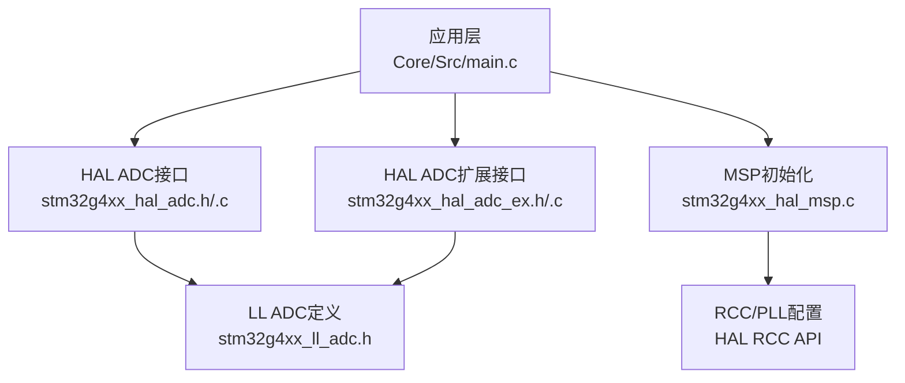
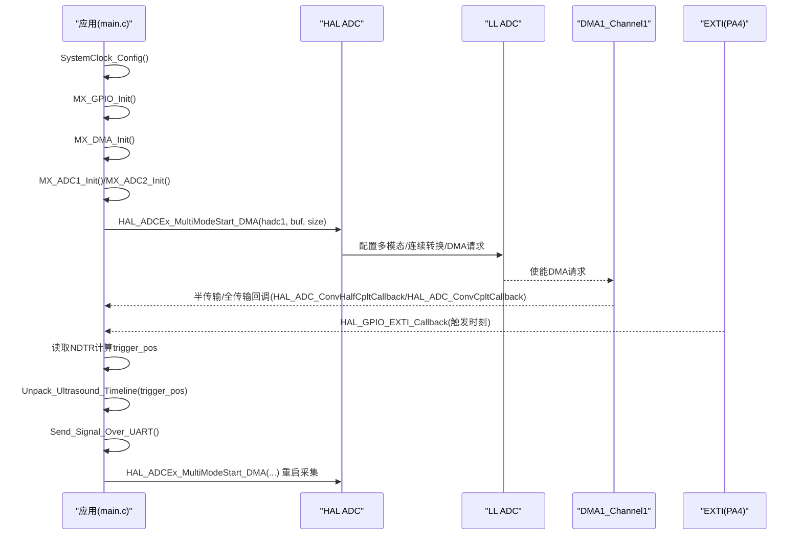
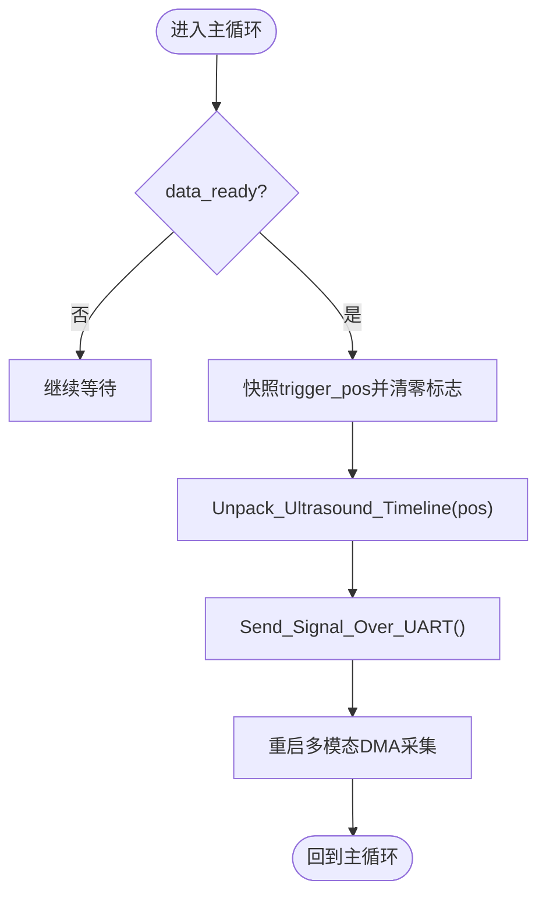
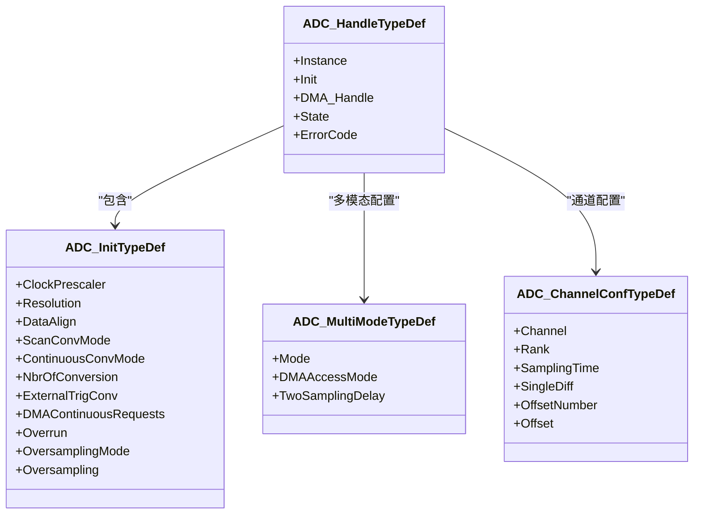
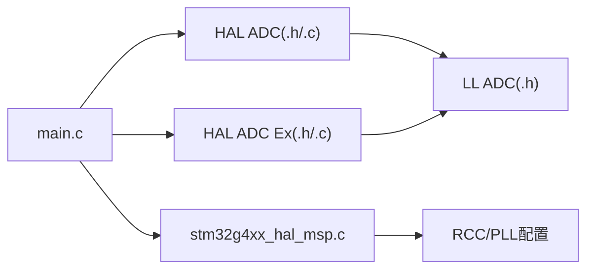

# ADC驱动模块

<cite>
**本文引用的文件列表**
- [main.c](file://Core/Src/main.c)
- [main.h](file://Core/Inc/main.h)
- [stm32g4xx_hal_msp.c](file://Core/Src/stm32g4xx_hal_msp.c)
- [stm32g4xx_hal_adc.h](file://Drivers/STM32G4xx_HAL_Driver/Inc/stm32g4xx_hal_adc.h)
- [stm32g4xx_hal_adc_ex.h](file://Drivers/STM32G4xx_HAL_Driver/Inc/stm32g4xx_hal_adc_ex.h)
- [stm32g4xx_ll_adc.h](file://Drivers/STM32G4xx_HAL_Driver/Inc/stm32g4xx_ll_adc.h)
- [stm32g4xx_hal_adc.c](file://Drivers/STM32G4xx_HAL_Driver/Src/stm32g4xx_hal_adc.c)
- [stm32g4xx_hal_adc_ex.c](file://Drivers/STM32G4xx_HAL_Driver/Src/stm32g4xx_hal_adc_ex.c)
</cite>

## 目录
1. [简介](#简介)
2. [项目结构](#项目结构)
3. [核心组件](#核心组件)
4. [架构总览](#架构总览)
5. [详细组件分析](#详细组件分析)
6. [依赖关系分析](#依赖关系分析)
7. [性能考虑](#性能考虑)
8. [故障排查指南](#故障排查指南)
9. [结论](#结论)
10. [附录](#附录)

## 简介
本技术文档围绕STM32G4系列微控制器的ADC外设驱动，结合工程中的双通道交错（Interleaved）模式与DMA环形缓冲实现，系统阐述单通道/多通道配置、采样率与分辨率设置、触发模式、差分输入、过采样、校准等关键功能。重点说明如何实现双通道交错模式以达成8MSPS的高速采样，并给出完整的初始化流程要点（时钟、GPIO、DMA集成）、中断处理与数据重组策略，以及性能优化与常见问题解决方案。

## 项目结构
本项目采用CubeMX生成的标准分层结构：应用逻辑位于Core/Src/main.c；硬件抽象层（HAL）与底层寄存器访问（LL）位于Drivers/STM32G4xx_HAL_Driver；MSP（外设相关引脚、时钟、DMA初始化）位于Core/Src/stm32g4xx_hal_msp.c。

图表来源
- [main.c:219-290](file://Core/Src/main.c#L219-L290)
- [stm32g4xx_hal_msp.c:92-185](file://Core/Src/stm32g4xx_hal_msp.c#L92-L185)
- [stm32g4xx_hal_adc.h:41-252](file://Drivers/STM32G4xx_HAL_Driver/Inc/stm32g4xx_hal_adc.h#L41-L252)
- [stm32g4xx_hal_adc_ex.h:252-275](file://Drivers/STM32G4xx_HAL_Driver/Inc/stm32g4xx_hal_adc_ex.h#L252-L275)
- [stm32g4xx_ll_adc.h:1-200](file://Drivers/STM32G4xx_HAL_Driver/Inc/stm32g4xx_ll_adc.h#L1-L200)

章节来源
- [main.c:219-290](file://Core/Src/main.c#L219-L290)
- [stm32g4xx_hal_msp.c:92-185](file://Core/Src/stm32g4xx_hal_msp.c#L92-L185)

## 核心组件
- ADC句柄与多模态配置：通过ADC_HandleTypeDef管理ADC实例，使用ADC_MultiModeTypeDef配置双通道交错模式。
- DMA环形缓冲：DMA1_Channel1以循环模式将ADC1/ADC2的16位结果打包为32位字写入内存，主循环在回调中完成数据重组与传输。
- 外部触发与时间窗口捕获：EXTI上升沿作为“触发事件”，记录DMA剩余计数以确定触发时刻位置，从而组织预触发与后触发样本。
- 时钟与GPIO：ADC12时钟源选择PLL，PA2/PA3用于ADC1_IN3/IN4差分对，PA6/PA7用于ADC2_IN3/IN4差分对；PA4配置为EXTI上升沿触发。

章节来源
- [main.c:47-82](file://Core/Src/main.c#L47-L82)
- [main.c:344-464](file://Core/Src/main.c#L344-L464)
- [stm32g4xx_hal_msp.c:92-185](file://Core/Src/stm32g4xx_hal_msp.c#L92-L185)

## 架构总览
下图展示了从系统启动到高速采样的整体流程，包括时钟、GPIO、DMA、ADC初始化，以及双通道交错模式的启动与中断回调处理。

图表来源
- [main.c:219-290](file://Core/Src/main.c#L219-L290)
- [main.c:344-464](file://Core/Src/main.c#L344-L464)
- [stm32g4xx_hal_msp.c:92-185](file://Core/Src/stm32g4xx_hal_msp.c#L92-L185)
- [stm32g4xx_hal_adc_ex.c:861-871](file://Drivers/STM32G4xx_HAL_Driver/Src/stm32g4xx_hal_adc_ex.c#L861-L871)

## 详细组件分析

### 1) 系统时钟与ADC时钟配置
- 系统时钟：通过PLL提供SYSCLK，AHB/APB分频设置为1，确保总线带宽满足高速DMA需求。
- ADC时钟：在MSP中为ADC12选择PLL作为时钟源，并在启用ADC12时钟前输出PLLADCCLK。该路径可支持较高ADC频率，配合最小采样周期可实现接近8MSPS的采样率。

章节来源
- [main.c:296-337](file://Core/Src/main.c#L296-L337)
- [stm32g4xx_hal_msp.c:104-115](file://Core/Src/stm32g4xx_hal_msp.c#L104-L115)
- [stm32g4xx_hal_msp.c:157-168](file://Core/Src/stm32g4xx_hal_msp.c#L157-L168)
- [stm32g4xx_ll_rcc.h:1689-1707](file://Drivers/STM32G4xx_HAL_Driver/Inc/stm32g4xx_ll_rcc.h#L1689-L1707)

### 2) GPIO与外部触发
- ADC模拟输入：PA2/PA3配置为ADC1_IN3/IN4（差分），PA6/PA7配置为ADC2_IN3/IN4（差分）。
- 触发输入：PA4配置为EXTI上升沿触发，用于标记采样时间窗起点。

章节来源
- [stm32g4xx_hal_msp.c:117-125](file://Core/Src/stm32g4xx_hal_msp.c#L117-L125)
- [stm32g4xx_hal_msp.c:170-178](file://Core/Src/stm32g4xx_hal_msp.c#L170-L178)
- [main.c:488-520](file://Core/Src/main.c#L488-L520)

### 3) DMA配置与环形缓冲
- DMA1_Channel1：外设到内存、外设地址不增、内存地址递增、32位对齐、循环模式、低优先级。
- 数据格式：每个32位字包含两个16位样本（低16位=ADC1，高16位=ADC2），对应交错模式下的合并输出。
- 缓冲区大小：120个32位字，即240个16位样本，覆盖预触发与后触发窗口。

章节来源
- [stm32g4xx_hal_msp.c:127-143](file://Core/Src/stm32g4xx_hal_msp.c#L127-L143)
- [main.c:53-62](file://Core/Src/main.c#L53-L62)

### 4) ADC初始化与双通道交错模式
- ADC1/ADC2公共参数：同步时钟PCLK不分频、12位分辨率、右对齐、扫描关闭、单次EOC、连续转换、1个通道、软件触发、DMA连续请求（仅主ADC开启）。
- 多模态配置：模式为双通道交错（ADC_DUALMODE_INTERL），DMA访问模式为12/10位合并，两次采样间隔设为4周期。
- 通道配置：两路均配置为通道3，采样时间2.5周期，差分结束模式。

章节来源
- [main.c:344-407](file://Core/Src/main.c#L344-L407)
- [main.c:414-464](file://Core/Src/main.c#L414-L464)
- [stm32g4xx_hal_adc_ex.h:252-275](file://Drivers/STM32G4xx_HAL_Driver/Inc/stm32g4xx_hal_adc_ex.h#L252-L275)

### 5) 触发与时间窗组织
- EXTI回调：在PA4上升沿时读取DMA剩余计数（NDTR），计算环形缓冲中触发点索引，避免UART传输期间误触发。
- 完成判定：等待DMA半传输与全传输各一次，确保至少80个后触发样本被写入，随后停止多模态DMA并置标志。
- 数据重组：根据触发点快照，按顺序解包环形缓冲，偶数索引为ADC1，奇数索引为ADC2，得到线性时间轴。

图表来源
- [main.c:259-290](file://Core/Src/main.c#L259-L290)
- [main.c:156-171](file://Core/Src/main.c#L156-L171)
- [main.c:119-131](file://Core/Src/main.c#L119-L131)

章节来源
- [main.c:91-113](file://Core/Src/main.c#L91-L113)
- [main.c:136-149](file://Core/Src/main.c#L136-L149)
- [main.c:156-171](file://Core/Src/main.c#L156-L171)

### 6) 8MSPS高速采样原理与配置要点
- 交错模式：ADC1与ADC2交替采样，理论采样率为单通道两倍。
- 时钟与采样周期：ADC时钟由PLL提供，通道采样时间设为2.5周期，加上固定处理周期（12位约12.5周期），每通道约15周期；在合理时钟下可实现接近8MSPS。
- DMA与内存带宽：DMA循环模式与32位打包减少CPU干预，保证数据流稳定。
- 触发定位：利用EXTI+NDTR精确确定触发时刻，组织前后触发窗口。

章节来源
- [main.c:382-386](file://Core/Src/main.c#L382-L386)
- [main.c:395-399](file://Core/Src/main.c#L395-L399)
- [stm32g4xx_hal_adc.h:281-292](file://Drivers/STM32G4xx_HAL_Driver/Inc/stm32g4xx_hal_adc.h#L281-L292)

### 7) 差分输入模式
- 通道配置为差分结束模式，正端为所选通道，负端自动映射为i+1通道，提高共模抑制能力。
- 注意：差分模式下相邻通道不可单独使用。

章节来源
- [main.c:396-398](file://Core/Src/main.c#L396-L398)
- [main.c:452-454](file://Core/Src/main.c#L452-L454)
- [stm32g4xx_hal_adc.h:294-310](file://Drivers/STM32G4xx_HAL_Driver/Inc/stm32g4xx_hal_adc.h#L294-L310)

### 8) 过采样与校准
- 过采样：可在ADC初始化结构中启用OversamplingMode并配置比率与移位，适用于提升信噪比或等效分辨率。
- 校准：使用扩展API进行自校准，建议在ADC禁用状态下执行，以提高转换精度。

章节来源
- [stm32g4xx_hal_adc.h:49-69](file://Drivers/STM32G4xx_HAL_Driver/Inc/stm32g4xx_hal_adc.h#L49-L69)
- [stm32g4xx_hal_adc.c:139-141](file://Drivers/STM32G4xx_HAL_Driver/Src/stm32g4xx_hal_adc.c#L139-L141)
- [stm32g4xx_hal_adc_ex.c:126-190](file://Drivers/STM32G4xx_HAL_Driver/Src/stm32g4xx_hal_adc_ex.c#L126-L190)

### 9) 触发模式与外部事件
- 常规组触发源：支持软件触发与多种定时器/外部中断源，极性可选。
- 当前工程使用软件触发启动多模态DMA，同时用EXTI上升沿作为时间窗标记。

章节来源
- [stm32g4xx_hal_adc.h:641-727](file://Drivers/STM32G4xx_HAL_Driver/Inc/stm32g4xx_hal_adc.h#L641-L727)
- [main.c:371-372](file://Core/Src/main.c#L371-L372)

### 10) 类图：关键数据结构与关系

图表来源
- [stm32g4xx_hal_adc.h:90-252](file://Drivers/STM32G4xx_HAL_Driver/Inc/stm32g4xx_hal_adc.h#L90-L252)
- [stm32g4xx_hal_adc_ex.h:252-275](file://Drivers/STM32G4xx_HAL_Driver/Inc/stm32g4xx_hal_adc_ex.h#L252-L275)

## 依赖关系分析
- main.c依赖HAL ADC与扩展API进行多模态DMA启动与停止，依赖DMA回调与EXTI回调进行时间窗组织。
- MSP负责ADC12时钟源选择、GPIO模拟输入配置、DMA1_Channel1初始化与链接。
- HAL/LL提供寄存器级操作与状态机管理，确保时序与错误处理正确。

图表来源
- [main.c:219-290](file://Core/Src/main.c#L219-L290)
- [stm32g4xx_hal_msp.c:92-185](file://Core/Src/stm32g4xx_hal_msp.c#L92-L185)
- [stm32g4xx_hal_adc.h:41-252](file://Drivers/STM32G4xx_HAL_Driver/Inc/stm32g4xx_hal_adc.h#L41-L252)
- [stm32g4xx_hal_adc_ex.h:252-275](file://Drivers/STM32G4xx_HAL_Driver/Inc/stm32g4xx_hal_adc_ex.h#L252-L275)
- [stm32g4xx_ll_adc.h:1-200](file://Drivers/STM32G4xx_HAL_Driver/Inc/stm32g4xx_ll_adc.h#L1-L200)

章节来源
- [main.c:219-290](file://Core/Src/main.c#L219-L290)
- [stm32g4xx_hal_msp.c:92-185](file://Core/Src/stm32g4xx_hal_msp.c#L92-L185)

## 性能考虑
- 时钟路径：ADC时钟选择PLL，降低分频，有助于达到更高采样率；需确保PLL输出稳定且符合器件限制。
- 采样时间：尽量减小采样周期（如2.5周期），但需兼顾前端信号源阻抗与带宽，避免失真。
- DMA模式：必须使用循环模式与连续DMA请求，防止溢出与丢样。
- 数据打包：32位打包减少总线事务，提高吞吐；主循环仅在必要时重组与发送数据。
- 中断开销：EXTI与DMA回调保持轻量，避免阻塞；使用volatile标志与快照机制保障原子性。
- 过采样：在需要更高动态范围时可启用过采样，但会降低有效采样率，需权衡。

[本节为通用指导，无需特定文件引用]

## 故障排查指南
- 无数据或数据错乱：检查DMA是否循环模式、内存地址递增、32位对齐；确认DMA与ADC链接成功。
- 触发位置偏移：EXTI回调中读取NDTR时需做边界保护（非零且不大于缓冲大小），并使用快照避免竞争。
- 后触发样本不足：确保等待半传输与全传输各一次后再停止DMA，以保证足够后触发样本。
- 时钟不稳定：确认ADC12时钟源与PLL输出已正确使能，APB/AHB分频合理。
- 差分通道冲突：差分模式下相邻通道不可单独使用，避免重复配置。

章节来源
- [main.c:101-105](file://Core/Src/main.c#L101-L105)
- [main.c:119-131](file://Core/Src/main.c#L119-L131)
- [stm32g4xx_hal_msp.c:127-143](file://Core/Src/stm32g4xx_hal_msp.c#L127-L143)
- [stm32g4xx_hal_adc.h:294-310](file://Drivers/STM32G4xx_HAL_Driver/Inc/stm32g4xx_hal_adc.h#L294-L310)

## 结论
本工程基于STM32G4的ADC双通道交错模式与DMA环形缓冲，实现了接近8MSPS的高速采样与精确定时的时间窗组织。通过合理的时钟与GPIO配置、DMA循环模式、EXTI触发与回调处理，系统在低功耗与高吞吐之间取得良好平衡。对于更复杂的场景，可进一步引入过采样与校准以提升精度，并结合定时器触发实现更灵活的采样调度。

[本节为总结，无需特定文件引用]

## 附录

### 完整初始化流程要点（参考路径）
- 系统时钟配置：[SystemClock_Config:296-337](file://Core/Src/main.c#L296-L337)
- ADC1/ADC2初始化：[MX_ADC1_Init:344-407](file://Core/Src/main.c#L344-L407)、[MX_ADC2_Init:414-464](file://Core/Src/main.c#L414-L464)
- DMA初始化与链接：[MX_DMA_Init:469-481](file://Core/Src/main.c#L469-481)、[HAL_ADC_MspInit(DMA):127-143](file://Core/Src/stm32g4xx_hal_msp.c#L127-143)
- GPIO与EXTI配置：[MX_GPIO_Init:488-520](file://Core/Src/main.c#L488-520)
- 启动多模态DMA：[HAL_ADCEx_MultiModeStart_DMA:249-255](file://Core/Src/main.c#L249-255)

章节来源
- [main.c:296-337](file://Core/Src/main.c#L296-L337)
- [main.c:344-464](file://Core/Src/main.c#L344-L464)
- [main.c:469-481](file://Core/Src/main.c#L469-L481)
- [stm32g4xx_hal_msp.c:127-143](file://Core/Src/stm32g4xx_hal_msp.c#L127-L143)
- [main.c:488-520](file://Core/Src/main.c#L488-L520)
- [main.c:249-255](file://Core/Src/main.c#L249-L255)