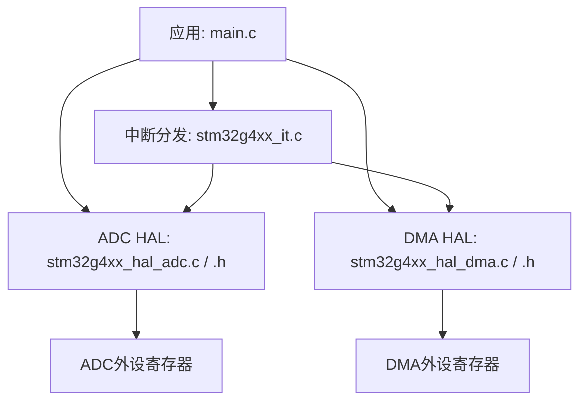
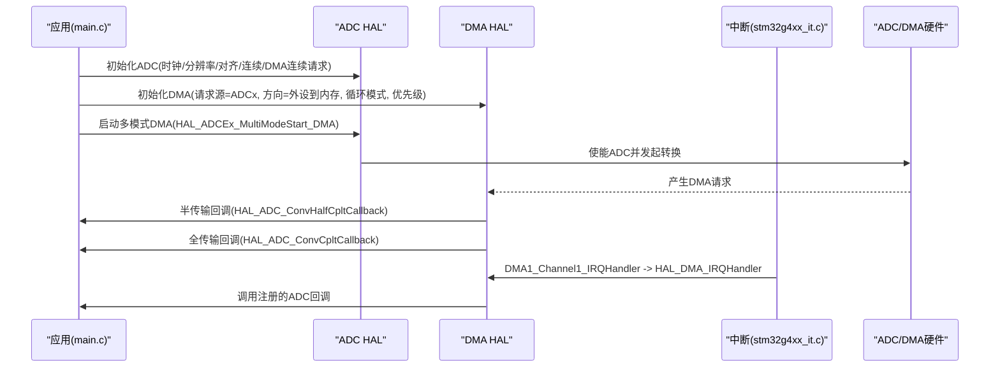
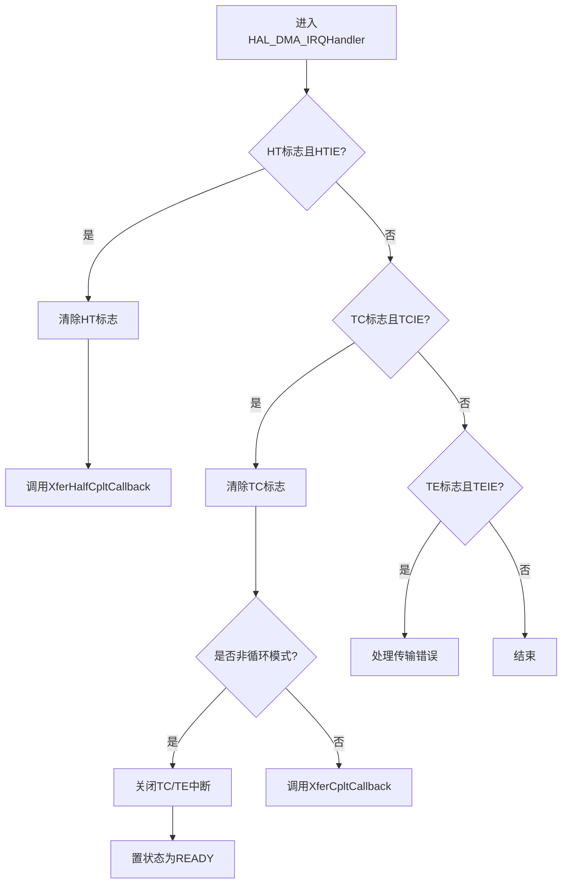
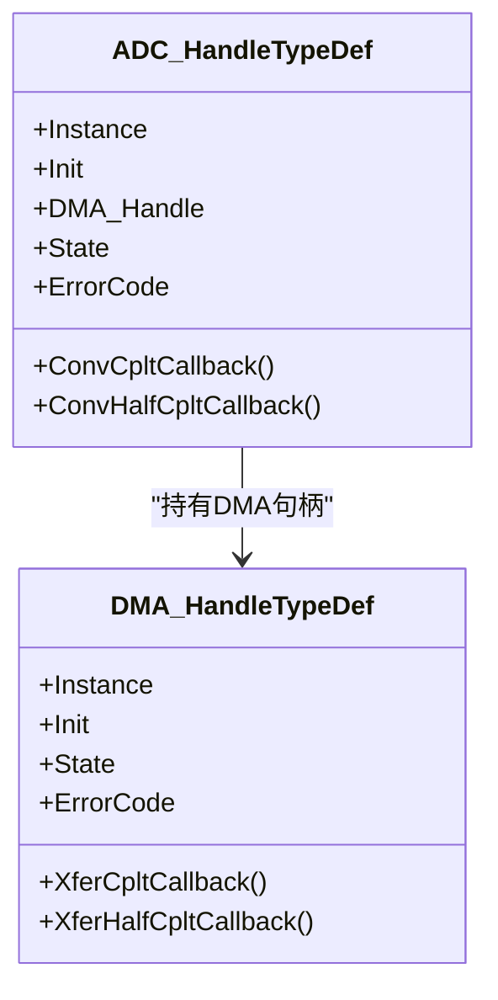
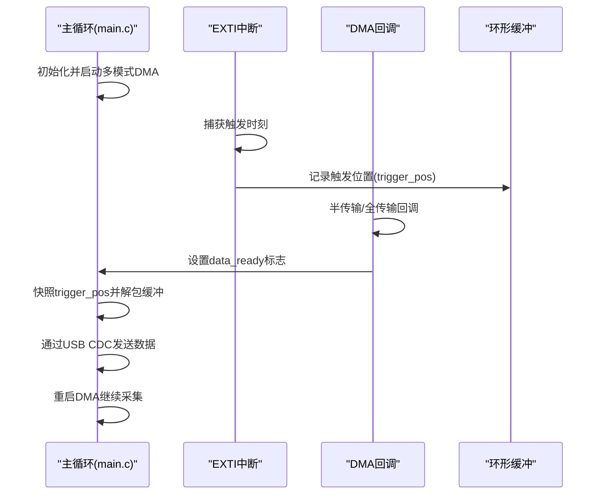
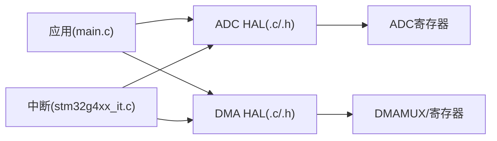

# DMA驱动模块

<cite>
**本文引用的文件**   
- [Core/Src/main.c](file://Core/Src/main.c)
- [Core/Src/stm32g4xx_it.c](file://Core/Src/stm32g4xx_it.c)
- [Drivers/STM32G4xx_HAL_Driver/Inc/stm32g4xx_hal_dma.h](file://Drivers/STM32G4xx_HAL_Driver/Inc/stm32g4xx_hal_dma.h)
- [Drivers/STM32G4xx_HAL_Driver/Src/stm32g4xx_hal_dma.c](file://Drivers/STM32G4xx_HAL_Driver/Src/stm32g4xx_hal_dma.c)
- [Drivers/STM32G4xx_HAL_Driver/Inc/stm32g4xx_hal_adc.h](file://Drivers/STM32G4xx_HAL_Driver/Inc/stm32g4xx_hal_adc.h)
- [Drivers/STM32G4xx_HAL_Driver/Src/stm32g4xx_hal_adc.c](file://Drivers/STM32G4xx_HAL_Driver/Src/stm32g4xx_hal_adc.c)
- [Drivers/STM32G4xx_HAL_Driver/Src/stm32g4xx_hal_adc_ex.c](file://Drivers/STM32G4xx_HAL_Driver/Src/stm32g4xx_hal_adc_ex.c)
</cite>

## 目录
1. [简介](#简介)
2. [项目结构](#项目结构)
3. [核心组件](#核心组件)
4. [架构总览](#架构总览)
5. [详细组件分析](#详细组件分析)
6. [依赖关系分析](#依赖关系分析)
7. [性能与调优](#性能与调优)
8. [故障诊断指南](#故障诊断指南)
9. [结论](#结论)
10. [附录：关键API与宏参考](#附录关键api与宏参考)

## 简介
本技术文档面向STM32G4系列微控制器的DMA控制器驱动，结合工程中的ADC+DMA双通道交错采集示例，系统阐述以下主题：
- DMA通道配置、数据传输方向、内存/外设地址增量、数据宽度对齐、模式（正常/循环）、优先级管理
- 循环模式与正常模式的差异及适用场景
- ADC数据采集中使用DMA进行高效零拷贝传输的方法
- 环形缓冲区管理与内存对齐要求
- DMA中断处理机制与错误处理策略
- DMA与ADC集成的完整流程与代码片段路径
- 为初学者提供概念入门，为高级开发者提供性能调优与故障诊断指导

## 项目结构
本项目基于STM32CubeMX生成的工程骨架，包含HAL层驱动与应用逻辑。与DMA驱动相关的关键位置如下：
- 应用入口与用户回调：Core/Src/main.c
- 中断向量与HAL中断分发：Core/Src/stm32g4xx_it.c
- DMA HAL接口与实现：Drivers/STM32G4xx_HAL_Driver/Inc/stm32g4xx_hal_dma.h, Src/stm32g4xx_hal_dma.c
- ADC HAL接口与实现（含多模式扩展）：Drivers/STM32G4xx_HAL_Driver/Inc/stm32g4xx_hal_adc.h, Src/stm32g4xx_hal_adc.c, Src/stm32g4xx_hal_adc_ex.c

图表来源
- [Core/Src/main.c](file://Core/Src/main.c)
- [Core/Src/stm32g4xx_it.c](file://Core/Src/stm32g4xx_it.c)
- [Drivers/STM32G4xx_HAL_Driver/Inc/stm32g4xx_hal_adc.h](file://Drivers/STM32G4xx_HAL_Driver/Inc/stm32g4xx_hal_adc.h)
- [Drivers/STM32G4xx_HAL_Driver/Src/stm32g4xx_hal_adc.c](file://Drivers/STM32G4xx_HAL_Driver/Src/stm32g4xx_hal_adc.c)
- [Drivers/STM32G4xx_HAL_Driver/Inc/stm32g4xx_hal_dma.h](file://Drivers/STM32G4xx_HAL_Driver/Inc/stm32g4xx_hal_dma.h)
- [Drivers/STM32G4xx_HAL_Driver/Src/stm32g4xx_hal_dma.c](file://Drivers/STM32G4xx_HAL_Driver/Src/stm32g4xx_hal_dma.c)

章节来源
- [Core/Src/main.c](file://Core/Src/main.c)
- [Core/Src/stm32g4xx_it.c](file://Core/Src/stm32g4xx_it.c)
- [Drivers/STM32G4xx_HAL_Driver/Inc/stm32g4xx_hal_dma.h](file://Drivers/STM32G4xx_HAL_Driver/Inc/stm32g4xx_hal_dma.h)
- [Drivers/STM32G4xx_HAL_Driver/Src/stm32g4xx_hal_dma.c](file://Drivers/STM32G4xx_HAL_Driver/Src/stm32g4xx_hal_dma.c)
- [Drivers/STM32G4xx_HAL_Driver/Inc/stm32g4xx_hal_adc.h](file://Drivers/STM32G4xx_HAL_Driver/Inc/stm32g4xx_hal_adc.h)
- [Drivers/STM32G4xx_HAL_Driver/Src/stm32g4xx_hal_adc.c](file://Drivers/STM32G4xx_HAL_Driver/Src/stm32g4xx_hal_adc.c)
- [Drivers/STM32G4xx_HAL_Driver/Src/stm32g4xx_hal_adc_ex.c](file://Drivers/STM32G4xx_HAL_Driver/Src/stm32g4xx_hal_adc_ex.c)

## 核心组件
- DMA HAL句柄与初始化结构体：定义于stm32g4xx_hal_dma.h，包含请求源、传输方向、地址增量、数据宽度、模式、优先级等字段；句柄包含状态、锁、回调指针、错误码、DMAMUX相关基址与掩码等。
- DMA HAL函数族：Init/DeInit、Start/Start_IT、Abort/Abort_IT、PollForTransfer、IRQHandler、GetState/GetError等，位于stm32g4xx_hal_dma.c。
- ADC HAL句柄与初始化结构体：定义于stm32g4xx_hal_adc.h，包含时钟分频、分辨率、对齐、扫描模式、EOC选择、连续转换、DMA连续请求、溢出行为、过采样等；句柄包含DMA_Handle指针与回调。
- ADC HAL函数族：Init/DeInit、Start/Stop、Start_DMA/Stop_DMA、多模式扩展API等，位于stm32g4xx_hal_adc.c与stm32g4xx_hal_adc_ex.c。
- 应用层集成：main.c中完成DMA/ADC初始化、启动多模式DMA采集、实现半传输/全传输回调、EXTI触发捕获、环形缓冲解包与USB CDC发送。

章节来源
- [Drivers/STM32G4xx_HAL_Driver/Inc/stm32g4xx_hal_dma.h](file://Drivers/STM32G4xx_HAL_Driver/Inc/stm32g4xx_hal_dma.h)
- [Drivers/STM32G4xx_HAL_Driver/Src/stm32g4xx_hal_dma.c](file://Drivers/STM32G4xx_HAL_Driver/Src/stm32g4xx_hal_dma.c)
- [Drivers/STM32G4xx_HAL_Driver/Inc/stm32g4xx_hal_adc.h](file://Drivers/STM32G4xx_HAL_Driver/Inc/stm32g4xx_hal_adc.h)
- [Drivers/STM32G4xx_HAL_Driver/Src/stm32g4xx_hal_adc.c](file://Drivers/STM32G4xx_HAL_Driver/Src/stm32g4xx_hal_adc.c)
- [Drivers/STM32G4xx_HAL_Driver/Src/stm32g4xx_hal_adc_ex.c](file://Drivers/STM32G4xx_HAL_Driver/Src/stm32g4xx_hal_adc_ex.c)
- [Core/Src/main.c](file://Core/Src/main.c)

## 架构总览
下图展示DMA与ADC在工程中的交互关系，以及中断与回调的调用链。

图表来源
- [Core/Src/main.c](file://Core/Src/main.c)
- [Core/Src/stm32g4xx_it.c](file://Core/Src/stm32g4xx_it.c)
- [Drivers/STM32G4xx_HAL_Driver/Src/stm32g4xx_hal_adc.c](file://Drivers/STM32G4xx_HAL_Driver/Src/stm32g4xx_hal_adc.c)
- [Drivers/STM32G4xx_HAL_Driver/Src/stm32g4xx_hal_dma.c](file://Drivers/STM32G4xx_HAL_Driver/Src/stm32g4xx_hal_dma.c)

## 详细组件分析

### DMA HAL数据结构与初始化
- DMA_InitTypeDef关键字段
  - Request：外设请求源（如ADC1/ADC2）
  - Direction：传输方向（外设到内存/内存到外设/内存到内存）
  - PeriphInc/MemInc：外设/内存地址是否自增
  - PeriphDataAlignment/MemDataAlignment：数据宽度（字节/半字/字）
  - Mode：NORMAL或CIRCULAR（循环）
  - Priority：LOW/MEDIUM/HIGH/VERY_HIGH
- DMA_HandleTypeDef关键字段
  - Instance：DMA通道寄存器基址
  - Init：上述配置
  - State/Lock/ErrorCode：状态机与错误码
  - Parent：父对象（例如ADC句柄）
  - XferCpltCallback/XferHalfCpltCallback/XferErrorCallback/XferAbortCallback：回调
  - DMAmuxChannel/Status/RequestGen：DMAMUX同步与请求生成器支持

初始化流程要点
- 校验参数、计算通道索引与DMA基址
- 写入CCR寄存器（方向、增量、数据宽度、模式、优先级）
- 设置DMAMUX通道请求ID，必要时配置请求生成器
- 清标志位、置状态为READY、分配锁

章节来源
- [Drivers/STM32G4xx_HAL_Driver/Inc/stm32g4xx_hal_dma.h](file://Drivers/STM32G4xx_HAL_Driver/Inc/stm32g4xx_hal_dma.h)
- [Drivers/STM32G4xx_HAL_Driver/Src/stm32g4xx_hal_dma.c](file://Drivers/STM32G4xx_HAL_Driver/Src/stm32g4xx_hal_dma.c)

### DMA IO操作与中断处理
- Start/Start_IT：配置源/目的地址与长度，启用通道；Start_IT根据是否有半传输回调决定是否开启HT中断
- Abort/Abort_IT：禁用通道与中断、清标志、复位状态
- PollForTransfer：轮询等待TC或HT，不支持循环模式
- IRQHandler：根据ISR与CCR判断HT/TC/TE事件，清标志并调用对应回调；在非循环模式下自动关闭相应中断

图表来源
- [Drivers/STM32G4xx_HAL_Driver/Src/stm32g4xx_hal_dma.c](file://Drivers/STM32G4xx_HAL_Driver/Src/stm32g4xx_hal_dma.c)

章节来源
- [Drivers/STM32G4xx_HAL_Driver/Src/stm32g4xx_hal_dma.c](file://Drivers/STM32G4xx_HAL_Driver/Src/stm32g4xx_hal_dma.c)

### ADC HAL与DMA集成
- ADC_InitTypeDef关键字段
  - ClockPrescaler/Resolution/DataAlign：时钟与数据格式
  - ScanConvMode/ContinuousConvMode/NbrOfConversion：序列与连续转换
  - ExternalTrigConv/ExternalTrigConvEdge：外部触发源与边沿
  - DMAContinuousRequests：DMA连续请求（配合循环模式）
  - Overrun：溢出时保留或覆盖
- ADC_HandleTypeDef关键字段
  - DMA_Handle：指向DMA句柄
  - ConvCpltCallback/ConvHalfCpltCallback：转换完成与半传输回调
- 多模式扩展（双通道交错）
  - 通过扩展API启动多模式DMA采集，将两个ADC结果打包到一个目标缓冲区

图表来源
- [Drivers/STM32G4xx_HAL_Driver/Inc/stm32g4xx_hal_adc.h](file://Drivers/STM32G4xx_HAL_Driver/Inc/stm32g4xx_hal_adc.h)
- [Drivers/STM32G4xx_HAL_Driver/Inc/stm32g4xx_hal_dma.h](file://Drivers/STM32G4xx_HAL_Driver/Inc/stm32g4xx_hal_dma.h)

章节来源
- [Drivers/STM32G4xx_HAL_Driver/Inc/stm32g4xx_hal_adc.h](file://Drivers/STM32G4xx_HAL_Driver/Inc/stm32g4xx_hal_adc.h)
- [Drivers/STM32G4xx_HAL_Driver/Src/stm32g4xx_hal_adc.c](file://Drivers/STM32G4xx_HAL_Driver/Src/stm32g4xx_hal_adc.c)
- [Drivers/STM32G4xx_HAL_Driver/Src/stm32g4xx_hal_adc_ex.c](file://Drivers/STM32G4xx_HAL_Driver/Src/stm32g4xx_hal_adc_ex.c)

### 应用层集成与环形缓冲区管理
- 环形缓冲区设计
  - 使用uint32_t数组作为缓冲，低16位存放ADC1，高16位存放ADC2，实现交错数据的紧凑存储
  - 缓冲区大小需满足“预触发+后触发”窗口需求
- 触发与时间窗
  - EXTI上升沿触发记录当前DMA剩余计数，反推触发点在环形缓冲中的位置
  - 利用半传输/全传输回调计数确保至少获取足够的后触发样本
- 零拷贝传输
  - ADC直接写入环形缓冲，主循环仅在需要时读取并解包为线性时序，避免中间拷贝
- 内存对齐
  - 使用uint32_t类型保证按字访问，避免跨总线周期导致的性能损失
- 典型流程
  - 初始化GPIO/EXTI、DMA、ADC1/ADC2
  - 启动多模式DMA采集（循环模式）
  - 在回调中更新标志位，主循环检测标志后进行数据处理与输出

图表来源
- [Core/Src/main.c](file://Core/Src/main.c)
- [Core/Src/stm32g4xx_it.c](file://Core/Src/stm32g4xx_it.c)

章节来源
- [Core/Src/main.c](file://Core/Src/main.c)
- [Core/Src/stm32g4xx_it.c](file://Core/Src/stm32g4xx_it.c)

## 依赖关系分析
- 应用层依赖HAL层提供的统一接口，屏蔽底层寄存器细节
- DMA HAL负责外设请求映射（DMAMUX）、中断分发与回调调度
- ADC HAL在多模式下协调两个ADC实例，并通过DMA将结果写入用户缓冲
- 中断向量表将硬件中断路由至HAL处理函数，再由HAL调用用户回调

图表来源
- [Core/Src/main.c](file://Core/Src/main.c)
- [Core/Src/stm32g4xx_it.c](file://Core/Src/stm32g4xx_it.c)
- [Drivers/STM32G4xx_HAL_Driver/Src/stm32g4xx_hal_dma.c](file://Drivers/STM32G4xx_HAL_Driver/Src/stm32g4xx_hal_dma.c)
- [Drivers/STM32G4xx_HAL_Driver/Src/stm32g4xx_hal_adc.c](file://Drivers/STM32G4xx_HAL_Driver/Src/stm32g4xx_hal_adc.c)

章节来源
- [Core/Src/main.c](file://Core/Src/main.c)
- [Core/Src/stm32g4xx_it.c](file://Core/Src/stm32g4xx_it.c)
- [Drivers/STM32G4xx_HAL_Driver/Src/stm32g4xx_hal_dma.c](file://Drivers/STM32G4xx_HAL_Driver/Src/stm32g4xx_hal_dma.c)
- [Drivers/STM32G4xx_HAL_Driver/Src/stm32g4xx_hal_adc.c](file://Drivers/STM32G4xx_HAL_Driver/Src/stm32g4xx_hal_adc.c)

## 性能与调优
- 循环模式 vs 正常模式
  - 循环模式：适合持续采集（如ADC），无需CPU干预，配合半/全传输回调可实现流水线处理
  - 正常模式：一次性传输完成后停止，适用于批量固定长度传输
- 数据宽度与对齐
  - 外设与内存数据宽度一致可避免内部重排开销；使用uint32_t缓冲提升吞吐
- 优先级管理
  - 在高负载系统中，适当提高DMA优先级可减少丢样风险
- 触发定位与时序
  - 使用__HAL_DMA_GET_COUNTER快速估算触发点，减少中断内耗时
- 零拷贝与批处理
  - 直接在环形缓冲中累积数据，主循环批量解包与发送，降低中断上下文负担

[本节为通用指导，不直接分析具体文件]

## 故障诊断指南
- 常见错误码
  - HAL_DMA_ERROR_TE：传输错误（地址无效、总线冲突等）
  - HAL_DMA_ERROR_TIMEOUT：超时
  - HAL_DMA_ERROR_SYNC：DMAMUX同步溢出
  - HAL_DMA_ERROR_REQGEN：请求生成器溢出
- 诊断步骤
  - 检查DMA通道是否启用、中断是否使能、回调是否正确注册
  - 确认ADC的DMA连续请求与DMA循环模式匹配
  - 核对缓冲大小与DMA长度一致，避免越界
  - 使用__HAL_DMA_GET_COUNTER观察剩余计数，验证触发定位逻辑
- 典型问题定位
  - 无回调触发：检查NVIC优先级与中断向量映射
  - 数据错位：检查PeriphInc/MemInc与数据宽度配置
  - 溢出丢失：检查Overrun行为与DMA速率是否匹配ADC速率

章节来源
- [Drivers/STM32G4xx_HAL_Driver/Inc/stm32g4xx_hal_dma.h](file://Drivers/STM32G4xx_HAL_Driver/Inc/stm32g4xx_hal_dma.h)
- [Drivers/STM32G4xx_HAL_Driver/Src/stm32g4xx_hal_dma.c](file://Drivers/STM32G4xx_HAL_Driver/Src/stm32g4xx_hal_dma.c)
- [Core/Src/main.c](file://Core/Src/main.c)

## 结论
本仓库展示了STM32G4上DMA与ADC的高效集成方案：通过双通道交错采集、DMA循环模式与半/全传输回调，实现了实时、零拷贝的数据流处理。结合EXTI触发与环形缓冲，可在复杂时序下精确定位事件并稳定输出。遵循本文的配置要点与调优建议，可进一步提升系统吞吐与鲁棒性。

[本节为总结，不直接分析具体文件]

## 附录：关键API与宏参考
- DMA HAL
  - HAL_DMA_Init / HAL_DMA_DeInit
  - HAL_DMA_Start / HAL_DMA_Start_IT
  - HAL_DMA_Abort / HAL_DMA_Abort_IT
  - HAL_DMA_PollForTransfer
  - HAL_DMA_IRQHandler
  - __HAL_DMA_GET_COUNTER
  - 宏：DMA_REQUEST_ADCx、DMA_CCR_*、DMA_IT_*、DMA_FLAG_*
- ADC HAL
  - HAL_ADC_Init / HAL_ADC_ConfigChannel
  - HAL_ADCEx_MultiModeConfigChannel
  - HAL_ADCEx_MultiModeStart_DMA / HAL_ADCEx_MultiModeStop_DMA
  - HAL_ADC_ConvCpltCallback / HAL_ADC_ConvHalfCpltCallback
  - 宏：ADC_EOCSelection、DMAContinuousRequests、Overrun等

章节来源
- [Drivers/STM32G4xx_HAL_Driver/Inc/stm32g4xx_hal_dma.h](file://Drivers/STM32G4xx_HAL_Driver/Inc/stm32g4xx_hal_dma.h)
- [Drivers/STM32G4xx_HAL_Driver/Src/stm32g4xx_hal_dma.c](file://Drivers/STM32G4xx_HAL_Driver/Src/stm32g4xx_hal_dma.c)
- [Drivers/STM32G4xx_HAL_Driver/Inc/stm32g4xx_hal_adc.h](file://Drivers/STM32G4xx_HAL_Driver/Inc/stm32g4xx_hal_adc.h)
- [Drivers/STM32G4xx_HAL_Driver/Src/stm32g4xx_hal_adc.c](file://Drivers/STM32G4xx_HAL_Driver/Src/stm32g4xx_hal_adc.c)
- [Drivers/STM32G4xx_HAL_Driver/Src/stm32g4xx_hal_adc_ex.c](file://Drivers/STM32G4xx_HAL_Driver/Src/stm32g4xx_hal_adc_ex.c)
- [Core/Src/main.c](file://Core/Src/main.c)