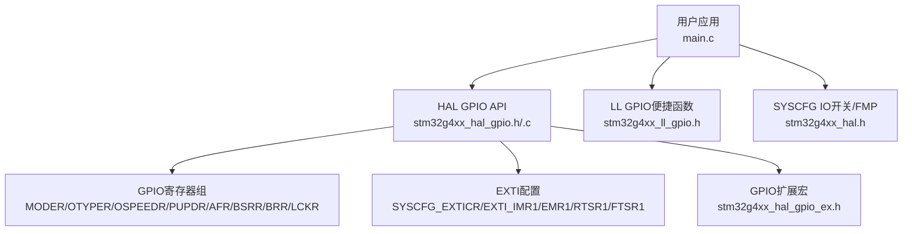
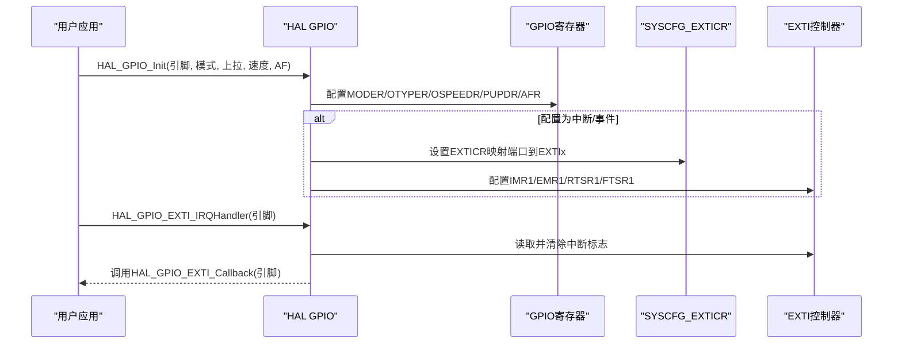
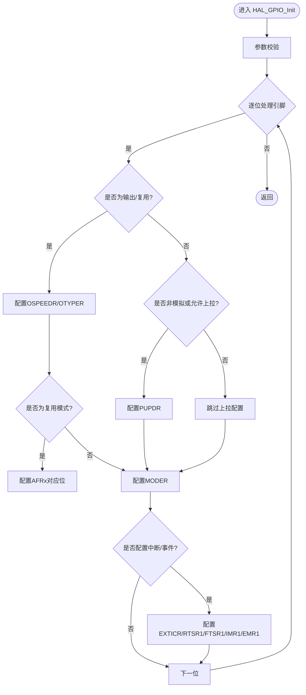
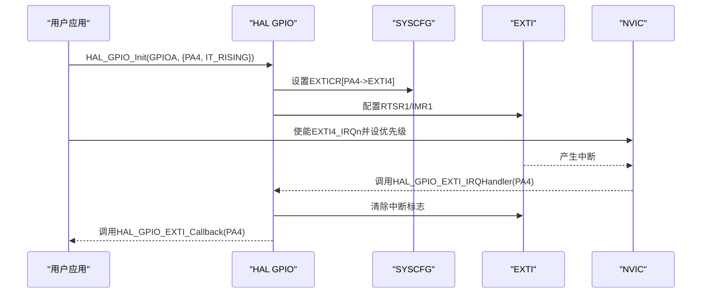
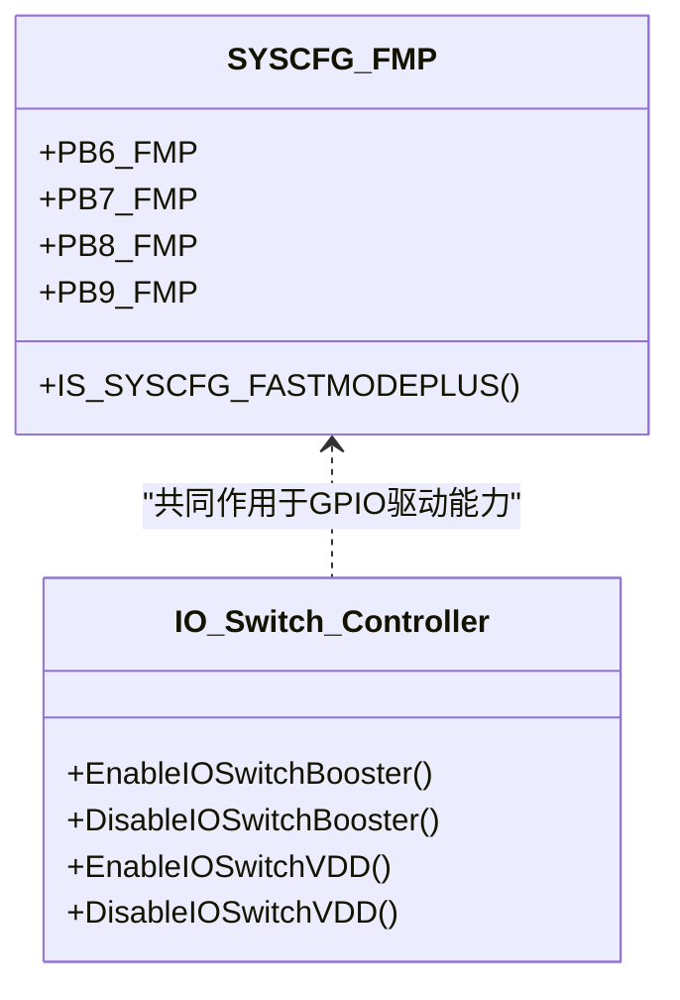
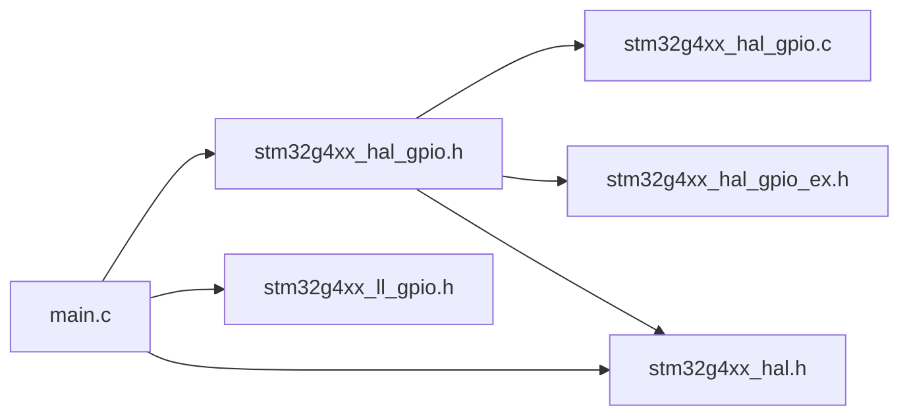

# GPIO驱动模块

<cite>
**本文引用的文件**   
- [stm32g4xx_hal_gpio.h](file://Drivers/STM32G4xx_HAL_Driver/Inc/stm32g4xx_hal_gpio.h)
- [stm32g4xx_hal_gpio.c](file://Drivers/STM32G4xx_HAL_Driver/Src/stm32g4xx_hal_gpio.c)
- [stm32g4xx_hal_gpio_ex.h](file://Drivers/STM32G4xx_HAL_Driver/Inc/stm32g4xx_hal_gpio_ex.h)
- [stm32g4xx_ll_gpio.h](file://Drivers/STM32G4xx_HAL_Driver/Inc/stm32g4xx_ll_gpio.h)
- [stm32g4xx_hal.h](file://Drivers/STM32G4xx_HAL_Driver/Inc/stm32g4xx_hal.h)
- [main.c](file://Core/Src/main.c)
- [main.h](file://Core/Inc/main.h)
</cite>

## 目录
1. [简介](#简介)
2. [项目结构](#项目结构)
3. [核心组件](#核心组件)
4. [架构总览](#架构总览)
5. [详细组件分析](#详细组件分析)
6. [依赖关系分析](#依赖关系分析)
7. [性能与功耗优化](#性能与功耗优化)
8. [故障排查指南](#故障排查指南)
9. [结论](#结论)
10. [附录：典型应用与示例路径](#附录典型应用与示例路径)

## 简介
本技术文档面向STM32G4系列微控制器的GPIO驱动模块，系统阐述HAL层与LL层的API、寄存器操作要点、外部中断配置流程、快速模式Plus（Fast-mode Plus）与IO开关控制器使用方法，并提供LED控制、按键检测、传感器接口等典型应用场景的参考实现路径。文档同时给出功耗优化建议与电气特性注意事项，帮助初学者快速入门，并为高级开发者提供底层寄存器操作与性能优化指导。

## 项目结构
本项目采用标准CubeMX工程组织方式，GPIO相关代码主要位于HAL驱动与用户主程序：
- HAL GPIO接口定义与实现：stm32g4xx_hal_gpio.h / stm32g4xx_hal_gpio.c
- GPIO扩展功能（复用AF映射、端口索引宏等）：stm32g4xx_hal_gpio_ex.h
- LL层GPIO原子操作与便捷函数：stm32g4xx_ll_gpio.h
- SYSCFG相关宏与IO开关控制器接口：stm32g4xx_hal.h
- 用户应用入口与GPIO初始化示例：main.c / main.h

图表来源
- [stm32g4xx_hal_gpio.h:285-303](file://Drivers/STM32G4xx_HAL_Driver/Inc/stm32g4xx_hal_gpio.h#L285-L303)
- [stm32g4xx_hal_gpio.c:162-284](file://Drivers/STM32G4xx_HAL_Driver/Src/stm32g4xx_hal_gpio.c#L162-L284)
- [stm32g4xx_hal_gpio_ex.h:311-316](file://Drivers/STM32G4xx_HAL_Driver/Inc/stm32g4xx_hal_gpio_ex.h#L311-L316)
- [stm32g4xx_ll_gpio.h:285-429](file://Drivers/STM32G4xx_HAL_Driver/Inc/stm32g4xx_ll_gpio.h#L285-L429)
- [stm32g4xx_hal.h:603-606](file://Drivers/STM32G4xx_HAL_Driver/Inc/stm32g4xx_hal.h#L603-L606)

章节来源
- [main.c:488-520](file://Core/Src/main.c#L488-L520)
- [stm32g4xx_hal_gpio.h:285-303](file://Drivers/STM32G4xx_HAL_Driver/Inc/stm32g4xx_hal_gpio.h#L285-L303)
- [stm32g4xx_hal_gpio.c:162-284](file://Drivers/STM32G4xx_HAL_Driver/Src/stm32g4xx_hal_gpio.c#L162-L284)

## 核心组件
- GPIO初始化结构体与枚举
  - GPIO_InitTypeDef：包含Pin、Mode、Pull、Speed、Alternate字段，用于统一配置引脚模式、上下拉、速度与复用。
  - GPIO_PinState：表示引脚电平状态（SET/RESET）。
- 模式与速度
  - 模式：输入、推挽输出、开漏输出、复用推挽/开漏、模拟；支持中断/事件及上升/下降沿触发组合。
  - 速度：低、中、高、极高四档，影响输出翻转速率与EMI。
- 上拉/下拉电阻
  - 无、上拉、下拉三态，适用于输入或复用模式下的弱上/下拉。
- 外部中断/事件
  - 通过SYSCFG_EXTICR选择端口到EXTI线，EXTI_IMR1/EMR1使能中断/事件，RTSR1/FTSR1设置边沿触发。
- IO操作
  - 读：HAL_GPIO_ReadPin
  - 写/翻转：HAL_GPIO_WritePin/HAL_GPIO_TogglePin（使用BSRR/BRR保证原子性）
  - 锁：HAL_GPIO_LockPin锁定配置寄存器直至复位
- EXTI回调
  - HAL_GPIO_EXTI_IRQHandler负责清标志并调用HAL_GPIO_EXTI_Callback，用户可在应用中重写该回调。

章节来源
- [stm32g4xx_hal_gpio.h:47-72](file://Drivers/STM32G4xx_HAL_Driver/Inc/stm32g4xx_hal_gpio.h#L47-L72)
- [stm32g4xx_hal_gpio.h:116-156](file://Drivers/STM32G4xx_HAL_Driver/Inc/stm32g4xx_hal_gpio.h#L116-L156)
- [stm32g4xx_hal_gpio.h:285-303](file://Drivers/STM32G4xx_HAL_Driver/Inc/stm32g4xx_hal_gpio.h#L285-L303)
- [stm32g4xx_hal_gpio.c:374-484](file://Drivers/STM32G4xx_HAL_Driver/Src/stm32g4xx_hal_gpio.c#L374-L484)
- [stm32g4xx_hal_gpio.c:491-514](file://Drivers/STM32G4xx_HAL_Driver/Src/stm32g4xx_hal_gpio.c#L491-L514)

## 架构总览
GPIO驱动在HAL层封装了寄存器操作，向上提供统一API；LL层提供更贴近寄存器的轻量级函数；用户应用通过HAL/LL进行配置与操作。EXTI由SYSCFG与EXTI外设协同完成路由与触发。

图表来源
- [stm32g4xx_hal_gpio.c:162-284](file://Drivers/STM32G4xx_HAL_Driver/Src/stm32g4xx_hal_gpio.c#L162-L284)
- [stm32g4xx_hal_gpio.c:491-514](file://Drivers/STM32G4xx_HAL_Driver/Src/stm32g4xx_hal_gpio.c#L491-L514)

## 详细组件分析

### HAL GPIO初始化与IO操作
- 初始化流程
  - 参数校验后，按位遍历配置的引脚，分别处理：
    - 输出/复用模式：配置OSPEEDR与OTYPER
    - 非模拟模式或特定条件：配置PUPDR
    - 复用模式：配置AFRL/AFRH对应位的AF编号
    - 中断/事件模式：启用SYSCFG时钟，设置EXTICR，配置RTSR1/FTSR1/IMR1/EMR1
  - 最后写入MODER确定方向模式
- IO读写与翻转
  - 读：直接读取IDR相应位
  - 写/翻转：使用BSRR置位与BRR清零，确保原子操作避免中断干扰
- 引脚锁
  - 通过LCKR写入序列锁定配置寄存器，防止意外修改

图表来源
- [stm32g4xx_hal_gpio.c:162-284](file://Drivers/STM32G4xx_HAL_Driver/Src/stm32g4xx_hal_gpio.c#L162-L284)

章节来源
- [stm32g4xx_hal_gpio.c:162-284](file://Drivers/STM32G4xx_HAL_Driver/Src/stm32g4xx_hal_gpio.c#L162-L284)
- [stm32g4xx_hal_gpio.c:374-484](file://Drivers/STM32G4xx_HAL_Driver/Src/stm32g4xx_hal_gpio.c#L374-L484)

### 外部中断（EXTI）配置与回调
- 配置步骤
  - 将引脚模式设置为带中断/事件的组合（如GPIO_MODE_IT_RISING）
  - HAL_GPIO_Init内部会：
    - 启用SYSCFG时钟
    - 设置SYSCFG_EXTICRx以将指定端口映射到EXTIx
    - 配置RTSR1/FTSR1选择边沿触发
    - 配置IMR1/EMR1选择中断或事件
  - 在NVIC中使能对应EXTI IRQ并设置优先级
- 中断处理
  - HAL_GPIO_EXTI_IRQHandler检查并清除中断标志，然后调用HAL_GPIO_EXTI_Callback
  - 用户需在应用中重写HAL_GPIO_EXTI_Callback以实现业务逻辑

图表来源
- [stm32g4xx_hal_gpio.c:234-279](file://Drivers/STM32G4xx_HAL_Driver/Src/stm32g4xx_hal_gpio.c#L234-L279)
- [stm32g4xx_hal_gpio.c:491-514](file://Drivers/STM32G4xx_HAL_Driver/Src/stm32g4xx_hal_gpio.c#L491-L514)
- [main.c:498-506](file://Core/Src/main.c#L498-L506)

章节来源
- [stm32g4xx_hal_gpio.c:234-279](file://Drivers/STM32G4xx_HAL_Driver/Src/stm32g4xx_hal_gpio.c#L234-L279)
- [main.c:498-506](file://Core/Src/main.c#L498-L506)
- [main.c:91-113](file://Core/Src/main.c#L91-L113)

### 快速模式Plus（Fast-mode Plus）与IO开关控制器
- 快速模式Plus（FMP）
  - 针对部分I2C引脚（PB6/PB7/PB8/PB9）可通过SYSCFG_CFGR1中的FMP位开启，提升SCL/SDA边沿速率，支持更高带宽I2C通信
  - 宏定义与验证宏位于HAL头文件中，便于条件编译与参数校验
- IO开关控制器
  - 提供使能/禁用IO开关增强器与VDD切换能力，改善开关噪声与驱动能力
  - 相关接口：HAL_SYSCFG_EnableIOSwitchBooster/DisableIOSwitchBooster、EnableIOSwitchVDD/DisableIOSwitchVDD

图表来源
- [stm32g4xx_hal.h:169-181](file://Drivers/STM32G4xx_HAL_Driver/Inc/stm32g4xx_hal.h#L169-L181)
- [stm32g4xx_hal.h:484-500](file://Drivers/STM32G4xx_HAL_Driver/Inc/stm32g4xx_hal.h#L484-L500)
- [stm32g4xx_hal.h:603-606](file://Drivers/STM32G4xx_HAL_Driver/Inc/stm32g4xx_hal.h#L603-L606)

章节来源
- [stm32g4xx_hal.h:169-181](file://Drivers/STM32G4xx_HAL_Driver/Inc/stm32g4xx_hal.h#L169-L181)
- [stm32g4xx_hal.h:484-500](file://Drivers/STM32G4xx_HAL_Driver/Inc/stm32g4xx_hal.h#L484-L500)
- [stm32g4xx_hal.h:603-606](file://Drivers/STM32G4xx_HAL_Driver/Inc/stm32g4xx_hal.h#L603-L606)

### LL层GPIO便捷函数
- LL层提供单引脚/多引脚的原子操作函数，适合对性能敏感的场景
- 常用函数：
  - LL_GPIO_SetPinMode/GetPinMode
  - LL_GPIO_SetPinOutputType/GetPinOutputType
  - LL_GPIO_SetPinSpeed/GetPinSpeed
  - LL_GPIO_SetPinPull/GetPinPull
  - LL_GPIO_SetAFPin_0_7/SetAFPin_8_15

章节来源
- [stm32g4xx_ll_gpio.h:285-429](file://Drivers/STM32G4xx_HAL_Driver/Inc/stm32g4xx_ll_gpio.h#L285-L429)

### 复用功能（AF）映射概览
- STM32G4的每个GPIO引脚可映射至多个外设的复用功能（AF0~AF15），包括定时器、串口、SPI、I2C、USB、CAN、SAI、UCPD、HRTIM等
- 具体映射由GPIOEx头文件中的宏定义提供，例如：
  - TIM1/TIM2/TIM3/TIM4/TIM8/TIM15/TIM16/TIM17/TIM20
  - USART1/USART2/USART3/LPUART1/UART4/UART5
  - SPI1/SPI2/SPI3/I2C1/I2C2/I2C3/I2C4
  - SAI1、UCPD1、FDCAN1/FDCAN2/FDCAN3、QUADSPI/OctoSPI等
- 配置方法：在GPIO_InitTypeDef中设置Alternate字段为对应AF编号

章节来源
- [stm32g4xx_hal_gpio_ex.h:53-293](file://Drivers/STM32G4xx_HAL_Driver/Inc/stm32g4xx_hal_gpio_ex.h#L53-L293)

## 依赖关系分析
- HAL GPIO依赖：
  - 设备头文件与基础类型（stm32g4xx_hal_def.h）
  - GPIO扩展宏（stm32g4xx_hal_gpio_ex.h）
  - 系统配置宏（stm32g4xx_hal.h）
- 用户应用依赖：
  - HAL GPIO API进行初始化与IO操作
  - NVIC配置EXTI中断
  - 可选：LL GPIO进行高性能场景的细粒度控制

图表来源
- [stm32g4xx_hal_gpio.h:270-271](file://Drivers/STM32G4xx_HAL_Driver/Inc/stm32g4xx_hal_gpio.h#L270-L271)
- [stm32g4xx_hal_gpio.c:106-106](file://Drivers/STM32G4xx_HAL_Driver/Src/stm32g4xx_hal_gpio.c#L106-L106)
- [main.c:20-21](file://Core/Src/main.c#L20-L21)

章节来源
- [stm32g4xx_hal_gpio.h:270-271](file://Drivers/STM32G4xx_HAL_Driver/Inc/stm32g4xx_hal_gpio.h#L270-L271)
- [main.c:20-21](file://Core/Src/main.c#L20-L21)

## 性能与功耗优化
- 输出速度匹配负载
  - 根据信号频率与负载电容选择合适的OSPEEDR档位，避免过高速度导致EMI与功耗增加
- 开漏与推挽选择
  - 总线型或多主机场景优先开漏，配合外部上拉；数字输出一般推挽
- 上拉/下拉合理配置
  - 输入引脚在无外部上拉时启用内部上拉可降低悬空风险；低功耗场景可关闭不用的上拉
- 中断与事件
  - 仅使能必要的EXTI线，减少中断开销；在中断中只做最小必要操作，复杂逻辑放入主循环
- 快速模式Plus
  - I2C通信需要更高带宽时可开启FMP，注意器件兼容性与布线质量
- IO开关控制器
  - 在高噪声环境或大电流切换时，可启用IO开关增强器以提升驱动能力与稳定性
- 锁配置
  - 关键引脚配置完成后使用HAL_GPIO_LockPin锁定，防止运行时误改

章节来源
- [stm32g4xx_hal_gpio.c:456-484](file://Drivers/STM32G4xx_HAL_Driver/Src/stm32g4xx_hal_gpio.c#L456-L484)
- [stm32g4xx_hal.h:603-606](file://Drivers/STM32G4xx_HAL_Driver/Inc/stm32g4xx_hal.h#L603-L606)
- [stm32g4xx_hal.h:169-181](file://Drivers/STM32G4xx_HAL_Driver/Inc/stm32g4xx_hal.h#L169-L181)

## 故障排查指南
- 中断未触发
  - 确认已启用SYSCFG时钟并在HAL_GPIO_Init中正确设置EXTICR
  - 检查EXTI IMR1/EMR1与RTSR1/FTSR1配置是否与期望一致
  - 确认NVIC已使能对应EXTI IRQ且优先级合理
- 引脚电平异常
  - 检查输出模式（推挽/开漏）与速度设置是否匹配负载
  - 确认上拉/下拉配置是否符合电路设计
- 复用冲突
  - 同一引脚只能映射到一个AF，避免重复配置
- 快速模式Plus无效
  - 确认目标引脚属于支持的PB6/PB7/PB8/PB9范围，且FMP宏有效
- IO开关控制器问题
  - 确认调用时序与电源域配置，避免在不稳定状态下切换

章节来源
- [stm32g4xx_hal_gpio.c:234-279](file://Drivers/STM32G4xx_HAL_Driver/Src/stm32g4xx_hal_gpio.c#L234-L279)
- [stm32g4xx_hal_gpio.c:491-514](file://Drivers/STM32G4xx_HAL_Driver/Src/stm32g4xx_hal_gpio.c#L491-L514)
- [stm32g4xx_hal.h:484-500](file://Drivers/STM32G4xx_HAL_Driver/Inc/stm32g4xx_hal.h#L484-L500)

## 结论
GPIO驱动模块在STM32G4平台上提供了完善的HAL与LL接口，覆盖基本IO操作、中断/事件、复用映射、速度与上拉下拉配置，以及快速模式Plus与IO开关控制器等高级特性。通过合理的模式选择、速度匹配与中断管理，可实现高效稳定的GPIO应用。对于高频或高可靠性需求，建议结合LL层与寄存器操作进行精细化调优。

## 附录：典型应用与示例路径
- LED控制（开漏输出，低电平点亮）
  - 参考路径：[main.c:509-519](file://Core/Src/main.c#L509-L519)
- 按键检测（外部中断上升沿触发）
  - 参考路径：[main.c:498-506](file://Core/Src/main.c#L498-L506)、[main.c:91-113](file://Core/Src/main.c#L91-L113)
- 传感器接口（ADC+DMA+EXTI触发采集）
  - 参考路径：[main.c:249-287](file://Core/Src/main.c#L249-L287)、[main.c:119-149](file://Core/Src/main.c#L119-L149)
- 复用功能（TIM/UART/SPI/I2C等）
  - 参考路径：[stm32g4xx_hal_gpio_ex.h:53-293](file://Drivers/STM32G4xx_HAL_Driver/Inc/stm32g4xx_hal_gpio_ex.h#L53-L293)
- 快速模式Plus（I2C PB6-PB9）
  - 参考路径：[stm32g4xx_hal.h:169-181](file://Drivers/STM32G4xx_HAL_Driver/Inc/stm32g4xx_hal.h#L169-L181)、[stm32g4xx_hal.h:484-500](file://Drivers/STM32G4xx_HAL_Driver/Inc/stm32g4xx_hal.h#L484-L500)
- IO开关控制器（增强驱动能力）
  - 参考路径：[stm32g4xx_hal.h:603-606](file://Drivers/STM32G4xx_HAL_Driver/Inc/stm32g4xx_hal.h#L603-L606)