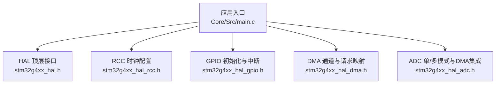
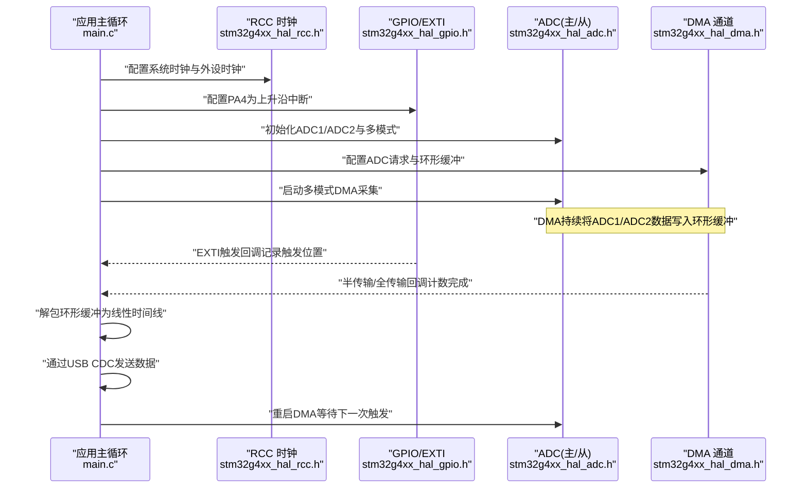
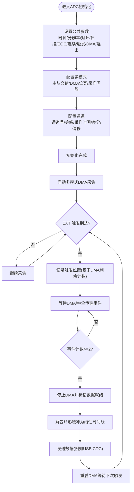
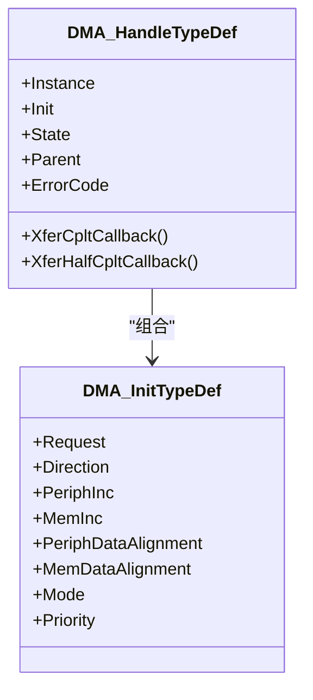
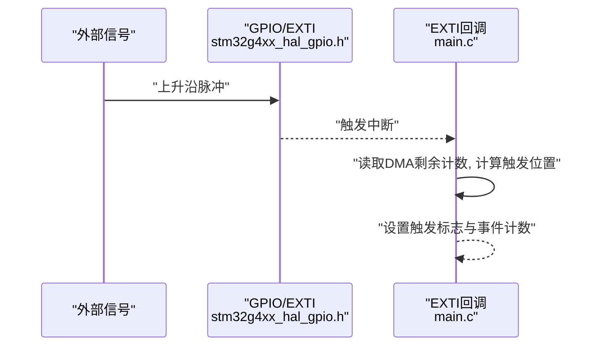
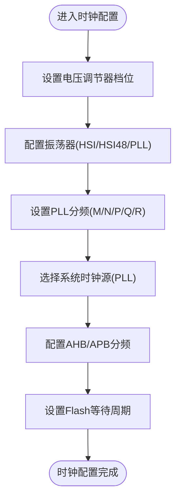
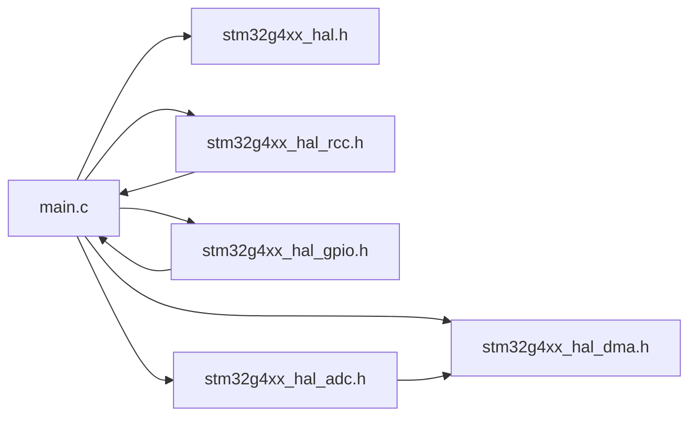

# HAL外设驱动模块

<cite>
**本文引用的文件**   
- [main.c](file://Core/Src/main.c)
- [main.h](file://Core/Inc/main.h)
- [stm32g4xx_hal.h](file://Drivers/STM32G4xx_HAL_Driver/Inc/stm32g4xx_hal.h)
- [stm32g4xx_hal_adc.h](file://Drivers/STM32G4xx_HAL_Driver/Inc/stm32g4xx_hal_adc.h)
- [stm32g4xx_hal_dma.h](file://Drivers/STM32G4xx_HAL_Driver/Inc/stm32g4xx_hal_dma.h)
- [stm32g4xx_hal_gpio.h](file://Drivers/STM32G4xx_HAL_Driver/Inc/stm32g4xx_hal_gpio.h)
- [stm32g4xx_hal_rcc.h](file://Drivers/STM32G4xx_HAL_Driver/Inc/stm32g4xx_hal_rcc.h)
</cite>

## 目录
1. [简介](#简介)
2. [项目结构](#项目结构)
3. [核心组件](#核心组件)
4. [架构总览](#架构总览)
5. [详细组件分析](#详细组件分析)
6. [依赖关系分析](#依赖关系分析)
7. [性能考虑](#性能考虑)
8. [故障排查指南](#故障排查指南)
9. [结论](#结论)
10. [附录](#附录) 

## 简介
本技术参考文档面向STM32G4系列微控制器的HAL外设驱动，结合工程中的实际使用方式，系统讲解ADC、DMA、GPIO、RCC等关键外设的驱动实现与使用方法。文档覆盖初始化流程、配置参数、典型应用场景（如双ADC交错采样+DMA环形缓冲+EXTI触发采集）、外设协同机制与数据路径，并提供性能优化建议与常见问题解决方案，既适合初学者入门，也便于高级开发者进行底层定制与调优。

## 项目结构
本项目采用CubeMX生成的标准工程布局：应用入口位于Core/Src/main.c，HAL驱动头文件位于Drivers/STM32G4xx_HAL_Driver/Inc下，外设初始化与回调在main.c中组织，时钟与电源配置通过RCC/PWR相关API完成。

图示来源 
- [main.c:219-290](file://Core/Src/main.c#L219-L290)
- [stm32g4xx_hal.h:1-200](file://Drivers/STM32G4xx_HAL_Driver/Inc/stm32g4xx_hal.h#L1-L200)
- [stm32g4xx_hal_rcc.h:1-200](file://Drivers/STM32G4xx_HAL_Driver/Inc/stm32g4xx_hal_rcc.h#L1-L200)
- [stm32g4xx_hal_gpio.h:1-200](file://Drivers/STM32G4xx_HAL_Driver/Inc/stm32g4xx_hal_gpio.h#L1-L200)
- [stm32g4xx_hal_dma.h:1-200](file://Drivers/STM32G4xx_HAL_Driver/Inc/stm32g4xx_hal_dma.h#L1-L200)
- [stm32g4xx_hal_adc.h:1-200](file://Drivers/STM32G4xx_HAL_Driver/Inc/stm32g4xx_hal_adc.h#L1-L200)

章节来源
- [main.c:219-290](file://Core/Src/main.c#L219-L290)
- [main.h:1-70](file://Core/Inc/main.h#L1-L70)

## 核心组件
- ADC（模数转换）
  - 支持单通道与多模式（主从交错），可配置分辨率、对齐方式、扫描序列、外部触发、DMA连续请求与溢出处理策略。
  - 工程中演示了双ADC交错模式与DMA环形缓冲，用于高速数据采集。
- DMA（直接存储器访问）
  - 提供传输方向、地址增量、数据宽度、循环模式、优先级等配置；支持半传输与全传输回调，适配ADC到内存的高速搬运。
- GPIO（通用输入输出）
  - 支持推挽/开漏输出、复用功能、中断模式（上升/下降/双边沿）及速度档位；工程中用于触发信号输入与LED指示。
- RCC（复位与时钟）
  - 提供振荡器（HSI/HSE/LSI/LSE/HSI48）与PLL配置，以及SYSCLK/HCLK/APB分频设置；工程中启用HSI与HSI48并通过PLL提升系统频率。

章节来源
- [stm32g4xx_hal_adc.h:1-200](file://Drivers/STM32G4xx_HAL_Driver/Inc/stm32g4xx_hal_adc.h#L1-L200)
- [stm32g4xx_hal_dma.h:1-200](file://Drivers/STM32G4xx_HAL_Driver/Inc/stm32g4xx_hal_dma.h#L1-L200)
- [stm32g4xx_hal_gpio.h:1-200](file://Drivers/STM32G4xx_HAL_Driver/Inc/stm32g4xx_hal_gpio.h#L1-L200)
- [stm32g4xx_hal_rcc.h:1-200](file://Drivers/STM32G4xx_HAL_Driver/Inc/stm32g4xx_hal_rcc.h#L1-L200)
- [main.c:296-337](file://Core/Src/main.c#L296-L337)

## 架构总览
下图展示了应用中各外设驱动的协作关系与控制流：RCC负责系统与时钟，GPIO提供触发输入，ADC以双通道交错模式工作，DMA将转换结果搬运至环形缓冲区，EXTI捕获触发时刻并配合DMA回调完成数据窗口截取与处理。

图示来源 
- [main.c:219-290](file://Core/Src/main.c#L219-L290)
- [main.c:296-337](file://Core/Src/main.c#L296-L337)
- [main.c:488-520](file://Core/Src/main.c#L488-L520)
- [main.c:344-464](file://Core/Src/main.c#L344-L464)
- [main.c:469-481](file://Core/Src/main.c#L469-L481)
- [stm32g4xx_hal_adc.h:1-200](file://Drivers/STM32G4xx_HAL_Driver/Inc/stm32g4xx_hal_adc.h#L1-L200)
- [stm32g4xx_hal_dma.h:1-200](file://Drivers/STM32G4xx_HAL_Driver/Inc/stm32g4xx_hal_dma.h#L1-L200)
- [stm32g4xx_hal_gpio.h:1-200](file://Drivers/STM32G4xx_HAL_Driver/Inc/stm32g4xx_hal_gpio.h#L1-L200)
- [stm32g4xx_hal_rcc.h:1-200](file://Drivers/STM32G4xx_HAL_Driver/Inc/stm32g4xx_hal_rcc.h#L1-L200)

## 详细组件分析

### ADC驱动（单/多模式与DMA集成）
- 初始化要点
  - 选择时钟分频、分辨率、数据对齐、扫描模式、EOC选择、连续转换、外部触发源与边沿、DMA连续请求、溢出策略与过采样开关。
  - 多模式配置包括主从模式（交错）、DMA访问位宽、采样间隔等。
  - 通道配置包含通道号、序列等级、采样时间、差分/单端、偏移补偿等。
- 运行流程
  - 启动多模式DMA采集后，DMA按环形缓冲写入ADC1/ADC2数据；通过半传输/全传输回调判断采集窗口是否完整。
  - EXTI触发回调读取DMA剩余计数以确定触发点在环形缓冲中的位置，从而在后续解包时定位“预触发”和“后触发”数据段。
- 典型用法路径
  - 初始化：调用ADC初始化与多模式配置函数，随后配置通道。
  - 启动：调用多模式DMA启动函数，传入环形缓冲指针与长度。
  - 回调：实现半传输与全传输回调，累计事件以判定采集完成。
  - 停止：根据业务需要停止DMA或重新启用以等待下一次触发。

图示来源 
- [stm32g4xx_hal_adc.h:1-200](file://Drivers/STM32G4xx_HAL_Driver/Inc/stm32g4xx_hal_adc.h#L1-L200)
- [main.c:344-464](file://Core/Src/main.c#L344-L464)
- [main.c:86-149](file://Core/Src/main.c#L86-L149)
- [main.c:156-171](file://Core/Src/main.c#L156-L171)

章节来源
- [stm32g4xx_hal_adc.h:1-200](file://Drivers/STM32G4xx_HAL_Driver/Inc/stm32g4xx_hal_adc.h#L1-L200)
- [main.c:344-464](file://Core/Src/main.c#L344-L464)
- [main.c:86-149](file://Core/Src/main.c#L86-L149)
- [main.c:156-171](file://Core/Src/main.c#L156-L171)

### DMA驱动（请求映射与环形缓冲）
- 初始化要点
  - 选择请求源（如ADC1）、传输方向（外设到内存）、外设/内存地址增量、数据宽度、循环模式、优先级。
  - 使能DMA控制器与DMAMUX时钟，配置NVIC中断优先级并开启中断。
- 回调机制
  - 半传输与全传输回调用于判定环形缓冲填充进度，结合EXTI触发位置确定有效数据窗口。
- 典型用法路径
  - 配置DMA通道与请求映射，绑定回调函数。
  - 启动ADC DMA后，DMA自动将数据搬运至环形缓冲。
  - 在回调中更新状态标志，主循环据此执行数据处理与重启动作。

图示来源 
- [stm32g4xx_hal_dma.h:1-200](file://Drivers/STM32G4xx_HAL_Driver/Inc/stm32g4xx_hal_dma.h#L1-200)
- [main.c:469-481](file://Core/Src/main.c#L469-L481)

章节来源
- [stm32g4xx_hal_dma.h:1-200](file://Drivers/STM32G4xx_HAL_Driver/Inc/stm32g4xx_hal_dma.h#L1-200)
- [main.c:469-481](file://Core/Src/main.c#L469-L481)

### GPIO与EXTI驱动（触发与指示）
- 初始化要点
  - 配置端口时钟，设置引脚模式（如上升沿中断）、上拉/下拉、速度。
  - 配置对应EXTI中断优先级并开启中断。
- 中断处理
  - 在回调中快速记录触发点（读取DMA剩余计数），避免复杂逻辑影响实时性。
- 典型用法路径
  - 配置PA4为上升沿中断，PC13为开漏输出用于LED指示。
  - 在中断回调中设置触发标志与位置，主循环据此执行数据处理。

图示来源 
- [stm32g4xx_hal_gpio.h:1-200](file://Drivers/STM32G4xx_HAL_Driver/Inc/stm32g4xx_hal_gpio.h#L1-L200)
- [main.c:488-520](file://Core/Src/main.c#L488-L520)
- [main.c:86-113](file://Core/Src/main.c#L86-L113)

章节来源
- [stm32g4xx_hal_gpio.h:1-200](file://Drivers/STM32G4xx_HAL_Driver/Inc/stm32g4xx_hal_gpio.h#L1-L200)
- [main.c:488-520](file://Core/Src/main.c#L488-L520)
- [main.c:86-113](file://Core/Src/main.c#L86-L113)

### RCC驱动（系统与时钟配置）
- 初始化要点
  - 配置电压调节器档位，选择振荡器（HSI/HSI48等），配置PLL分频系数（M/N/P/Q/R）。
  - 设置系统时钟源与AHB/APB分频，配置Flash等待周期。
- 典型用法路径
  - 在SystemClock_Config中完成RCC配置，确保外设时钟满足ADC与DMA需求。

图示来源 
- [stm32g4xx_hal_rcc.h:1-200](file://Drivers/STM32G4xx_HAL_Driver/Inc/stm32g4xx_hal_rcc.h#L1-L200)
- [main.c:296-337](file://Core/Src/main.c#L296-L337)

章节来源
- [stm32g4xx_hal_rcc.h:1-200](file://Drivers/STM32G4xx_HAL_Driver/Inc/stm32g4xx_hal_rcc.h#L1-L200)
- [main.c:296-337](file://Core/Src/main.c#L296-L337)

### 其他外设（TIM、USART、I2C、SPI）
- 在本工程中未直接使用TIM、USART、I2C、SPI的HAL驱动。若需扩展，可遵循以下通用步骤：
  - 使能相应外设时钟（RCC）。
  - 配置外设参数（如波特率、数据位、停止位、校验；或I2C速率、地址；或SPI模式、极性、相位等）。
  - 配置DMA或中断以实现高效数据传输。
  - 启动外设并在回调中处理数据。
- 由于本仓库未包含这些外设的具体实现，本节为概念性说明，不附加具体代码路径。

[本节为概念性内容，不涉及具体文件分析]

## 依赖关系分析
- main.c依赖HAL顶层接口与各外设头文件，通过HAL API完成外设初始化与运行控制。
- ADC驱动依赖DMA驱动进行数据搬运，EXTI中断用于触发定位。
- RCC驱动为所有外设提供时钟基础，确保时序与频率满足要求。

图示来源 
- [main.c:219-290](file://Core/Src/main.c#L219-L290)
- [stm32g4xx_hal.h:1-200](file://Drivers/STM32G4xx_HAL_Driver/Inc/stm32g4xx_hal.h#L1-L200)
- [stm32g4xx_hal_rcc.h:1-200](file://Drivers/STM32G4xx_HAL_Driver/Inc/stm32g4xx_hal_rcc.h#L1-L200)
- [stm32g4xx_hal_gpio.h:1-200](file://Drivers/STM32G4xx_HAL_Driver/Inc/stm32g4xx_hal_gpio.h#L1-L200)
- [stm32g4xx_hal_dma.h:1-200](file://Drivers/STM32G4xx_HAL_Driver/Inc/stm32g4xx_hal_dma.h#L1-L200)
- [stm32g4xx_hal_adc.h:1-200](file://Drivers/STM32G4xx_HAL_Driver/Inc/stm32g4xx_hal_adc.h#L1-L200)

章节来源
- [main.c:219-290](file://Core/Src/main.c#L219-L290)

## 性能考虑
- 时钟与功耗
  - 合理设置PLL与分频，确保ADC与DMA在高吞吐时的稳定性；必要时降低外设时钟以降低功耗。
- DMA与中断
  - 使用DMA环形缓冲减少CPU参与；在回调中仅做最小必要操作（如计数与标志），避免阻塞。
- 触发定位
  - 在EXTI回调中读取DMA剩余计数以定位触发点，注意边界保护（如剩余计数为0或越界的情况）。
- 数据解包
  - 在主循环中快照触发位置，避免ISR修改导致的数据竞争；解包过程尽量使用局部变量与顺序访问以提升缓存命中。
- 传输效率
  - 批量发送（如构建完整输出缓冲后一次性发送）可减少多次调用开销；在USB CDC等接口满队列时适当重试与延时。

[本节提供一般性指导，不直接分析具体文件]

## 故障排查指南
- 常见错误处理
  - 工程定义了统一错误处理函数，发生异常时可进入死循环以便调试。
- 断言与调试
  - 若启用完整断言，可在断言失败时记录文件与行号信息，辅助定位配置错误。
- 典型问题与建议
  - 触发位置异常：检查EXTI回调中对DMA剩余计数的读取与边界保护逻辑。
  - 数据不完整：确认DMA半/全传输回调是否正确计数，确保达到阈值后再停止DMA。
  - 时钟不稳定：核对RCC配置与PLL参数，确保APB与外设时钟满足手册限制。

章节来源
- [main.c:530-539](file://Core/Src/main.c#L530-L539)
- [main.c:540-555](file://Core/Src/main.c#L540-L555)

## 结论
本参考文档围绕STM32G4工程的HAL外设驱动，系统梳理了ADC、DMA、GPIO、RCC的初始化流程、配置要点与协同工作机制。通过双ADC交错+DMA环形缓冲+EXTI触发的典型场景，展示了高速数据采集与处理的实践方法。读者可在此基础上扩展TIM、USART、I2C、SPI等外设，并结合性能优化与故障排查建议，构建稳定高效的嵌入式应用。

[本节为总结性内容，不直接分析具体文件]

## 附录
- 术语表
  - HAL：硬件抽象层，提供跨系列的统一API。
  - DMAMUX：DMA请求复用器，用于灵活映射外设请求到DMA通道。
  - EXTI：外部中断/事件控制器，用于引脚级中断与事件触发。
- 参考路径
  - ADC初始化与多模式配置：[main.c:344-464](file://Core/Src/main.c#L344-L464)
  - DMA初始化与中断配置：[main.c:469-481](file://Core/Src/main.c#L469-L481)
  - GPIO与EXTI初始化：[main.c:488-520](file://Core/Src/main.c#L488-L520)
  - 系统时钟配置：[main.c:296-337](file://Core/Src/main.c#L296-L337)

[本节为补充信息，不直接分析具体文件]