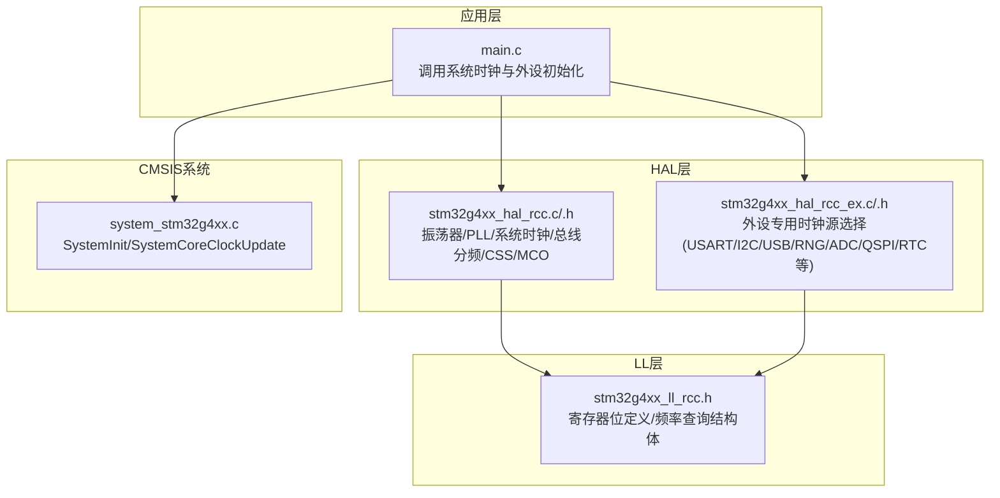
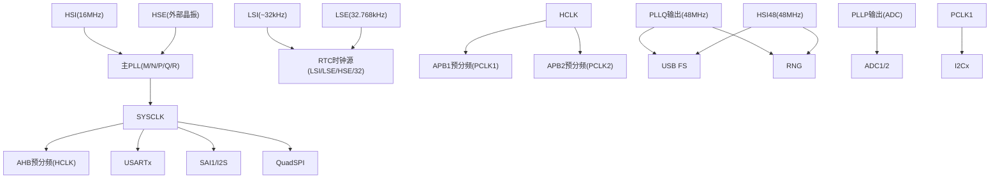
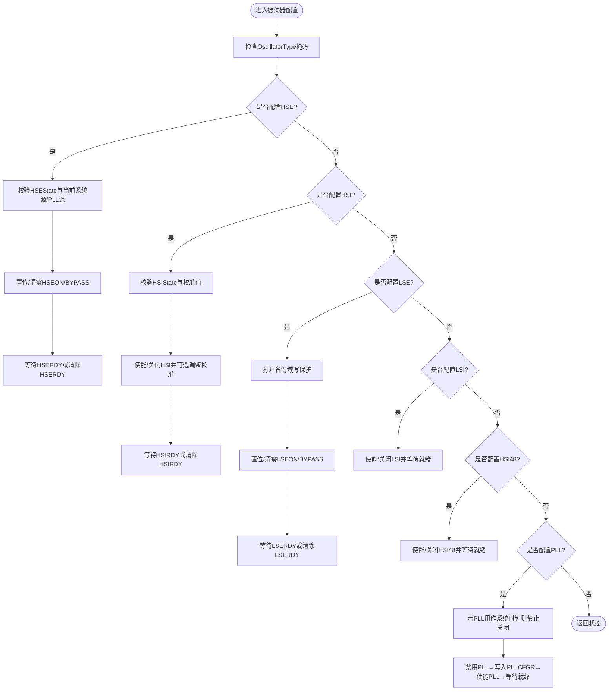
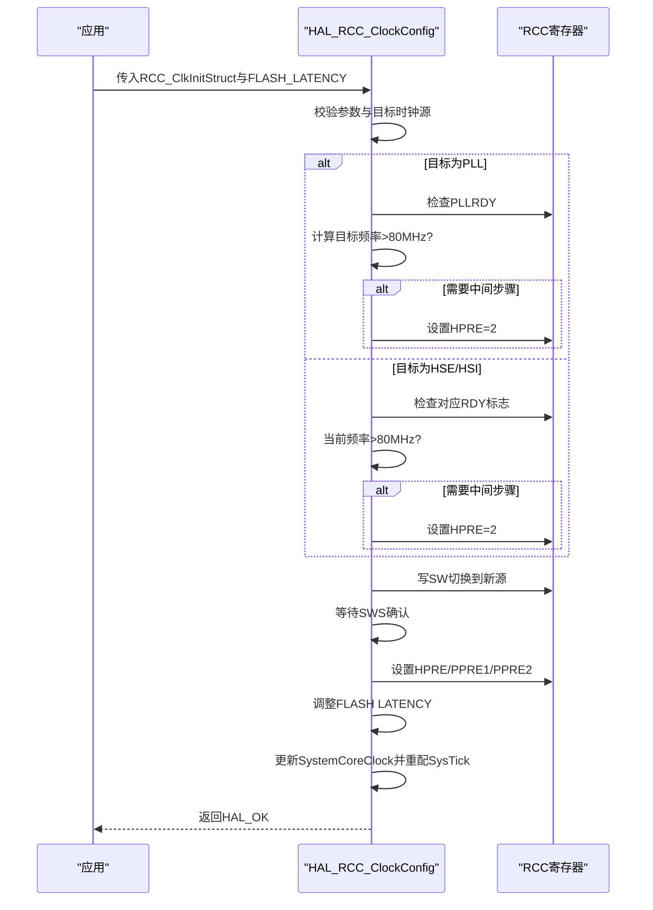
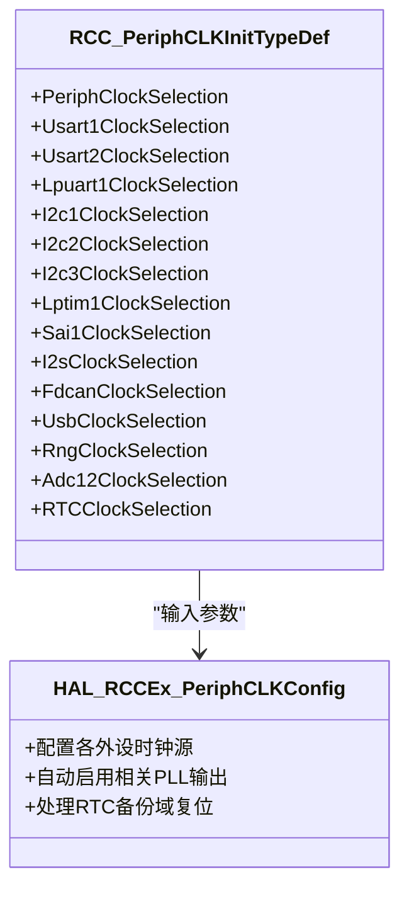
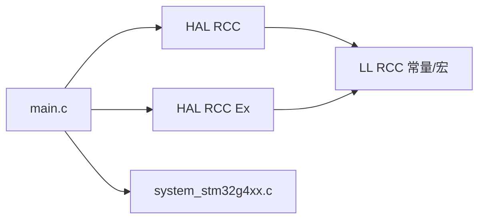

# RCC驱动模块

<cite>
**本文引用的文件**   
- [stm32g4xx_hal_rcc.h](file://Drivers/STM32G4xx_HAL_Driver/Inc/stm32g4xx_hal_rcc.h)
- [stm32g4xx_hal_rcc.c](file://Drivers/STM32G4xx_HAL_Driver/Src/stm32g4xx_hal_rcc.c)
- [stm32g4xx_hal_rcc_ex.h](file://Drivers/STM32G4xx_HAL_Driver/Inc/stm32g4xx_hal_rcc_ex.h)
- [stm32g4xx_hal_rcc_ex.c](file://Drivers/STM32G4xx_HAL_Driver/Src/stm32g4xx_hal_rcc_ex.c)
- [stm32g4xx_ll_rcc.h](file://Drivers/STM32G4xx_HAL_Driver/Inc/stm32g4xx_ll_rcc.h)
- [system_stm32g4xx.c](file://Core/Src/system_stm32g4xx.c)
- [main.c](file://Core/Src/main.c)
</cite>

## 目录
1. [简介](#简介)
2. [项目结构](#项目结构)
3. [核心组件](#核心组件)
4. [架构总览](#架构总览)
5. [详细组件分析](#详细组件分析)
6. [依赖关系分析](#依赖关系分析)
7. [性能与功耗考虑](#性能与功耗考虑)
8. [故障排查指南](#故障排查指南)
9. [结论](#结论)
10. [附录：常用配置要点与示例路径](#附录常用配置要点与示例路径)

## 简介
本技术参考文档面向STM32G4系列的复位与时钟控制（RCC）驱动，围绕系统时钟树、外设时钟门控、低功耗模式下的时钟管理展开。重点覆盖HSE/HSI/PLL等时钟源配置与切换流程、AHB/APB总线分频、USB/ADC等特殊时钟源配置、时钟安全系统CSS与备份域时钟管理，并提供功耗优化策略与稳定性建议，帮助初学者快速入门，也为高级开发者提供定制与调试技巧。

## 项目结构
本项目采用标准HAL+LL分层组织：
- HAL层：提供高层API用于振荡器、PLL、系统时钟、总线分频、MCO输出、CSS等；
- LL层：提供底层寄存器访问宏与常量定义，便于轻量级或高性能场景使用；
- CMSIS系统初始化：在启动阶段完成FPU、向量表等基础设置，并维护SystemCoreClock变量；
- 应用层：通过HAL API进行系统时钟与外设时钟配置。

图表来源
- [stm32g4xx_hal_rcc.c:115-203](file://Drivers/STM32G4xx_HAL_Driver/Src/stm32g4xx_hal_rcc.c#L115-L203)
- [stm32g4xx_hal_rcc_ex.c:73-122](file://Drivers/STM32G4xx_HAL_Driver/Src/stm32g4xx_hal_rcc_ex.c#L73-L122)
- [stm32g4xx_ll_rcc.h:76-98](file://Drivers/STM32G4xx_HAL_Driver/Inc/stm32g4xx_ll_rcc.h#L76-L98)
- [system_stm32g4xx.c:175-192](file://Core/Src/system_stm32g4xx.c#L175-L192)

章节来源
- [stm32g4xx_hal_rcc.c:115-203](file://Drivers/STM32G4xx_HAL_Driver/Src/stm32g4xx_hal_rcc.c#L115-L203)
- [stm32g4xx_hal_rcc_ex.c:73-122](file://Drivers/STM32G4xx_HAL_Driver/Src/stm32g4xx_hal_rcc_ex.c#L73-L122)
- [stm32g4xx_ll_rcc.h:76-98](file://Drivers/STM32G4xx_HAL_Driver/Inc/stm32g4xx_ll_rcc.h#L76-L98)
- [system_stm32g4xx.c:175-192](file://Core/Src/system_stm32g4xx.c#L175-L192)

## 核心组件
- 振荡器与PLL配置：支持HSE、HSI、LSE、LSI、HSI48及主PLL的开启/关闭/参数配置；
- 系统时钟与总线分频：SYSCLK/HCLK/PCLK1/PCLK2的分频与时钟源切换；
- 外设专用时钟源：通过扩展接口为USART、I2C、LPUART、SAI、I2S、FDCAN、USB、RNG、ADC、QSPI、RTC等选择独立时钟源；
- MCO输出：将任意时钟源输出到PA8/PG10引脚，便于测量与调试；
- 时钟安全系统CSS：HSE/LSE失效检测与NMI中断处理；
- 频率查询：提供获取当前各总线频率的API，配合SystemCoreClock更新。

章节来源
- [stm32g4xx_hal_rcc.h:45-121](file://Drivers/STM32G4xx_HAL_Driver/Inc/stm32g4xx_hal_rcc.h#L45-L121)
- [stm32g4xx_hal_rcc.c:219-296](file://Drivers/STM32G4xx_HAL_Driver/Src/stm32g4xx_hal_rcc.c#L219-L296)
- [stm32g4xx_hal_rcc_ex.h:46-127](file://Drivers/STM32G4xx_HAL_Driver/Inc/stm32g4xx_hal_rcc_ex.h#L46-L127)
- [stm32g4xx_ll_rcc.h:83-89](file://Drivers/STM32G4xx_HAL_Driver/Inc/stm32g4xx_ll_rcc.h#L83-L89)

## 架构总览
RCC驱动由“系统时钟树”和“外设时钟路由”两部分组成：
- 系统时钟树：HSI/HSE/PLL作为SYSCLK源，经AHB预分频得到HCLK，再经APB1/APB2预分频得到PCLK1/PCLK2；
- 外设时钟路由：部分外设不直接继承自SYSCLK，而是通过专用选择位从PLL输出（如PLLQ/PLLP）、HSI48、外部时钟或PCLKx中选择。

图表来源
- [stm32g4xx_hal_rcc.h:294-371](file://Drivers/STM32G4xx_HAL_Driver/Inc/stm32g4xx_hal_rcc.h#L294-L371)
- [stm32g4xx_hal_rcc_ex.h:382-444](file://Drivers/STM32G4xx_HAL_Driver/Inc/stm32g4xx_hal_rcc_ex.h#L382-L444)
- [stm32g4xx_hal_rcc.c:139-176](file://Drivers/STM32G4xx_HAL_Driver/Src/stm32g4xx_hal_rcc.c#L139-L176)

## 详细组件分析

### 振荡器与PLL配置（HSE/HSI/LSE/LSI/HSI48/PLL）
- 功能要点
  - 支持按位组合配置多种振荡器；
  - 对HSE/HSI/LSE/LSI/HSI48分别提供使能/关闭/旁路状态机，带就绪等待与超时保护；
  - PLL可在非系统时钟源时动态修改参数，若PLL正作为系统时钟源则禁止关闭；
  - 自动启用必要的PLL输出（如SYSCLK/48M1/ADC），并在关闭时释放以省电。
- 关键流程
  - 参数校验→目标振荡器状态判断→硬件使能/关闭→就绪标志轮询→必要时调整校准值→更新SysTick。
- 典型错误处理
  - 指针为空、参数越界、目标时钟未就绪、备份域写保护未打开、超时等返回HAL_ERROR/HAL_TIMEOUT。

图表来源
- [stm32g4xx_hal_rcc.c:312-716](file://Drivers/STM32G4xx_HAL_Driver/Src/stm32g4xx_hal_rcc.c#L312-L716)

章节来源
- [stm32g4xx_hal_rcc.c:312-716](file://Drivers/STM32G4xx_HAL_Driver/Src/stm32g4xx_hal_rcc.c#L312-L716)
- [stm32g4xx_hal_rcc.h:141-302](file://Drivers/STM32G4xx_HAL_Driver/Inc/stm32g4xx_hal_rcc.h#L141-L302)

### 系统时钟与总线分频（SYSCLK/HCLK/PCLK1/PCLK2）
- 功能要点
  - 支持从HSI/HSE/PLL切换系统时钟源；
  - 针对超过80MHz的切换，内部先插入HCLK=2中间步骤以避免欠压/过冲问题；
  - 根据电压范围与目标频率正确设置Flash等待周期；
  - 更新SystemCoreClock并重新初始化滴答定时器。
- 关键流程
  - 校验参数→若目标为PLL需确保PLL已锁定→必要时先设HCLK=2→写SW位→等待SWS确认→按需调整HCLK/APB分频→更新Latency→刷新SystemCoreClock。

图表来源
- [stm32g4xx_hal_rcc.c:766-940](file://Drivers/STM32G4xx_HAL_Driver/Src/stm32g4xx_hal_rcc.c#L766-L940)

章节来源
- [stm32g4xx_hal_rcc.c:766-940](file://Drivers/STM32G4xx_HAL_Driver/Src/stm32g4xx_hal_rcc.c#L766-L940)
- [stm32g4xx_hal_rcc.h:314-371](file://Drivers/STM32G4xx_HAL_Driver/Inc/stm32g4xx_hal_rcc.h#L314-L371)

### 外设专用时钟源配置（USART/I2C/LPUART/SAI/I2S/FDCAN/USB/RNG/ADC/QSPI/RTC）
- 功能要点
  - 通过扩展结构体统一配置各外设时钟源；
  - 某些外设（USB/RNG/SAI/I2S/FDCAN/QSPI）若选择PLL输出，会自动启用对应的PLL输出位（如48M1/ADC）；
  - RTC时钟源变更会触发备份域复位，需谨慎处理备份数据。
- 典型用法
  - 填充RCC_PeriphCLKInitTypeDef，指定PeriphClockSelection与各外设时钟源；
  - 调用HAL_RCCEx_PeriphCLKConfig完成一次性配置。

图表来源
- [stm32g4xx_hal_rcc_ex.h:46-127](file://Drivers/STM32G4xx_HAL_Driver/Inc/stm32g4xx_hal_rcc_ex.h#L46-L127)
- [stm32g4xx_hal_rcc_ex.c:123-487](file://Drivers/STM32G4xx_HAL_Driver/Src/stm32g4xx_hal_rcc_ex.c#L123-L487)

章节来源
- [stm32g4xx_hal_rcc_ex.c:123-487](file://Drivers/STM32G4xx_HAL_Driver/Src/stm32g4xx_hal_rcc_ex.c#L123-L487)
- [stm32g4xx_hal_rcc_ex.h:195-444](file://Drivers/STM32G4xx_HAL_Driver/Inc/stm32g4xx_hal_rcc_ex.h#L195-L444)

### USB与RNG时钟（48MHz）
- 要求
  - USB FS需要精确的48MHz时钟；
  - RNG要求≤48MHz。
- 实现方式
  - 可通过HSI48直接提供48MHz；
  - 或通过主PLL的PLLQ输出48MHz（需同时启用PLL_48M1CLK输出）。
- 配置入口
  - 使用RCC_PeriphCLKInitTypeDef中的UsbClockSelection/RngClockSelection字段，并调用HAL_RCCEx_PeriphCLKConfig。

章节来源
- [stm32g4xx_hal_rcc_ex.h:382-398](file://Drivers/STM32G4xx_HAL_Driver/Inc/stm32g4xx_hal_rcc_ex.h#L382-L398)
- [stm32g4xx_hal_rcc_ex.c:402-430](file://Drivers/STM32G4xx_HAL_Driver/Src/stm32g4xx_hal_rcc_ex.c#L402-L430)
- [stm32g4xx_hal_rcc.c:139-176](file://Drivers/STM32G4xx_HAL_Driver/Src/stm32g4xx_hal_rcc.c#L139-L176)

### ADC时钟（PLLP或SYSCLK）
- 可选源
  - 来自主PLL的PLLP输出（需启用PLL_ADCCLK）；
  - 或直接来自SYSCLK。
- 配置入口
  - 使用Adc12ClockSelection字段，调用HAL_RCCEx_PeriphCLKConfig。

章节来源
- [stm32g4xx_hal_rcc_ex.h:400-420](file://Drivers/STM32G4xx_HAL_Driver/Inc/stm32g4xx_hal_rcc_ex.h#L400-L420)
- [stm32g4xx_hal_rcc_ex.c:432-464](file://Drivers/STM32G4xx_HAL_Driver/Src/stm32g4xx_hal_rcc_ex.c#L432-L464)

### 时钟安全系统CSS与备份域时钟管理
- HSE CSS
  - 启用后若检测到HSE失效，自动切至HSI并产生NMI中断；
  - 通过HAL_RCC_EnableCSS启用，NMI中调用HAL_RCC_NMI_IRQHandler处理。
- LSE CSS
  - 启用后若LSE失效，仅产生中断，不影响寄存器；
  - 通过HAL_RCC_EnableLSECSS启用，并通过EXTI行处理。
- 备份域与时钟
  - 修改RTC时钟源会触发备份域复位，需先打开PWR备份域写保护；
  - 若之前启用了LSE，需在复位后等待其就绪。

章节来源
- [stm32g4xx_hal_rcc.c:1283-1340](file://Drivers/STM32G4xx_HAL_Driver/Src/stm32g4xx_hal_rcc.c#L1283-L1340)
- [stm32g4xx_hal_rcc_ex.c:133-218](file://Drivers/STM32G4xx_HAL_Driver/Src/stm32g4xx_hal_rcc_ex.c#L133-L218)
- [stm32g4xx_ll_rcc.h:155-191](file://Drivers/STM32G4xx_HAL_Driver/Inc/stm32g4xx_ll_rcc.h#L155-L191)

### MCO输出（调试与测量）
- 功能
  - 将任意时钟源输出到PA8/PG10，便于示波器测量；
  - 支持多路时钟源与分频。
- 配置
  - 调用HAL_RCC_MCOConfig选择源与分频，GPIO需配置为复用推挽。

章节来源
- [stm32g4xx_hal_rcc.c:994-1031](file://Drivers/STM32G4xx_HAL_Driver/Src/stm32g4xx_hal_rcc.c#L994-L1031)
- [stm32g4xx_hal_rcc.h:384-435](file://Drivers/STM32G4xx_HAL_Driver/Inc/stm32g4xx_hal_rcc.h#L384-L435)

### 频率查询与SystemCoreClock
- 提供获取SYSCLK/HCLK/PCLK1/PCLK2频率的API；
- SystemCoreClock在时钟切换后自动更新，也可通过SystemCoreClockUpdate手动刷新。

章节来源
- [stm32g4xx_hal_rcc.c:1063-1145](file://Drivers/STM32G4xx_HAL_Driver/Src/stm32g4xx_hal_rcc.c#L1063-L1145)
- [system_stm32g4xx.c:230-272](file://Core/Src/system_stm32g4xx.c#L230-L272)

## 依赖关系分析
- HAL_RCC依赖LL层提供的寄存器位定义与常量；
- HAL_RCC_Ex对外设时钟路由进行封装，内部同样操作RCC相关寄存器；
- 应用层通过HAL_API完成配置，无需直接操作寄存器；
- system_stm32g4xx.c负责启动期系统时钟与SystemCoreClock维护。

图表来源
- [main.c:296-337](file://Core/Src/main.c#L296-L337)
- [stm32g4xx_hal_rcc.c:115-203](file://Drivers/STM32G4xx_HAL_Driver/Src/stm32g4xx_hal_rcc.c#L115-L203)
- [stm32g4xx_ll_rcc.h:100-137](file://Drivers/STM32G4xx_HAL_Driver/Inc/stm32g4xx_ll_rcc.h#L100-L137)

章节来源
- [main.c:296-337](file://Core/Src/main.c#L296-L337)
- [stm32g4xx_hal_rcc.c:115-203](file://Drivers/STM32G4xx_HAL_Driver/Src/stm32g4xx_hal_rcc.c#L115-L203)
- [stm32g4xx_ll_rcc.h:100-137](file://Drivers/STM32G4xx_HAL_Driver/Inc/stm32g4xx_ll_rcc.h#L100-L137)

## 性能与功耗考虑
- Flash等待周期
  - 提高SYSCLK时需提前增加LATENCY，降低时及时减少，避免读错或浪费功耗；
- 高频切换中间步骤
  - 当目标频率>80MHz，先设置HCLK=2过渡，防止欠压/过冲；
- 外设时钟门控
  - 不使用的外设应关闭其时钟以降低功耗；
- 时钟源选择
  - 高稳定度需求优先HSE+PLL；低功耗待机可用HSI/LSI；
- 48MHz时钟源
  - USB/RNG优先HSI48或PLLQ，确保精度与抖动满足协议要求；
- 备份域写保护
  - 修改RTC时钟源前必须打开PWR备份域写保护，否则失败。

[本节为通用指导，不直接分析具体文件]

## 故障排查指南
- 常见错误码
  - HAL_TIMEOUT：振荡器就绪等待超时、备份域写保护未打开、时钟切换超时；
  - HAL_ERROR：参数非法、目标时钟未就绪、试图关闭正在使用的PLL。
- 定位方法
  - 使用MCO输出观测实际时钟频率；
  - 读取当前时钟配置（Get函数）核对预期；
  - 检查CSS中断标志与回调是否被调用。
- 典型场景
  - USB无法枚举：确认USB时钟源是否为48MHz且PLL输出已启用；
  - ADC采样异常：确认ADC时钟源与分频是否在允许范围内；
  - RTC时间漂移：检查RTC时钟源与LSE驱动能力。

章节来源
- [stm32g4xx_hal_rcc.c:312-716](file://Drivers/STM32G4xx_HAL_Driver/Src/stm32g4xx_hal_rcc.c#L312-L716)
- [stm32g4xx_hal_rcc.c:766-940](file://Drivers/STM32G4xx_HAL_Driver/Src/stm32g4xx_hal_rcc.c#L766-L940)
- [stm32g4xx_hal_rcc.c:1283-1340](file://Drivers/STM32G4xx_HAL_Driver/Src/stm32g4xx_hal_rcc.c#L1283-L1340)

## 结论
RCC驱动为STM32G4提供了完整的时钟管理能力，涵盖系统时钟树、外设时钟路由、CSS与备份域管理等关键特性。通过HAL与LL分层，既保证了易用性，也保留了底层灵活性。合理配置时钟源与分频、遵循切换时序与Flash等待周期、善用MCO与CSS，可显著提升系统稳定性与能效。

[本节为总结，不直接分析具体文件]

## 附录：常用配置要点与示例路径
- 系统时钟配置示例（HSI+PLL，48MHz USB/RNG）
  - 参考：[main.c:296-337](file://Core/Src/main.c#L296-L337)
- 外设时钟源配置（USB/RNG/ADC/RTC等）
  - 参考：[stm32g4xx_hal_rcc_ex.c:123-487](file://Drivers/STM32G4xx_HAL_Driver/Src/stm32g4xx_hal_rcc_ex.c#L123-L487)
- 时钟安全系统（HSE/LSE CSS）
  - 参考：[stm32g4xx_hal_rcc.c:1283-1340](file://Drivers/STM32G4xx_HAL_Driver/Src/stm32g4xx_hal_rcc.c#L1283-L1340)
- 频率查询与SystemCoreClock更新
  - 参考：[stm32g4xx_hal_rcc.c:1063-1145](file://Drivers/STM32G4xx_HAL_Driver/Src/stm32g4xx_hal_rcc.c#L1063-L1145), [system_stm32g4xx.c:230-272](file://Core/Src/system_stm32g4xx.c#L230-L272)