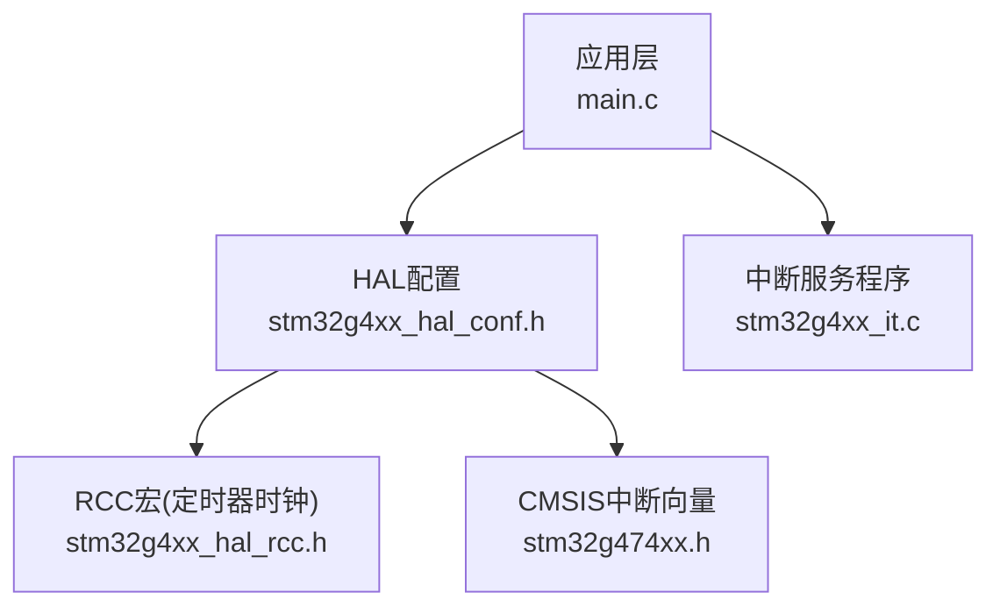
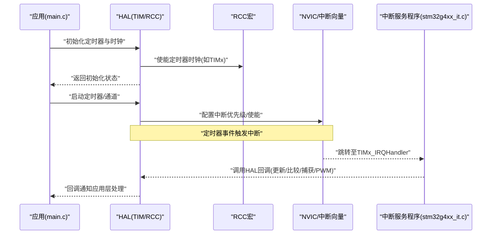
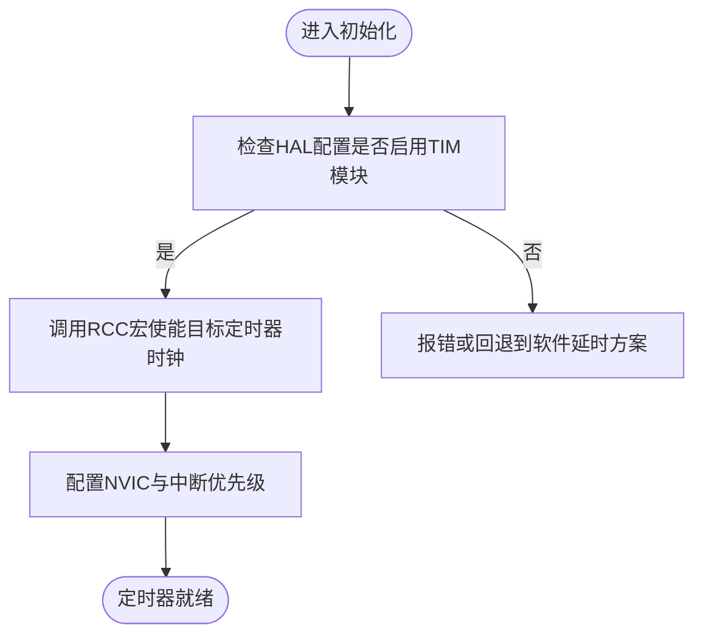
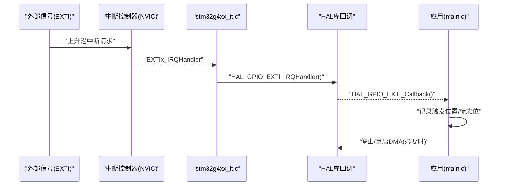
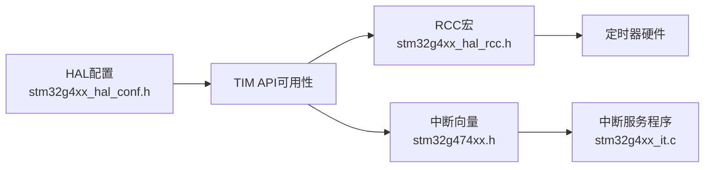

# 定时器驱动模块

<cite>
**本文引用的文件**   
- [main.c](file://Core/Src/main.c)
- [stm32g4xx_it.c](file://Core/Src/stm32g4xx_it.c)
- [stm32g4xx_hal_conf.h](file://Core/Inc/stm32g4xx_hal_conf.h)
- [stm32g4xx_hal_rcc.h](file://Drivers/STM32G4xx_HAL_Driver/Inc/stm32g4xx_hal_rcc.h)
- [stm32g474xx.h](file://Drivers/CMSIS/Device/ST/STM32G4xx/Include/stm32g474xx.h)
</cite>

## 目录
1. [简介](#简介)
2. [项目结构](#项目结构)
3. [核心组件](#核心组件)
4. [架构总览](#架构总览)
5. [详细组件分析](#详细组件分析)
6. [依赖关系分析](#依赖关系分析)
7. [性能与精度分析](#性能与精度分析)
8. [故障排查指南](#故障排查指南)
9. [结论](#结论)
10. [附录：典型应用与配置要点](#附录典型应用与配置要点)

## 简介
本技术文档面向STM32G4系列微控制器的定时器外设驱动，覆盖基本定时器、通用定时器与高级定时器的配置和使用方法。文档重点阐述以下方面：
- 定时器模式：时基、输出比较、输入捕获、PWM生成
- 中断处理与DMA集成
- 典型应用场景：精确延时、脉冲测量、电机控制
- 高级功能：定时器级联、同步模式、死区时间配置
- 精度分析与性能优化建议
- 初学者入门与高级开发者实时控制指导

说明：当前工程以ADC+DMA+EXTI为主，未包含定时器用户代码；但工程中已启用HAL_TIM模块并包含RCC宏与中断向量定义，可作为定时器驱动的参考基础。

## 项目结构
本项目采用CubeMX生成的标准分层结构：
- Core/Src 与 Core/Inc：应用入口、系统初始化、中断服务程序、HAL配置
- Drivers/STM32G4xx_HAL_Driver：HAL驱动接口（含RCC、DMA等）
- Drivers/CMSIS：设备头文件与中断向量定义

图表来源
- [main.c:1-556](file://Core/Src/main.c#L1-L556)
- [stm32g4xx_hal_conf.h:1-381](file://Core/Inc/stm32g4xx_hal_conf.h#L1-L381)
- [stm32g4xx_it.c:1-247](file://Core/Src/stm32g4xx_it.c#L1-L247)
- [stm32g4xx_hal_rcc.h:817-1171](file://Drivers/STM32G4xx_HAL_Driver/Inc/stm32g4xx_hal_rcc.h#L817-L1171)
- [stm32g474xx.h:101-149](file://Drivers/CMSIS/Device/ST/STM32G4xx/Include/stm32g474xx.h#L101-L149)

章节来源
- [main.c:1-556](file://Core/Src/main.c#L1-L556)
- [stm32g4xx_hal_conf.h:1-381](file://Core/Inc/stm32g4xx_hal_conf.h#L1-L381)
- [stm32g4xx_it.c:1-247](file://Core/Src/stm32g4xx_it.c#L1-L247)
- [stm32g4xx_hal_rcc.h:817-1171](file://Drivers/STM32G4xx_HAL_Driver/Inc/stm32g4xx_hal_rcc.h#L817-L1171)
- [stm32g474xx.h:101-149](file://Drivers/CMSIS/Device/ST/STM32G4xx/Include/stm32g474xx.h#L101-L149)

## 核心组件
- HAL配置开关：在HAL配置中启用TIM模块，以便使用定时器相关API与回调注册机制。
- RCC宏：提供各定时器时钟使能宏，用于在初始化前开启对应定时器时钟。
- CMSIS中断向量：定义了TIM1~TIM19、HRTIM等中断号，便于在中断文件中挂载定时器中断服务函数。

章节来源
- [stm32g4xx_hal_conf.h:64-66](file://Core/Inc/stm32g4xx_hal_conf.h#L64-L66)
- [stm32g4xx_hal_conf.h:105-106](file://Core/Inc/stm32g4xx_hal_conf.h#L105-L106)
- [stm32g4xx_hal_rcc.h:817-871](file://Drivers/STM32G4xx_HAL_Driver/Inc/stm32g4xx_hal_rcc.h#L817-L871)
- [stm32g4xx_hal_rcc.h:1157-1171](file://Drivers/STM32G4xx_HAL_Driver/Inc/stm32g4xx_hal_rcc.h#L1157-L1171)
- [stm32g474xx.h:101-149](file://Drivers/CMSIS/Device/ST/STM32G4xx/Include/stm32g474xx.h#L101-L149)

## 架构总览
下图展示了“应用层—HAL—RCC—CMSIS”的调用链，以及定时器相关的中断路径。虽然当前工程未实现定时器用户代码，但该架构为后续添加定时器驱动提供了清晰的路径。

图表来源
- [main.c:1-556](file://Core/Src/main.c#L1-L556)
- [stm32g4xx_it.c:1-247](file://Core/Src/stm32g4xx_it.c#L1-L247)
- [stm32g4xx_hal_rcc.h:817-1171](file://Drivers/STM32G4xx_HAL_Driver/Inc/stm32g4xx_hal_rcc.h#L817-L1171)
- [stm32g474xx.h:101-149](file://Drivers/CMSIS/Device/ST/STM32G4xx/Include/stm32g474xx.h#L101-L149)

## 详细组件分析

### 组件A：定时器时钟与中断基础设施
- 时钟使能宏：通过RCC宏对TIM2~TIM7、TIM16/TIM17等进行时钟使能，确保定时器外设可用。
- 中断向量：在CMSIS头文件中定义了TIM1~TIM19及HRTIM的中断号，便于在stm32g4xx_it.c中实现对应的中断服务函数。

图表来源
- [stm32g4xx_hal_conf.h:64-66](file://Core/Inc/stm32g4xx_hal_conf.h#L64-L66)
- [stm32g4xx_hal_rcc.h:817-871](file://Drivers/STM32G4xx_HAL_Driver/Inc/stm32g4xx_hal_rcc.h#L817-L871)
- [stm32g4xx_hal_rcc.h:1157-1171](file://Drivers/STM32G4xx_HAL_Driver/Inc/stm32g4xx_hal_rcc.h#L1157-L1171)
- [stm32g474xx.h:101-149](file://Drivers/CMSIS/Device/ST/STM32G4xx/Include/stm32g474xx.h#L101-L149)

章节来源
- [stm32g4xx_hal_conf.h:64-66](file://Core/Inc/stm32g4xx_hal_conf.h#L64-L66)
- [stm32g4xx_hal_rcc.h:817-871](file://Drivers/STM32G4xx_HAL_Driver/Inc/stm32g4xx_hal_rcc.h#L817-L871)
- [stm32g4xx_hal_rcc.h:1157-1171](file://Drivers/STM32G4xx_HAL_Driver/Inc/stm32g4xx_hal_rcc.h#L1157-L1171)
- [stm32g474xx.h:101-149](file://Drivers/CMSIS/Device/ST/STM32G4xx/Include/stm32g474xx.h#L101-L149)

### 组件B：中断处理流程（示例：EXTI/DMA，可类比TIM）
当前工程实现了EXTI与DMA的中断处理，其流程可作为定时器中断处理的参考模板：
- EXTI引脚上升沿触发 → HAL_GPIO_EXTI_Callback → 应用逻辑
- DMA传输完成/半完成 → HAL_ADC_ConvCpltCallback/HAL_ADC_ConvHalfCpltCallback → 应用逻辑

图表来源
- [stm32g4xx_it.c:205-214](file://Core/Src/stm32g4xx_it.c#L205-L214)
- [stm32g4xx_it.c:219-228](file://Core/Src/stm32g4xx_it.c#L219-L228)
- [main.c:91-113](file://Core/Src/main.c#L91-L113)
- [main.c:136-149](file://Core/Src/main.c#L136-L149)

章节来源
- [stm32g4xx_it.c:205-214](file://Core/Src/stm32g4xx_it.c#L205-L214)
- [stm32g4xx_it.c:219-228](file://Core/Src/stm32g4xx_it.c#L219-L228)
- [main.c:91-113](file://Core/Src/main.c#L91-L113)
- [main.c:136-149](file://Core/Src/main.c#L136-L149)

### 组件C：定时器模式与参数设置（概念性说明）
以下为常见模式的配置要点（概念性，非当前工程代码）：
- 时基模式：选择时钟源、预分频器(PSC)、自动重装载值(ARR)，产生周期中断或作为其他定时器/外设的时钟。
- 输出比较模式：设置比较值(CCR)、输出极性、空闲电平，配合中断或DMA进行精确时序控制。
- 输入捕获模式：配置捕获边沿、滤波器、预分频，读取CCR计算脉宽/频率。
- PWM生成：选择PWM模式1/2、占空比(CCR)、周期(ARR)、互补输出与死区时间（高级定时器）。

[本节为概念性内容，不直接分析具体文件]

### 组件D：定时器中断与DMA集成（概念性说明）
- 中断：在TIM更新/比较/捕获事件中使能相应中断，在stm32g4xx_it.c中实现TIMx_IRQHandler，调用HAL回调处理。
- DMA：将定时器数据（如CCR、ARR或捕获值）与内存缓冲连接，减少CPU参与，提高吞吐。

[本节为概念性内容，不直接分析具体文件]

### 组件E：高级功能（概念性说明）
- 定时器级联：主从模式（Master-Slave），一个定时器作为另一个的时钟或触发源。
- 同步模式：多定时器同步，统一触发或对齐计数。
- 死区时间：高级定时器互补输出时配置死区，避免上下桥臂直通。

[本节为概念性内容，不直接分析具体文件]

## 依赖关系分析
- HAL配置依赖：TIM模块需在HAL配置中启用，否则无法使用定时器API。
- RCC依赖：所有定时器使用前需通过RCC宏使能对应时钟。
- 中断依赖：CMSIS中断向量定义决定中断服务函数的命名与优先级配置。

图表来源
- [stm32g4xx_hal_conf.h:64-66](file://Core/Inc/stm32g4xx_hal_conf.h#L64-L66)
- [stm32g4xx_hal_rcc.h:817-871](file://Drivers/STM32G4xx_HAL_Driver/Inc/stm32g4xx_hal_rcc.h#L817-L871)
- [stm32g474xx.h:101-149](file://Drivers/CMSIS/Device/ST/STM32G4xx/Include/stm32g474xx.h#L101-L149)
- [stm32g4xx_it.c:1-247](file://Core/Src/stm32g4xx_it.c#L1-L247)

章节来源
- [stm32g4xx_hal_conf.h:64-66](file://Core/Inc/stm32g4xx_hal_conf.h#L64-L66)
- [stm32g4xx_hal_rcc.h:817-871](file://Drivers/STM32G4xx_HAL_Driver/Inc/stm32g4xx_hal_rcc.h#L817-L871)
- [stm32g474xx.h:101-149](file://Drivers/CMSIS/Device/ST/STM32G4xx/Include/stm32g474xx.h#L101-L149)
- [stm32g4xx_it.c:1-247](file://Core/Src/stm32g4xx_it.c#L1-L247)

## 性能与精度分析
- 时钟源选择：优先使用PLL或高精度晶振，降低RC振荡器带来的漂移。
- 预分频与重装载：合理设置PSC与ARR，避免溢出频繁导致中断开销过大。
- 中断与DMA权衡：高频事件建议使用DMA搬运数据，降低CPU负载。
- 死区时间与PWM：高级定时器死区时间影响输出波形质量与效率，需根据功率器件特性调整。
- 同步与级联：多定时器协同可降低抖动与延迟，提升整体时序一致性。

[本节为通用性能建议，不直接分析具体文件]

## 故障排查指南
- 现象：定时器无中断或无输出
  - 检查HAL配置是否启用TIM模块
  - 确认RCC宏是否使能对应定时器时钟
  - 验证NVIC中断优先级与使能
- 现象：中断频繁或卡死
  - 检查中断服务程序是否过长，考虑使用标志位+DMA
  - 确认中断标志清除是否正确
- 现象：PWM异常或短路风险
  - 检查死区时间配置是否合理
  - 确认互补输出与刹车逻辑

章节来源
- [stm32g4xx_hal_conf.h:64-66](file://Core/Inc/stm32g4xx_hal_conf.h#L64-L66)
- [stm32g4xx_hal_rcc.h:817-871](file://Drivers/STM32G4xx_HAL_Driver/Inc/stm32g4xx_hal_rcc.h#L817-L871)
- [stm32g4xx_it.c:205-214](file://Core/Src/stm32g4xx_it.c#L205-L214)

## 结论
本仓库已具备定时器驱动的完整基础设施：HAL配置、RCC宏与中断向量定义齐全。尽管当前工程未实现定时器用户代码，但基于现有架构可快速扩展出时基、输出比较、输入捕获与PWM等模式，并结合中断与DMA实现高性能实时控制。建议在新增定时器功能时遵循“先时钟后中断、先低开销后复杂逻辑”的原则，逐步完善。

[本节为总结性内容，不直接分析具体文件]

## 附录：典型应用与配置要点

### 精确延时
- 使用基本/通用定时器时基模式，配置PSC与ARR得到固定周期中断，在主循环或回调中计数实现延时。
- 注意中断开销，短延时尽量使用硬件延时或最小化中断体。

[本节为概念性内容，不直接分析具体文件]

### 脉冲测量（输入捕获）
- 配置输入捕获边沿与滤波器，读取CCR计算脉宽/频率。
- 结合DMA批量捕获，减少中断次数，提高稳定性。

[本节为概念性内容，不直接分析具体文件]

### 电机控制（PWM+死区）
- 使用高级定时器互补输出，配置PWM模式与死区时间。
- 结合定时器同步与级联，实现多轴协调控制。

[本节为概念性内容，不直接分析具体文件]

### 定时器级联与同步
- 主从模式：主定时器触发从定时器，保证多路输出严格同步。
- 统一时钟源：确保所有定时器来自同一时钟，降低相位误差。

[本节为概念性内容，不直接分析具体文件]