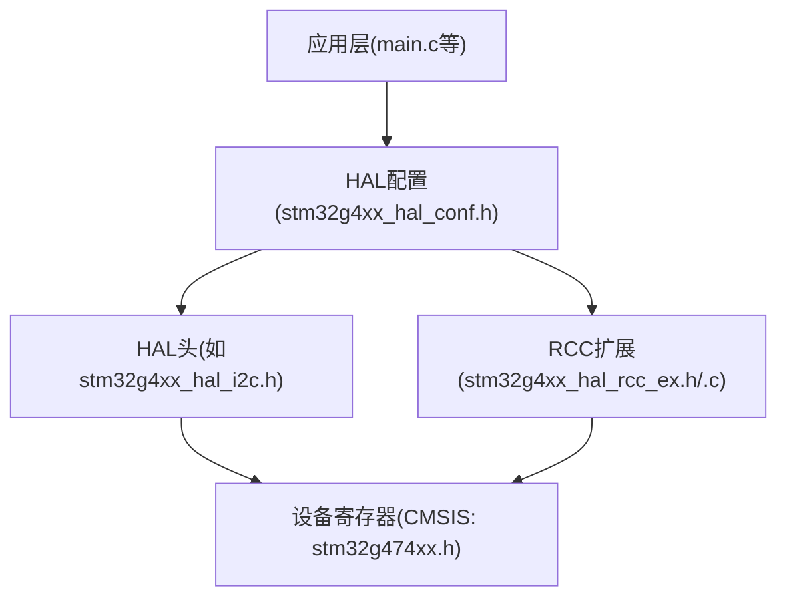
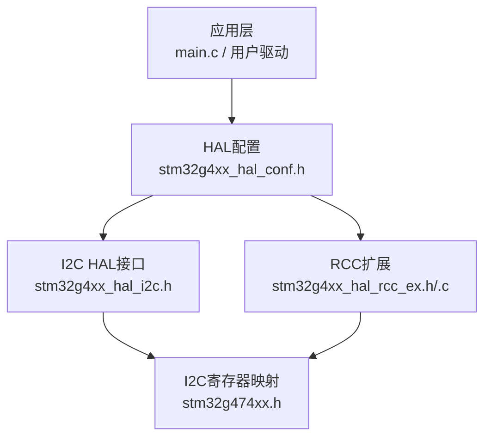
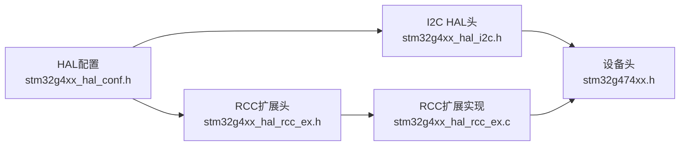

# I2C总线通信驱动

<cite>
**本文引用的文件**   
- [Core/Inc/stm32g4xx_hal_conf.h](file://Core/Inc/stm32g4xx_hal_conf.h)
- [Drivers/CMSIS/Device/ST/STM32G4xx/Include/stm32g474xx.h](file://Drivers/CMSIS/Device/ST/STM32G4xx/Include/stm32g474xx.h)
- [Drivers/STM32G4xx_HAL_Driver/Inc/stm32g4xx_hal_rcc_ex.h](file://Drivers/STM32G4xx_HAL_Driver/Inc/stm32g4xx_hal_rcc_ex.h)
- [Drivers/STM32G4xx_HAL_Driver/Src/stm32g4xx_hal_rcc_ex.c](file://Drivers/STM32G4xx_HAL_Driver/Src/stm32g4xx_hal_rcc_ex.c)
- [Drivers/STM32G4xx_HAL_Driver/Inc/Legacy/stm32_hal_legacy.h](file://Drivers/STM32G4xx_HAL_Driver/Inc/Legacy/stm32_hal_legacy.h)
</cite>

## 目录
1. [简介](#简介)
2. [项目结构](#项目结构)
3. [核心组件](#核心组件)
4. [架构总览](#架构总览)
5. [详细组件分析](#详细组件分析)
6. [依赖关系分析](#依赖关系分析)
7. [性能与功耗考量](#性能与功耗考量)
8. [故障诊断与调试](#故障诊断与调试)
9. [结论](#结论)
10. [附录：I2C协议与设备驱动要点](#附录i2c协议与设备驱动要点)

## 简介
本技术参考文档面向使用STM32G4系列微控制器的开发者，系统阐述I2C外设的配置方法、主从模式差异、时钟源与时序设置、ACK/NACK机制、仲裁原理，以及阻塞式、中断驱动和DMA传输的实现思路。同时给出多主机、广播通信与软件模拟I2C的实践建议，并覆盖常见设备（EEPROM、传感器、显示器）的驱动编写指南、信号完整性与抗干扰措施，以及调试与排障方法。

## 项目结构
本项目为基于STM32CubeMX生成的工程骨架，包含CMSIS设备头、HAL配置与部分RCC扩展实现。I2C HAL模块在工程中处于“可选启用”状态，当前未启用具体应用代码，但提供了完整的接口与宏定义基础，便于后续集成I2C驱动。

图表来源
- [Core/Inc/stm32g4xx_hal_conf.h:275-281](file://Core/Inc/stm32g4xx_hal_conf.h#L275-L281)
- [Drivers/CMSIS/Device/ST/STM32G4xx/Include/stm32g474xx.h:552-563](file://Drivers/CMSIS/Device/ST/STM32G4xx/Include/stm32g474xx.h#L552-L563)
- [Drivers/STM32G4xx_HAL_Driver/Inc/stm32g4xx_hal_rcc_ex.h:715-754](file://Drivers/STM32G4xx_HAL_Driver/Inc/stm32g4xx_hal_rcc_ex.h#L715-L754)
- [Drivers/STM32G4xx_HAL_Driver/Src/stm32g4xx_hal_rcc_ex.c:289-334](file://Drivers/STM32G4xx_HAL_Driver/Src/stm32g4xx_hal_rcc_ex.c#L289-L334)

章节来源
- [Core/Inc/stm32g4xx_hal_conf.h:275-281](file://Core/Inc/stm32g4xx_hal_conf.h#L275-L281)

## 核心组件
- I2C外设寄存器组：包括控制寄存器CR1/CR2、自身地址OAR1/OAR2、时序TIMINGR、超时TIMEOUTR、中断与状态ISR、中断清除ICR、PEC校验PECR、收发数据RXDR/TXDR等。这些寄存器由CMSIS设备头提供基址与偏移定义，供HAL/LL层访问。
- RCC时钟源选择：通过RCC扩展宏可配置I2Cx时钟源为PCLK1、HSI或SYSCLK，并在运行时查询当前时钟源频率，用于计算I2C时序参数。
- HAL配置开关：通过HAL配置头中的宏控制是否编译I2C模块，从而决定是否包含I2C相关头文件与符号。

章节来源
- [Drivers/CMSIS/Device/ST/STM32G4xx/Include/stm32g474xx.h:552-563](file://Drivers/CMSIS/Device/ST/STM32G4xx/Include/stm32g474xx.h#L552-L563)
- [Drivers/STM32G4xx_HAL_Driver/Inc/stm32g4xx_hal_rcc_ex.h:715-754](file://Drivers/STM32G4xx_HAL_Driver/Inc/stm32g4xx_hal_rcc_ex.h#L715-L754)
- [Drivers/STM32G4xx_HAL_Driver/Src/stm32g4xx_hal_rcc_ex.c:289-334](file://Drivers/STM32G4xx_HAL_Driver/Src/stm32g4xx_hal_rcc_ex.c#L289-L334)
- [Core/Inc/stm32g4xx_hal_conf.h:275-281](file://Core/Inc/stm32g4xx_hal_conf.h#L275-L281)

## 架构总览
下图展示了从应用层到硬件寄存器的调用路径，以及RCC对I2C时钟源的配置点。

图表来源
- [Core/Inc/stm32g4xx_hal_conf.h:275-281](file://Core/Inc/stm32g4xx_hal_conf.h#L275-L281)
- [Drivers/CMSIS/Device/ST/STM32G4xx/Include/stm32g474xx.h:552-563](file://Drivers/CMSIS/Device/ST/STM32G4xx/Include/stm32g474xx.h#L552-L563)
- [Drivers/STM32G4xx_HAL_Driver/Inc/stm32g4xx_hal_rcc_ex.h:715-754](file://Drivers/STM32G4xx_HAL_Driver/Inc/stm32g4xx_hal_rcc_ex.h#L715-L754)
- [Drivers/STM32G4xx_HAL_Driver/Src/stm32g4xx_hal_rcc_ex.c:289-334](file://Drivers/STM32G4xx_HAL_Driver/Src/stm32g4xx_hal_rcc_ex.c#L289-L334)

## 详细组件分析

### I2C外设寄存器与中断向量
- 寄存器组：CR1/CR2、OAR1/OAR2、TIMINGR、TIMEOUTR、ISR、ICR、PECR、RXDR、TXDR等，定义了I2C外设的核心功能与控制位。
- 中断向量：I2Cx_EV_IRQn与I2Cx_ER_IRQn分别对应事件与错误中断，用于中断驱动与错误处理。

章节来源
- [Drivers/CMSIS/Device/ST/STM32G4xx/Include/stm32g474xx.h:552-563](file://Drivers/CMSIS/Device/ST/STM32G4xx/Include/stm32g474xx.h#L552-L563)
- [Drivers/CMSIS/Device/ST/STM32G4xx/Include/stm32g474xx.h:108-111](file://Drivers/CMSIS/Device/ST/STM32G4xx/Include/stm32g474xx.h#L108-L111)
- [Drivers/CMSIS/Device/ST/STM32G4xx/Include/stm32g474xx.h:159-160](file://Drivers/CMSIS/Device/ST/STM32G4xx/Include/stm32g474xx.h#L159-L160)
- [Drivers/CMSIS/Device/ST/STM32G4xx/Include/stm32g474xx.h:168-169](file://Drivers/CMSIS/Device/ST/STM32G4xx/Include/stm32g474xx.h#L168-L169)

### RCC时钟源配置与查询
- 时钟源选择：支持将I2C1~I2C4的时钟源配置为PCLK1、HSI或SYSCLK，通过RCC扩展宏进行写入。
- 时钟源查询：提供读取当前I2C时钟源的宏，结合获取各时钟频率的API，可用于计算I2C时序参数。
- 运行时配置：在RCC扩展实现中，针对I2C1/I2C2/I2C3/I2C4分别有配置分支，确保仅当对应外设时钟被选中时才执行配置。

章节来源
- [Drivers/STM32G4xx_HAL_Driver/Inc/stm32g4xx_hal_rcc_ex.h:715-754](file://Drivers/STM32G4xx_HAL_Driver/Inc/stm32g4xx_hal_rcc_ex.h#L715-L754)
- [Drivers/STM32G4xx_HAL_Driver/Src/stm32g4xx_hal_rcc_ex.c:289-334](file://Drivers/STM32G4xx_HAL_Driver/Src/stm32g4xx_hal_rcc_ex.c#L289-L334)

### HAL模块启用与兼容性别名
- 模块启用：通过HAL配置头中的宏控制是否包含I2C相关头文件，从而决定是否编译I2C驱动。
- 兼容别名：Legacy头文件中提供旧版命名与新版的映射，例如通用呼叫、双地址、无应答拉伸、模拟滤波等选项的别名，以及顺序传输/接收的IT/DMA函数别名，便于跨版本迁移。

章节来源
- [Core/Inc/stm32g4xx_hal_conf.h:275-281](file://Core/Inc/stm32g4xx_hal_conf.h#L275-L281)
- [Drivers/STM32G4xx_HAL_Driver/Inc/Legacy/stm32_hal_legacy.h:1036-1058](file://Drivers/STM32G4xx_HAL_Driver/Inc/Legacy/stm32_hal_legacy.h#L1036-L1058)
- [Drivers/STM32G4xx_HAL_Driver/Inc/Legacy/stm32_hal_legacy.h:1854-1869](file://Drivers/STM32G4xx_HAL_Driver/Inc/Legacy/stm32_hal_legacy.h#L1854-L1869)

## 依赖关系分析
- 应用层依赖HAL配置头以决定是否启用I2C模块。
- HAL I2C接口依赖CMSIS设备头提供的寄存器映射与中断向量。
- RCC扩展头/实现提供I2C时钟源配置与查询能力，间接影响I2C时序计算。

图表来源
- [Core/Inc/stm32g4xx_hal_conf.h:275-281](file://Core/Inc/stm32g4xx_hal_conf.h#L275-L281)
- [Drivers/CMSIS/Device/ST/STM32G4xx/Include/stm32g474xx.h:552-563](file://Drivers/CMSIS/Device/ST/STM32G4xx/Include/stm32g474xx.h#L552-L563)
- [Drivers/STM32G4xx_HAL_Driver/Inc/stm32g4xx_hal_rcc_ex.h:715-754](file://Drivers/STM32G4xx_HAL_Driver/Inc/stm32g4xx_hal_rcc_ex.h#L715-L754)
- [Drivers/STM32G4xx_HAL_Driver/Src/stm32g4xx_hal_rcc_ex.c:289-334](file://Drivers/STM32G4xx_HAL_Driver/Src/stm32g4xx_hal_rcc_ex.c#L289-L334)

## 性能与功耗考量
- 时钟源选择：I2C时钟源可选择PCLK1、HSI或SYSCLK。不同源具有不同的抖动与稳定性特性，需根据目标速率与噪声环境权衡。
- 时序参数：I2C的上升/下降时间、高/低电平持续时间与时钟分频等参数需在TIMINGR中正确配置，以确保满足标准/快速/快速+模式的时序要求。
- DMA与中断：在高吞吐场景下优先使用DMA以降低CPU占用；在中断场景中注意临界区与标志位清理，避免丢失事件。
- 功耗：在低功耗模式下，I2C可在空闲时关闭时钟或在唤醒帧到来时动态开启HSI，以减少静态功耗。

章节来源
- [Drivers/STM32G4xx_HAL_Driver/Inc/stm32g4xx_hal_rcc_ex.h:715-754](file://Drivers/STM32G4xx_HAL_Driver/Inc/stm32g4xx_hal_rcc_ex.h#L715-L754)
- [Drivers/STM32G4xx_HAL_Driver/Src/stm32g4xx_hal_rcc_ex.c:289-334](file://Drivers/STM32G4xx_HAL_Driver/Src/stm32g4xx_hal_rcc_ex.c#L289-L334)

## 故障诊断与调试
- 中断向量：使用I2Cx_EV_IRQn与I2Cx_ER_IRQn捕获事件与错误，便于定位总线异常（如仲裁丢失、超时报错、NACK等）。
- 状态与错误标志：通过ISR与ICR配合检查并清除相应标志位，结合TIMEOUTR防止死等。
- 常见问题排查：
  - 无法启动总线：检查SCL/SDA上拉电阻、时钟源与频率、TIMINGR配置。
  - 频繁NACK：核对从机地址、读写方向、器件是否就绪。
  - 总线锁死：发送STOP或多次SCL脉冲释放总线，必要时复位I2C外设。
  - 多主机冲突：确认仲裁逻辑与优先级策略，避免同时发起起始条件。

章节来源
- [Drivers/CMSIS/Device/ST/STM32G4xx/Include/stm32g474xx.h:552-563](file://Drivers/CMSIS/Device/ST/STM32G4xx/Include/stm32g474xx.h#L552-L563)
- [Drivers/CMSIS/Device/ST/STM32G4xx/Include/stm32g474xx.h:108-111](file://Drivers/CMSIS/Device/ST/STM32G4xx/Include/stm32g474xx.h#L108-L111)
- [Drivers/CMSIS/Device/ST/STM32G4xx/Include/stm32g474xx.h:159-160](file://Drivers/CMSIS/Device/ST/STM32G4xx/Include/stm32g474xx.h#L159-L160)
- [Drivers/CMSIS/Device/ST/STM32G4xx/Include/stm32g474xx.h:168-169](file://Drivers/CMSIS/Device/ST/STM32G4xx/Include/stm32g474xx.h#L168-L169)

## 结论
本仓库提供了STM32G4系列的CMSIS设备头与HAL配置基础，并包含RCC扩展中对I2C时钟源的选择与查询能力。尽管当前工程未直接启用I2C应用代码，但已具备构建完整I2C驱动所需的底层支撑。建议在启用HAL_I2C_MODULE_ENABLED后，依据本指南完成外设初始化、时序配置与数据传输流程，并结合中断/DMA提升效率与鲁棒性。

## 附录：I2C协议与设备驱动要点

### 主模式与从模式的区别
- 主模式：由主机产生起始/停止条件与时钟，负责寻址与仲裁；适用于主控设备。
- 从模式：响应来自主机的地址匹配，按约定发送/接收数据；适用于外设节点。
- 典型流程：主机发送START→发送从机地址+方向位→等待ACK→数据块传输→STOP。

### 时钟频率与时钟源设置
- 时钟源：可通过RCC扩展宏将I2C时钟源设置为PCLK1、HSI或SYSCLK。
- 频率计算：根据所选时钟源频率与目标速率（标准/快速/快速+），在TIMINGR中配置相应的时序参数，以满足建立/保持时间与上升/下降时间要求。

章节来源
- [Drivers/STM32G4xx_HAL_Driver/Inc/stm32g4xx_hal_rcc_ex.h:715-754](file://Drivers/STM32G4xx_HAL_Driver/Inc/stm32g4xx_hal_rcc_ex.h#L715-L754)
- [Drivers/STM32G4xx_HAL_Driver/Src/stm32g4xx_hal_rcc_ex.c:289-334](file://Drivers/STM32G4xx_HAL_Driver/Src/stm32g4xx_hal_rcc_ex.c#L289-L334)

### 地址配置与通用呼叫
- 自身地址：通过OAR1/OAR2配置单/双地址模式，支持7位/10位地址格式。
- 通用呼叫：启用通用呼叫地址（0x00）可使所有从机响应，常用于唤醒或复位。

章节来源
- [Drivers/CMSIS/Device/ST/STM32G4xx/Include/stm32g474xx.h:552-563](file://Drivers/CMSIS/Device/ST/STM32G4xx/Include/stm32g474xx.h#L552-L563)
- [Drivers/STM32G4xx_HAL_Driver/Inc/Legacy/stm32_hal_legacy.h:1036-1058](file://Drivers/STM32G4xx_HAL_Driver/Inc/Legacy/stm32_hal_legacy.h#L1036-L1058)

### 数据传输格式与ACK/NACK机制
- 数据帧：起始条件→地址字节（含R/W位）→ACK/NACK→数据字节序列→每字节后ACK/NACK→停止条件。
- ACK/NACK：接收方在每字节后拉低SDA表示ACK，否则为NACK；主机在最后一个字节后可发送NACK以结束接收。

### 总线仲裁原理
- 多主机共享总线时，若多个主机同时发起传输，会在SCL高电平时比较SDA电平，出现不一致的主机退出竞争，保证数据一致性。
- 仲裁失败的主机需等待总线空闲后重试。

### 阻塞式读写、中断驱动与DMA传输
- 阻塞式：调用同步接口，等待传输完成；适合简单任务与低吞吐场景。
- 中断驱动：启用事件/错误中断，在回调中处理数据搬运与状态机推进；适合中等吞吐与实时性要求。
- DMA传输：将数据在内存与I2C数据寄存器之间自动搬运，降低CPU负载；适合大数据量与高吞吐场景。

### 多主机通信与广播通信
- 多主机：合理设计仲裁与重试策略，避免长时间占用总线；必要时引入超时与错误恢复。
- 广播通信：使用通用呼叫地址或特定广播地址，使所有从机响应；需谨慎处理从机行为与冲突。

### 软件模拟I2C
- 通过GPIO模拟SCL/SDA波形，严格遵循时序要求；适用于无硬件I2C或引脚受限场景。
- 注意上拉电阻、延时与抖动处理，确保稳定通信。

### 常见设备驱动编写指南
- EEPROM：先写地址指针，再连续读/写数据页；注意页边界与写周期等待。
- 传感器：配置工作模式与采样率，周期性读取数据并进行校准与滤波。
- 显示器：按命令/数据帧组织传输，注意时序与缓冲区管理。

### 时序要求、信号完整性与抗干扰
- 时序：严格遵守标准/快速/快速+模式的建立/保持时间与上升/下降时间限制。
- 信号完整性：合理布局走线，减少环路面积；使用合适的上拉电阻值；避免长距离平行走线。
- 抗干扰：增加去耦电容、屏蔽与地平面分割；必要时采用差分或隔离方案。

### 调试工具与故障诊断方法
- 逻辑分析仪/示波器：抓取SCL/SDA波形，验证起始/停止、ACK/NACK与数据内容。
- 中断与状态寄存器：结合ISR/ICR与TIMEOUTR定位异常；打印关键状态以便追踪。
- 最小化测试：先实现单字节回环，逐步扩展到多字节与复杂操作。