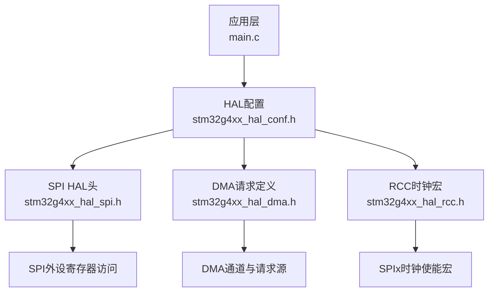
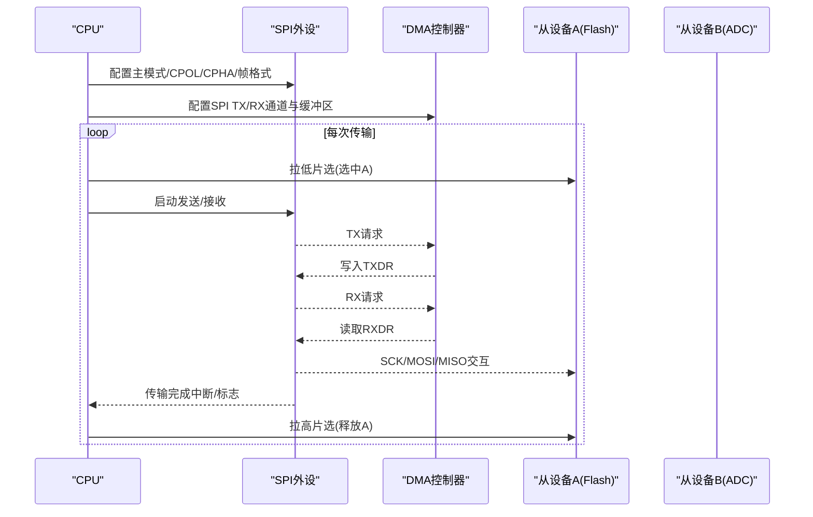
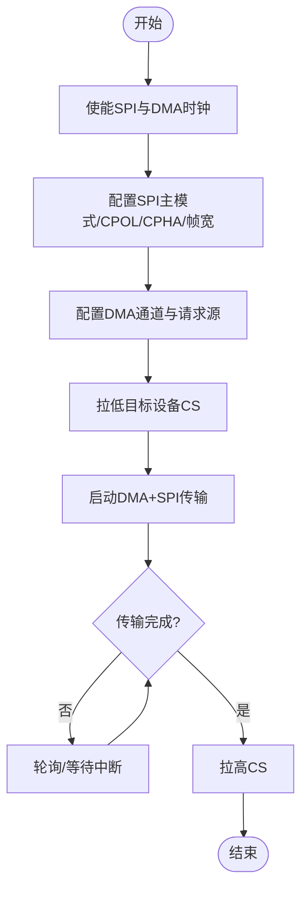
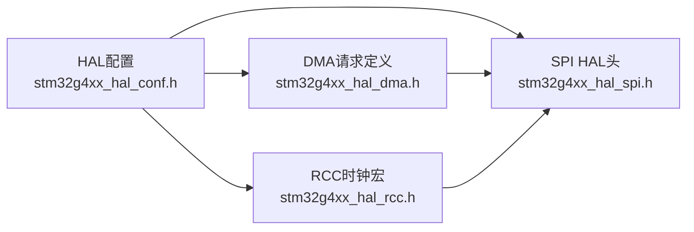

# SPI串行通信驱动

<cite>
**本文引用的文件**   
- [Core/Inc/stm32g4xx_hal_conf.h](file://Core/Inc/stm32g4xx_hal_conf.h)
- [Drivers/STM32G4xx_HAL_Driver/Inc/stm32g4xx_hal_dma.h](file://Drivers/STM32G4xx_HAL_Driver/Inc/stm32g4xx_hal_dma.h)
- [Drivers/STM32G4xx_HAL_Driver/Inc/stm32g4xx_hal_rcc.h](file://Drivers/STM32G4xx_HAL_Driver/Inc/stm32g4xx_hal_rcc.h)
</cite>

## 目录
1. [简介](#简介)
2. [项目结构](#项目结构)
3. [核心组件](#核心组件)
4. [架构总览](#架构总览)
5. [详细组件分析](#详细组件分析)
6. [依赖关系分析](#依赖关系分析)
7. [性能与EMC考虑](#性能与emc考虑)
8. [故障排查指南](#故障排查指南)
9. [结论](#结论)
10. [附录：参考实现路径](#附录参考实现路径)

## 简介
本技术文档面向在STM32G4系列微控制器上使用SPI外设的开发者，系统阐述SPI主从模式、时钟极性与相位（CPOL/CPHA）、数据帧格式、全双工时序、片选管理，以及阻塞式、中断驱动和DMA传输的实现思路与适用场景。同时给出多设备通信、高速数据传输、内存映射接口（如QSPI）的设计要点，并覆盖常见SPI设备（Flash、ADC/DAC、显示屏）的驱动开发建议、时钟频率限制、信号质量与EMC设计考量，以及总线调试与性能优化方法。

## 项目结构
本项目为基于STM32CubeMX生成的工程骨架，包含HAL配置、RCC时钟宏、DMA请求定义等关键头文件。当前工程中未直接包含SPI应用代码，但提供了启用SPI模块与相关资源的必要入口点。

图表来源
- [Core/Inc/stm32g4xx_hal_conf.h:335-337](file://Core/Inc/stm32g4xx_hal_conf.h#L335-L337)
- [Drivers/STM32G4xx_HAL_Driver/Inc/stm32g4xx_hal_dma.h:194-199](file://Drivers/STM32G4xx_HAL_Driver/Inc/stm32g4xx_hal_dma.h#L194-L199)
- [Drivers/STM32G4xx_HAL_Driver/Inc/stm32g4xx_hal_rcc.h:1115-1121](file://Drivers/STM32G4xx_HAL_Driver/Inc/stm32g4xx_hal_rcc.h#L1115-L1121)

章节来源
- [Core/Inc/stm32g4xx_hal_conf.h:335-337](file://Core/Inc/stm32g4xx_hal_conf.h#L335-L337)
- [Drivers/STM32G4xx_HAL_Driver/Inc/stm32g4xx_hal_dma.h:194-199](file://Drivers/STM32G4xx_HAL_Driver/Inc/stm32g4xx_hal_dma.h#L194-L199)
- [Drivers/STM32G4xx_HAL_Driver/Inc/stm32g4xx_hal_rcc.h:1115-1121](file://Drivers/STM32G4xx_HAL_Driver/Inc/stm32g4xx_hal_rcc.h#L1115-L1121)

## 核心组件
- SPI HAL配置开关与包含
  - 通过HAL配置宏启用SPI模块，并在条件编译中包含SPI HAL头文件，从而暴露SPI初始化、传输、回调等API。
- DMA请求源
  - 提供SPI1/SPI2/SPI3的RX/TX DMA请求常量，用于将SPI收发与DMA通道绑定，实现零CPU拷贝的高速传输。
- RCC时钟宏
  - 提供SPI1/SPI3等外设时钟使能宏，确保外设工作前正确开启对应APB总线时钟。

章节来源
- [Core/Inc/stm32g4xx_hal_conf.h:335-337](file://Core/Inc/stm32g4xx_hal_conf.h#L335-L337)
- [Drivers/STM32G4xx_HAL_Driver/Inc/stm32g4xx_hal_dma.h:194-199](file://Drivers/STM32G4xx_HAL_Driver/Inc/stm32g4xx_hal_dma.h#L194-L199)
- [Drivers/STM32G4xx_HAL_Driver/Inc/stm32g4xx_hal_rcc.h:1115-1121](file://Drivers/STM32G4xx_HAL_Driver/Inc/stm32g4xx_hal_rcc.h#L1115-L1121)

## 架构总览
下图展示典型SPI主设备与多个从设备的连接与通信流程，包括片选管理、时钟极性/相位、全双工移位与DMA参与的数据通路。

图表来源
- [Drivers/STM32G4xx_HAL_Driver/Inc/stm32g4xx_hal_dma.h:194-199](file://Drivers/STM32G4xx_HAL_Driver/Inc/stm32g4xx_hal_dma.h#L194-L199)
- [Drivers/STM32G4xx_HAL_Driver/Inc/stm32g4xx_hal_rcc.h:1115-1121](file://Drivers/STM32G4xx_HAL_Driver/Inc/stm32g4xx_hal_rcc.h#L1115-L1121)

## 详细组件分析

### SPI外设配置与工作模式
- 主从模式选择
  - 在主模式下，MCU产生SCK并控制MOSI；在从模式下，由外部主设备提供SCK，MCU仅响应。
- 时钟极性与相位（CPOL/CPHA）
  - CPOL决定空闲时SCK电平；CPHA决定采样边沿。需与从设备严格匹配。
- 数据帧格式
  - 支持8/16位帧长、MSB/LSB优先、可选CRC校验（取决于HAL配置）。
- 全双工机制
  - MOSI与MISO同时移位，读写在同一时钟周期内完成。

章节来源
- [Core/Inc/stm32g4xx_hal_conf.h:335-337](file://Core/Inc/stm32g4xx_hal_conf.h#L335-L337)

### 片选管理与多设备通信
- 片选策略
  - 使用独立GPIO作为每个从设备的CS引脚，传输前拉低，结束后拉高。
- 多设备总线
  - 共享SCK/MOSI/MISO，各从设备独立CS；注意CS切换建立/保持时间。
- 冲突避免
  - 同一时刻仅一个从设备CS有效；必要时在CS切换后插入最小延时。

章节来源
- [Drivers/STM32G4xx_HAL_Driver/Inc/stm32g4xx_hal_rcc.h:1115-1121](file://Drivers/STM32G4xx_HAL_Driver/Inc/stm32g4xx_hal_rcc.h#L1115-L1121)

### 阻塞式传输
- 特点
  - 调用即阻塞直到传输完成，适合简单任务或低吞吐场景。
- 适用场景
  - 小批量命令/状态读取、调试打印、低频控制。
- 注意事项
  - 避免在实时路径中长时间阻塞；合理设置超时。

章节来源
- [Core/Inc/stm32g4xx_hal_conf.h:335-337](file://Core/Inc/stm32g4xx_hal_conf.h#L335-L337)

### 中断驱动传输
- 特点
  - 通过TXE/RXNE/TC等事件触发中断，CPU仅在必要时处理。
- 适用场景
  - 中等吞吐、需要灵活调度、对延迟敏感但不追求极致带宽。
- 关键点
  - 中断服务函数应短小精悍；维护环形缓冲与索引；避免在中断中执行耗时操作。

章节来源
- [Core/Inc/stm32g4xx_hal_conf.h:335-337](file://Core/Inc/stm32g4xx_hal_conf.h#L335-L337)

### DMA传输
- 特点
  - 由DMA搬运数据，极大降低CPU负载，适合大数据量连续传输。
- 适用场景
  - Flash页写/读、图像数据流、传感器批量采集。
- 配置要点
  - 使用SPI TX/RX DMA请求常量；配置循环/半满/完成中断以管理缓冲。
- 流程图

图表来源
- [Drivers/STM32G4xx_HAL_Driver/Inc/stm32g4xx_hal_dma.h:194-199](file://Drivers/STM32G4xx_HAL_Driver/Inc/stm32g4xx_hal_dma.h#L194-L199)
- [Drivers/STM32G4xx_HAL_Driver/Inc/stm32g4xx_hal_rcc.h:1115-1121](file://Drivers/STM32G4xx_HAL_Driver/Inc/stm32g4xx_hal_rcc.h#L1115-L1121)

章节来源
- [Drivers/STM32G4xx_HAL_Driver/Inc/stm32g4xx_hal_dma.h:194-199](file://Drivers/STM32G4xx_HAL_Driver/Inc/stm32g4xx_hal_dma.h#L194-L199)
- [Drivers/STM32G4xx_HAL_Driver/Inc/stm32g4xx_hal_rcc.h:1115-1121](file://Drivers/STM32G4xx_HAL_Driver/Inc/stm32g4xx_hal_rcc.h#L1115-L1121)

### 高速数据传输与内存映射接口
- 高速SPI
  - 提高SPI时钟分频以降低SCK周期；确保PCB走线阻抗匹配与端接；缩短走线长度。
- 内存映射接口（QSPI）
  - 对于大容量Flash，可使用QSPI在内存映射模式下直接按地址访问，减少指令开销。
- 流水线与双缓冲
  - 结合DMA半满/完成中断进行双缓冲轮换，最大化吞吐。

章节来源
- [Core/Inc/stm32g4xx_hal_conf.h:335-337](file://Core/Inc/stm32g4xx_hal_conf.h#L335-L337)

### 常见SPI设备驱动开发指南
- Flash存储器
  - 典型操作：读ID、页编程、扇区擦除、连续读；注意忙等待与写保护。
- ADC/DAC
  - 常用单字节命令+数据组合；关注时序建立/保持时间与最大时钟。
- 显示屏
  - 大量像素数据采用DMA连续传输；合理使用写命令/数据复用引脚与DC控制。

章节来源
- [Core/Inc/stm32g4xx_hal_conf.h:335-337](file://Core/Inc/stm32g4xx_hal_conf.h#L335-L337)

## 依赖关系分析
- HAL配置到具体外设
  - 通过宏开关启用SPI HAL，并包含相应头文件，形成“配置→接口”的依赖链。
- DMA与SPI耦合
  - 使用DMA请求常量将SPI收发与DMA通道关联，降低CPU介入。
- RCC与时钟
  - 外设使用前必须使能对应时钟，否则寄存器访问无效。

图表来源
- [Core/Inc/stm32g4xx_hal_conf.h:335-337](file://Core/Inc/stm32g4xx_hal_conf.h#L335-L337)
- [Drivers/STM32G4xx_HAL_Driver/Inc/stm32g4xx_hal_dma.h:194-199](file://Drivers/STM32G4xx_HAL_Driver/Inc/stm32g4xx_hal_dma.h#L194-L199)
- [Drivers/STM32G4xx_HAL_Driver/Inc/stm32g4xx_hal_rcc.h:1115-1121](file://Drivers/STM32G4xx_HAL_Driver/Inc/stm32g4xx_hal_rcc.h#L1115-L1121)

章节来源
- [Core/Inc/stm32g4xx_hal_conf.h:335-337](file://Core/Inc/stm32g4xx_hal_conf.h#L335-L337)
- [Drivers/STM32G4xx_HAL_Driver/Inc/stm32g4xx_hal_dma.h:194-199](file://Drivers/STM32G4xx_HAL_Driver/Inc/stm32g4xx_hal_dma.h#L194-L199)
- [Drivers/STM32G4xx_HAL_Driver/Inc/stm32g4xx_hal_rcc.h:1115-1121](file://Drivers/STM32G4xx_HAL_Driver/Inc/stm32g4xx_hal_rcc.h#L1115-L1121)

## 性能与EMC考虑
- 时钟频率限制
  - 依据器件手册与电源电压确定最高SPI时钟；在高时钟下谨慎评估IO摆率与功耗。
- 信号完整性
  - 控制走线长度、阻抗匹配、端接电阻；避免跨越分割平面；尽量短而直。
- EMC设计
  - 减小环路面积；屏蔽与地平面完整；必要时增加磁珠或共模电感；合理布局去耦电容。
- 软件优化
  - 使用DMA与双缓冲；合并小包为大块传输；关闭不必要的调试输出；合理优先级分配中断。

[本节为通用指导，不直接分析具体文件]

## 故障排查指南
- 无法访问SPI寄存器
  - 检查是否已使能SPI时钟；确认RCC宏使用正确。
- 数据错乱或位序错误
  - 核对CPOL/CPHA与帧格式是否与从设备一致；确认MSB/LSB优先设置。
- DMA无数据
  - 检查DMA请求源是否正确；确认DMA通道方向与缓冲区大小；验证传输完成标志。
- 多设备冲突
  - 确认CS切换时序；避免同时选中多个从设备；在CS切换后插入最小延时。

章节来源
- [Drivers/STM32G4xx_HAL_Driver/Inc/stm32g4xx_hal_rcc.h:1115-1121](file://Drivers/STM32G4xx_HAL_Driver/Inc/stm32g4xx_hal_rcc.h#L1115-L1121)
- [Drivers/STM32G4xx_HAL_Driver/Inc/stm32g4xx_hal_dma.h:194-199](file://Drivers/STM32G4xx_HAL_Driver/Inc/stm32g4xx_hal_dma.h#L194-L199)

## 结论
通过在HAL配置中启用SPI模块，并结合DMA与RCC时钟宏，可在STM32G4上构建高效可靠的SPI通信方案。根据业务需求选择合适的传输方式（阻塞/中断/DMA），配合良好的PCB设计与EMC措施，可实现从基础配置到高性能应用的完整SPI开发闭环。

[本节为总结性内容，不直接分析具体文件]

## 附录：参考实现路径
- 启用SPI模块与包含SPI HAL头文件
  - 参考路径：[Core/Inc/stm32g4xx_hal_conf.h:335-337](file://Core/Inc/stm32g4xx_hal_conf.h#L335-L337)
- 使用SPI1/SPI2/SPI3的DMA请求常量
  - 参考路径：[Drivers/STM32G4xx_HAL_Driver/Inc/stm32g4xx_hal_dma.h:194-199](file://Drivers/STM32G4xx_HAL_Driver/Inc/stm32g4xx_hal_dma.h#L194-L199)
- 使能SPI1/SPI3时钟
  - 参考路径：[Drivers/STM32G4xx_HAL_Driver/Inc/stm32g4xx_hal_rcc.h:1115-1121](file://Drivers/STM32G4xx_HAL_Driver/Inc/stm32g4xx_hal_rcc.h#L1115-L1121)