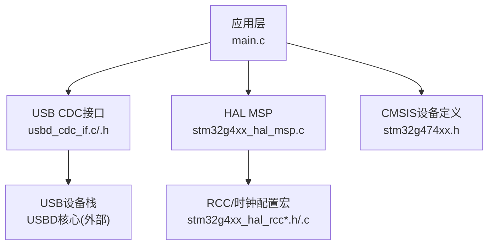
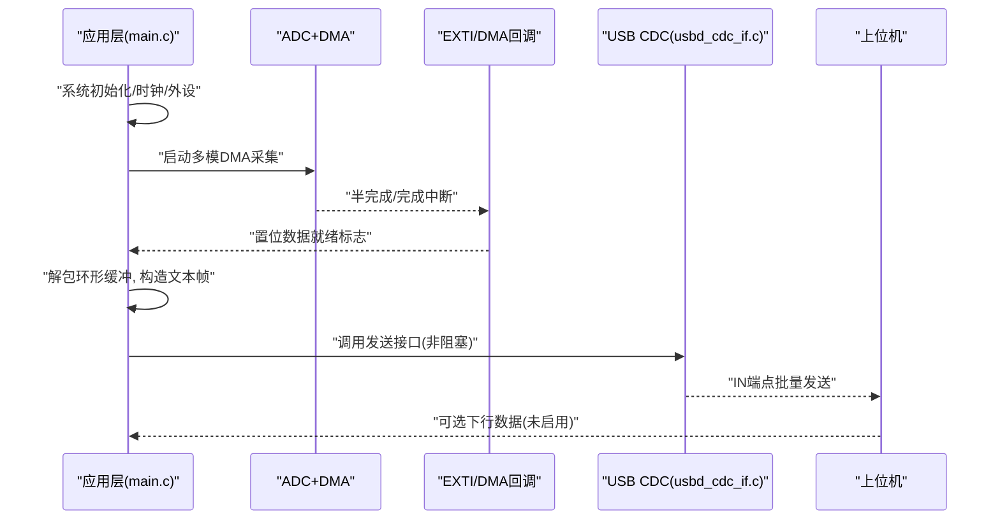
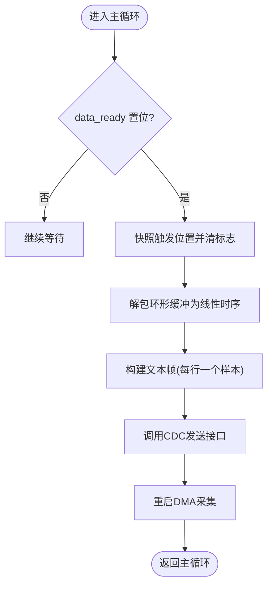
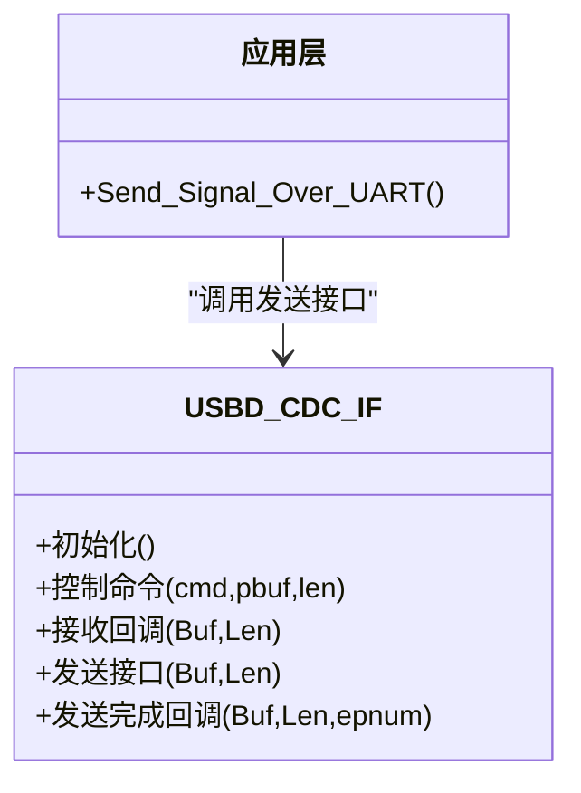
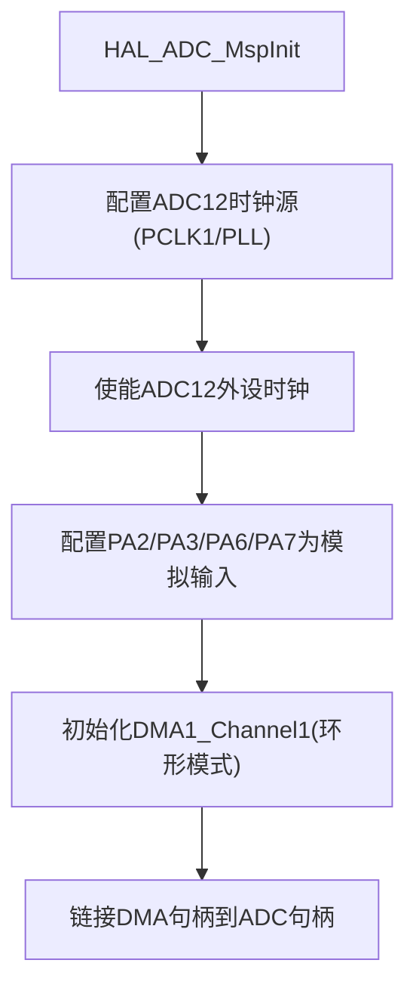
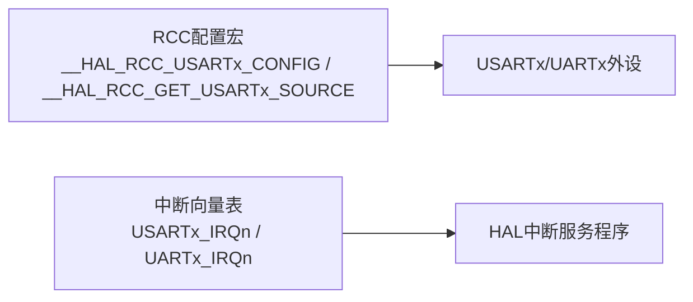
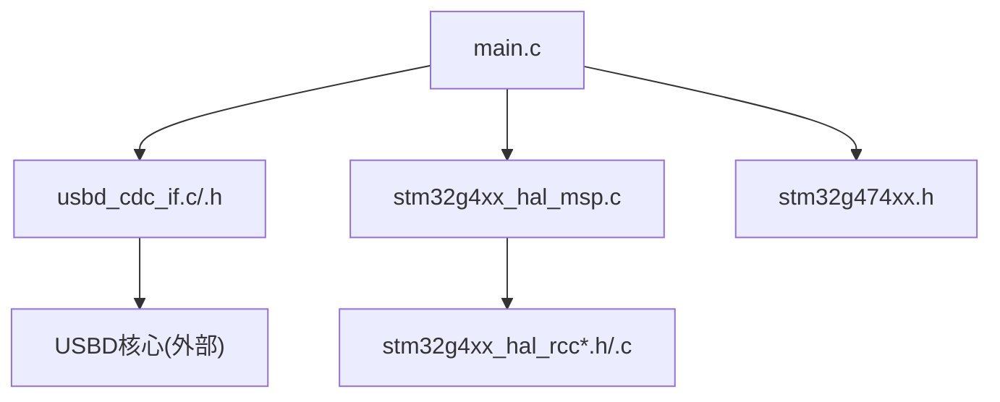

# USART串口通信驱动

<cite>
**本文引用的文件**   
- [main.c](file://Core/Src/main.c)
- [main.h](file://Core/Inc/main.h)
- [stm32g4xx_hal_msp.c](file://Core/Src/stm32g4xx_hal_msp.c)
- [usbd_cdc_if.c](file://USB_Device/App/usbd_cdc_if.c)
- [usbd_cdc_if.h](file://USB_Device/App/usbd_cdc_if.h)
- [stm32g4xx_hal_conf.h](file://Core/Inc/stm32g4xx_hal_conf.h)
- [stm32g4xx_hal_rcc_ex.c](file://Drivers/STM32G4xx_HAL_Driver/Src/stm32g4xx_hal_rcc_ex.c)
- [stm32g4xx_hal_rcc.h](file://Drivers/STM32G4xx_HAL_Driver/Inc/stm32g4xx_hal_rcc.h)
- [stm32g4xx_hal_rcc_ex.h](file://Drivers/STM32G4xx_HAL_Driver/Inc/stm32g4xx_hal_rcc_ex.h)
- [stm32g474xx.h](file://Drivers/CMSIS/Device/ST/STM32G4xx/Include/stm32g474xx.h)
</cite>

## 目录
1. [简介](#简介)
2. [项目结构](#项目结构)
3. [核心组件](#核心组件)
4. [架构总览](#架构总览)
5. [详细组件分析](#详细组件分析)
6. [依赖关系分析](#依赖关系分析)
7. [性能考虑](#性能考虑)
8. [故障排查指南](#故障排查指南)
9. [结论](#结论)
10. [附录](#附录)

## 简介
本技术文档面向使用STM32G4系列微控制器的开发者，围绕USART串口通信驱动与典型应用进行系统化说明。需要特别说明的是：当前仓库示例工程并未直接使用硬件USART外设进行数据收发，而是通过USB CDC（虚拟串口）实现与上位机的通信。因此，本文在“直接USART配置”部分提供基于HAL的通用方法与参考路径；在“实际工程中的串口通信”部分，则基于现有代码对USB CDC的数据发送流程、回调机制、错误处理等进行深入解析，并给出阻塞式、中断驱动和DMA三种传输模式的原理与实践建议，帮助读者从入门到高级应用全面掌握USART开发。

## 项目结构
该工程采用CubeMX生成的标准分层结构：
- Core/Src 与 Core/Inc：应用主循环、系统初始化、MSP层等
- USB_Device/App：USB CDC类接口实现与导出函数
- Drivers/STM32G4xx_HAL_Driver：HAL库源与头文件（包含RCC、GPIO、DMA、UART/USART相关宏与API）
- Drivers/CMSIS：设备定义与中断向量表

图表来源
- [main.c:219-290](file://Core/Src/main.c#L219-L290)
- [usbd_cdc_if.c:138-145](file://USB_Device/App/usbd_cdc_if.c#L138-L145)
- [stm32g4xx_hal_msp.c:92-185](file://Core/Src/stm32g4xx_hal_msp.c#L92-L185)
- [stm32g4xx_hal_rcc_ex.c:219-276](file://Drivers/STM32G4xx_HAL_Driver/Src/stm32g4xx_hal_rcc_ex.c#L219-L276)
- [stm32g474xx.h:114-130](file://Drivers/CMSIS/Device/ST/STM32G4xx/Include/stm32g474xx.h#L114-L130)

章节来源
- [main.c:219-290](file://Core/Src/main.c#L219-L290)
- [usbd_cdc_if.c:138-145](file://USB_Device/App/usbd_cdc_if.c#L138-L145)
- [stm32g4xx_hal_msp.c:92-185](file://Core/Src/stm32g4xx_hal_msp.c#L92-L185)
- [stm32g4xx_hal_rcc_ex.c:219-276](file://Drivers/STM32G4xx_HAL_Driver/Src/stm32g4xx_hal_rcc_ex.c#L219-L276)
- [stm32g474xx.h:114-130](file://Drivers/CMSIS/Device/ST/STM32G4xx/Include/stm32g474xx.h#L114-L130)

## 核心组件
- 应用入口与主循环：负责系统初始化、外设启动、触发事件处理与数据上报
- USB CDC接口：封装了CDC类的初始化、控制命令、接收与发送回调
- HAL MSP：为ADC/DMA等外设提供底层资源初始化（时钟、GPIO、DMA通道）
- RCC配置：提供USART/LPUART等外设时钟源选择与使能宏
- CMSIS设备定义：提供中断号、寄存器基地址等基础定义

章节来源
- [main.c:219-290](file://Core/Src/main.c#L219-L290)
- [usbd_cdc_if.c:138-145](file://USB_Device/App/usbd_cdc_if.c#L138-L145)
- [stm32g4xx_hal_msp.c:92-185](file://Core/Src/stm32g4xx_hal_msp.c#L92-L185)
- [stm32g4xx_hal_rcc_ex.c:219-276](file://Drivers/STM32G4xx_HAL_Driver/Src/stm32g4xx_hal_rcc_ex.c#L219-L276)
- [stm32g474xx.h:114-130](file://Drivers/CMSIS/Device/ST/STM32G4xx/Include/stm32g474xx.h#L114-L130)

## 架构总览
下图展示了工程中“传感器数据采集→数据处理→USB CDC上报”的整体数据流，以及USART相关的时钟与中断能力边界。

图表来源
- [main.c:249-287](file://Core/Src/main.c#L249-L287)
- [main.c:119-149](file://Core/Src/main.c#L119-L149)
- [usbd_cdc_if.c:281-293](file://USB_Device/App/usbd_cdc_if.c#L281-L293)

## 详细组件分析

### 组件A：应用层与数据上报流程
- 主循环中检测数据就绪标志，快照触发位置，避免ISR竞争
- 将环形缓冲区按时间顺序重排为线性时序
- 构建文本帧并通过USB CDC发送
- 重启DMA以等待下一次触发

图表来源
- [main.c:264-287](file://Core/Src/main.c#L264-L287)
- [main.c:156-171](file://Core/Src/main.c#L156-L171)
- [main.c:178-212](file://Core/Src/main.c#L178-L212)

章节来源
- [main.c:264-287](file://Core/Src/main.c#L264-L287)
- [main.c:156-171](file://Core/Src/main.c#L156-L171)
- [main.c:178-212](file://Core/Src/main.c#L178-L212)

### 组件B：USB CDC接口层
- 初始化时设置收发缓冲区指针
- 控制命令处理包含Line Coding字段说明（波特率、停止位、校验、数据位），但当前未实现具体逻辑
- 发送接口为非阻塞，内部检查发送状态，若忙则返回BUSY
- 接收回调中重新挂接RX缓冲并请求下一包

图表来源
- [usbd_cdc_if.c:138-145](file://USB_Device/App/usbd_cdc_if.c#L138-L145)
- [usbd_cdc_if.c:180-244](file://USB_Device/App/usbd_cdc_if.c#L180-L244)
- [usbd_cdc_if.c:261-268](file://USB_Device/App/usbd_cdc_if.c#L261-L268)
- [usbd_cdc_if.c:281-293](file://USB_Device/App/usbd_cdc_if.c#L281-L293)
- [usbd_cdc_if.c:307-316](file://USB_Device/App/usbd_cdc_if.c#L307-L316)

章节来源
- [usbd_cdc_if.c:138-145](file://USB_Device/App/usbd_cdc_if.c#L138-L145)
- [usbd_cdc_if.c:180-244](file://USB_Device/App/usbd_cdc_if.c#L180-L244)
- [usbd_cdc_if.c:261-268](file://USB_Device/App/usbd_cdc_if.c#L261-L268)
- [usbd_cdc_if.c:281-293](file://USB_Device/App/usbd_cdc_if.c#L281-L293)
- [usbd_cdc_if.c:307-316](file://USB_Device/App/usbd_cdc_if.c#L307-L316)

### 组件C：HAL MSP与DMA/ADC资源
- ADC1/ADC2共用ADC12时钟源，由PLL提供
- DMA1通道1用于ADC1到内存的环形传输
- GPIO配置为模拟输入，无上下拉

图表来源
- [stm32g4xx_hal_msp.c:92-185](file://Core/Src/stm32g4xx_hal_msp.c#L92-L185)

章节来源
- [stm32g4xx_hal_msp.c:92-185](file://Core/Src/stm32g4xx_hal_msp.c#L92-L185)

### 组件D：USART/LPUART时钟与中断能力（参考）
- RCC提供USART1/2/3、UART4/5、LPUART1的时钟源选择宏与查询宏
- CMSIS定义了USARTx与UARTx的中断号，便于在中断控制器中配置优先级与使能

图表来源
- [stm32g4xx_hal_rcc_ex.h:599-641](file://Drivers/STM32G4xx_HAL_Driver/Inc/stm32g4xx_hal_rcc_ex.h#L599-L641)
- [stm32g4xx_hal_rcc.h:915-931](file://Drivers/STM32G4xx_HAL_Driver/Inc/stm32g4xx_hal_rcc.h#L915-L931)
- [stm32g474xx.h:114-130](file://Drivers/CMSIS/Device/ST/STM32G4xx/Include/stm32g474xx.h#L114-L130)

章节来源
- [stm32g4xx_hal_rcc_ex.h:599-641](file://Drivers/STM32G4xx_HAL_Driver/Inc/stm32g4xx_hal_rcc_ex.h#L599-L641)
- [stm32g4xx_hal_rcc.h:915-931](file://Drivers/STM32G4xx_HAL_Driver/Inc/stm32g4xx_hal_rcc.h#L915-L931)
- [stm32g474xx.h:114-130](file://Drivers/CMSIS/Device/ST/STM32G4xx/Include/stm32g474xx.h#L114-L130)

## 依赖关系分析
- 应用层依赖USB CDC接口进行数据上报
- USB CDC接口依赖USBD核心（外部库）
- HAL MSP依赖RCC与GPIO/DMA驱动
- RCC宏与CMSIS定义提供底层能力支撑

图表来源
- [main.c:219-290](file://Core/Src/main.c#L219-L290)
- [usbd_cdc_if.c:138-145](file://USB_Device/App/usbd_cdc_if.c#L138-L145)
- [stm32g4xx_hal_msp.c:92-185](file://Core/Src/stm32g4xx_hal_msp.c#L92-L185)
- [stm32g4xx_hal_rcc_ex.c:219-276](file://Drivers/STM32G4xx_HAL_Driver/Src/stm32g4xx_hal_rcc_ex.c#L219-L276)
- [stm32g474xx.h:114-130](file://Drivers/CMSIS/Device/ST/STM32G4xx/Include/stm32g474xx.h#L114-L130)

章节来源
- [main.c:219-290](file://Core/Src/main.c#L219-L290)
- [usbd_cdc_if.c:138-145](file://USB_Device/App/usbd_cdc_if.c#L138-L145)
- [stm32g4xx_hal_msp.c:92-185](file://Core/Src/stm32g4xx_hal_msp.c#L92-L185)
- [stm32g4xx_hal_rcc_ex.c:219-276](file://Drivers/STM32G4xx_HAL_Driver/Src/stm32g4xx_hal_rcc_ex.c#L219-L276)
- [stm32g474xx.h:114-130](file://Drivers/CMSIS/Device/ST/STM32G4xx/Include/stm32g474xx.h#L114-L130)

## 性能考虑
- 非阻塞发送：CDC发送接口会检查发送状态，若忙则返回BUSY，上层需轮询或队列化重试，避免阻塞主循环
- 环形缓冲与DMA：ADC采样采用环形DMA，减少CPU干预，提高吞吐
- 文本格式化开销：将数值转换为字符串会增加CPU负载，建议在空闲时段或中断中预处理
- 时钟源选择：USART/LPUART可使用PCLK1、SYSCLK、HSI或LSE作为时钟源，合理选择可提升精度与功耗平衡

[本节为通用指导，不直接分析具体文件]

## 故障排查指南
- 发送失败或卡住
  - 现象：发送接口返回BUSY或长时间无响应
  - 排查：确认上层是否轮询重试；检查USB枚举与连接状态；查看CDC发送完成回调是否被调用
  - 参考路径
    - [usbd_cdc_if.c:281-293](file://USB_Device/App/usbd_cdc_if.c#L281-L293)
    - [usbd_cdc_if.c:307-316](file://USB_Device/App/usbd_cdc_if.c#L307-L316)
- 数据错乱或丢包
  - 现象：上位机收到的数据不完整或错位
  - 排查：确认文本帧分隔符是否正确；检查DMA环形缓冲索引计算；避免在发送期间修改共享变量
  - 参考路径
    - [main.c:156-171](file://Core/Src/main.c#L156-L171)
    - [main.c:178-212](file://Core/Src/main.c#L178-L212)
- 触发事件丢失
  - 现象：EXTI触发后未产生数据上报
  - 排查：检查uart_busy保护逻辑；确认trigger_detected与post_trigger_dma_events计数；验证DMA回调是否执行
  - 参考路径
    - [main.c:91-113](file://Core/Src/main.c#L91-L113)
    - [main.c:119-149](file://Core/Src/main.c#L119-L149)

章节来源
- [usbd_cdc_if.c:281-293](file://USB_Device/App/usbd_cdc_if.c#L281-L293)
- [usbd_cdc_if.c:307-316](file://USB_Device/App/usbd_cdc_if.c#L307-L316)
- [main.c:156-171](file://Core/Src/main.c#L156-L171)
- [main.c:178-212](file://Core/Src/main.c#L178-L212)
- [main.c:91-113](file://Core/Src/main.c#L91-L113)
- [main.c:119-149](file://Core/Src/main.c#L119-L149)

## 结论
本仓库示例工程通过USB CDC实现了稳定的上位机通信链路，并在数据采集侧采用DMA环形缓冲与中断协作，有效降低了CPU占用。对于需要直接使用硬件USART的场景，可参考RCC与CMSIS提供的时钟与中断能力，结合HAL UART API实现阻塞、中断与DMA三种传输模式。本文提供了从架构到细节的完整分析，并给出了常见问题定位方法，帮助开发者快速落地USART相关功能。

[本节为总结性内容，不直接分析具体文件]

## 附录

### 一、USART外设配置要点（基于HAL的通用方法）
- 时钟与复位
  - 使能USART/LPUART外设时钟，选择合适时钟源（PCLK1、SYSCLK、HSI、LSE）
  - 参考路径
    - [stm32g4xx_hal_rcc_ex.c:219-276](file://Drivers/STM32G4xx_HAL_Driver/Src/stm32g4xx_hal_rcc_ex.c#L219-L276)
    - [stm32g4xx_hal_rcc_ex.h:599-641](file://Drivers/STM32G4xx_HAL_Driver/Inc/stm32g4xx_hal_rcc_ex.h#L599-L641)
- 引脚复用与GPIO配置
  - TX/RX引脚设为复用推挽输出/浮空输入，必要时开启上拉
- 波特率、数据位、停止位、校验
  - 通过HAL UART初始化结构体配置，注意与上位机一致
  - 参考路径（HAL配置宏与类型声明）
    - [stm32g4xx_hal_conf.h:65-66](file://Core/Inc/stm32g4xx_hal_conf.h#L65-L66)
    - [stm32g4xx_hal_conf.h:346-352](file://Core/Inc/stm32g4xx_hal_conf.h#L346-L352)
- 中断与DMA
  - 中断：配置NVIC优先级与使能，编写HAL回调处理接收/发送完成
  - DMA：配置环形/正常模式，绑定外设到内存地址
  - 参考路径（中断号）
    - [stm32g474xx.h:114-130](file://Drivers/CMSIS/Device/ST/STM32G4xx/Include/stm32g474xx.h#L114-L130)

章节来源
- [stm32g4xx_hal_rcc_ex.c:219-276](file://Drivers/STM32G4xx_HAL_Driver/Src/stm32g4xx_hal_rcc_ex.c#L219-L276)
- [stm32g4xx_hal_rcc_ex.h:599-641](file://Drivers/STM32G4xx_HAL_Driver/Inc/stm32g4xx_hal_rcc_ex.h#L599-L641)
- [stm32g4xx_hal_conf.h:65-66](file://Core/Inc/stm32g4xx_hal_conf.h#L65-L66)
- [stm32g4xx_hal_conf.h:346-352](file://Core/Inc/stm32g4xx_hal_conf.h#L346-L352)
- [stm32g474xx.h:114-130](file://Drivers/CMSIS/Device/ST/STM32G4xx/Include/stm32g474xx.h#L114-L130)

### 二、三种数据传输模式（原理与实践建议）
- 阻塞式传输
  - 适用场景：小数据量、简单调试
  - 关键点：发送完成后才返回，可能阻塞主循环
  - 实践建议：仅在初始化或低频率任务中使用
- 中断驱动传输
  - 适用场景：中等速率、实时性要求较高
  - 关键点：启用TXE/RXNE中断，在回调中填充/读取数据
  - 实践建议：配合环形缓冲与状态机，避免频繁上下文切换
- DMA传输
  - 适用场景：大数据量、高吞吐
  - 关键点：配置环形/正常模式，使用半传输/全传输回调
  - 实践建议：与中断协同，保证数据完整性与时序

[本节为通用指导，不直接分析具体文件]

### 三、典型应用场景（参考路径）
- 串口调试与日志输出
  - 参考路径（CDC发送接口）
    - [usbd_cdc_if.c:281-293](file://USB_Device/App/usbd_cdc_if.c#L281-L293)
- 与上位机通信
  - 参考路径（CDC控制命令与Line Coding说明）
    - [usbd_cdc_if.c:180-244](file://USB_Device/App/usbd_cdc_if.c#L180-L244)
- 传感器数据读取与上报
  - 参考路径（ADC+DMA采集与上报）
    - [main.c:249-287](file://Core/Src/main.c#L249-L287)
    - [stm32g4xx_hal_msp.c:92-185](file://Core/Src/stm32g4xx_hal_msp.c#L92-L185)

章节来源
- [usbd_cdc_if.c:281-293](file://USB_Device/App/usbd_cdc_if.c#L281-L293)
- [usbd_cdc_if.c:180-244](file://USB_Device/App/usbd_cdc_if.c#L180-L244)
- [main.c:249-287](file://Core/Src/main.c#L249-L287)
- [stm32g4xx_hal_msp.c:92-185](file://Core/Src/stm32g4xx_hal_msp.c#L92-L185)