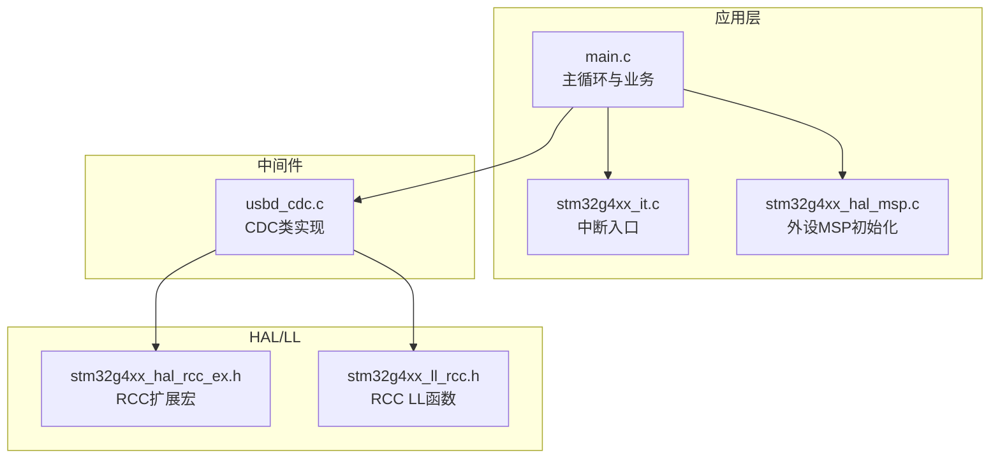
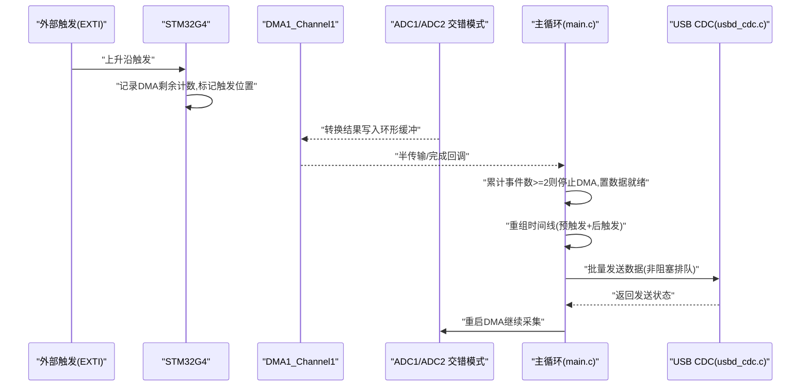
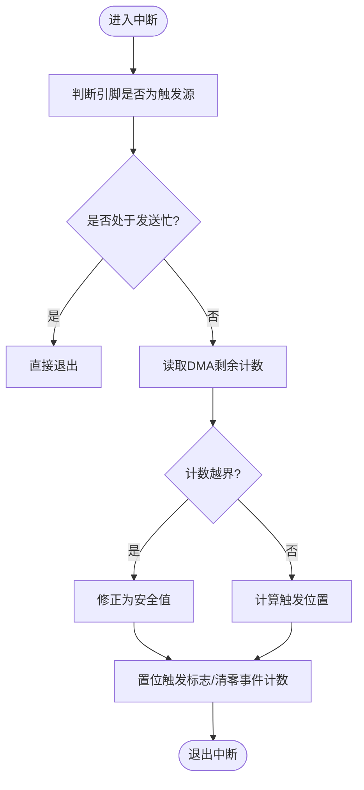
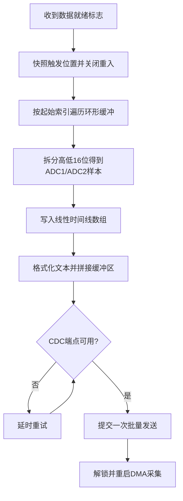
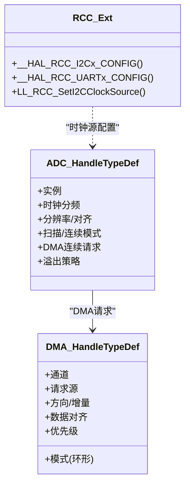
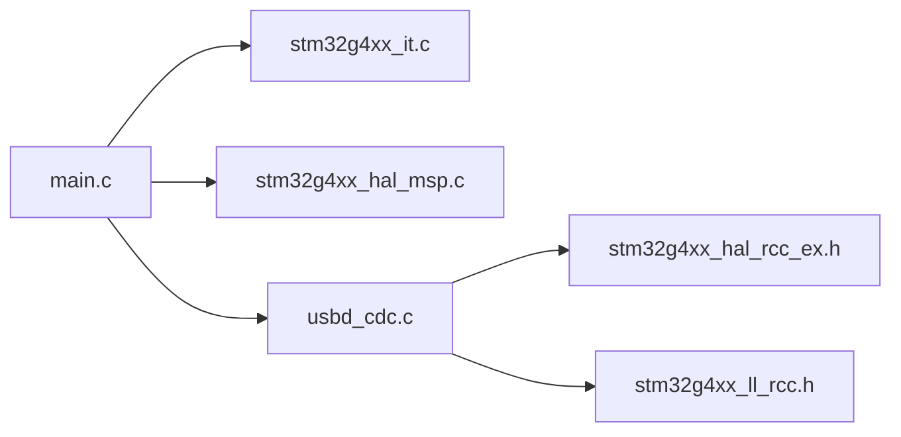

# 通信接口驱动模块

<cite>
**本文引用的文件**   
- [main.c](file://Core/Src/main.c)
- [main.h](file://Core/Inc/main.h)
- [stm32g4xx_hal_msp.c](file://Core/Src/stm32g4xx_hal_msp.c)
- [stm32g4xx_it.c](file://Core/Src/stm32g4xx_it.c)
- [usbd_cdc.c](file://Middlewares/ST/STM32_USB_Device_Library/Class/CDC/Src/usbd_cdc.c)
- [stm32g4xx_hal_rcc_ex.h](file://Drivers/STM32G4xx_HAL_Driver/Inc/stm32g4xx_hal_rcc_ex.h)
- [stm32g4xx_ll_rcc.h](file://Drivers/STM32G4xx_HAL_Driver/Inc/stm32g4xx_ll_rcc.h)
</cite>

## 目录
1. [简介](#简介)
2. [项目结构](#项目结构)
3. [核心组件](#核心组件)
4. [架构总览](#架构总览)
5. [详细组件分析](#详细组件分析)
6. [依赖关系分析](#依赖关系分析)
7. [性能与优化](#性能与优化)
8. [故障排查指南](#故障排查指南)
9. [结论](#结论)
10. [附录：USART/I2C/SPI 参考要点](#附录usarti2cspi-参考要点)

## 简介
本技术参考文档面向 STM32G4 系列微控制器的串行通信接口驱动，覆盖 USART、I2C、SPI 等常用协议。文档从系统架构、数据流、中断与 DMA 驱动方式入手，结合工程中的 USB CDC（虚拟串口）实现，给出异步/阻塞传输思路、时序与错误处理要点，并提供速率优化、抗干扰与调试技巧，帮助初学者快速入门，同时为高级开发者提供高性能应用开发指导。

## 项目结构
本项目采用 CubeMX 生成的标准工程结构，核心逻辑位于 Core 目录，HAL/LL 驱动位于 Drivers，USB CDC 中间件位于 Middlewares，设备层在 USB_Device。当前工程已启用 ADC+DMA 采集并通过 USB CDC 输出数据，可作为“串口调试”的现成通道。

图表来源
- [main.c:219-290](file://Core/Src/main.c#L219-L290)
- [stm32g4xx_it.c:205-228](file://Core/Src/stm32g4xx_it.c#L205-L228)
- [stm32g4xx_hal_msp.c:92-185](file://Core/Src/stm32g4xx_hal_msp.c#L92-L185)
- [usbd_cdc.c:22-47](file://Middlewares/ST/STM32_USB_Device_Library/Class/CDC/Src/usbd_cdc.c#L22-L47)
- [stm32g4xx_hal_rcc_ex.h:715-798](file://Drivers/STM32G4xx_HAL_Driver/Inc/stm32g4xx_hal_rcc_ex.h#L715-L798)
- [stm32g4xx_ll_rcc.h:1570-1822](file://Drivers/STM32G4xx_HAL_Driver/Inc/stm32g4xx_ll_rcc.h#L1570-L1822)

章节来源
- [main.c:219-290](file://Core/Src/main.c#L219-L290)
- [stm32g4xx_it.c:205-228](file://Core/Src/stm32g4xx_it.c#L205-L228)
- [stm32g4xx_hal_msp.c:92-185](file://Core/Src/stm32g4xx_hal_msp.c#L92-L185)
- [usbd_cdc.c:22-47](file://Middlewares/ST/STM32_USB_Device_Library/Class/CDC/Src/usbd_cdc.c#L22-L47)
- [stm32g4xx_hal_rcc_ex.h:715-798](file://Drivers/STM32G4xx_HAL_Driver/Inc/stm32g4xx_hal_rcc_ex.h#L715-L798)
- [stm32g4xx_ll_rcc.h:1570-1822](file://Drivers/STM32G4xx_HAL_Driver/Inc/stm32g4xx_ll_rcc.h#L1570-L1822)

## 核心组件
- 主程序与任务调度：主循环负责触发数据采集、重组时间线、通过 USB CDC 发送数据，并重启采集以等待下一次触发。
- 中断与回调：EXTI 捕获外部触发边沿；DMA 半传输/完成回调用于判定采集窗口结束；USB 低优先级中断处理 CDC 收发。
- 外设与时钟：ADC 双通道交错采样，DMA 环形缓冲；USB CDC 作为“虚拟串口”通道；RCC 宏/LL 提供 I2C/UART 时钟源配置能力。
- 数据路径：ADC→DMA→内存环形缓冲→主循环重组→USB CDC 批量发送。

章节来源
- [main.c:86-213](file://Core/Src/main.c#L86-L213)
- [stm32g4xx_it.c:205-228](file://Core/Src/stm32g4xx_it.c#L205-L228)
- [stm32g4xx_hal_msp.c:127-148](file://Core/Src/stm32g4xx_hal_msp.c#L127-L148)
- [usbd_cdc.c:22-47](file://Middlewares/ST/STM32_USB_Device_Library/Class/CDC/Src/usbd_cdc.c#L22-L47)

## 架构总览
下图展示从触发到数据输出的完整流程，体现中断、DMA 与 USB CDC 的协作关系。

图表来源
- [main.c:91-131](file://Core/Src/main.c#L91-L131)
- [main.c:156-213](file://Core/Src/main.c#L156-L213)
- [stm32g4xx_it.c:205-228](file://Core/Src/stm32g4xx_it.c#L205-L228)
- [usbd_cdc.c:22-47](file://Middlewares/ST/STM32_USB_Device_Library/Class/CDC/Src/usbd_cdc.c#L22-L47)

## 详细组件分析

### 中断与回调机制（EXTI/DMA/USB）
- EXTI 捕获外部触发，读取 DMA 剩余计数以确定环形缓冲中触发点，避免重复触发并在 UART 忙时忽略。
- DMA 半传输/完成回调累计事件，达到阈值后停止 DMA 并置数据就绪标志。
- USB 低优先级中断调用 HAL_PCD_IRQHandler 处理 CDC 端点事务。

图表来源
- [main.c:91-113](file://Core/Src/main.c#L91-L113)
- [main.c:119-131](file://Core/Src/main.c#L119-L131)
- [stm32g4xx_it.c:205-228](file://Core/Src/stm32g4xx_it.c#L205-L228)

章节来源
- [main.c:91-131](file://Core/Src/main.c#L91-L131)
- [stm32g4xx_it.c:205-228](file://Core/Src/stm32g4xx_it.c#L205-L228)

### 数据重组与发送（USB CDC 虚拟串口）
- 将环形缓冲按触发位置展开为线性时间线，偶数位为 ADC1，奇数位为 ADC2。
- 将样本序列转换为文本行，一次性打包并通过 CDC 发送，若端点满则轮询重试。

图表来源
- [main.c:156-213](file://Core/Src/main.c#L156-L213)
- [main.c:264-287](file://Core/Src/main.c#L264-L287)
- [usbd_cdc.c:22-47](file://Middlewares/ST/STM32_USB_Device_Library/Class/CDC/Src/usbd_cdc.c#L22-L47)

章节来源
- [main.c:156-213](file://Core/Src/main.c#L156-L213)
- [main.c:264-287](file://Core/Src/main.c#L264-L287)
- [usbd_cdc.c:22-47](file://Middlewares/ST/STM32_USB_Device_Library/Class/CDC/Src/usbd_cdc.c#L22-L47)

### 外设与时钟（ADC/DMA/RCC）
- ADC 双通道交错模式，DMA 环形模式，主循环启动/重启采集。
- DMA 通道映射至 ADC1，方向外设到内存，地址递增，字对齐。
- RCC 提供 I2C/UART 时钟源选择宏与 LL 函数，便于后续扩展 USART/I2C/SPI 驱动。

图表来源
- [stm32g4xx_hal_msp.c:127-148](file://Core/Src/stm32g4xx_hal_msp.c#L127-L148)
- [stm32g4xx_hal_rcc_ex.h:715-798](file://Drivers/STM32G4xx_HAL_Driver/Inc/stm32g4xx_hal_rcc_ex.h#L715-L798)
- [stm32g4xx_ll_rcc.h:1570-1822](file://Drivers/STM32G4xx_HAL_Driver/Inc/stm32g4xx_ll_rcc.h#L1570-L1822)

章节来源
- [stm32g4xx_hal_msp.c:92-185](file://Core/Src/stm32g4xx_hal_msp.c#L92-L185)
- [stm32g4xx_hal_rcc_ex.h:715-798](file://Drivers/STM32G4xx_HAL_Driver/Inc/stm32g4xx_hal_rcc_ex.h#L715-L798)
- [stm32g4xx_ll_rcc.h:1570-1822](file://Drivers/STM32G4xx_HAL_Driver/Inc/stm32g4xx_ll_rcc.h#L1570-L1822)

## 依赖关系分析
- main.c 依赖 HAL 初始化、USB CDC 发送、DMA/ADC 回调。
- stm32g4xx_it.c 暴露中断入口，转发至 HAL 层处理。
- stm32g4xx_hal_msp.c 完成 GPIO/时钟/DMA 绑定。
- usbd_cdc.c 提供 CDC 类能力，配合 USB 中断完成数据收发。
- RCC 宏/LL 为 I2C/UART 时钟源配置提供基础。

图表来源
- [main.c:219-290](file://Core/Src/main.c#L219-L290)
- [stm32g4xx_it.c:205-228](file://Core/Src/stm32g4xx_it.c#L205-L228)
- [stm32g4xx_hal_msp.c:92-185](file://Core/Src/stm32g4xx_hal_msp.c#L92-L185)
- [usbd_cdc.c:22-47](file://Middlewares/ST/STM32_USB_Device_Library/Class/CDC/Src/usbd_cdc.c#L22-L47)
- [stm32g4xx_hal_rcc_ex.h:715-798](file://Drivers/STM32G4xx_HAL_Driver/Inc/stm32g4xx_hal_rcc_ex.h#L715-L798)
- [stm32g4xx_ll_rcc.h:1570-1822](file://Drivers/STM32G4xx_HAL_Driver/Inc/stm32g4xx_ll_rcc.h#L1570-L1822)

章节来源
- [main.c:219-290](file://Core/Src/main.c#L219-L290)
- [stm32g4xx_it.c:205-228](file://Core/Src/stm32g4xx_it.c#L205-L228)
- [stm32g4xx_hal_msp.c:92-185](file://Core/Src/stm32g4xx_hal_msp.c#L92-L185)
- [usbd_cdc.c:22-47](file://Middlewares/ST/STM32_USB_Device_Library/Class/CDC/Src/usbd_cdc.c#L22-L47)
- [stm32g4xx_hal_rcc_ex.h:715-798](file://Drivers/STM32G4xx_HAL_Driver/Inc/stm32g4xx_hal_rcc_ex.h#L715-L798)
- [stm32g4xx_ll_rcc.h:1570-1822](file://Drivers/STM32G4xx_HAL_Driver/Inc/stm32g4xx_ll_rcc.h#L1570-L1822)

## 性能与优化
- 使用 DMA 环形缓冲与交错模式，降低 CPU 负载，提高吞吐。
- 批量打包数据再发送，减少 USB CDC 调用次数，提升带宽利用率。
- 在中断中仅做最小工作（记录位置、置标志），复杂处理移至主循环。
- 合理设置 DMA 优先级与 NVIC 优先级，避免高优先级抢占导致抖动。
- 对 I2C/USART 时钟源选择 PCLK/SYSCLK/HSI/LSE 时，需权衡精度与功耗。

[本节为通用建议，不直接分析具体文件]

## 故障排查指南
- 无数据输出：检查 USB CDC 枚举与端点状态；确认主循环是否进入发送分支；查看 CDC_Transmit_FS 返回值。
- 触发丢失或误触发：确认 EXTI 引脚配置与去抖；检查 uart_busy 保护逻辑；验证 DMA 剩余计数边界处理。
- 数据错乱：核对 DMA 数据对齐与地址增量；确认环形缓冲大小与触发位置计算；确保重组顺序正确。
- 系统卡死：检查 Error_Handler 与 HardFault 入口；确认中断未嵌套过深；必要时降低中断优先级。

章节来源
- [main.c:264-287](file://Core/Src/main.c#L264-L287)
- [main.c:91-113](file://Core/Src/main.c#L91-L113)
- [stm32g4xx_it.c:85-95](file://Core/Src/stm32g4xx_it.c#L85-L95)

## 结论
本模块以 DMA+中断为核心，结合 USB CDC 实现了稳定高效的“虚拟串口”调试通道。基于此框架，可平滑扩展到 USART、I2C、SPI 等通信场景，满足从入门到高性能应用的多样化需求。

[本节为总结性内容，不直接分析具体文件]

## 附录：USART/I2C/SPI 参考要点
- USART（含 UART）
  - 时钟源：可通过 RCC 宏配置 PCLK/SYSCLK/HSI/LSE 等来源，保证波特率精度。
  - 典型参数：数据位、停止位、校验位、硬件流控、过采样、单/双缓冲。
  - 传输方式：查询、中断、DMA；建议大数据量使用 DMA 环形缓冲。
  - 错误处理：帧错误、噪声错误、溢出/下溢；需在回调中清除标志并统计错误。
  - 参考：RCC 宏定义与 LL 函数可用于时钟源切换与查询。

- I2C
  - 时钟源：支持 PCLK/SYSCLK/HSI，需根据 SCL 频率与占空比要求选择。
  - 模式：主机/从机，快速/高速模式，ACK/NACK 控制，超时与仲裁丢失处理。
  - 传输方式：查询、中断、DMA；多字节建议使用 DMA 以降低 CPU 占用。
  - 错误处理：总线错误、ACK 失败、超时；建议在回调中复位总线并重试。

- SPI
  - 时钟极性/相位：CPOL/CPHA 四相组合，需与从设备匹配。
  - 数据宽度：8/16 位，MSB/LSB 优先；NSS 软件/硬件管理。
  - 传输方式：查询、中断、DMA；全双工注意 TX/RX 缓冲同步。
  - 错误处理： overrun、mode fault、CRC 错误（如启用）；必要时复位 SPI。

章节来源
- [stm32g4xx_hal_rcc_ex.h:715-798](file://Drivers/STM32G4xx_HAL_Driver/Inc/stm32g4xx_hal_rcc_ex.h#L715-L798)
- [stm32g4xx_ll_rcc.h:1570-1822](file://Drivers/STM32G4xx_HAL_Driver/Inc/stm32g4xx_ll_rcc.h#L1570-L1822)