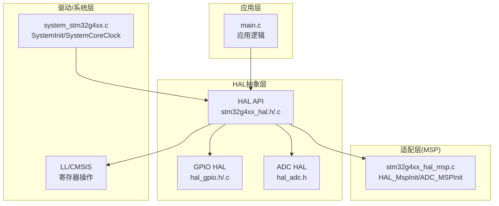
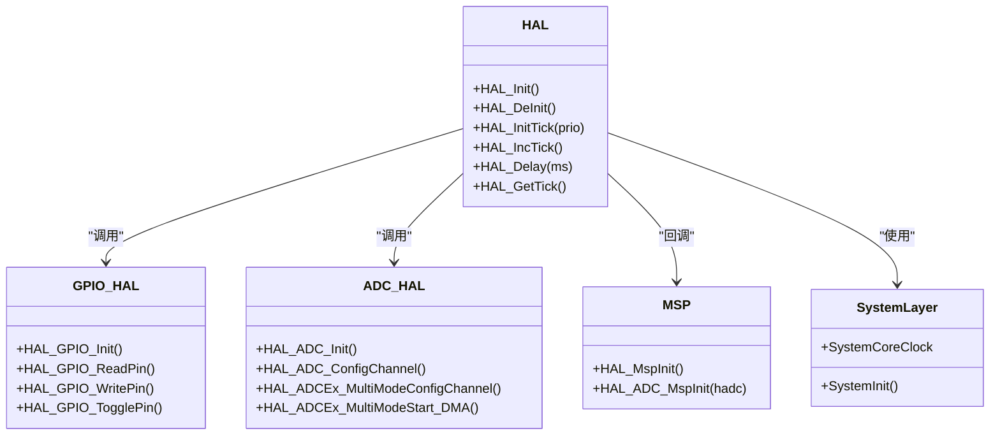
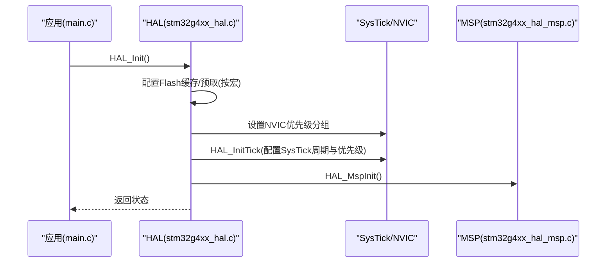
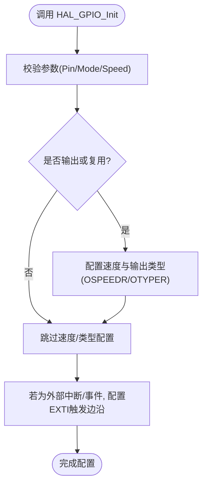
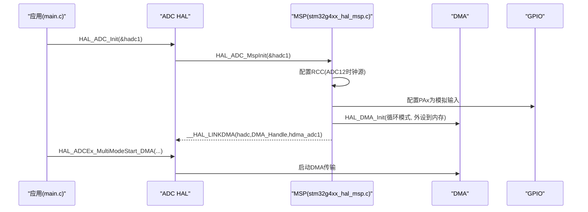
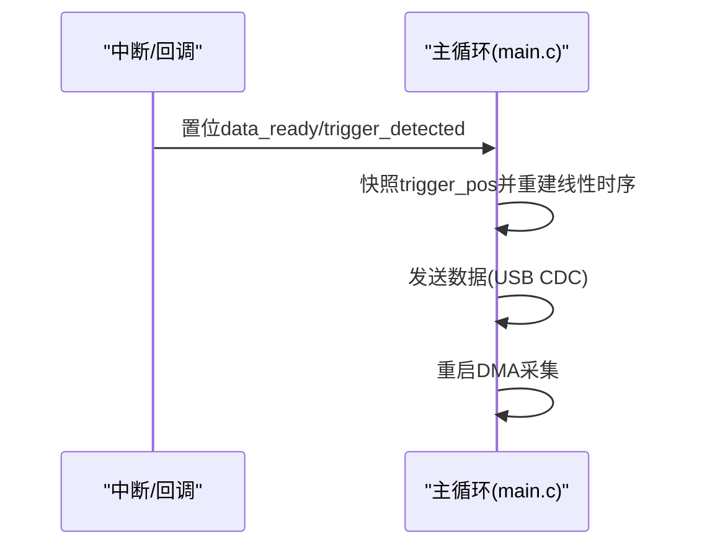
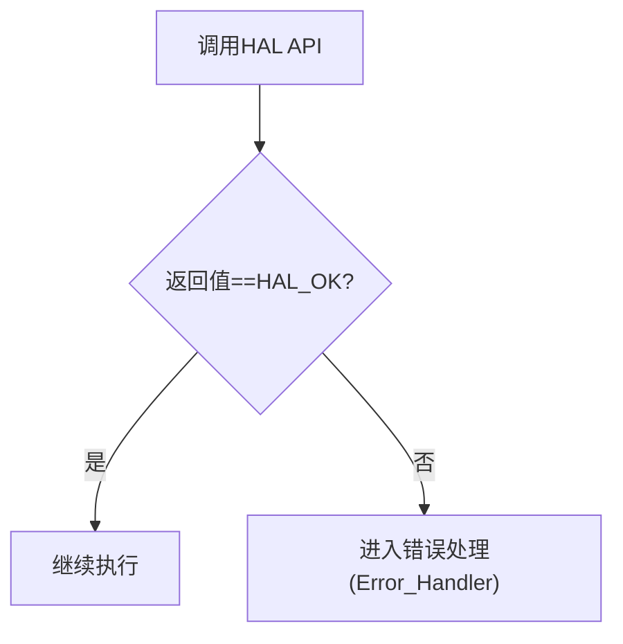
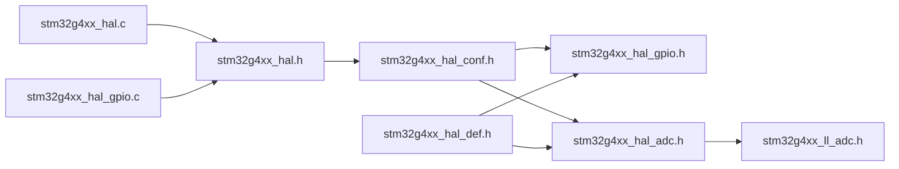

# HAL核心架构设计

<cite>
**本文引用的文件**   
- [main.c](file://Core/Src/main.c)
- [stm32g4xx_hal_conf.h](file://Core/Inc/stm32g4xx_hal_conf.h)
- [stm32g4xx_hal.h](file://Drivers/STM32G4xx_HAL_Driver/Inc/stm32g4xx_hal.h)
- [stm32g4xx_hal.c](file://Drivers/STM32G4xx_HAL_Driver/Src/stm32g4xx_hal.c)
- [stm32g4xx_hal_def.h](file://Drivers/STM32G4xx_HAL_Driver/Inc/stm32g4xx_hal_def.h)
- [stm32g4xx_hal_gpio.h](file://Drivers/STM32G4xx_HAL_Driver/Inc/stm32g4xx_hal_gpio.h)
- [stm32g4xx_hal_gpio.c](file://Drivers/STM32G4xx_HAL_Driver/Src/stm32g4xx_hal_gpio.c)
- [stm32g4xx_hal_adc.h](file://Drivers/STM32G4xx_HAL_Driver/Inc/stm32g4xx_hal_adc.h)
- [stm32g4xx_hal_msp.c](file://Core/Src/stm32g4xx_hal_msp.c)
- [system_stm32g4xx.c](file://Core/Src/system_stm32g4xx.c)
</cite>

## 目录
1. [引言](#引言)
2. [项目结构](#项目结构)
3. [核心组件](#核心组件)
4. [架构总览](#架构总览)
5. [详细组件分析](#详细组件分析)
6. [依赖关系分析](#依赖关系分析)
7. [性能与实时性考虑](#性能与实时性考虑)
8. [故障排查指南](#故障排查指南)
9. [结论](#结论)
10. [附录：配置宏与编译选项](#附录配置宏与编译选项)

## 引言
本文件面向初学者与高级开发者，系统阐述STM32 HAL驱动库的核心架构与设计理念。重点包括：
- 分层设计理念：抽象层（HAL）、适配层（MSP）、驱动层（LL/CMSIS）的职责分离
- 模块组织方式、接口设计规范、错误处理机制与回调体系
- HAL_Init()初始化流程与各子系统启动顺序
- 应用层如何通过统一接口访问底层硬件
- 配置宏定义的作用与编译时裁剪策略
- 架构图与交互图，帮助理解数据流与控制流

## 项目结构
本项目采用CubeMX生成的标准工程布局，关键目录与职责如下：
- Core/Src 与 Core/Inc：用户应用入口、系统初始化、MSP适配实现、中断服务函数等
- Drivers/STM32G4xx_HAL_Driver：HAL驱动源码与头文件，包含各外设的HAL API与公共定义
- CMSIS：内核寄存器访问与系统级基础支持
- Middlewares/USB_Device_Library：USB设备栈（与本主题相关度较低）

图表来源
- [main.c:219-290](file://Core/Src/main.c#L219-L290)
- [stm32g4xx_hal.h:525-553](file://Drivers/STM32G4xx_HAL_Driver/Inc/stm32g4xx_hal.h#L525-L553)
- [stm32g4xx_hal.c:148-185](file://Drivers/STM32G4xx_HAL_Driver/Src/stm32g4xx_hal.c#L148-L185)
- [stm32g4xx_hal_gpio.h:47-63](file://Drivers/STM32G4xx_HAL_Driver/Inc/stm32g4xx_hal_gpio.h#L47-L63)
- [stm32g4xx_hal_gpio.c:162-200](file://Drivers/STM32G4xx_HAL_Driver/Src/stm32g4xx_hal_gpio.c#L162-L200)
- [stm32g4xx_hal_adc.h:90-200](file://Drivers/STM32G4xx_HAL_Driver/Inc/stm32g4xx_hal_adc.h#L90-L200)
- [stm32g4xx_hal_msp.c:63-82](file://Core/Src/stm32g4xx_hal_msp.c#L63-L82)
- [system_stm32g4xx.c:181-192](file://Core/Src/system_stm32g4xx.c#L181-L192)

章节来源
- [main.c:219-290](file://Core/Src/main.c#L219-L290)
- [stm32g4xx_hal.h:525-553](file://Drivers/STM32G4xx_HAL_Driver/Inc/stm32g4xx_hal.h#L525-L553)
- [stm32g4xx_hal.c:148-185](file://Drivers/STM32G4xx_HAL_Driver/Src/stm32g4xx_hal.c#L148-L185)
- [stm32g4xx_hal_gpio.h:47-63](file://Drivers/STM32G4xx_HAL_Driver/Inc/stm32g4xx_hal_gpio.h#L47-L63)
- [stm32g4xx_hal_gpio.c:162-200](file://Drivers/STM32G4xx_HAL_Driver/Src/stm32g4xx_hal_gpio.c#L162-L200)
- [stm32g4xx_hal_adc.h:90-200](file://Drivers/STM32G4xx_HAL_Driver/Inc/stm32g4xx_hal_adc.h#L90-L200)
- [stm32g4xx_hal_msp.c:63-82](file://Core/Src/stm32g4xx_hal_msp.c#L63-L82)
- [system_stm32g4xx.c:181-192](file://Core/Src/system_stm32g4xx.c#L181-L192)

## 核心组件
- HAL公共接口与时间基准
  - HAL_Init()/HAL_DeInit()：完成Flash缓存/预取、NVIC优先级分组、SysTick时基与MSP初始化
  - HAL_IncTick/HAL_Delay/HAL_GetTick：基于SysTick的时间基准与延时
- 外设HAL模块
  - GPIO HAL：提供引脚模式、速度、上下拉、外部中断等配置与读写API
  - ADC HAL：提供多通道、扫描、DMA、过采样、多模等配置与转换控制API
- 适配层MSP
  - HAL_MspInit：系统级时钟、电源、中断分组等全局资源初始化
  - HAL_ADC_MspInit：为具体ADC实例配置RCC时钟、GPIO模拟输入、DMA及句柄关联
- 驱动/系统层
  - system_stm32g4xx.c：SystemInit设置FPU、向量表位置；SystemCoreClock维护核心时钟
  - LL/CMSIS：直接寄存器访问，被HAL/MSP调用

章节来源
- [stm32g4xx_hal.h:525-553](file://Drivers/STM32G4xx_HAL_Driver/Inc/stm32g4xx_hal.h#L525-L553)
- [stm32g4xx_hal.c:148-185](file://Drivers/STM32G4xx_HAL_Driver/Src/stm32g4xx_hal.c#L148-L185)
- [stm32g4xx_hal.c:322-414](file://Drivers/STM32G4xx_HAL_Driver/Src/stm32g4xx_hal.c#L322-L414)
- [stm32g4xx_hal_gpio.h:47-63](file://Drivers/STM32G4xx_HAL_Driver/Inc/stm32g4xx_hal_gpio.h#L47-L63)
- [stm32g4xx_hal_gpio.c:162-200](file://Drivers/STM32G4xx_HAL_Driver/Src/stm32g4xx_hal_gpio.c#L162-L200)
- [stm32g4xx_hal_adc.h:90-200](file://Drivers/STM32G4xx_HAL_Driver/Inc/stm32g4xx_hal_adc.h#L90-L200)
- [stm32g4xx_hal_msp.c:63-82](file://Core/Src/stm32g4xx_hal_msp.c#L63-L82)
- [stm32g4xx_hal_msp.c:92-185](file://Core/Src/stm32g4xx_hal_msp.c#L92-L185)
- [system_stm32g4xx.c:181-192](file://Core/Src/system_stm32g4xx.c#L181-L192)

## 架构总览
HAL采用“三层分离”的分层架构：
- 抽象层（HAL）：对外暴露统一的API与句柄模型，屏蔽不同系列差异
- 适配层（MSP）：将HAL与具体板级资源（时钟、GPIO、DMA、中断）解耦，便于移植
- 驱动/系统层（LL/CMSIS）：直接操作寄存器，提供最小化、高性能的底层能力

图表来源
- [stm32g4xx_hal.h:525-553](file://Drivers/STM32G4xx_HAL_Driver/Inc/stm32g4xx_hal.h#L525-L553)
- [stm32g4xx_hal.c:148-185](file://Drivers/STM32G4xx_HAL_Driver/Src/stm32g4xx_hal.c#L148-L185)
- [stm32g4xx_hal_gpio.h:47-63](file://Drivers/STM32G4xx_HAL_Driver/Inc/stm32g4xx_hal_gpio.h#L47-L63)
- [stm32g4xx_hal_gpio.c:162-200](file://Drivers/STM32G4xx_HAL_Driver/Src/stm32g4xx_hal_gpio.c#L162-L200)
- [stm32g4xx_hal_adc.h:90-200](file://Drivers/STM32G4xx_HAL_Driver/Inc/stm32g4xx_hal_adc.h#L90-L200)
- [stm32g4xx_hal_msp.c:63-82](file://Core/Src/stm32g4xx_hal_msp.c#L63-L82)
- [stm32g4xx_hal_msp.c:92-185](file://Core/Src/stm32g4xx_hal_msp.c#L92-L185)
- [system_stm32g4xx.c:181-192](file://Core/Src/system_stm32g4xx.c#L181-L192)

## 详细组件分析

### HAL_Init()初始化流程与时序
HAL_Init()负责系统级基础初始化，典型顺序如下：
- 根据配置宏启用/禁用指令缓存、数据缓存与预取缓冲
- 设置NVIC优先级分组
- 初始化SysTick作为1ms时基（可配置频率），并设置其优先级
- 调用弱函数HAL_MspInit()进行平台级初始化

图表来源
- [stm32g4xx_hal.c:148-185](file://Drivers/STM32G4xx_HAL_Driver/Src/stm32g4xx_hal.c#L148-L185)
- [stm32g4xx_hal.c:255-287](file://Drivers/STM32G4xx_HAL_Driver/Src/stm32g4xx_hal.c#L255-L287)
- [stm32g4xx_hal_msp.c:63-82](file://Core/Src/stm32g4xx_hal_msp.c#L63-L82)
- [main.c:229-236](file://Core/Src/main.c#L229-L236)

章节来源
- [stm32g4xx_hal.c:148-185](file://Drivers/STM32G4xx_HAL_Driver/Src/stm32g4xx_hal.c#L148-L185)
- [stm32g4xx_hal.c:255-287](file://Drivers/STM32G4xx_HAL_Driver/Src/stm32g4xx_hal.c#L255-L287)
- [stm32g4xx_hal_msp.c:63-82](file://Core/Src/stm32g4xx_hal_msp.c#L63-L82)
- [main.c:229-236](file://Core/Src/main.c#L229-L236)

### 外设HAL模块：GPIO
- 初始化结构体GPIO_InitTypeDef定义了Pin/Mode/Pull/Speed/Alternate等字段
- HAL_GPIO_Init()依据参数配置OSPEEDR/OTYPER/AFR等寄存器，支持输入、输出、复用、模拟、外部中断/事件模式
- 提供读取/写入/翻转等便捷API

图表来源
- [stm32g4xx_hal_gpio.h:47-63](file://Drivers/STM32G4xx_HAL_Driver/Inc/stm32g4xx_hal_gpio.h#L47-L63)
- [stm32g4xx_hal_gpio.c:162-200](file://Drivers/STM32G4xx_HAL_Driver/Src/stm32g4xx_hal_gpio.c#L162-L200)

章节来源
- [stm32g4xx_hal_gpio.h:47-63](file://Drivers/STM32G4xx_HAL_Driver/Inc/stm32g4xx_hal_gpio.h#L47-L63)
- [stm32g4xx_hal_gpio.c:162-200](file://Drivers/STM32G4xx_HAL_Driver/Src/stm32g4xx_hal_gpio.c#L162-L200)

### 外设HAL模块：ADC与MSP适配
- ADC HAL通过ADC_HandleTypeDef管理实例状态与配置，支持多模、DMA、过采样等
- MSP在HAL_ADC_MspInit中完成：
  - RCC时钟选择与使能（如ADC12由PLL提供）
  - GPIO配置为模拟输入
  - DMA初始化并链接到ADC句柄
  - 计数引用确保多实例安全共享时钟

图表来源
- [stm32g4xx_hal_adc.h:90-200](file://Drivers/STM32G4xx_HAL_Driver/Inc/stm32g4xx_hal_adc.h#L90-L200)
- [stm32g4xx_hal_msp.c:92-185](file://Core/Src/stm32g4xx_hal_msp.c#L92-L185)
- [stm32g4xx_hal_def.h:62-66](file://Drivers/STM32G4xx_HAL_Driver/Inc/stm32g4xx_hal_def.h#L62-L66)
- [main.c:244-255](file://Core/Src/main.c#L244-L255)

章节来源
- [stm32g4xx_hal_adc.h:90-200](file://Drivers/STM32G4xx_HAL_Driver/Inc/stm32g4xx_hal_adc.h#L90-L200)
- [stm32g4xx_hal_msp.c:92-185](file://Core/Src/stm32g4xx_hal_msp.c#L92-L185)
- [stm32g4xx_hal_def.h:62-66](file://Drivers/STM32G4xx_HAL_Driver/Inc/stm32g4xx_hal_def.h#L62-L66)
- [main.c:244-255](file://Core/Src/main.c#L244-L255)

### 回调函数体系与中断处理
- HAL采用弱函数回调机制，允许用户在应用中覆盖默认行为
- 常见回调：
  - HAL_MspInit/HAL_MspDeInit：平台级初始化/反初始化
  - HAL_ADC_ConvHalfCpltCallback/HAL_ADC_ConvCpltCallback：DMA半满/完成回调
  - HAL_GPIO_EXTI_Callback：外部中断回调
- 在项目中，主循环等待标志位，ISR仅做最小化处理，保证实时性与稳定性

图表来源
- [main.c:91-149](file://Core/Src/main.c#L91-L149)
- [main.c:259-289](file://Core/Src/main.c#L259-L289)

章节来源
- [main.c:91-149](file://Core/Src/main.c#L91-L149)
- [main.c:259-289](file://Core/Src/main.c#L259-L289)

### 错误处理机制
- HAL普遍返回HAL_StatusTypeDef（OK/ERROR/BUSY/TIMEOUT）
- 应用侧需检查返回值并在失败路径调用Error_Handler()
- assert_param用于参数校验（可通过宏开关启用）

图表来源
- [stm32g4xx_hal_def.h:38-44](file://Drivers/STM32G4xx_HAL_Driver/Inc/stm32g4xx_hal_def.h#L38-L44)
- [main.c:250-255](file://Core/Src/main.c#L250-L255)
- [main.c:530-539](file://Core/Src/main.c#L530-L539)

章节来源
- [stm32g4xx_hal_def.h:38-44](file://Drivers/STM32G4xx_HAL_Driver/Inc/stm32g4xx_hal_def.h#L38-L44)
- [main.c:250-255](file://Core/Src/main.c#L250-L255)
- [main.c:530-539](file://Core/Src/main.c#L530-L539)

## 依赖关系分析
- 头文件包含关系
  - stm32g4xx_hal.h包含stm32g4xx_hal_conf.h，后者按宏条件包含各模块头文件
  - 各模块头文件包含stm32g4xx_hal_def.h以获取公共类型与宏
- 运行时依赖
  - HAL依赖CMSIS内核寄存器与NVIC/SysTick
  - HAL依赖MSP提供的平台级初始化
  - 外设HAL依赖LL/CMSIS进行寄存器操作

图表来源
- [stm32g4xx_hal.h:29](file://Drivers/STM32G4xx_HAL_Driver/Inc/stm32g4xx_hal.h#L29)
- [stm32g4xx_hal_conf.h:211-357](file://Core/Inc/stm32g4xx_hal_conf.h#L211-L357)
- [stm32g4xx_hal_def.h:28-31](file://Drivers/STM32G4xx_HAL_Driver/Inc/stm32g4xx_hal_def.h#L28-L31)
- [stm32g4xx_hal.c:35](file://Drivers/STM32G4xx_HAL_Driver/Src/stm32g4xx_hal.c#L35)
- [stm32g4xx_hal_gpio.c:106](file://Drivers/STM32G4xx_HAL_Driver/Src/stm32g4xx_hal_gpio.c#L106)
- [stm32g4xx_hal_adc.h:31](file://Drivers/STM32G4xx_HAL_Driver/Inc/stm32g4xx_hal_adc.h#L31)

章节来源
- [stm32g4xx_hal.h:29](file://Drivers/STM32G4xx_HAL_Driver/Inc/stm32g4xx_hal.h#L29)
- [stm32g4xx_hal_conf.h:211-357](file://Core/Inc/stm32g4xx_hal_conf.h#L211-L357)
- [stm32g4xx_hal_def.h:28-31](file://Drivers/STM32G4xx_HAL_Driver/Inc/stm32g4xx_hal_def.h#L28-L31)
- [stm32g4xx_hal.c:35](file://Drivers/STM32G4xx_HAL_Driver/Src/stm32g4xx_hal.c#L35)
- [stm32g4xx_hal_gpio.c:106](file://Drivers/STM32G4xx_HAL_Driver/Src/stm32g4xx_hal_gpio.c#L106)
- [stm32g4xx_hal_adc.h:31](file://Drivers/STM32G4xx_HAL_Driver/Inc/stm32g4xx_hal_adc.h#L31)

## 性能与实时性考虑
- 时基与延时
  - HAL_Delay基于SysTick轮询，避免在中断中使用长延时
  - 可通过HAL_SetTickFreq调整tick频率，但需注意精度与开销权衡
- 中断与回调
  - 中断服务函数应保持短小，仅更新标志或最小数据处理
  - 主循环负责耗时任务（如数据打包、通信发送）
- DMA与环形缓冲
  - 使用DMA循环模式降低CPU负载，结合半满/完成回调保障数据完整性
- 缓存与预取
  - 合理开启指令/数据缓存与预取以提升性能，注意一致性要求

[本节为通用指导，不直接分析具体文件]

## 故障排查指南
- 常见问题定位
  - HAL_Init失败：检查NVIC优先级分组与SysTick配置是否正确
  - ADC无数据：确认MSP中RCC/GPIO/DMA配置与句柄链接
  - 中断未触发：检查GPIO模式、EXTI配置与NVIC优先级
- 调试建议
  - 启用assert_param以便尽早发现参数错误
  - 使用LED或串口打印关键路径状态
  - 利用调试冻结功能在STOP/SLEEP模式下保持调试

章节来源
- [stm32g4xx_hal_conf.h:360-374](file://Core/Inc/stm32g4xx_hal_conf.h#L360-L374)
- [main.c:530-539](file://Core/Src/main.c#L530-L539)
- [stm32g4xx_hal_msp.c:92-185](file://Core/Src/stm32g4xx_hal_msp.c#L92-L185)

## 结论
HAL通过清晰的三层架构与弱函数回调机制，实现了高内聚、低耦合的可移植外设驱动框架。应用层只需关注业务逻辑，借助统一API即可访问底层硬件；MSP将平台差异隔离；LL/CMSIS提供高效寄存器操作。配合合理的配置宏与错误处理策略，可在保证实时性的同时提升开发效率与代码质量。

[本节为总结，不直接分析具体文件]

## 附录：配置宏与编译选项
- 模块裁剪
  - 在stm32g4xx_hal_conf.h中通过HAL_xxx_MODULE_ENABLED宏启用/禁用对应模块，减少体积
- 回调注册
  - USE_HAL_xxx_REGISTER_CALLBACKS宏控制是否启用动态回调注册（当前示例未启用）
- 振荡器与时钟值
  - HSE_VALUE/HSI_VALUE/HSI48_VALUE/LSE_VALUE等影响RCC计算与外设时钟
- 系统配置
  - VDD_VALUE、TICK_INT_PRIORITY、USE_RTOS、PREFETCH_ENABLE、INSTRUCTION_CACHE_ENABLE、DATA_CACHE_ENABLE
- 断言
  - USE_FULL_ASSERT启用assert_param，便于参数校验与问题定位

章节来源
- [stm32g4xx_hal_conf.h:37-75](file://Core/Inc/stm32g4xx_hal_conf.h#L37-L75)
- [stm32g4xx_hal_conf.h:77-109](file://Core/Inc/stm32g4xx_hal_conf.h#L77-L109)
- [stm32g4xx_hal_conf.h:117-176](file://Core/Inc/stm32g4xx_hal_conf.h#L117-L176)
- [stm32g4xx_hal_conf.h:183-188](file://Core/Inc/stm32g4xx_hal_conf.h#L183-L188)
- [stm32g4xx_hal_conf.h:360-374](file://Core/Inc/stm32g4xx_hal_conf.h#L360-L374)