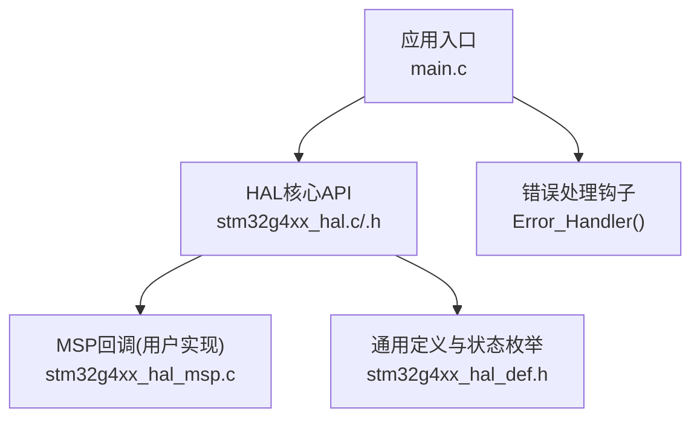
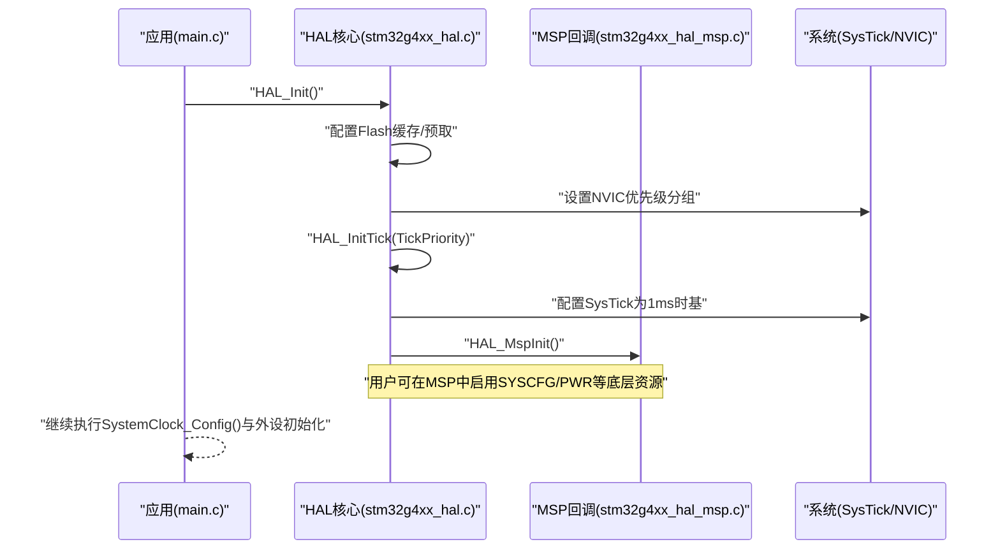
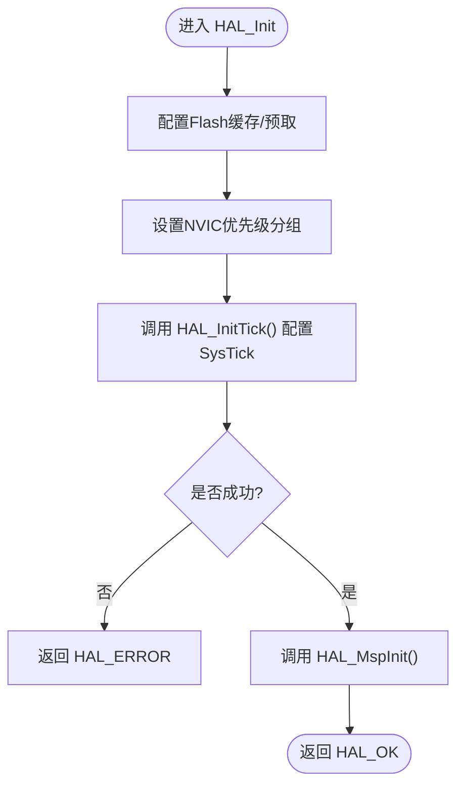
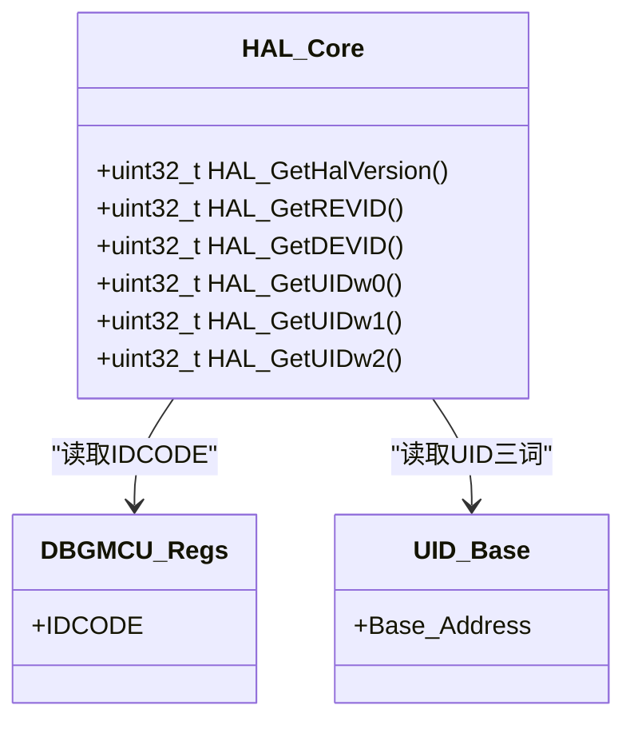
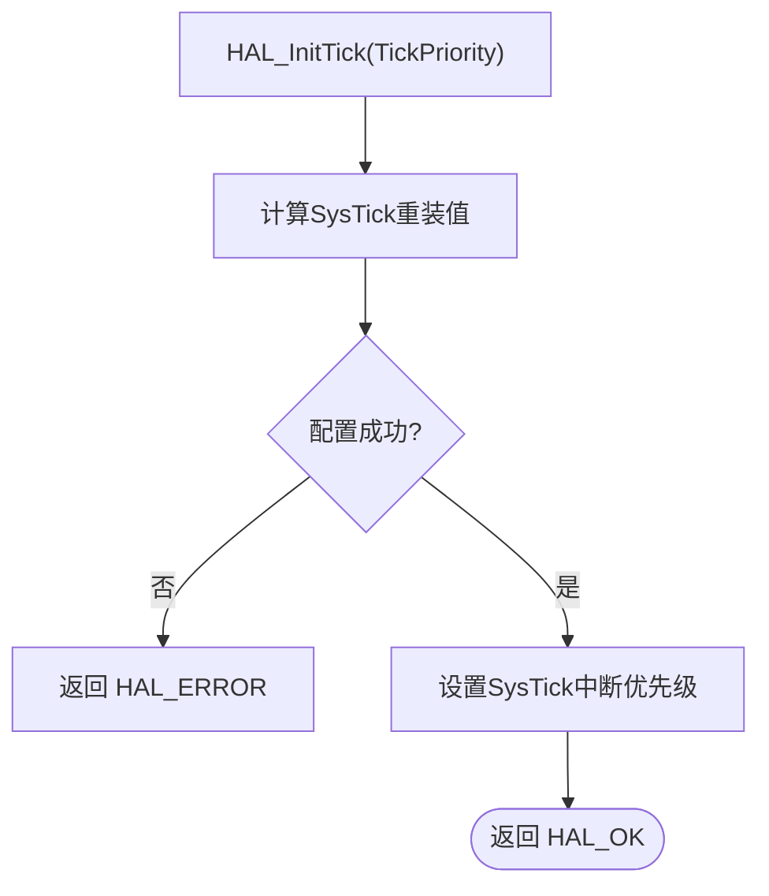
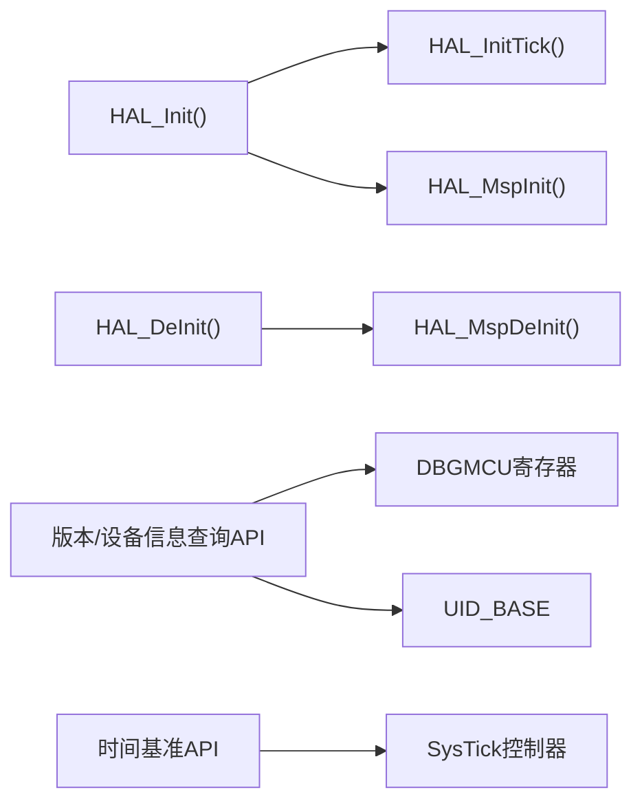

# HAL核心API接口

<cite>
**本文引用的文件**   
- [main.c](file://Core/Src/main.c)
- [stm32g4xx_hal.h](file://Drivers/STM32G4xx_HAL_Driver/Inc/stm32g4xx_hal.h)
- [stm32g4xx_hal.c](file://Drivers/STM32G4xx_HAL_Driver/Src/stm32g4xx_hal.c)
- [stm32g4xx_hal_def.h](file://Drivers/STM32G4xx_HAL_Driver/Inc/stm32g4xx_hal_def.h)
- [stm32g4xx_hal_msp.c](file://Core/Src/stm32g4xx_hal_msp.c)
- [main.h](file://Core/Inc/main.h)
</cite>

## 目录
1. [简介](#简介)
2. [项目结构](#项目结构)
3. [核心组件](#核心组件)
4. [架构总览](#架构总览)
5. [详细组件分析](#详细组件分析)
6. [依赖关系分析](#依赖关系分析)
7. [性能与使用建议](#性能与使用建议)
8. [故障排查指南](#故障排查指南)
9. [结论](#结论)
10. [附录：初学者入门与高级扩展](#附录初学者入门与高级扩展)

## 简介
本文件面向STM32G4系列HAL库的核心API，聚焦系统初始化与管理、版本与芯片信息查询、以及MSP（硬件抽象层）回调机制。文档以仓库中的实际实现为依据，提供函数调用时机、返回值类型与错误码说明、最佳实践和可扩展点，帮助初学者快速上手，并为高级开发者提供二次开发与定制指导。

## 项目结构
本项目采用CubeMX生成的标准分层结构：
- Core/Src/main.c：应用入口，包含系统初始化、外设初始化与主循环逻辑。
- Drivers/STM32G4xx_HAL_Driver：HAL驱动源码与头文件，包含HAL核心API定义与实现。
- Core/Src/stm32g4xx_hal_msp.c：用户可重写的MSP回调实现，用于底层时钟、GPIO、DMA等具体资源初始化。

图表来源
- [main.c:219-290](file://Core/Src/main.c#L219-L290)
- [stm32g4xx_hal.h:524-553](file://Drivers/STM32G4xx_HAL_Driver/Inc/stm32g4xx_hal.h#L524-L553)
- [stm32g4xx_hal.c:148-215](file://Drivers/STM32G4xx_HAL_Driver/Src/stm32g4xx_hal.c#L148-L215)
- [stm32g4xx_hal_msp.c:63-82](file://Core/Src/stm32g4xx_hal_msp.c#L63-L82)
- [stm32g4xx_hal_def.h:38-44](file://Drivers/STM32G4xx_HAL_Driver/Inc/stm32g4xx_hal_def.h#L38-L44)

章节来源
- [main.c:219-290](file://Core/Src/main.c#L219-L290)
- [stm32g4xx_hal.h:524-553](file://Drivers/STM32G4xx_HAL_Driver/Inc/stm32g4xx_hal.h#L524-L553)
- [stm32g4xx_hal.c:148-215](file://Drivers/STM32G4xx_HAL_Driver/Src/stm32g4xx_hal.c#L148-L215)
- [stm32g4xx_hal_msp.c:63-82](file://Core/Src/stm32g4xx_hal_msp.c#L63-L82)
- [stm32g4xx_hal_def.h:38-44](file://Drivers/STM32G4xx_HAL_Driver/Inc/stm32g4xx_hal_def.h#L38-L44)

## 核心组件
- HAL_Init()：系统级初始化，配置Flash缓存/预取、NVIC优先级分组、SysTick时基，并调用MSP初始化回调。
- HAL_DeInit()：反初始化公共部分，复位所有外设总线，并调用MSP反初始化回调。
- HAL_MspInit()/HAL_MspDeInit()：弱引用回调，供用户在stm32g4xx_hal_msp.c中重写，完成底层时钟、中断、GPIO等具体资源初始化。
- 版本与设备信息查询：
  - HAL_GetHalVersion()：返回HAL驱动版本号。
  - HAL_GetREVID()：读取设备修订ID。
  - HAL_GetDEVID()：读取设备ID。
  - HAL_GetUIDw0()/HAL_GetUIDw1()/HAL_GetUIDw2()：读取96位唯一标识符的三个字。
- 时间基准与控制：
  - HAL_InitTick()：配置SysTick为1ms时基，设置中断优先级。
  - HAL_IncTick()/HAL_GetTick()/HAL_Delay()：tick递增、获取tick值、阻塞延时。
  - HAL_SuspendTick()/HAL_ResumeTick()：挂起/恢复tick中断。
  - HAL_SetTickFreq()/HAL_GetTickFreq()：设置/查询tick频率。

章节来源
- [stm32g4xx_hal.h:524-553](file://Drivers/STM32G4xx_HAL_Driver/Inc/stm32g4xx_hal.h#L524-L553)
- [stm32g4xx_hal.c:148-215](file://Drivers/STM32G4xx_HAL_Driver/Src/stm32g4xx_hal.c#L148-L215)
- [stm32g4xx_hal.c:255-287](file://Drivers/STM32G4xx_HAL_Driver/Src/stm32g4xx_hal.c#L255-L287)
- [stm32g4xx_hal.c:322-446](file://Drivers/STM32G4xx_HAL_Driver/Src/stm32g4xx_hal.c#L322-L446)
- [stm32g4xx_hal.c:452-500](file://Drivers/STM32G4xx_HAL_Driver/Src/stm32g4xx_hal.c#L452-L500)

## 架构总览
下图展示了从应用入口到HAL核心API及MSP回调的调用链，以及关键控制流。

图表来源
- [main.c:229-236](file://Core/Src/main.c#L229-L236)
- [stm32g4xx_hal.c:148-185](file://Drivers/STM32G4xx_HAL_Driver/Src/stm32g4xx_hal.c#L148-L185)
- [stm32g4xx_hal.c:255-287](file://Drivers/STM32G4xx_HAL_Driver/Src/stm32g4xx_hal.c#L255-L287)
- [stm32g4xx_hal_msp.c:63-82](file://Core/Src/stm32g4xx_hal_msp.c#L63-L82)

## 详细组件分析

### HAL_Init() 系统初始化
- 功能要点：
  - 配置Flash指令缓存、数据缓存与预取缓冲（依据编译期宏）。
  - 设置NVIC优先级分组。
  - 通过HAL_InitTick()配置SysTick为1ms时基，并设置其优先级。
  - 调用HAL_MspInit()进行底层硬件初始化。
- 返回值：
  - HAL_OK：成功。
  - HAL_ERROR：若HAL_InitTick失败则返回错误。
- 典型调用位置：
  - main()起始处，在SystemClock_Config()之前。

图表来源
- [stm32g4xx_hal.c:148-185](file://Drivers/STM32G4xx_HAL_Driver/Src/stm32g4xx_hal.c#L148-L185)
- [stm32g4xx_hal.c:255-287](file://Drivers/STM32G4xx_HAL_Driver/Src/stm32g4xx_hal.c#L255-L287)

章节来源
- [stm32g4xx_hal.c:148-185](file://Drivers/STM32G4xx_HAL_Driver/Src/stm32g4xx_hal.c#L148-L185)
- [main.c:229-236](file://Core/Src/main.c#L229-L236)

### HAL_DeInit() 系统反初始化
- 功能要点：
  - 对APB1/APB2/AHB1/AHB2/AHB3总线执行强制复位与释放复位。
  - 调用HAL_MspDeInit()进行底层反初始化。
- 返回值：
  - 始终返回HAL_OK（该函数为可选）。
- 适用场景：
  - 运行时需要完全重置HAL公共部分（较少使用），或用于特殊重启流程。

章节来源
- [stm32g4xx_hal.c:192-215](file://Drivers/STM32G4xx_HAL_Driver/Src/stm32g4xx_hal.c#L192-L215)

### HAL_MspInit()/HAL_MspDeInit() 硬件抽象层初始化
- 设计模式：
  - 在HAL库中以__weak形式声明，允许用户在stm32g4xx_hal_msp.c中覆盖实现。
- 常见用途：
  - 使能SYSCFG、PWR等系统模块时钟。
  - 配置死电池引脚上拉、禁用UCPD死电池功能等。
  - 作为各外设MSP回调（如HAL_ADC_MspInit）的统一入口。
- 注意：
  - 不要修改HAL库中的弱函数原型；应在用户文件中实现同名函数以覆盖默认行为。

章节来源
- [stm32g4xx_hal.c:221-237](file://Drivers/STM32G4xx_HAL_Driver/Src/stm32g4xx_hal.c#L221-L237)
- [stm32g4xx_hal_msp.c:63-82](file://Core/Src/stm32g4xx_hal_msp.c#L63-L82)

### 版本与设备信息查询API
- HAL_GetHalVersion()：
  - 返回HAL驱动版本号，格式为0xXYZR（主/次/修订/候选）。
- HAL_GetREVID()：
  - 从DBGMCU->IDCODE寄存器提取修订ID。
- HAL_GetDEVID()：
  - 从DBGMCU->IDCODE寄存器提取设备ID。
- HAL_GetUIDw0()/HAL_GetUIDw1()/HAL_GetUIDw2()：
  - 从UID_BASE地址读取96位唯一标识符的三个32位字。

图表来源
- [stm32g4xx_hal.c:452-500](file://Drivers/STM32G4xx_HAL_Driver/Src/stm32g4xx_hal.c#L452-L500)

章节来源
- [stm32g4xx_hal.c:452-500](file://Drivers/STM32G4xx_HAL_Driver/Src/stm32g4xx_hal.c#L452-L500)

### 时间基准与控制API
- HAL_InitTick(TickPriority)：
  - 基于当前SystemCoreClock与uwTickFreq计算SysTick重装值，配置1ms时基。
  - 设置SysTick中断优先级，记录uwTickPrio。
  - 若参数无效或配置失败，返回HAL_ERROR。
- HAL_IncTick()/HAL_GetTick()/HAL_Delay()：
  - HAL_IncTick()由SysTick ISR调用，累加全局uwTick。
  - HAL_GetTick()返回当前tick值。
  - HAL_Delay()基于tick差值实现阻塞延时。
- HAL_SuspendTick()/HAL_ResumeTick()：
  - 关闭/开启SysTick中断，暂停/恢复tick计数。
- HAL_SetTickFreq()/HAL_GetTickFreq()：
  - 动态调整tick频率（需重新配置SysTick），失败时回滚。

图表来源
- [stm32g4xx_hal.c:255-287](file://Drivers/STM32G4xx_HAL_Driver/Src/stm32g4xx_hal.c#L255-L287)

章节来源
- [stm32g4xx_hal.c:255-287](file://Drivers/STM32G4xx_HAL_Driver/Src/stm32g4xx_hal.c#L255-L287)
- [stm32g4xx_hal.c:322-446](file://Drivers/STM32G4xx_HAL_Driver/Src/stm32g4xx_hal.c#L322-L446)

## 依赖关系分析
- HAL_Init()依赖：
  - Flash缓存/预取宏（编译期配置）。
  - NVIC优先级分组设置。
  - HAL_InitTick()与SysTick配置。
  - HAL_MspInit()用户回调。
- HAL_DeInit()依赖：
  - RCC总线复位宏。
  - HAL_MspDeInit()用户回调。
- 版本与设备信息API依赖：
  - DBGMCU寄存器访问。
  - UID_BASE地址访问。
- 时间基准API依赖：
  - SystemCoreClock、uwTickFreq、uwTickPrio全局变量。
  - SysTick控制器寄存器。

图表来源
- [stm32g4xx_hal.c:148-215](file://Drivers/STM32G4xx_HAL_Driver/Src/stm32g4xx_hal.c#L148-L215)
- [stm32g4xx_hal.c:255-287](file://Drivers/STM32G4xx_HAL_Driver/Src/stm32g4xx_hal.c#L255-L287)
- [stm32g4xx_hal.c:452-500](file://Drivers/STM32G4xx_HAL_Driver/Src/stm32g4xx_hal.c#L452-L500)

章节来源
- [stm32g4xx_hal.c:148-215](file://Drivers/STM32G4xx_HAL_Driver/Src/stm32g4xx_hal.c#L148-L215)
- [stm32g4xx_hal.c:255-287](file://Drivers/STM32G4xx_HAL_Driver/Src/stm32g4xx_hal.c#L255-L287)
- [stm32g4xx_hal.c:452-500](file://Drivers/STM32G4xx_HAL_Driver/Src/stm32g4xx_hal.c#L452-L500)

## 性能与使用建议
- 初始化顺序：
  - 先调用HAL_Init()，再配置系统时钟SystemClock_Config()，最后初始化外设。
- Tick优先级：
  - 若在ISR中使用HAL_Delay()，需确保SysTick优先级高于外设中断（数值更小），避免被阻塞。
- 频率切换：
  - 使用HAL_SetTickFreq()前确认新频率合法，失败会回滚旧频率。
- 低功耗与调试：
  - 可通过DBGMCU相关API在SLEEP/STOP/STANDBY模式下保持调试能力。

[本节为通用建议，不直接分析具体文件]

## 故障排查指南
- 常见错误码与含义：
  - HAL_OK：操作成功。
  - HAL_ERROR：一般性错误（如参数非法、配置失败）。
  - HAL_BUSY：资源忙（例如外设正在使用中）。
  - HAL_TIMEOUT：等待超时（如VREFBUF就绪等待）。
- 定位方法：
  - 检查HAL_InitTick()返回值，确认SysTick配置是否成功。
  - 检查MSP回调中时钟使能与GPIO/DMA配置是否正确。
  - 使用assert_param断言宏（若启用USE_FULL_ASSERT）定位参数错误位置。
- 错误处理钩子：
  - Error_Handler()为用户自定义的错误处理入口，可在其中添加日志、LED指示或停机保护。

章节来源
- [stm32g4xx_hal_def.h:38-44](file://Drivers/STM32G4xx_HAL_Driver/Inc/stm32g4xx_hal_def.h#L38-L44)
- [main.h:53](file://Core/Inc/main.h#L53)
- [main.c:530-539](file://Core/Src/main.c#L530-L539)

## 结论
HAL核心API提供了统一的系统初始化、时间基准管理与设备信息查询能力。通过MSP回调机制，用户可以在不修改HAL库的前提下灵活定制底层资源初始化。遵循正确的初始化顺序、合理设置Tick优先级、妥善处理返回值与错误码，是构建稳定嵌入式应用的关键。

[本节为总结，不直接分析具体文件]

## 附录：初学者入门与高级扩展

### 初学者入门：最小可用示例步骤
- 在main()开头调用HAL_Init()。
- 随后调用SystemClock_Config()配置系统时钟。
- 初始化所需外设（GPIO、ADC、DMA等）。
- 在主循环中处理业务逻辑，必要时使用HAL_Delay()或基于HAL_GetTick()的非阻塞延时。
- 参考路径：
  - [main.c:229-236](file://Core/Src/main.c#L229-L236)
  - [main.c:296-337](file://Core/Src/main.c#L296-L337)

章节来源
- [main.c:229-236](file://Core/Src/main.c#L229-L236)
- [main.c:296-337](file://Core/Src/main.c#L296-L337)

### 高级扩展：自定义MSP与回调
- 在stm32g4xx_hal_msp.c中实现HAL_MspInit()/HAL_MspDeInit()，完成系统模块与时钟的最低层初始化。
- 针对特定外设，实现对应的Msp回调（如HAL_ADC_MspInit），在其中配置GPIO、DMA、RCC等。
- 如需替换时间基准源，可覆盖HAL_InitTick()（__weak），但需保证1ms基准语义不变。
- 参考路径：
  - [stm32g4xx_hal_msp.c:63-82](file://Core/Src/stm32g4xx_hal_msp.c#L63-L82)
  - [stm32g4xx_hal_msp.c:92-185](file://Core/Src/stm32g4xx_hal_msp.c#L92-L185)
  - [stm32g4xx_hal.c:255-287](file://Drivers/STM32G4xx_HAL_Driver/Src/stm32g4xx_hal.c#L255-L287)

章节来源
- [stm32g4xx_hal_msp.c:63-82](file://Core/Src/stm32g4xx_hal_msp.c#L63-L82)
- [stm32g4xx_hal_msp.c:92-185](file://Core/Src/stm32g4xx_hal_msp.c#L92-L185)
- [stm32g4xx_hal.c:255-287](file://Drivers/STM32G4xx_HAL_Driver/Src/stm32g4xx_hal.c#L255-L287)