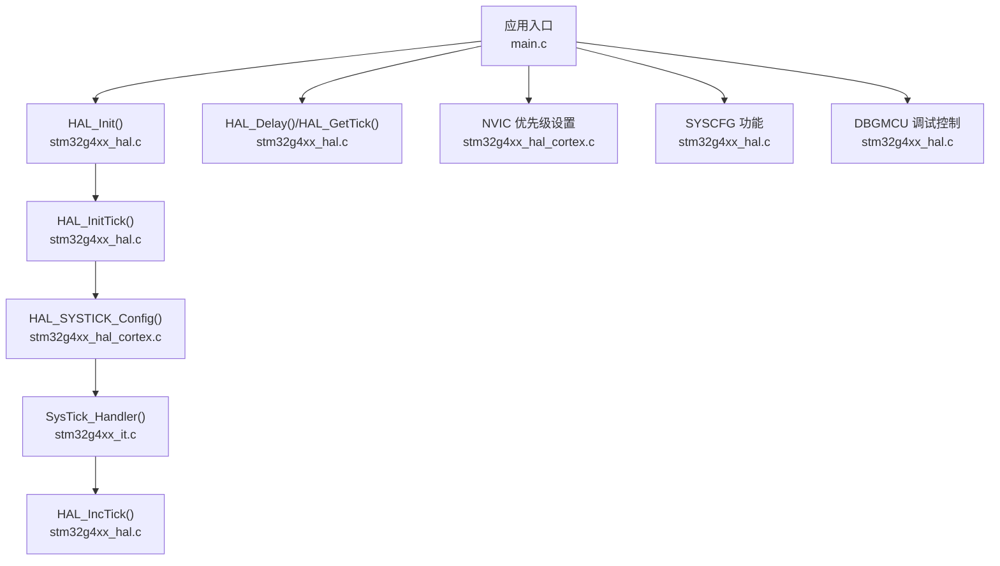
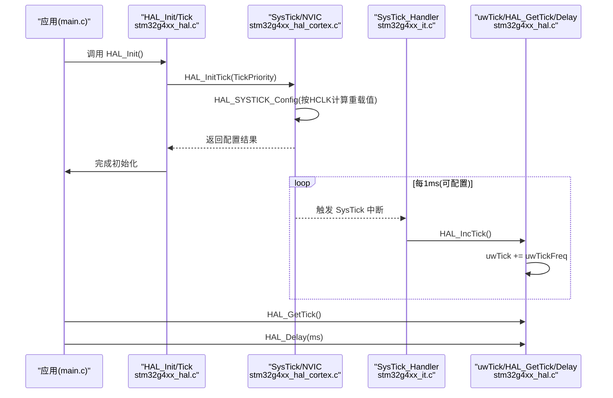
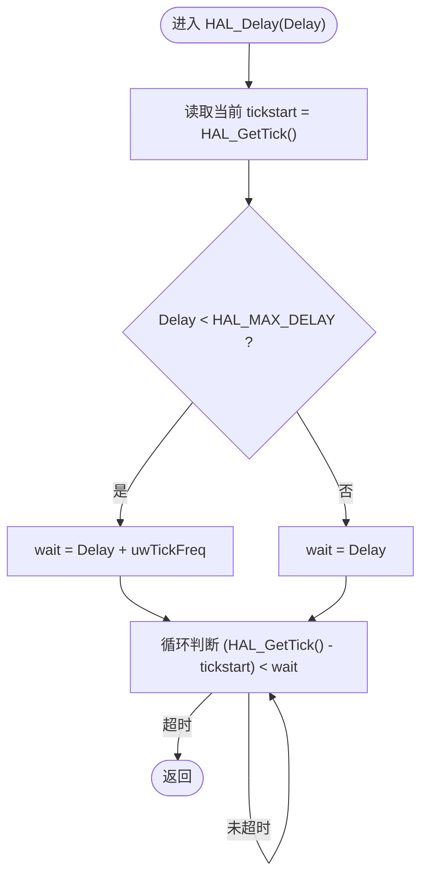
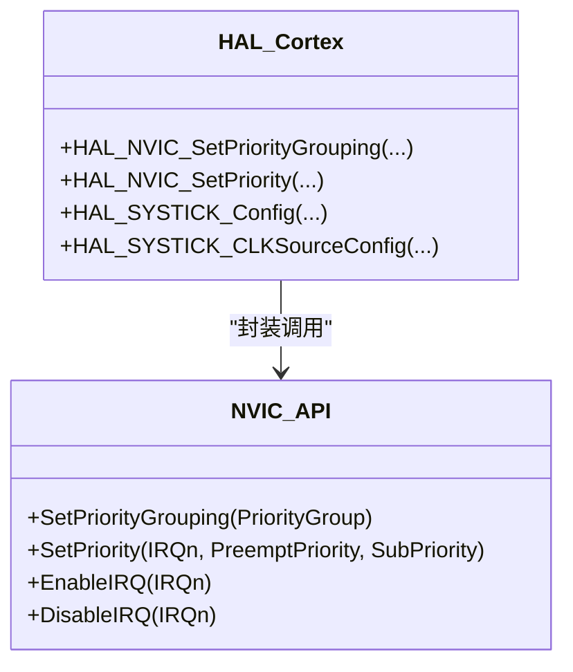
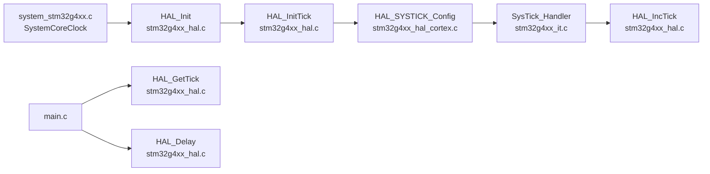

# HAL系统服务功能

<cite>
**本文引用的文件列表**
- [main.c](file://Core/Src/main.c)
- [stm32g4xx_hal_conf.h](file://Core/Inc/stm32g4xx_hal_conf.h)
- [stm32g4xx_hal.h](file://Drivers/STM32G4xx_HAL_Driver/Inc/stm32g4xx_hal.h)
- [stm32g4xx_hal.c](file://Drivers/STM32G4xx_HAL_Driver/Src/stm32g4xx_hal.c)
- [stm32g4xx_it.c](file://Core/Src/stm32g4xx_it.c)
- [system_stm32g4xx.c](file://Core/Src/system_stm32g4xx.c)
- [stm32g4xx_hal_cortex.h](file://Drivers/STM32G4xx_HAL_Driver/Inc/stm32g4xx_hal_cortex.h)
- [stm32g4xx_hal_cortex.c](file://Drivers/STM32G4xx_HAL_Driver/Src/stm32g4xx_hal_cortex.c)
</cite>

## 目录
1. [简介](#简介)
2. [项目结构](#项目结构)
3. [核心组件](#核心组件)
4. [架构总览](#架构总览)
5. [详细组件分析](#详细组件分析)
6. [依赖关系分析](#依赖关系分析)
7. [性能与精度](#性能与精度)
8. [故障排查指南](#故障排查指南)
9. [结论](#结论)
10. [附录：API速查与使用示例路径](#附录api速查与使用示例路径)

## 简介
本文件面向初学者与高级开发者，系统化讲解 STM32 HAL 库提供的“系统服务”能力，重点覆盖：
- 时间管理：HAL_Delay、HAL_GetTick、tick 频率与优先级控制
- 中断优先级设置：NVIC 分组与优先级配置
- 调试支持：DBGMCU 在低功耗模式下的调试保持
- SYSCFG 高级特性：内存映射切换、VREFBUF 配置等

文档不仅解释每个 API 的用途、参数与返回值，还通过流程图与时序图展示 tick 系统的实现原理与精度控制方法，并提供实际工程中的参考路径。

## 项目结构
本项目为基于 STM32G4 的 CubeMX 工程，HAL 系统服务相关代码主要分布在以下位置：
- 应用入口与初始化流程：Core/Src/main.c
- HAL 配置与模块开关：Core/Inc/stm32g4xx_hal_conf.h
- HAL 公共驱动（时间、SYSCFG、调试）：Drivers/STM32G4xx_HAL_Driver/Src/stm32g4xx_hal.c 及其头文件 stm32g4xx_hal.h
- Cortex 子系统（NVIC、SysTick）：Drivers/STM32G4xx_HAL_Driver/Src/stm32g4xx_hal_cortex.c 及其头文件 stm32g4xx_hal_cortex.h
- 系统时钟与向量表：Core/Src/system_stm32g4xx.c
- 中断处理入口（含 SysTick_Handler）：Core/Src/stm32g4xx_it.c

图表来源
- [stm32g4xx_hal.c:148-185](file://Drivers/STM32G4xx_HAL_Driver/Src/stm32g4xx_hal.c#L148-L185)
- [stm32g4xx_hal.c:255-287](file://Drivers/STM32G4xx_HAL_Driver/Src/stm32g4xx_hal.c#L255-L287)
- [stm32g4xx_hal_cortex.c:376-416](file://Drivers/STM32G4xx_HAL_Driver/Src/stm32g4xx_hal_cortex.c#L376-L416)
- [stm32g4xx_it.c:184-193](file://Core/Src/stm32g4xx_it.c#L184-L193)
- [stm32g4xx_hal.c:400-414](file://Drivers/STM32G4xx_HAL_Driver/Src/stm32g4xx_hal.c#L400-L414)

章节来源
- [main.c:219-290](file://Core/Src/main.c#L219-L290)
- [stm32g4xx_hal_conf.h:178-189](file://Core/Inc/stm32g4xx_hal_conf.h#L178-L189)

## 核心组件
- 时间基准与延时
  - HAL_Init：初始化 Flash 缓存、NVIC 优先级分组、SysTick 时间基准并调用 HAL_MspInit
  - HAL_InitTick：根据当前 uwTickFreq 配置 SysTick 中断周期与优先级
  - HAL_IncTick：在中断中递增全局时间变量 uwTick
  - HAL_GetTick：获取当前 tick 值（毫秒级）
  - HAL_Delay：阻塞式延时（基于 tick 轮询）
  - HAL_SetTickFreq / HAL_GetTickFreq：动态调整 tick 频率（10Hz/100Hz/1kHz）
  - HAL_SuspendTick / HAL_ResumeTick：挂起/恢复 SysTick 中断
- 中断优先级
  - HAL_NVIC_SetPriorityGrouping：设置抢占/子优先级位数分配
  - HAL_NVIC_SetPriority：设置具体 IRQ 的抢占与子优先级
- 调试支持
  - HAL_DBGMCU_EnableDBGSleepMode/StopMode/StandbyMode 等：在低功耗模式下保持调试连接
- SYSCFG 系统配置
  - 内存映射切换宏：__HAL_SYSCFG_REMAPMEMORY_*
  - VREFBUF 配置：电压量程、高阻输出、校准、使能/失能
  - CCMSRAM 擦除与写保护
  - I/O 模拟开关增强器与供电选择

章节来源
- [stm32g4xx_hal.h:525-611](file://Drivers/STM32G4xx_HAL_Driver/Inc/stm32g4xx_hal.h#L525-L611)
- [stm32g4xx_hal.c:148-185](file://Drivers/STM32G4xx_HAL_Driver/Src/stm32g4xx_hal.c#L148-L185)
- [stm32g4xx_hal.c:255-287](file://Drivers/STM32G4xx_HAL_Driver/Src/stm32g4xx_hal.c#L255-L287)
- [stm32g4xx_hal.c:322-414](file://Drivers/STM32G4xx_HAL_Driver/Src/stm32g4xx_hal.c#L322-L414)
- [stm32g4xx_hal.c:526-574](file://Drivers/STM32G4xx_HAL_Driver/Src/stm32g4xx_hal.c#L526-L574)
- [stm32g4xx_hal.c:597-780](file://Drivers/STM32G4xx_HAL_Driver/Src/stm32g4xx_hal.c#L597-L780)
- [stm32g4xx_hal.h:318-441](file://Drivers/STM32G4xx_HAL_Driver/Inc/stm32g4xx_hal.h#L318-L441)

## 架构总览
下图展示了从系统启动到 tick 驱动的完整链路，以及用户层对时间服务的调用路径。

图表来源
- [stm32g4xx_hal.c:148-185](file://Drivers/STM32G4xx_HAL_Driver/Src/stm32g4xx_hal.c#L148-L185)
- [stm32g4xx_hal.c:255-287](file://Drivers/STM32G4xx_HAL_Driver/Src/stm32g4xx_hal.c#L255-L287)
- [stm32g4xx_hal_cortex.c:376-416](file://Drivers/STM32G4xx_HAL_Driver/Src/stm32g4xx_hal_cortex.c#L376-L416)
- [stm32g4xx_it.c:184-193](file://Core/Src/stm32g4xx_it.c#L184-L193)
- [stm32g4xx_hal.c:322-414](file://Drivers/STM32G4xx_HAL_Driver/Src/stm32g4xx_hal.c#L322-L414)

## 详细组件分析

### 时间管理与 Tick 系统
- HAL_Init
  - 作用：配置 Flash 预取/指令/数据缓存、设置 NVIC 优先级分组、初始化 SysTick 时间基准、调用 HAL_MspInit
  - 关键点：默认使用 SysTick 作为时间源；若 HAL_InitTick 失败则返回错误状态
- HAL_InitTick
  - 作用：根据 uwTickFreq 计算 SysTick 重载值并设置中断优先级
  - 输入：TickPriority（必须小于 1<<__NVIC_PRIO_BITS）
  - 行为：调用 HAL_SYSTICK_Config 配置 SysTick，再设置 SysTick_IRQn 的优先级
- HAL_IncTick
  - 作用：在中断上下文中累加 uwTick，步长为 uwTickFreq
- HAL_GetTick
  - 作用：返回当前 uwTick（单位取决于 tick 频率）
- HAL_Delay
  - 作用：基于 tick 的阻塞延时，内部会加上一个 tick 周期以保证最小等待
- HAL_SetTickFreq / HAL_GetTickFreq
  - 作用：运行时修改 tick 频率（10Hz/100Hz/1kHz），成功时重新配置 SysTick
- HAL_SuspendTick / HAL_ResumeTick
  - 作用：关闭/开启 SysTick 中断，用于临界区或低功耗场景

图表来源
- [stm32g4xx_hal.c:400-414](file://Drivers/STM32G4xx_HAL_Driver/Src/stm32g4xx_hal.c#L400-L414)

章节来源
- [stm32g4xx_hal.c:148-185](file://Drivers/STM32G4xx_HAL_Driver/Src/stm32g4xx_hal.c#L148-L185)
- [stm32g4xx_hal.c:255-287](file://Drivers/STM32G4xx_HAL_Driver/Src/stm32g4xx_hal.c#L255-L287)
- [stm32g4xx_hal.c:322-414](file://Drivers/STM32G4xx_HAL_Driver/Src/stm32g4xx_hal.c#L322-L414)
- [stm32g4xx_it.c:184-193](file://Core/Src/stm32g4xx_it.c#L184-L193)

### 中断优先级设置（NVIC）
- HAL_NVIC_SetPriorityGrouping
  - 作用：设置抢占/子优先级的位宽分配（0~4 组）
- HAL_NVIC_SetPriority
  - 作用：为指定 IRQn 设置抢占优先级与子优先级
  - 注意：数值越小优先级越高；需先正确设置分组

图表来源
- [stm32g4xx_hal_cortex.h:269-294](file://Drivers/STM32G4xx_HAL_Driver/Inc/stm32g4xx_hal_cortex.h#L269-L294)
- [stm32g4xx_hal_cortex.c:163-196](file://Drivers/STM32G4xx_HAL_Driver/Src/stm32g4xx_hal_cortex.c#L163-L196)

章节来源
- [stm32g4xx_hal_cortex.h:87-100](file://Drivers/STM32G4xx_HAL_Driver/Inc/stm32g4xx_hal_cortex.h#L87-L100)
- [stm32g4xx_hal_cortex.c:163-196](file://Drivers/STM32G4xx_HAL_Driver/Src/stm32g4xx_hal_cortex.c#L163-L196)

### 调试支持（DBGMCU）
- 提供在 SLEEP/STOP/STANDBY 模式下保持调试连接的接口
- 典型用法：在进入低功耗前启用对应 DBGMCU 位，退出后按需关闭

章节来源
- [stm32g4xx_hal.c:526-574](file://Drivers/STM32G4xx_HAL_Driver/Src/stm32g4xx_hal.c#L526-L574)

### SYSCFG 高级特性
- 内存映射切换
  - 宏：__HAL_SYSCFG_REMAPMEMORY_FLASH/SYSTEMFLASH/SRAM/FMC/QUADSPI
  - 函数：HAL_SYSCFG_EnableMemorySwappingBank / DisableMemorySwappingBank（双 Bank 交换）
- VREFBUF 配置（如设备具备）
  - 电压量程：HAL_SYSCFG_VREFBUF_VoltageScalingConfig
  - 高阻输出：HAL_SYSCFG_VREFBUF_HighImpedanceConfig
  - 校准：HAL_SYSCFG_VREFBUF_TrimmingConfig
  - 使能/失能：HAL_SYSCFG_EnableVREFBUF / DisableVREFBUF
- CCMSRAM 擦除与写保护
  - 擦除：HAL_SYSCFG_CCMSRAMErase
  - 写保护：HAL_SYSCFG_CCMSRAM_WriteProtectionEnable
- I/O 模拟开关增强器与供电选择
  - 增强器：EnableIOSwitchBooster / DisableIOSwitchBooster
  - 供电选择：EnableIOSwitchVDD / DisableIOSwitchVDD

章节来源
- [stm32g4xx_hal.h:318-441](file://Drivers/STM32G4xx_HAL_Driver/Inc/stm32g4xx_hal.h#L318-L441)
- [stm32g4xx_hal.c:597-780](file://Drivers/STM32G4xx_HAL_Driver/Src/stm32g4xx_hal.c#L597-L780)

## 依赖关系分析
- HAL_Init 依赖 system_stm32g4xx.c 中的 SystemCoreClock 与 RCC 配置
- HAL_InitTick 依赖 HAL_SYSTICK_Config（Cortex HAL）与 NVIC 优先级设置
- SysTick_Handler 位于中断向量表中，调用 HAL_IncTick 维护 uwTick
- HAL_Delay/GetTick 直接访问 uwTick 与 uwTickFreq

图表来源
- [system_stm32g4xx.c:181-192](file://Core/Src/system_stm32g4xx.c#L181-L192)
- [stm32g4xx_hal.c:148-185](file://Drivers/STM32G4xx_HAL_Driver/Src/stm32g4xx_hal.c#L148-L185)
- [stm32g4xx_hal.c:255-287](file://Drivers/STM32G4xx_HAL_Driver/Src/stm32g4xx_hal.c#L255-L287)
- [stm32g4xx_hal_cortex.c:376-416](file://Drivers/STM32G4xx_HAL_Driver/Src/stm32g4xx_hal_cortex.c#L376-L416)
- [stm32g4xx_it.c:184-193](file://Core/Src/stm32g4xx_it.c#L184-L193)

章节来源
- [system_stm32g4xx.c:181-192](file://Core/Src/system_stm32g4xx.c#L181-L192)
- [stm32g4xx_hal.c:148-185](file://Drivers/STM32G4xx_HAL_Driver/Src/stm32g4xx_hal.c#L148-L185)

## 性能与精度
- Tick 频率与精度
  - 默认 1kHz（1ms），可通过 HAL_SetTickFreq 调整为 100Hz 或 10Hz
  - 精度受 SystemCoreClock 与 SysTick 时钟源影响；可在 HAL_SYSTICK_CLKSourceConfig 中选择 HCLK 或 HCLK/8
- 延时误差
  - HAL_Delay 内部会额外增加一个 tick 周期以保障最小等待，存在 ±1 个 tick 的不确定性
- 中断优先级
  - 若 HAL_Delay 被 ISR 调用，必须确保 SysTick 中断优先级高于该 ISR（数值更小），否则会被阻塞
- 功耗与调试
  - 在低功耗模式下可使用 DBGMCU 保持调试，但会增加功耗
- 自定义扩展
  - HAL_IncTick、HAL_SYSTICK_Callback 等为 __weak，可在用户文件中重写以实现高精度或多任务时间基

章节来源
- [stm32g4xx_hal.c:351-387](file://Drivers/STM32G4xx_HAL_Driver/Src/stm32g4xx_hal.c#L351-L387)
- [stm32g4xx_hal.c:400-414](file://Drivers/STM32G4xx_HAL_Driver/Src/stm32g4xx_hal.c#L400-L414)
- [stm32g4xx_hal_cortex.c:376-416](file://Drivers/STM32G4xx_HAL_Driver/Src/stm32g4xx_hal_cortex.c#L376-L416)

## 故障排查指南
- HAL_Init 返回错误
  - 检查 TICK_INT_PRIORITY 是否有效（小于 1<<__NVIC_PRIO_BITS）
  - 确认 SystemCoreClock 已正确更新（系统时钟变更后需调用 SystemCoreClockUpdate）
- HAL_Delay 不生效或过长
  - 确认 SysTick 已启用且优先级合理
  - 检查是否在 ISR 中调用 HAL_Delay 导致优先级倒置
- HAL_GetTick 跳变异常
  - 检查是否误用 HAL_SuspendTick/ResumeTick 造成时间不同步
- SYSCFG 操作无效
  - 确认目标外设是否存在（如 VREFBUF 条件编译）
  - 内存映射切换需在合适时机进行，避免执行流指向错误区域

章节来源
- [stm32g4xx_hal.c:255-287](file://Drivers/STM32G4xx_HAL_Driver/Src/stm32g4xx_hal.c#L255-L287)
- [stm32g4xx_hal.c:400-414](file://Drivers/STM32G4xx_HAL_Driver/Src/stm32g4xx_hal.c#L400-L414)
- [stm32g4xx_hal.c:597-780](file://Drivers/STM32G4xx_HAL_Driver/Src/stm32g4xx_hal.c#L597-L780)
- [system_stm32g4xx.c:230-272](file://Core/Src/system_stm32g4xx.c#L230-L272)

## 结论
HAL 系统服务提供了稳定、易用的时间基准、中断优先级与调试能力，并通过 SYSCFG 暴露了丰富的系统级配置选项。理解 tick 系统的工作机制与优先级策略，是构建可靠嵌入式应用的基础。对于高性能需求，建议结合自定义回调与合适的 SysTick 时钟源，并在关键路径上谨慎使用阻塞延时。

## 附录：API速查与使用示例路径
- 时间管理
  - HAL_Init：[stm32g4xx_hal.c:148-185](file://Drivers/STM32G4xx_HAL_Driver/Src/stm32g4xx_hal.c#L148-L185)
  - HAL_InitTick：[stm32g4xx_hal.c:255-287](file://Drivers/STM32G4xx_HAL_Driver/Src/stm32g4xx_hal.c#L255-L287)
  - HAL_IncTick：[stm32g4xx_hal.c:322-325](file://Drivers/STM32G4xx_HAL_Driver/Src/stm32g4xx_hal.c#L322-L325)
  - HAL_GetTick：[stm32g4xx_hal.c:333-336](file://Drivers/STM32G4xx_HAL_Driver/Src/stm32g4xx_hal.c#L333-L336)
  - HAL_Delay：[stm32g4xx_hal.c:400-414](file://Drivers/STM32G4xx_HAL_Driver/Src/stm32g4xx_hal.c#L400-L414)
  - HAL_SetTickFreq / HAL_GetTickFreq：[stm32g4xx_hal.c:351-387](file://Drivers/STM32G4xx_HAL_Driver/Src/stm32g4xx_hal.c#L351-L387)
  - HAL_SuspendTick / HAL_ResumeTick：[stm32g4xx_hal.c:426-446](file://Drivers/STM32G4xx_HAL_Driver/Src/stm32g4xx_hal.c#L426-L446)
- 中断优先级
  - HAL_NVIC_SetPriorityGrouping：[stm32g4xx_hal_cortex.c:163-170](file://Drivers/STM32G4xx_HAL_Driver/Src/stm32g4xx_hal_cortex.c#L163-L170)
  - HAL_NVIC_SetPriority：[stm32g4xx_hal_cortex.c:185-196](file://Drivers/STM32G4xx_HAL_Driver/Src/stm32g4xx_hal_cortex.c#L185-L196)
- 调试支持
  - DBGMCU 控制：[stm32g4xx_hal.c:526-574](file://Drivers/STM32G4xx_HAL_Driver/Src/stm32g4xx_hal.c#L526-L574)
- SYSCFG
  - 内存映射宏：[stm32g4xx_hal.h:318-441](file://Drivers/STM32G4xx_HAL_Driver/Inc/stm32g4xx_hal.h#L318-L441)
  - VREFBUF 配置：[stm32g4xx_hal.c:642-727](file://Drivers/STM32G4xx_HAL_Driver/Src/stm32g4xx_hal.c#L642-L727)
  - CCMSRAM 擦除/写保护：[stm32g4xx_hal.c:597-641](file://Drivers/STM32G4xx_HAL_Driver/Src/stm32g4xx_hal.c#L597-L641), [stm32g4xx_hal.c:769-780](file://Drivers/STM32G4xx_HAL_Driver/Src/stm32g4xx_hal.c#L769-L780)
  - I/O 模拟开关增强/供电：[stm32g4xx_hal.c:734-767](file://Drivers/STM32G4xx_HAL_Driver/Src/stm32g4xx_hal.c#L734-L767)
- 使用示例路径（工程内已有调用）
  - main.c 中 HAL_Init 与 HAL_Delay 的使用：[main.c:229-236](file://Core/Src/main.c#L229-L236), [main.c:208-212](file://Core/Src/main.c#L208-L212)
  - NVIC 优先级设置（DMA/EXTI）：[main.c:478-479](file://Core/Src/main.c#L478-L479), [main.c:505-506](file://Core/Src/main.c#L505-L506)