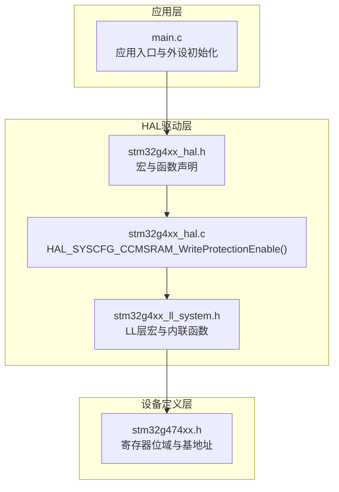
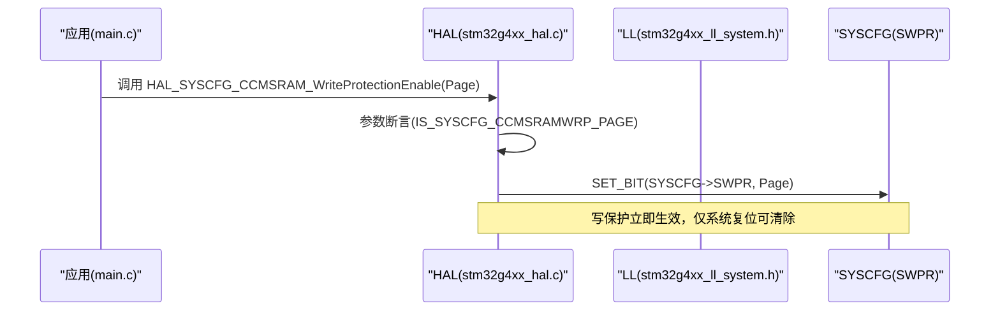
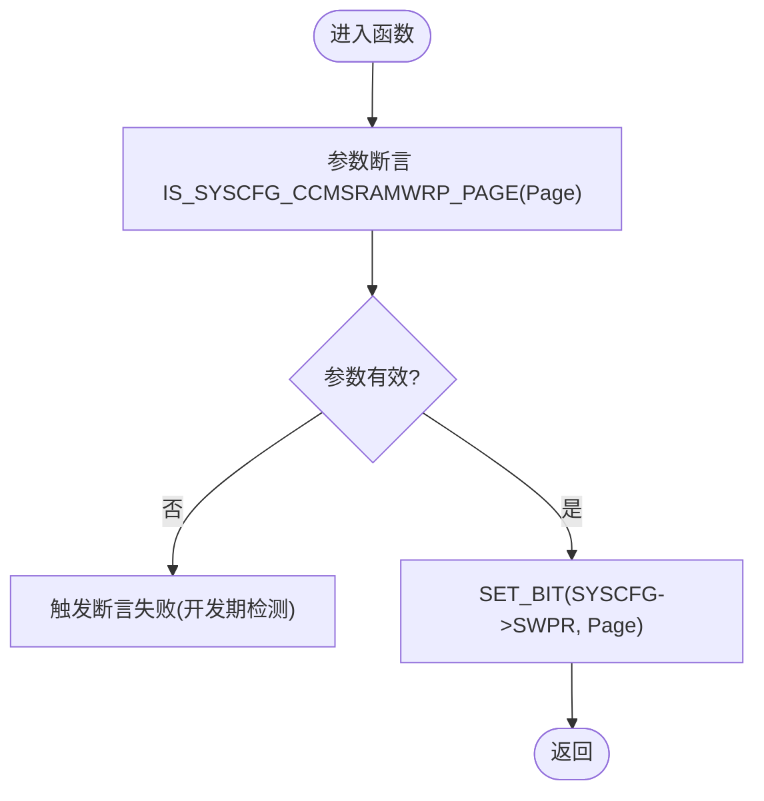
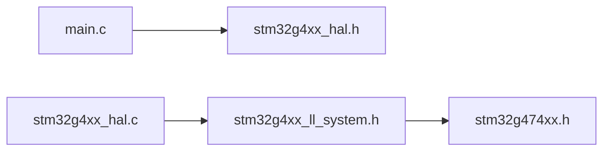

# CCMSRAM写保护机制

<cite>
**本文引用的文件**   
- [stm32g4xx_hal.h](file://Drivers/STM32G4xx_HAL_Driver/Inc/stm32g4xx_hal.h)
- [stm32g4xx_ll_system.h](file://Drivers/STM32G4xx_HAL_Driver/Inc/stm32g4xx_ll_system.h)
- [stm32g474xx.h](file://Drivers/CMSIS/Device/ST/STM32G4xx/Include/stm32g474xx.h)
- [main.c](file://Core/Src/main.c)
</cite>

## 目录
1. [简介](#简介)
2. [项目结构](#项目结构)
3. [核心组件](#核心组件)
4. [架构总览](#架构总览)
5. [详细组件分析](#详细组件分析)
6. [依赖关系分析](#依赖关系分析)
7. [性能与安全性考虑](#性能与安全性考虑)
8. [故障排查指南](#故障排查指南)
9. [结论](#结论)
10. [附录](#附录)

## 简介
本文件面向使用STM32G4系列MCU的开发者，系统性讲解CCM SRAM（CCMSRAM）的写保护机制。内容涵盖：
- CCMSRAM的特殊用途与安全价值
- HAL层API的使用方法与注意事项
- 32页粒度（PAGE0–PAGE31）的灵活配置
- 典型敏感区域（关键数据、中断向量表、安全密钥等）的保护策略
- 运行时动态启用/禁用保护的时机与流程
- 调试器交互行为与在线调试时的状态管理
- 初学者入门与高级最佳实践

## 项目结构
本项目为基于STM32CubeMX生成的工程，包含HAL驱动、CMSIS设备头文件与应用代码。与CCMSRAM写保护相关的实现主要位于HAL驱动与设备头文件中，应用示例位于main.c中。

图表来源
- [stm32g4xx_hal.h:96-130](file://Drivers/STM32G4xx_HAL_Driver/Inc/stm32g4xx_hal.h#L96-L130)
- [stm32g4xx_ll_system.h:841-885](file://Drivers/STM32G4xx_HAL_Driver/Inc/stm32g4xx_ll_system.h#L841-L885)
- [stm32g474xx.h:14703-14720](file://Drivers/CMSIS/Device/ST/STM32G4xx/Include/stm32g474xx.h#L14703-L14720)

章节来源
- [main.c:219-290](file://Core/Src/main.c#L219-L290)
- [stm32g4xx_hal.h:96-130](file://Drivers/STM32G4xx_HAL_Driver/Inc/stm32g4xx_hal.h#L96-L130)
- [stm32g4xx_ll_system.h:841-885](file://Drivers/STM32G4xx_HAL_Driver/Inc/stm32g4xx_ll_system.h#L841-L885)
- [stm32g474xx.h:14703-14720](file://Drivers/CMSIS/Device/ST/STM32G4xx/Include/stm32g474xx.h#L14703-L14720)

## 核心组件
- HAL API
  - HAL_SYSCFG_CCMSRAM_WriteProtectionEnable(Page)：按页启用CCMSRAM写保护。参数Page支持PAGE0–PAGE31的组合。
- LL宏与内联函数
  - LL_SYSCFG_EnableCCMSRAMPageWRP(CCMSRAMWRP)：底层直接置位SYSCFG->SWPR对应页位。
  - LL_SYSCFG_UnlockCCMSRAMWRP()/LockCCMSRAMWRP()：用于擦除相关控制位的解锁/锁定（与CCMSRAM擦除相关）。
- 设备寄存器定义
  - SYSCFG_SWPR_PAGE0~PAGE31：CCMSRAM写保护页控制位。
  - SYSCFG_SCSR_CCMER/CCMBSY：CCMSRAM擦除请求与忙标志（与擦除流程相关）。
  - CCMSRAM_BASE：CCMSRAM基地址（用于定位受保护内存区域）。

章节来源
- [stm32g4xx_hal.h:96-130](file://Drivers/STM32G4xx_HAL_Driver/Inc/stm32g4xx_hal.h#L96-L130)
- [stm32g4xx_ll_system.h:841-885](file://Drivers/STM32G4xx_HAL_Driver/Inc/stm32g4xx_ll_system.h#L841-L885)
- [stm32g474xx.h:14678-14684](file://Drivers/CMSIS/Device/ST/STM32G4xx/Include/stm32g474xx.h#L14678-L14684)
- [stm32g474xx.h:14703-14720](file://Drivers/CMSIS/Device/ST/STM32G4xx/Include/stm32g474xx.h#L14703-L14720)
- [stm32g474xx.h:1134](file://Drivers/CMSIS/Device/ST/STM32G4xx/Include/stm32g474xx.h#L1134)

## 架构总览
CCMSRAM写保护由SYSCFG模块提供，通过设置SYSCFG->SWPR寄存器中的页位来生效。HAL层对底层操作进行封装并提供断言校验；LL层提供更直接的寄存器访问接口。

图表来源
- [stm32g4xx_hal.c:770-779](file://Drivers/STM32G4xx_HAL_Driver/Src/stm32g4xx_hal.c#L770-L779)
- [stm32g4xx_ll_system.h:841-885](file://Drivers/STM32G4xx_HAL_Driver/Inc/stm32g4xx_ll_system.h#L841-L885)
- [stm32g474xx.h:14703-14720](file://Drivers/CMSIS/Device/ST/STM32G4xx/Include/stm32g474xx.h#L14703-L14720)

## 详细组件分析

### HAL层API：HAL_SYSCFG_CCMSRAM_WriteProtectionEnable(Page)
- 功能：将指定页的写保护位置位，使对应CCMSRAM页不可写入。
- 参数：Page可为PAGE0–PAGE31的任意组合（按位或）。
- 行为：内部进行参数有效性断言；随后直接置位SYSCFG->SWPR对应位。
- 注意：写保护一旦启用，只能通过系统复位清除。

图表来源
- [stm32g4xx_hal.c:770-779](file://Drivers/STM32G4xx_HAL_Driver/Src/stm32g4xx_hal.c#L770-L779)
- [stm32g4xx_hal.h:463-469](file://Drivers/STM32G4xx_HAL_Driver/Inc/stm32g4xx_hal.h#L463-L469)

章节来源
- [stm32g4xx_hal.c:770-779](file://Drivers/STM32G4xx_HAL_Driver/Src/stm32g4xx_hal.c#L770-L779)
- [stm32g4xx_hal.h:96-130](file://Drivers/STM32G4xx_HAL_Driver/Inc/stm32g4xx_hal.h#L96-L130)
- [stm32g4xx_hal.h:463-469](file://Drivers/STM32G4xx_HAL_Driver/Inc/stm32g4xx_hal.h#L463-L469)

### LL层辅助：页保护与擦除相关
- 页保护启用：LL_SYSCFG_EnableCCMSRAMPageWRP(CCMSRAMWRP)直接置位SYSCFG->SWPR。
- 擦除解锁/锁定：LL_SYSCFG_UnlockCCMSRAMWRP()/LL_SYSCFG_LockCCMSRAMWRP()用于擦除控制位（CCMER）的解锁与锁定，防止误操作。
- 擦除标志：SYSCFG_SCSR_CCMBSY指示擦除进行中，可用于轮询完成。

章节来源
- [stm32g4xx_ll_system.h:841-885](file://Drivers/STM32G4xx_HAL_Driver/Inc/stm32g4xx_ll_system.h#L841-L885)
- [stm32g4xx_ll_system.h:887-908](file://Drivers/STM32G4xx_HAL_Driver/Inc/stm32g4xx_ll_system.h#L887-L908)
- [stm32g474xx.h:14678-14684](file://Drivers/CMSIS/Device/ST/STM32G4xx/Include/stm32g474xx.h#L14678-L14684)

### 设备寄存器与页粒度
- 页控制位：SYSCFG_SWPR_PAGE0至PAGE31，每页对应一个位，支持细粒度保护。
- 擦除控制：SYSCFG_SCSR_CCMER为擦除请求位，CCMBSY为忙标志。
- 内存基址：CCMSRAM_BASE用于定位受保护内存范围。

章节来源
- [stm32g474xx.h:14703-14720](file://Drivers/CMSIS/Device/ST/STM32G4xx/Include/stm32g474xx.h#L14703-L14720)
- [stm32g474xx.h:14678-14684](file://Drivers/CMSIS/Device/ST/STM32G4xx/Include/stm32g474xx.h#L14678-L14684)
- [stm32g474xx.h:1134](file://Drivers/CMSIS/Device/ST/STM32G4xx/Include/stm32g474xx.h#L1134)

### 使用场景与代码示例路径
以下为常见敏感区域的保护建议与参考路径（不直接展示代码内容）：
- 关键数据结构（如全局配置、校准参数）
  - 在main.c中于外设初始化完成后、业务逻辑开始前调用HAL_SYSCFG_CCMSRAM_WriteProtectionEnable()，选择覆盖该结构的页。
  - 参考路径：[main.c:219-290](file://Core/Src/main.c#L219-L290)
- 中断向量表（若驻留CCMSRAM）
  - 将包含向量表的页加入保护集合，确保运行期不可被篡改。
  - 参考路径：[stm32g4xx_hal.h:96-130](file://Drivers/STM32G4xx_HAL_Driver/Inc/stm32g4xx_hal.h#L96-L130)
- 安全密钥与证书
  - 将存放密钥的页单独保护，避免运行时意外修改。
  - 参考路径：[stm32g4xx_ll_system.h:841-885](file://Drivers/STM32G4xx_HAL_Driver/Inc/stm32g4xx_ll_system.h#L841-L885)

提示：上述“参考路径”指向实际可用的宏与函数声明位置，便于在工程中查找并集成。

## 依赖关系分析
- main.c依赖HAL初始化与外设配置，可在合适时机调用写保护API。
- HAL层依赖LL层提供的寄存器操作与宏定义。
- LL层依赖设备头文件中的寄存器位域定义。

图表来源
- [main.c:219-290](file://Core/Src/main.c#L219-L290)
- [stm32g4xx_hal.h:96-130](file://Drivers/STM32G4xx_HAL_Driver/Inc/stm32g4xx_hal.h#L96-L130)
- [stm32g4xx_ll_system.h:841-885](file://Drivers/STM32G4xx_HAL_Driver/Inc/stm32g4xx_ll_system.h#L841-L885)
- [stm32g474xx.h:14703-14720](file://Drivers/CMSIS/Device/ST/STM32G4xx/Include/stm32g474xx.h#L14703-L14720)

章节来源
- [main.c:219-290](file://Core/Src/main.c#L219-L290)
- [stm32g4xx_hal.h:96-130](file://Drivers/STM32G4xx_HAL_Driver/Inc/stm32g4xx_hal.h#L96-L130)
- [stm32g4xx_ll_system.h:841-885](file://Drivers/STM32G4xx_HAL_Driver/Inc/stm32g4xx_ll_system.h#L841-L885)
- [stm32g474xx.h:14703-14720](file://Drivers/CMSIS/Device/ST/STM32G4xx/Include/stm32g474xx.h#L14703-L14720)

## 性能与安全性考虑
- 性能影响
  - 写保护为硬件级控制，启用后对读操作无影响，对写操作会触发异常（取决于CPU与调试器配置），不影响正常读路径性能。
- 安全性增强
  - 防篡改：阻止运行时对关键数据的无意或恶意修改。
  - 最小权限：仅对必要页启用保护，减少误伤风险。
  - 分阶段启用：先完成所有必要的初始化与数据装载，再批量启用写保护。
- 擦除与重置
  - 写保护仅在系统复位时清除；擦除CCMSRAM需遵循解锁→请求→等待忙标志的流程。

[本节为通用指导，无需特定文件引用]

## 故障排查指南
- 断言失败
  - 现象：调用HAL_SYSCFG_CCMSRAM_WriteProtectionEnable()时报断言错误。
  - 原因：传入的Page不在允许范围内。
  - 处理：检查宏定义与组合值，确保只使用PAGE0–PAGE31的有效位。
  - 参考路径：[stm32g4xx_hal.c:770-779](file://Drivers/STM32G4xx_HAL_Driver/Src/stm32g4xx_hal.c#L770-L779), [stm32g4xx_hal.h:463-469](file://Drivers/STM32G4xx_HAL_Driver/Inc/stm32g4xx_hal.h#L463-L469)
- 写保护无法关闭
  - 现象：尝试在运行期关闭写保护无效。
  - 原因：写保护只能由系统复位清除。
  - 处理：设计重启流程或在启动早期重新配置。
  - 参考路径：[stm32g4xx_ll_system.h:841-885](file://Drivers/STM32G4xx_HAL_Driver/Inc/stm32g4xx_ll_system.h#L841-L885)
- 擦除冲突
  - 现象：擦除CCMSRAM时失败或卡住。
  - 原因：未正确解锁或擦除仍在进行中。
  - 处理：先调用解锁宏，再发起擦除，并轮询忙标志。
  - 参考路径：[stm32g4xx_ll_system.h:887-908](file://Drivers/STM32G4xx_HAL_Driver/Inc/stm32g4xx_ll_system.h#L887-L908), [stm32g474xx.h:14678-14684](file://Drivers/CMSIS/Device/ST/STM32G4xx/Include/stm32g474xx.h#L14678-L14684)

章节来源
- [stm32g4xx_hal.c:770-779](file://Drivers/STM32G4xx_HAL_Driver/Src/stm32g4xx_hal.c#L770-L779)
- [stm32g4xx_ll_system.h:841-885](file://Drivers/STM32G4xx_HAL_Driver/Inc/stm32g4xx_ll_system.h#L841-L885)
- [stm32g4xx_ll_system.h:887-908](file://Drivers/STM32G4xx_HAL_Driver/Inc/stm32g4xx_ll_system.h#L887-L908)
- [stm32g474xx.h:14678-14684](file://Drivers/CMSIS/Device/ST/STM32G4xx/Include/stm32g474xx.h#L14678-L14684)

## 结论
CCMSRAM写保护为STM32G4提供了轻量而高效的运行时防护能力。通过HAL/LL接口可按页精细控制，结合合理的初始化时序与调试策略，可有效提升系统的抗篡改性与稳定性。建议在产品固件中尽早启用保护，并对关键页实施最小化保护策略。

[本节为总结性内容，无需特定文件引用]

## 附录

### 常用宏与API速查
- HAL
  - HAL_SYSCFG_CCMSRAM_WriteProtectionEnable(Page)
  - 参考路径：[stm32g4xx_hal.h:606](file://Drivers/STM32G4xx_HAL_Driver/Inc/stm32g4xx_hal.h#L606), [stm32g4xx_hal.c:770-779](file://Drivers/STM32G4xx_HAL_Driver/Src/stm32g4xx_hal.c#L770-L779)
- LL
  - LL_SYSCFG_EnableCCMSRAMPageWRP(CCMSRAMWRP)
  - LL_SYSCFG_UnlockCCMSRAMWRP()/LL_SYSCFG_LockCCMSRAMWRP()
  - 参考路径：[stm32g4xx_ll_system.h:841-885](file://Drivers/STM32G4xx_HAL_Driver/Inc/stm32g4xx_ll_system.h#L841-L885), [stm32g4xx_ll_system.h:887-908](file://Drivers/STM32G4xx_HAL_Driver/Inc/stm32g4xx_ll_system.h#L887-L908)
- 设备寄存器
  - SYSCFG_SWPR_PAGE0–PAGE31
  - SYSCFG_SCSR_CCMER/CCMBSY
  - CCMSRAM_BASE
  - 参考路径：[stm32g474xx.h:14703-14720](file://Drivers/CMSIS/Device/ST/STM32G4xx/Include/stm32g474xx.h#L14703-L14720), [stm32g474xx.h:14678-14684](file://Drivers/CMSIS/Device/ST/STM32G4xx/Include/stm32g474xx.h#L14678-L14684), [stm32g474xx.h:1134](file://Drivers/CMSIS/Device/ST/STM32G4xx/Include/stm32g474xx.h#L1134)

### 调试器交互与在线调试建议
- 在线调试时，部分调试器可能绕过写保护以支持断点与单步执行。为确保真实环境下的保护效果，应在非调试模式下验证写保护是否生效。
- 建议在启动流程中加入保护状态自检逻辑，并在异常情况下采取降级或告警策略。

[本节为通用指导，无需特定文件引用]