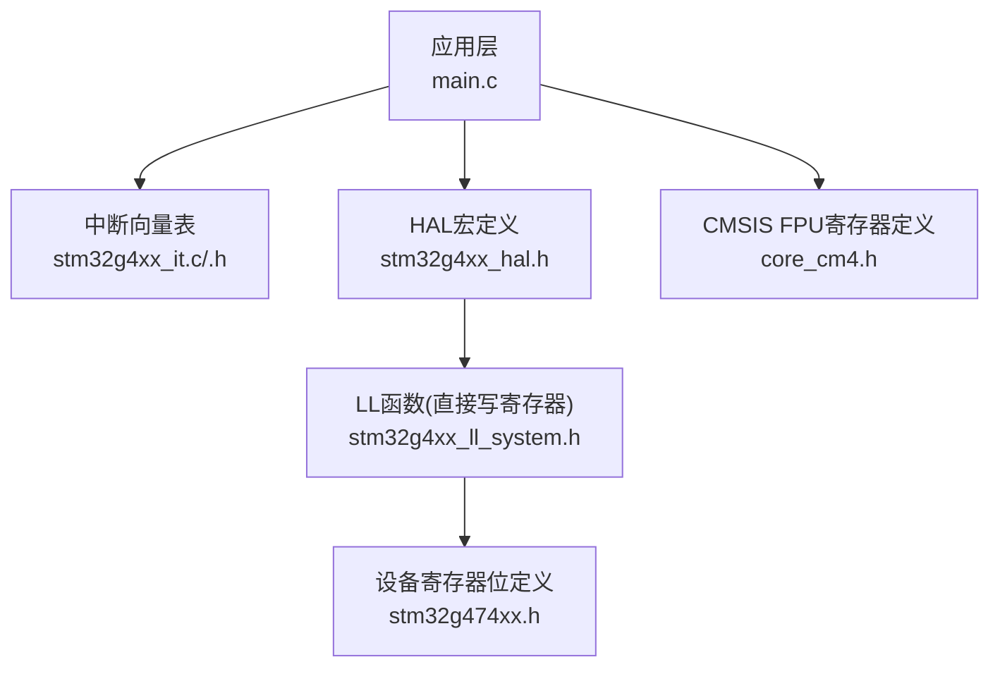
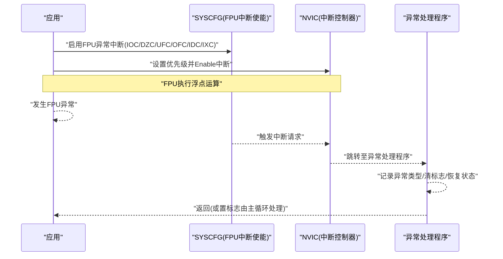
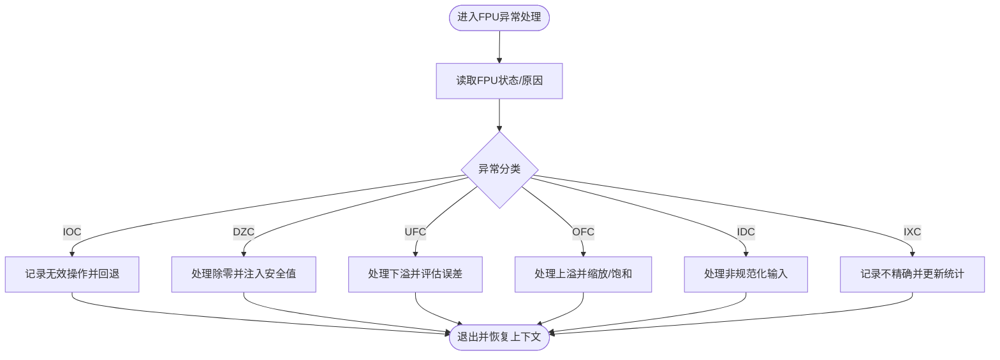
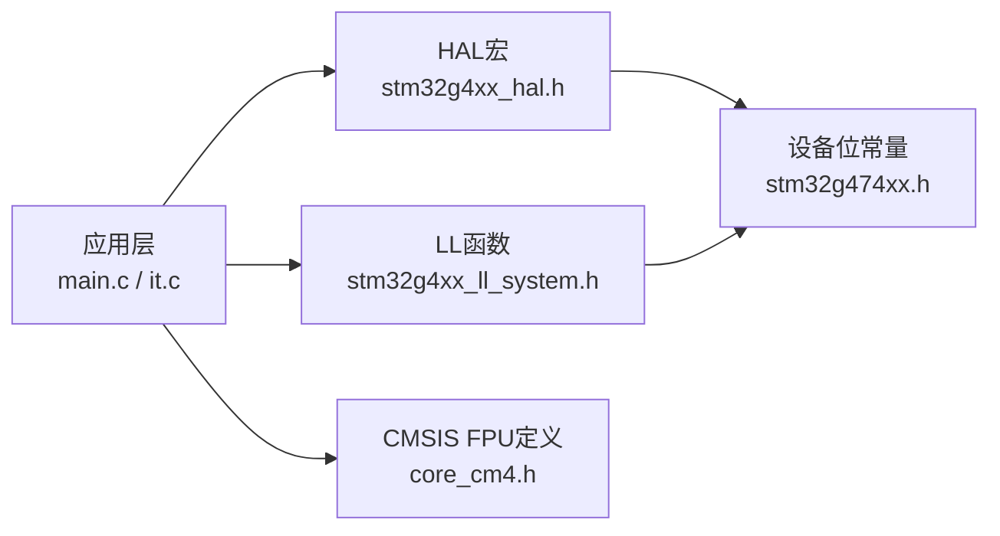

# FPU浮点运算中断

<cite>
**本文引用的文件**   
- [stm32g4xx_hal.h](file://Drivers/STM32G4xx_HAL_Driver/Inc/stm32g4xx_hal.h)
- [stm32g4xx_ll_system.h](file://Drivers/STM32G4xx_HAL_Driver/Inc/stm32g4xx_ll_system.h)
- [core_cm4.h](file://Drivers/CMSIS/Include/core_cm4.h)
- [stm32g474xx.h](file://Drivers/CMSIS/Device/ST/STM32G4xx/Include/stm32g474xx.h)
- [main.c](file://Core/Src/main.c)
- [stm32g4xx_it.c](file://Core/Src/stm32g4xx_it.c)
- [stm32g4xx_it.h](file://Core/Inc/stm32g4xx_it.h)
</cite>

## 目录
1. [简介](#简介)
2. [项目结构](#项目结构)
3. [核心组件](#核心组件)
4. [架构总览](#架构总览)
5. [详细组件分析](#详细组件分析)
6. [依赖关系分析](#依赖关系分析)
7. [性能与功耗考量](#性能与功耗考量)
8. [故障排查指南](#故障排查指南)
9. [结论](#结论)
10. [附录](#附录)

## 简介
本文件面向在Cortex-M4内核（如STM32G4系列）上使用FPU进行浮点运算的开发者，系统讲解如何通过SYSCFG将FPU异常映射为可屏蔽中断，从而实现对无效操作、除零、下溢、上溢、非规范化输入、不精确结果等异常的统一捕获与处理。文档同时覆盖：
- FPU中断宏定义与底层寄存器映射
- 使能FPU及FPU中断的配置流程
- 中断优先级设置与嵌套策略
- 在数字信号处理与数学计算密集型应用中的鲁棒性设计
- 初学者友好的浮点基础与异常类型说明
- 高级开发者的调试与优化技巧

## 项目结构
本项目基于STM32CubeMX生成的工程骨架，包含HAL驱动、CMSIS核心头文件与应用层代码。与FPU中断相关的关键位置如下：
- HAL层宏定义：FPU中断源宏
- LL层函数：直接操作SYSCFG以启用/禁用FPU中断
- CMSIS核心：FPU寄存器结构与位域定义
- 设备头文件：SYSCFG寄存器位掩码常量
- 应用层：中断向量表与回调入口

**图表来源** 
- [main.c:1-556](file://Core/Src/main.c#L1-L556)
- [stm32g4xx_it.c:1-247](file://Core/Src/stm32g4xx_it.c#L1-L247)
- [stm32g4xx_it.h:1-70](file://Core/Inc/stm32g4xx_it.h#L1-L70)
- [stm32g4xx_hal.h:80-95](file://Drivers/STM32G4xx_HAL_Driver/Inc/stm32g4xx_hal.h#L80-L95)
- [stm32g4xx_ll_system.h:500-680](file://Drivers/STM32G4xx_HAL_Driver/Inc/stm32g4xx_ll_system.h#L500-L680)
- [stm32g474xx.h:14445-14450](file://Drivers/CMSIS/Device/ST/STM32G4xx/Include/stm32g474xx.h#L14445-L14450)
- [core_cm4.h:1300-1403](file://Drivers/CMSIS/Include/core_cm4.h#L1300-L1403)

**章节来源**
- [main.c:1-556](file://Core/Src/main.c#L1-L556)
- [stm32g4xx_it.c:1-247](file://Core/Src/stm32g4xx_it.c#L1-L247)
- [stm32g4xx_it.h:1-70](file://Core/Inc/stm32g4xx_it.h#L1-L70)
- [stm32g4xx_hal.h:80-95](file://Drivers/STM32G4xx_HAL_Driver/Inc/stm32g4xx_hal.h#L80-L95)
- [stm32g4xx_ll_system.h:500-680](file://Drivers/STM32G4xx_HAL_Driver/Inc/stm32g4xx_ll_system.h#L500-L680)
- [stm32g474xx.h:14445-14450](file://Drivers/CMSIS/Device/ST/STM32G4xx/Include/stm32g474xx.h#L14445-L14450)
- [core_cm4.h:1300-1403](file://Drivers/CMSIS/Include/core_cm4.h#L1300-L1403)

## 核心组件
- SYSCFG FPU中断宏（HAL层）
  - 提供可读性强的宏名，对应到具体寄存器位，便于在应用中统一使用。
- LL层FPU中断控制函数
  - 通过直接读写SYSCFG->CFGR1的FPU_IE_x位来启用/禁用各类FPU异常中断。
- CMSIS FPU寄存器定义
  - 提供FPU_Type结构体与相关寄存器位域，用于配置FPU行为（如舍入模式、Flush-to-Zero等）。
- 设备寄存器位常量
  - 定义SYSCFG_CFGR1中各FPU中断位的掩码，供LL函数与HAL宏引用。

**章节来源**
- [stm32g4xx_hal.h:80-95](file://Drivers/STM32G4xx_HAL_Driver/Inc/stm32g4xx_hal.h#L80-L95)
- [stm32g4xx_ll_system.h:500-680](file://Drivers/STM32G4xx_HAL_Driver/Inc/stm32g4xx_ll_system.h#L500-L680)
- [core_cm4.h:1300-1403](file://Drivers/CMSIS/Include/core_cm4.h#L1300-L1403)
- [stm32g474xx.h:14445-14450](file://Drivers/CMSIS/Device/ST/STM32G4xx/Include/stm32g474xx.h#L14445-L14450)

## 架构总览
FPU异常经SYSCFG路由至NVIC，形成可屏蔽中断；应用侧需完成以下关键步骤：
- 使能FPU（若未默认开启）
- 选择并启用所需FPU异常中断源
- 配置NVIC优先级并使能对应中断
- 编写异常处理逻辑（建议最小化ISR开销，必要时置标志位交由主循环处理）

[此图为概念流程图，无需“图表来源”]

## 详细组件分析

### FPU中断宏与底层映射
- HAL层宏定义
  - SYSCFG_IT_FPU_IOC：无效操作中断
  - SYSCFG_IT_FPU_DZC：除零中断
  - SYSCFG_IT_FPU_UFC：下溢中断
  - SYSCFG_IT_FPU_OFC：上溢中断
  - SYSCFG_IT_FPU_IDC：输入非规范化中断
  - SYSCFG_IT_FPU_IXC：不精确结果中断
- 设备寄存器位常量
  - SYSCFG_CFGR1_FPU_IE_0 ~ _IE_5分别对应上述六种异常的中断使能位。

这些宏与位常量共同构成上层API与底层硬件之间的桥梁，确保在不同编译器与工具链下保持一致性。

**章节来源**
- [stm32g4xx_hal.h:80-95](file://Drivers/STM32G4xx_HAL_Driver/Inc/stm32g4xx_hal.h#L80-L95)
- [stm32g474xx.h:14445-14450](file://Drivers/CMSIS/Device/ST/STM32G4xx/Include/stm32g474xx.h#L14445-L14450)

### LL层FPU中断控制函数
- 启用函数族
  - LL_SYSCFG_EnableIT_FPU_IOC/DZC/UFC/OFC/IDC/IXC：分别置位SYSCFG->CFGR1对应FPU_IE_x位。
- 禁用函数族
  - LL_SYSCFG_DisableIT_FPU_IOC/DZC/UFC/OFC/IDC/IXC：分别清零对应位。
- 查询函数族
  - LL_SYSCFG_IsEnabledIT_FPU_*：读取当前使能状态。

这些函数直接操作寄存器，适合对延迟敏感的场景或需要细粒度控制的模块。

**章节来源**
- [stm32g4xx_ll_system.h:500-680](file://Drivers/STM32G4xx_HAL_Driver/Inc/stm32g4xx_ll_system.h#L500-L680)

### CMSIS FPU寄存器与行为控制
- FPU_Type结构体
  - FPCCR：上下文控制寄存器（懒保存、线程/特权位等）
  - FPCAR：上下文地址寄存器
  - FPDSCR：默认状态控制寄存器（舍入模式、FZ/DN/AHP等）
  - MVFRx：特性寄存器（精度、平方根、除法、异常陷阱支持等）
- 常用位域
  - FPDSCR.FZ：Flush-to-Zero模式
  - FPDSCR.DN：Denormals-Are-Zero模式
  - FPDSCR.RMode：舍入模式
  - MVFR0.FP_excep_trapping：是否支持异常陷阱（与中断不同，陷阱会立即进入HardFault类路径）

注意：FPU中断由SYSCFG路由，而FPU自身寄存器主要用于控制数值行为与上下文切换。

**章节来源**
- [core_cm4.h:1300-1403](file://Drivers/CMSIS/Include/core_cm4.h#L1300-L1403)

### 应用层集成要点
- 中断向量表
  - stm32g4xx_it.c/.h定义了标准Cortex-M异常向量（如UsageFault_Handler等），可用于实现FPU异常处理入口。
- 典型流程
  - 在初始化阶段启用FPU与FPU中断，配置NVIC优先级，并在异常处理程序中记录异常类型、清理状态、必要时复位FPU或采取降级策略。

**章节来源**
- [stm32g4xx_it.c:1-247](file://Core/Src/stm32g4xx_it.c#L1-L247)
- [stm32g4xx_it.h:1-70](file://Core/Inc/stm32g4xx_it.h#L1-L70)

### 配置与使能FPU中断（步骤指引）
以下为通用步骤（不含具体代码片段，仅给出参考路径）：
- 使能FPU（若未默认开启）
  - 参考路径：[core_cm4.h:1300-1403](file://Drivers/CMSIS/Include/core_cm4.h#L1300-L1403)
- 启用特定FPU异常中断
  - 参考路径：[stm32g4xx_ll_system.h:500-680](file://Drivers/STM32G4xx_HAL_Driver/Inc/stm32g4xx_ll_system.h#L500-L680)
- 配置NVIC优先级并Enable中断
  - 参考路径：[stm32g4xx_it.c:1-247](file://Core/Src/stm32g4xx_it.c#L1-L247)
- 编写异常处理程序
  - 参考路径：[stm32g4xx_it.c:1-247](file://Core/Src/stm32g4xx_it.c#L1-L247)

**章节来源**
- [core_cm4.h:1300-1403](file://Drivers/CMSIS/Include/core_cm4.h#L1300-L1403)
- [stm32g4xx_ll_system.h:500-680](file://Drivers/STM32G4xx_HAL_Driver/Inc/stm32g4xx_ll_system.h#L500-L680)
- [stm32g4xx_it.c:1-247](file://Core/Src/stm32g4xx_it.c#L1-L247)

### 异常类型与处理策略
- 无效操作（IOC）
  - 场景：非法指令或操作数组合
  - 处理：记录日志、回退算法、必要时重启计算模块
- 除零（DZC）
  - 场景：分母为零
  - 处理：替换为安全值或分支到替代路径
- 下溢（UFC）
  - 场景：结果过小接近零
  - 处理：结合FPDSCR.FZ/DN调整数值范围或容忍误差
- 上溢（OFC）
  - 场景：结果超出表示范围
  - 处理：缩放输入、饱和输出或切换到定点近似
- 输入非规范化（IDC）
  - 场景：输入为非正规数
  - 处理：根据性能需求决定是否转换为零或继续计算
- 不精确结果（IXC）
  - 场景：舍入误差
  - 处理：累积误差监控、阈值判定与补偿

[此图为概念流程图，无需“图表来源”]

### 优先级与嵌套策略
- 优先级设置
  - 使用NVIC设置FPU异常处理程序的优先级，确保关键任务不被长时间阻塞。
- 嵌套策略
  - 建议在ISR中只做最小工作（记录状态、置标志），在主循环中完成复杂处理，避免长耗时操作导致实时性下降。
- 与DMA/ADC等高频中断的协调
  - 参考工程中DMA与EXTI的优先级设置方式，合理分配FPU异常处理的抢占与子优先级。

**章节来源**
- [stm32g4xx_it.c:1-247](file://Core/Src/stm32g4xx_it.c#L1-L247)
- [main.c:466-520](file://Core/Src/main.c#L466-L520)

### 在DSP与数值计算中的应用建议
- 数据流保护
  - 在滤波器、FFT、自适应算法等关键路径前后加入异常检测与容错分支。
- 数值稳定性
  - 利用FPDSCR.FZ/DN与RMode控制数值行为，平衡精度与性能。
- 监控与诊断
  - 累计异常计数与分布，辅助定位不稳定参数区间。
- 降级与恢复
  - 当连续出现严重异常时，自动切换到更稳健的算法或降低采样率。

[本节为通用指导，无需“章节来源”]

## 依赖关系分析
- HAL宏依赖设备位常量
  - SYSCFG_IT_FPU_* 宏指向 SYSCFG_CFGR1_FPU_IE_x 位掩码。
- LL函数依赖设备位常量
  - LL_SYSCFG_EnableIT_FPU_* 通过SET_BIT操作SYSCFG->CFGR1。
- 应用层依赖LL/HAL与CMSIS
  - 应用调用LL/HAL接口，间接访问SYSCFG与FPU寄存器。

**图表来源**
- [stm32g4xx_hal.h:80-95](file://Drivers/STM32G4xx_HAL_Driver/Inc/stm32g4xx_hal.h#L80-L95)
- [stm32g4xx_ll_system.h:500-680](file://Drivers/STM32G4xx_HAL_Driver/Inc/stm32g4xx_ll_system.h#L500-L680)
- [stm32g474xx.h:14445-14450](file://Drivers/CMSIS/Device/ST/STM32G4xx/Include/stm32g474xx.h#L14445-L14450)
- [core_cm4.h:1300-1403](file://Drivers/CMSIS/Include/core_cm4.h#L1300-L1403)
- [main.c:1-556](file://Core/Src/main.c#L1-L556)
- [stm32g4xx_it.c:1-247](file://Core/Src/stm32g4xx_it.c#L1-L247)

**章节来源**
- [stm32g4xx_hal.h:80-95](file://Drivers/STM32G4xx_HAL_Driver/Inc/stm32g4xx_hal.h#L80-L95)
- [stm32g4xx_ll_system.h:500-680](file://Drivers/STM32G4xx_HAL_Driver/Inc/stm32g4xx_ll_system.h#L500-L680)
- [stm32g474xx.h:14445-14450](file://Drivers/CMSIS/Device/ST/STM32G4xx/Include/stm32g474xx.h#L14445-L14450)
- [core_cm4.h:1300-1403](file://Drivers/CMSIS/Include/core_cm4.h#L1300-L1403)
- [main.c:1-556](file://Core/Src/main.c#L1-L556)
- [stm32g4xx_it.c:1-247](file://Core/Src/stm32g4xx_it.c#L1-L247)

## 性能与功耗考量
- 中断开销
  - 频繁触发FPU异常会导致大量中断上下文切换，影响实时性。建议优先从算法层面规避异常。
- 数值模式
  - 启用FZ/DN可降低极端小数的处理成本，但可能引入更大误差；需权衡精度与性能。
- 批量处理
  - 将异常检查与统计放在批处理末尾，减少中断频率。
- 低功耗
  - 在空闲或低负载阶段关闭不必要的FPU中断，降低唤醒次数。

[本节为通用指导，无需“章节来源”]

## 故障排查指南
- 常见问题
  - 未使能FPU：编译期或运行期产生NOCPERR/UsageFault
  - 未配置NVIC优先级：中断无法进入或与其他高优先级中断竞争
  - ISR过长：系统抖动增大，其他外设中断延迟
- 排查步骤
  - 确认FPU已使能且编译器选项正确
  - 验证SYSCFG CFGR1中FPU_IE_x位状态
  - 检查NVIC优先级与使能状态
  - 在异常处理中记录异常类型与上下文信息
- 参考路径
  - 中断向量与回调入口：[stm32g4xx_it.c:1-247](file://Core/Src/stm32g4xx_it.c#L1-L247)
  - FPU寄存器定义：[core_cm4.h:1300-1403](file://Drivers/CMSIS/Include/core_cm4.h#L1300-L1403)
  - SYSCFG中断控制：[stm32g4xx_ll_system.h:500-680](file://Drivers/STM32G4xx_HAL_Driver/Inc/stm32g4xx_ll_system.h#L500-L680)

**章节来源**
- [stm32g4xx_it.c:1-247](file://Core/Src/stm32g4xx_it.c#L1-L247)
- [core_cm4.h:1300-1403](file://Drivers/CMSIS/Include/core_cm4.h#L1300-L1403)
- [stm32g4xx_ll_system.h:500-680](file://Drivers/STM32G4xx_HAL_Driver/Inc/stm32g4xx_ll_system.h#L500-L680)

## 结论
通过将FPU异常映射为可屏蔽中断，可在Cortex-M4平台上构建健壮的数值计算子系统。关键在于：
- 明确异常类型与业务影响
- 最小化ISR开销，采用标志+主循环处理模式
- 合理配置FPU数值行为与NVIC优先级
- 在算法与系统层面协同提升鲁棒性与实时性

[本节为总结，无需“章节来源”]

## 附录
- 快速参考：FPU中断宏与含义
  - IOC：无效操作
  - DZC：除零
  - UFC：下溢
  - OFC：上溢
  - IDC：输入非规范化
  - IXC：不精确结果
- 常用配置路径
  - 使能FPU与中断：[core_cm4.h:1300-1403](file://Drivers/CMSIS/Include/core_cm4.h#L1300-L1403)、[stm32g4xx_ll_system.h:500-680](file://Drivers/STM32G4xx_HAL_Driver/Inc/stm32g4xx_ll_system.h#L500-L680)
  - 中断入口与优先级：[stm32g4xx_it.c:1-247](file://Core/Src/stm32g4xx_it.c#L1-L247)

[本节为补充信息，无需“章节来源”]