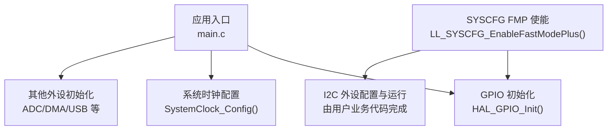
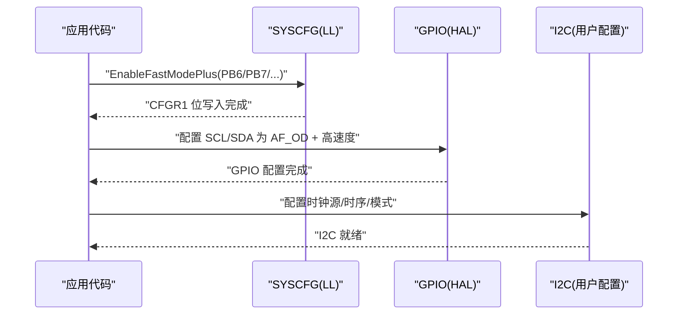
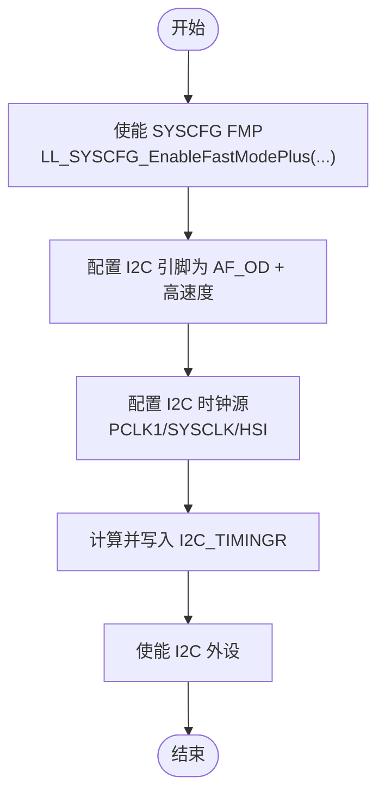
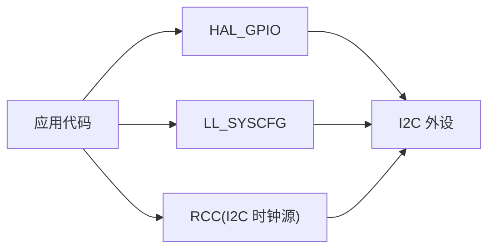

# Fast-mode Plus GPIO驱动能力

<cite>
**本文引用的文件**
- [Core/Src/main.c](file://Core/Src/main.c)
- [Core/Inc/main.h](file://Core/Inc/main.h)
- [Drivers/STM32G4xx_HAL_Driver/Inc/stm32g4xx_hal_gpio.h](file://Drivers/STM32G4xx_HAL_Driver/Inc/stm32g4xx_hal_gpio.h)
- [Drivers/STM32G4xx_HAL_Driver/Inc/stm32g4xx_ll_system.h](file://Drivers/STM32G4xx_HAL_Driver/Inc/stm32g4xx_ll_system.h)
- [Drivers/STM32G4xx_HAL_Driver/Inc/stm32g4xx_hal.h](file://Drivers/STM32G4xx_HAL_Driver/Inc/stm32g4xx_hal.h)
- [Drivers/CMSIS/Device/ST/STM32G4xx/Include/stm32g474xx.h](file://Drivers/CMSIS/Device/ST/STM32G4xx/Include/stm32g474xx.h)
</cite>

## 目录
1. [简介](#简介)
2. [项目结构](#项目结构)
3. [核心组件](#核心组件)
4. [架构总览](#架构总览)
5. [详细组件分析](#详细组件分析)
6. [依赖关系分析](#依赖关系分析)
7. [性能与功耗考量](#性能与功耗考量)
8. [故障排查指南](#故障排查指南)
9. [结论](#结论)
10. [附录：I2C基础与速度等级](#附录i2c基础与速度等级)

## 简介
本文件面向使用 STM32G4 系列 HAL/LL 库的开发者，系统性阐述如何通过 SYSCFG 的 Fast-mode Plus（FMP）功能增强 I2C 引脚驱动能力，从而在 PCB 走线较长或负载较重时稳定实现最高约 1MHz 的 I2C 通信速率。文档覆盖技术原理、引脚映射、配置方法、代码示例路径、功耗与 EMC 影响、与其他高速接口对比，以及从入门到进阶的实践建议。

## 项目结构
当前工程为基于 CubeMX 生成的 STM32G4 应用骨架，包含系统初始化、GPIO、ADC/DMA、USB CDC 等模块。Fast-mode Plus 属于系统级外设（SYSCFG）与 GPIO 驱动能力的组合特性，相关宏与 API 位于 HAL/LL 层头文件中。

图表来源
- [Core/Src/main.c:219-290](file://Core/Src/main.c#L219-L290)
- [Drivers/STM32G4xx_HAL_Driver/Inc/stm32g4xx_ll_system.h:458-500](file://Drivers/STM32G4xx_HAL_Driver/Inc/stm32g4xx_ll_system.h#L458-L500)

章节来源
- [Core/Src/main.c:219-290](file://Core/Src/main.c#L219-L290)

## 核心组件
- SYSCFG CFGR1 寄存器位域：提供 I2C PBx_FMP 与 I2Cx_FMP 控制位，用于开启特定引脚或 I2C 通道对应的 Fast-mode Plus 驱动能力。
- LL 层 API：LL_SYSCFG_EnableFastModePlus / LL_SYSCFG_DisableFastModePlus，直接操作 SYSCFG->CFGR1。
- HAL 层宏：SYSCFG_FASTMODEPLUS_PB6/PB7/PB8/PB9 等，便于以可读方式选择目标引脚。
- GPIO 速度档位：GPIO_SPEED_FREQ_HIGH / GPIO_SPEED_FREQ_VERY_HIGH，配合 FMP 可提升边沿驱动强度与时序裕量。

章节来源
- [Drivers/STM32G4xx_HAL_Driver/Inc/stm32g4xx_ll_system.h:110-132](file://Drivers/STM32G4xx_HAL_Driver/Inc/stm32g4xx_ll_system.h#L110-L132)
- [Drivers/STM32G4xx_HAL_Driver/Inc/stm32g4xx_ll_system.h:458-500](file://Drivers/STM32G4xx_HAL_Driver/Inc/stm32g4xx_ll_system.h#L458-L500)
- [Drivers/STM32G4xx_HAL_Driver/Inc/stm32g4xx_hal.h:170-183](file://Drivers/STM32G4xx_HAL_Driver/Inc/stm32g4xx_hal.h#L170-L183)
- [Drivers/STM32G4xx_HAL_Driver/Inc/stm32g4xx_hal_gpio.h:135-145](file://Drivers/STM32G4xx_HAL_Driver/Inc/stm32g4xx_hal_gpio.h#L135-L145)

## 架构总览
下图展示启用 Fast-mode Plus 的典型调用链与数据流：应用初始化阶段通过 LL/HAL 接口设置 SYSCFG，随后配置 GPIO 速度与复用，最后配置并启动 I2C 外设。

图表来源
- [Drivers/STM32G4xx_HAL_Driver/Inc/stm32g4xx_ll_system.h:458-500](file://Drivers/STM32G4xx_HAL_Driver/Inc/stm32g4xx_ll_system.h#L458-L500)
- [Drivers/STM32G4xx_HAL_Driver/Inc/stm32g4xx_hal_gpio.h:47-63](file://Drivers/STM32G4xx_HAL_Driver/Inc/stm32g4xx_hal_gpio.h#L47-L63)

## 详细组件分析

### SYSCFG Fast-mode Plus 机制与寄存器
- 作用：通过 SYSCFG_CFGR1 中的 I2C_PBx_FMP 与 I2Cx_FMP 位，提高对应 I2C 引脚的驱动电流能力，改善上升沿质量，支持更高频率（典型可达 1MHz）。
- 关键宏定义：
  - LL 层：LL_SYSCFG_I2C_FASTMODEPLUS_PB6/PB7/PB8/PB9/I2C1/I2C2/I2C3/I2C4
  - HAL 层：SYSCFG_FASTMODEPLUS_PB6/PB7/PB8/PB9
- 访问方式：
  - LL：LL_SYSCFG_EnableFastModePlus(Config) / LL_SYSCFG_DisableFastModePlus(Config)
  - HAL：可通过 __HAL_SYSCFG_ENABLE_FASTMODEPLUS 等宏（若存在），或直接操作 SYSCFG->CFGR1

章节来源
- [Drivers/STM32G4xx_HAL_Driver/Inc/stm32g4xx_ll_system.h:110-132](file://Drivers/STM32G4xx_HAL_Driver/Inc/stm32g4xx_ll_system.h#L110-L132)
- [Drivers/STM32G4xx_HAL_Driver/Inc/stm32g4xx_ll_system.h:458-500](file://Drivers/STM32G4xx_HAL_Driver/Inc/stm32g4xx_ll_system.h#L458-L500)
- [Drivers/STM32G4xx_HAL_Driver/Inc/stm32g4xx_hal.h:170-183](file://Drivers/STM32G4xx_HAL_Driver/Inc/stm32g4xx_hal.h#L170-L183)
- [Drivers/CMSIS/Device/ST/STM32G4xx/Include/stm32g474xx.h:846-853](file://Drivers/CMSIS/Device/ST/STM32G4xx/Include/stm32g474xx.h#L846-L853)

### GPIO 速度与复用配置
- 推荐模式：I2C SCL/SDA 使用开漏复用输出（AF_OD），并搭配较高速度档位（HIGH 或 VERY_HIGH）以获得更陡的边沿。
- 速度档位参考：
  - GPIO_SPEED_FREQ_HIGH：适用于 25–50 MHz 范围
  - GPIO_SPEED_FREQ_VERY_HIGH：适用于 50–120 MHz 范围
- 注意：即使未启用 FMP，提高 GPIO 速度也能改善信号质量；但达到 1MHz 时，FMP 对长走线/大容性负载尤为关键。

章节来源
- [Drivers/STM32G4xx_HAL_Driver/Inc/stm32g4xx_hal_gpio.h:135-145](file://Drivers/STM32G4xx_HAL_Driver/Inc/stm32g4xx_hal_gpio.h#L135-L145)
- [Drivers/STM32G4xx_HAL_Driver/Inc/stm32g4xx_hal_gpio.h:47-63](file://Drivers/STM32G4xx_HAL_Driver/Inc/stm32g4xx_hal_gpio.h#L47-L63)

### I2C 通道与引脚映射（PB6/PB7/PB8/PB9）
- 常见映射（不同封装可能略有差异，请以具体器件数据手册为准）：
  - I2C1：SCL=PB6，SDA=PB7
  - I2C2：SCL=PB8，SDA=PB9
- 使能策略：
  - 按引脚粒度：LL_SYSCFG_I2C_FASTMODEPLUS_PB6 / PB7 / PB8 / PB9
  - 按通道粒度：LL_SYSCFG_I2C_FASTMODEPLUS_I2C1 / I2C2 / I2C3 / I2C4
- 校验宏：HAL 层提供 IS_SYSCFG_FASTMODEPLUS(__PIN__) 用于参数合法性检查。

章节来源
- [Drivers/STM32G4xx_HAL_Driver/Inc/stm32g4xx_ll_system.h:110-132](file://Drivers/STM32G4xx_HAL_Driver/Inc/stm32g4xx_ll_system.h#L110-L132)
- [Drivers/STM32G4xx_HAL_Driver/Inc/stm32g4xx_hal.h:484-500](file://Drivers/STM32G4xx_HAL_Driver/Inc/stm32g4xx_hal.h#L484-L500)

### 代码示例路径（不含源码内容）
- 在系统初始化阶段启用 FMP（示例路径）：
  - 参考位置：[Core/Src/main.c:219-290](file://Core/Src/main.c#L219-L290)
  - 建议在 SystemClock_Config 之后、外设初始化之前调用 LL_SYSCFG_EnableFastModePlus(...)
- 配置 I2C 引脚为 AF_OD 并设置高速度（示例路径）：
  - 参考位置：[Core/Src/main.c:488-520](file://Core/Src/main.c#L488-L520)
  - 将 SCL/SDA 的 Mode 设为 AF_OD，Speed 设为 HIGH 或 VERY_HIGH
- 配置 I2C 时钟源与时序（示例路径）：
  - 时钟源可选 PCLK1/SYSCLK/HSI，参考 RCC 宏与函数：
    - [Drivers/STM32G4xx_HAL_Driver/Inc/stm32g4xx_ll_rcc.h:1570-1594](file://Drivers/STM32G4xx_HAL_Driver/Inc/stm32g4xx_ll_rcc.h#L1570-L1594)
    - [Drivers/STM32G4xx_HAL_Driver/Inc/stm32g4xx_hal_rcc_ex.h:756-798](file://Drivers/STM32G4xx_HAL_Driver/Inc/stm32g4xx_hal_rcc_ex.h#L756-L798)
  - I2C 时序寄存器字段参考：
    - [Drivers/CMSIS/Device/ST/STM32G4xx/Include/stm32g474xx.h:10469-10484](file://Drivers/CMSIS/Device/ST/STM32G4xx/Include/stm32g474xx.h#L10469-L10484)

章节来源
- [Core/Src/main.c:219-290](file://Core/Src/main.c#L219-L290)
- [Core/Src/main.c:488-520](file://Core/Src/main.c#L488-L520)
- [Drivers/STM32G4xx_HAL_Driver/Inc/stm32g4xx_ll_rcc.h:1570-1594](file://Drivers/STM32G4xx_HAL_Driver/Inc/stm32g4xx_ll_rcc.h#L1570-L1594)
- [Drivers/STM32G4xx_HAL_Driver/Inc/stm32g4xx_hal_rcc_ex.h:756-798](file://Drivers/STM32G4xx_HAL_Driver/Inc/stm32g4xx_hal_rcc_ex.h#L756-L798)
- [Drivers/CMSIS/Device/ST/STM32G4xx/Include/stm32g474xx.h:10469-10484](file://Drivers/CMSIS/Device/ST/STM32G4xx/Include/stm32g474xx.h#L10469-L10484)

### 流程图：启用 Fast-mode Plus 的配置步骤

图表来源
- [Drivers/STM32G4xx_HAL_Driver/Inc/stm32g4xx_ll_system.h:458-500](file://Drivers/STM32G4xx_HAL_Driver/Inc/stm32g4xx_ll_system.h#L458-L500)
- [Drivers/STM32G4xx_HAL_Driver/Inc/stm32g4xx_ll_rcc.h:1570-1594](file://Drivers/STM32G4xx_HAL_Driver/Inc/stm32g4xx_ll_rcc.h#L1570-L1594)
- [Drivers/CMSIS/Device/ST/STM32G4xx/Include/stm32g474xx.h:10469-10484](file://Drivers/CMSIS/Device/ST/STM32G4xx/Include/stm32g474xx.h#L10469-L10484)

## 依赖关系分析
- 组件耦合：
  - 应用代码依赖 LL_SYSCFG 与 HAL_GPIO 进行底层配置
  - I2C 外设依赖 RCC 提供的时钟源与时钟频率
  - 引脚复用依赖正确的 Alternate Function 选择（如 AF4_I2Cx）
- 外部依赖：
  - 器件数据手册与参考手册决定 PB6/PB7/PB8/PB9 的具体复用与 FMP 支持情况
  - PCB 布局与终端电阻对 1MHz 稳定性至关重要

图表来源
- [Drivers/STM32G4xx_HAL_Driver/Inc/stm32g4xx_ll_system.h:458-500](file://Drivers/STM32G4xx_HAL_Driver/Inc/stm32g4xx_ll_system.h#L458-L500)
- [Drivers/STM32G4xx_HAL_Driver/Inc/stm32g4xx_hal_gpio.h:47-63](file://Drivers/STM32G4xx_HAL_Driver/Inc/stm32g4xx_hal_gpio.h#L47-L63)
- [Drivers/STM32G4xx_HAL_Driver/Inc/stm32g4xx_ll_rcc.h:1570-1594](file://Drivers/STM32G4xx_HAL_Driver/Inc/stm32g4xx_ll_rcc.h#L1570-L1594)

章节来源
- [Drivers/STM32G4xx_HAL_Driver/Inc/stm32g4xx_ll_system.h:458-500](file://Drivers/STM32G4xx_HAL_Driver/Inc/stm32g4xx_ll_system.h#L458-L500)
- [Drivers/STM32G4xx_HAL_Driver/Inc/stm32g4xx_hal_gpio.h:47-63](file://Drivers/STM32G4xx_HAL_Driver/Inc/stm32g4xx_hal_gpio.h#L47-L63)
- [Drivers/STM32G4xx_HAL_Driver/Inc/stm32g4xx_ll_rcc.h:1570-1594](file://Drivers/STM32G4xx_HAL_Driver/Inc/stm32g4xx_ll_rcc.h#L1570-L1594)

## 性能与功耗考量
- 性能收益：
  - FMP 提升驱动电流，改善上升沿，降低长走线/大容性负载下的误码率，有助于稳定达到 1MHz。
- 功耗影响：
  - 更高的驱动电流与更快的边沿会增加动态功耗；在电池供电场景需权衡速率与功耗。
- EMC 设计建议：
  - 合理布局 I2C 走线，尽量短且远离噪声源
  - 适当增加上拉电阻阻值或使用有源上拉以降低过冲与振铃
  - 必要时添加磁珠或小串联电阻抑制高频辐射
- 与其他高速接口对比与选择：
  - SPI：全双工、更高吞吐，适合大容量数据传输；但占用更多引脚与布线复杂度更高
  - UART：简单可靠，适合调试与低速数据；不适合多设备总线拓扑
  - I2C：两线半双工、多主多从、地址寻址，适合传感器/EEPROM/RTC 等中低速场景；启用 FMP 后可达 1MHz，兼顾易用性与性能

[本节为通用指导，不直接分析具体文件]

## 故障排查指南
- 现象：I2C 在 400kHz 正常，1MHz 不稳定
  - 检查是否已启用对应引脚或通道的 FMP
  - 确认 GPIO 模式为 AF_OD，速度设置为 HIGH 或 VERY_HIGH
  - 核对 I2C 时钟源与频率，确保 TIMINGR 计算正确
  - 测量波形，关注上升沿时间与过冲/振铃
- 现象：通信偶发错误
  - 检查终端电阻与走线长度，必要时调整上拉电阻
  - 避免与强噪声源并行走线，必要时屏蔽或加地线隔离
- 现象：功耗异常升高
  - 评估是否在高负载下长期运行于 1MHz，考虑降速或间歇工作

章节来源
- [Drivers/STM32G4xx_HAL_Driver/Inc/stm32g4xx_ll_system.h:458-500](file://Drivers/STM32G4xx_HAL_Driver/Inc/stm32g4xx_ll_system.h#L458-L500)
- [Drivers/STM32G4xx_HAL_Driver/Inc/stm32g4xx_hal_gpio.h:135-145](file://Drivers/STM32G4xx_HAL_Driver/Inc/stm32g4xx_hal_gpio.h#L135-L145)
- [Drivers/CMSIS/Device/ST/STM32G4xx/Include/stm32g474xx.h:10469-10484](file://Drivers/CMSIS/Device/ST/STM32G4xx/Include/stm32g474xx.h#L10469-L10484)

## 结论
通过 SYSCFG 的 Fast-mode Plus 功能，STM32G4 可在 PB6/PB7（I2C1）与 PB8/PB9（I2C2）等引脚上显著提升 I2C 驱动能力，结合合适的 GPIO 速度与合理的 PCB 设计，能够稳定实现接近 1MHz 的通信速率。在实际工程中，应综合权衡功耗、EMC 与可靠性，选择合适的接口与速率，并在硬件与软件层面协同优化。

[本节为总结性内容，不直接分析具体文件]

## 附录：I2C基础与速度等级
- 标准模式（Standard Mode）：最高 100kHz
- 快速模式（Fast Mode）：最高 400kHz
- 快速模式+（Fast-mode Plus）：最高约 1MHz（受限于引脚驱动与 PCB 条件）
- 高速模式（High-speed Mode）：部分器件支持，需额外配置与严格 PCB 要求

[本节为概念性说明，不直接分析具体文件]