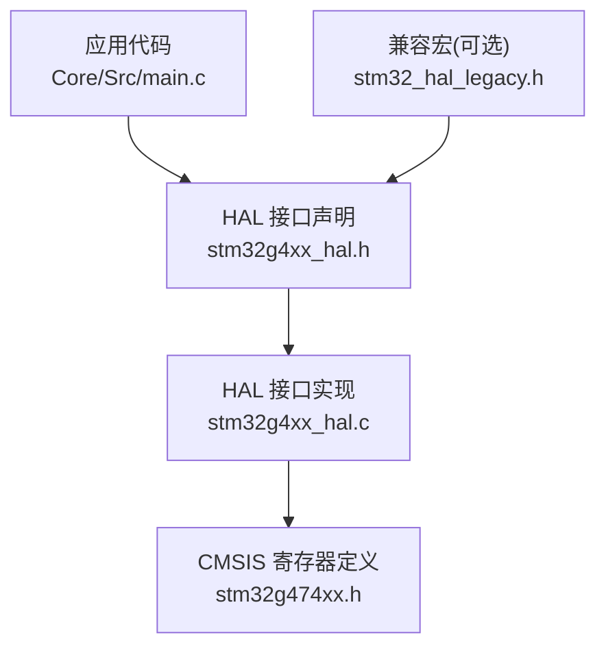
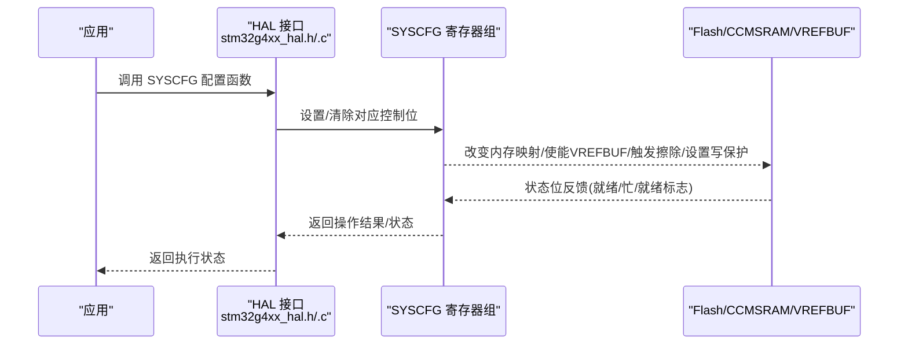
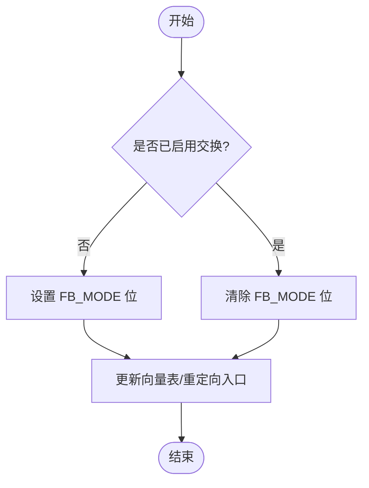
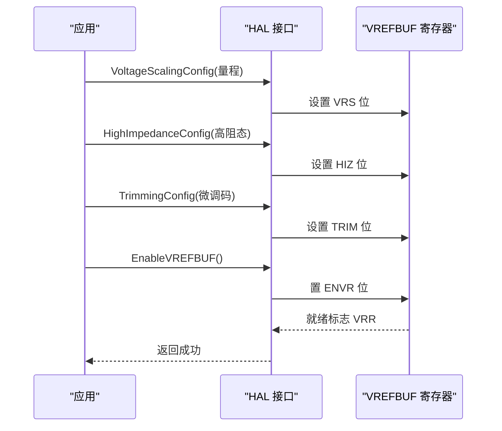
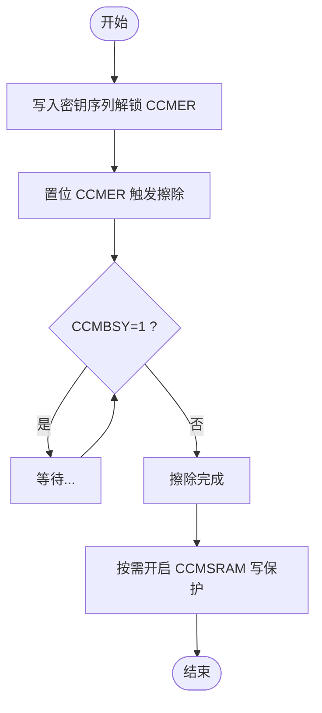
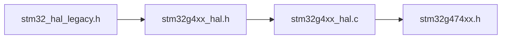

# SYSCFG系统配置服务

<cite>
**本文引用的文件**   
- [stm32g4xx_hal.h](file://Drivers/STM32G4xx_HAL_Driver/Inc/stm32g4xx_hal.h)
- [stm32g4xx_hal.c](file://Drivers/STM32G4xx_HAL_Driver/Src/stm32g4xx_hal.c)
- [stm32g474xx.h](file://Drivers/CMSIS/Device/ST/STM32G4xx/Include/stm32g474xx.h)
- [stm32_hal_legacy.h](file://Drivers/STM32G4xx_HAL_Driver/Inc/Legacy/stm32_hal_legacy.h)
- [main.c](file://Core/Src/main.c)
</cite>

## 目录
1. [简介](#简介)
2. [项目结构](#项目结构)
3. [核心组件](#核心组件)
4. [架构总览](#架构总览)
5. [详细组件分析](#详细组件分析)
6. [依赖关系分析](#依赖关系分析)
7. [性能与功耗考量](#性能与功耗考量)
8. [故障排查指南](#故障排查指南)
9. [结论](#结论)
10. [附录：常用宏与参数速查](#附录常用宏与参数速查)

## 简介
本文件面向使用 STM32G4 系列 HAL 库的开发者，系统化讲解 SYSCFG 模块的系统级配置能力，重点覆盖以下特性：
- 内部 Flash 双Bank内存映射切换（启动模式选择）
- VREFBUF 电压基准缓冲器（输出量程、高阻态、校准微调）
- CCMSRAM 擦除与写保护机制

文档同时提供从入门到进阶的使用建议、典型应用场景（如启动模式切换、ADC参考电压优化、关键数据保护），并给出基于仓库中实际头文件与实现的引用路径，便于读者快速定位源码。

## 项目结构
本项目为基于 STM32CubeMX 生成的工程，SYSCFG 相关 API 声明位于 HAL 驱动头文件，实现位于 HAL 驱动源文件；底层寄存器定义由 CMSIS 设备头文件提供。应用层 main.c 展示了 ADC/DMA/USB 等外设的典型用法，可作为集成 SYSCFG 配置的参考上下文。

图示来源
- [stm32g4xx_hal.h:590-607](file://Drivers/STM32G4xx_HAL_Driver/Inc/stm32g4xx_hal.h#L590-L607)
- [stm32g4xx_hal.c:594-640](file://Drivers/STM32G4xx_HAL_Driver/Src/stm32g4xx_hal.c#L594-L640)
- [stm32g474xx.h:16360-16381](file://Drivers/CMSIS/Device/ST/STM32G4xx/Include/stm32g474xx.h#L16360-L16381)
- [stm32_hal_legacy.h:627-633](file://Drivers/STM32G4xx_HAL_Driver/Inc/Legacy/stm32_hal_legacy.h#L627-L633)

章节来源
- [main.c:219-290](file://Core/Src/main.c#L219-L290)

## 核心组件
- 内存映射切换
  - 启用/禁用内部 Flash Bank 交换，用于将 Bank2 映射至 0x0800_0000，实现“从第二扇区启动”或“热更新后切换运行区域”。
  - 关键函数：HAL_SYSCFG_EnableMemorySwappingBank()、HAL_SYSCFG_DisableMemorySwappingBank()
- VREFBUF 电压基准缓冲器
  - 提供稳定的片内参考电压，支持多档输出量程、高阻态隔离、以及用户微调码，常用于提升 ADC 采样精度。
  - 关键函数：HAL_SYSCFG_VREFBUF_VoltageScalingConfig()、HAL_SYSCFG_VREFBUF_HighImpedanceConfig()、HAL_SYSCFG_VREFBUF_TrimmingConfig()、HAL_SYSCFG_EnableVREFBUF()、HAL_SYSCFG_DisableVREFBUF()
- CCMSRAM 擦除与写保护
  - 擦除：通过密钥解锁后触发硬件擦除请求，等待完成标志位复位。
  - 写保护：按页粒度开启写保护，防止关键数据被意外修改。
  - 关键函数：HAL_SYSCFG_CCMSRAMErase()、HAL_SYSCFG_CCMSRAM_WriteProtectionEnable()

章节来源
- [stm32g4xx_hal.h:590-607](file://Drivers/STM32G4xx_HAL_Driver/Inc/stm32g4xx_hal.h#L590-L607)
- [stm32g4xx_hal.c:594-640](file://Drivers/STM32G4xx_HAL_Driver/Src/stm32g4xx_hal.c#L594-L640)

## 架构总览
下图展示 SYSCFG 在 HAL 层与 CMSIS 寄存器层之间的调用关系，以及各功能对应的寄存器位域。

图示来源
- [stm32g4xx_hal.c:594-640](file://Drivers/STM32G4xx_HAL_Driver/Src/stm32g4xx_hal.c#L594-L640)
- [stm32g474xx.h:16360-16381](file://Drivers/CMSIS/Device/ST/STM32G4xx/Include/stm32g474xx.h#L16360-L16381)

## 详细组件分析

### 内存映射切换（Flash Bank 交换）
- 功能说明
  - 默认：Bank1 映射至 0x0800_0000，Bank2 映射至 0x0804_0000。
  - 交换后：Bank2 映射至 0x0800_0000，Bank1 映射至 0x0804_0000。
  - 典型用途：Bootloader 完成后切换到应用区；OTA 升级后重启进入新固件。
- 关键流程
  - 启用交换：设置 SYSCFG_MEMRMP_FB_MODE。
  - 禁用交换：清除 SYSCFG_MEMRMP_FB_MODE。
- 注意事项
  - 切换后需确保中断向量表、栈指针、入口地址与新映射一致。
  - 建议在切换前关闭可能访问 Flash 的中断，避免切换期间的取指异常。

图示来源
- [stm32g4xx_hal.c:612-640](file://Drivers/STM32G4xx_HAL_Driver/Src/stm32g4xx_hal.c#L612-L640)

章节来源
- [stm32g4xx_hal.h:591-593](file://Drivers/STM32G4xx_HAL_Driver/Inc/stm32g4xx_hal.h#L591-L593)
- [stm32g4xx_hal.c:612-640](file://Drivers/STM32G4xx_HAL_Driver/Src/stm32g4xx_hal.c#L612-L640)

### VREFBUF 电压基准缓冲器
- 功能说明
  - 提供稳定参考电压，改善 ADC 转换精度与稳定性。
  - 支持多档输出量程、高阻态隔离、以及用户微调码。
- 关键函数
  - HAL_SYSCFG_VREFBUF_VoltageScalingConfig(VoltageScaling)
  - HAL_SYSCFG_VREFBUF_HighImpedanceConfig(Mode)
  - HAL_SYSCFG_VREFBUF_TrimmingConfig(TrimmingValue)
  - HAL_SYSCFG_EnableVREFBUF() / HAL_SYSCFG_DisableVREFBUF()
- 参数与宏
  - 量程选项：SYSCFG_VREFBUF_VOLTAGE_SCALE0/1/2（分别对应不同输出电压）。
  - 高阻态：SYSCFG_VREFBUF_HIGH_IMPEDANCE_DISABLE/ENABLE。
  - 微调码范围：受限于 CCR_TRIM 位宽。
- 典型流程
  - 配置量程 → 可选配置高阻态 → 可选写入微调码 → 使能 VREFBUF → 等待就绪 → 使用 ADC。

图示来源
- [stm32g4xx_hal.h:595-601](file://Drivers/STM32G4xx_HAL_Driver/Inc/stm32g4xx_hal.h#L595-L601)
- [stm32g474xx.h:16360-16381](file://Drivers/CMSIS/Device/ST/STM32G4xx/Include/stm32g474xx.h#L16360-L16381)

章节来源
- [stm32g4xx_hal.h:139-151](file://Drivers/STM32G4xx_HAL_Driver/Inc/stm32g4xx_hal.h#L139-L151)
- [stm32g4xx_hal.h:473-481](file://Drivers/STM32G4xx_HAL_Driver/Inc/stm32g4xx_hal.h#L473-L481)
- [stm32g474xx.h:16360-16381](file://Drivers/CMSIS/Device/ST/STM32G4xx/Include/stm32g474xx.h#L16360-L16381)
- [stm32_hal_legacy.h:627-633](file://Drivers/STM32G4xx_HAL_Driver/Inc/Legacy/stm32_hal_legacy.h#L627-L633)

### CCMSRAM 擦除与写保护
- 擦除流程
  - 通过 SKR 写入特定序列解锁 CCMER 位保护。
  - 置位 CCMER 触发硬件擦除，等待 CCMBSY 清零表示完成。
- 写保护
  - 按页粒度开启写保护，防止运行时误写。
  - 页掩码宏：SYSCFG_SWPR_PAGE0~PAGE4 等。
- 状态查询
  - 使用 __HAL_SYSCFG_GET_FLAG(SYSCFG_SCSR_CCMBSY) 判断擦除进行中。

图示来源
- [stm32g4xx_hal.c:594-611](file://Drivers/STM32G4xx_HAL_Driver/Src/stm32g4xx_hal.c#L594-L611)
- [stm32g4xx_hal.h:413-421](file://Drivers/STM32G4xx_HAL_Driver/Inc/stm32g4xx_hal.h#L413-L421)
- [stm32g474xx.h:14681-14718](file://Drivers/CMSIS/Device/ST/STM32G4xx/Include/stm32g474xx.h#L14681-L14718)

章节来源
- [stm32g4xx_hal.h:591-593](file://Drivers/STM32G4xx_HAL_Driver/Inc/stm32g4xx_hal.h#L591-L593)
- [stm32g4xx_hal.h:607](file://Drivers/STM32G4xx_HAL_Driver/Inc/stm32g4xx_hal.h#L607)
- [stm32g4xx_hal.c:594-611](file://Drivers/STM32G4xx_HAL_Driver/Src/stm32g4xx_hal.c#L594-L611)
- [stm32g474xx.h:14681-14718](file://Drivers/CMSIS/Device/ST/STM32G4xx/Include/stm32g474xx.h#L14681-L14718)

### 实战示例指引（无代码片段）
- 启动模式配置（从 Bank2 启动）
  - 在 Bootloader 中完成应用镜像烧录后，调用启用内存交换函数，随后复位进入新应用。
  - 参考路径：[启用/禁用内存交换:612-640](file://Drivers/STM32G4xx_HAL_Driver/Src/stm32g4xx_hal.c#L612-L640)
- ADC 参考电压优化
  - 先配置 VREFBUF 量程与微调码，再使能 VREFBUF，等待就绪后再启动 ADC 采集。
  - 参考路径：[VREFBUF 配置宏与接口:139-151](file://Drivers/STM32G4xx_HAL_Driver/Inc/stm32g4xx_hal.h#L139-L151), [VREFBUF 寄存器位定义:16360-16381](file://Drivers/CMSIS/Device/ST/STM32G4xx/Include/stm32g474xx.h#L16360-L16381)
- 关键数据保护（CCMSRAM 写保护）
  - 在初始化阶段对包含关键参数的页面开启写保护，防止运行时误写。
  - 参考路径：[CCMSRAM 写保护接口](file://Drivers/STM32G4xx_HAL_Driver/Inc/stm32g4xx_hal.h#L607), [SWPR 页掩码宏:14706-14718](file://Drivers/CMSIS/Device/ST/STM32G4xx/Include/stm32g474xx.h#L14706-L14718)

章节来源
- [stm32g4xx_hal.c:594-640](file://Drivers/STM32G4xx_HAL_Driver/Src/stm32g4xx_hal.c#L594-L640)
- [stm32g4xx_hal.h:595-607](file://Drivers/STM32G4xx_HAL_Driver/Inc/stm32g4xx_hal.h#L595-L607)
- [stm32g474xx.h:16360-16381](file://Drivers/CMSIS/Device/ST/STM32G4xx/Include/stm32g474xx.h#L16360-L16381)
- [stm32g474xx.h:14706-14718](file://Drivers/CMSIS/Device/ST/STM32G4xx/Include/stm32g474xx.h#L14706-L14718)

## 依赖关系分析
- HAL 层对外暴露统一 API，屏蔽具体寄存器差异。
- CMSIS 设备头文件提供寄存器基址、位域与宏定义。
- Legacy 兼容宏用于跨版本迁移，保持旧代码可编译。

图示来源
- [stm32g4xx_hal.h:590-607](file://Drivers/STM32G4xx_HAL_Driver/Inc/stm32g4xx_hal.h#L590-L607)
- [stm32g4xx_hal.c:594-640](file://Drivers/STM32G4xx_HAL_Driver/Src/stm32g4xx_hal.c#L594-L640)
- [stm32g474xx.h:16360-16381](file://Drivers/CMSIS/Device/ST/STM32G4xx/Include/stm32g474xx.h#L16360-L16381)
- [stm32_hal_legacy.h:627-633](file://Drivers/STM32G4xx_HAL_Driver/Inc/Legacy/stm32_hal_legacy.h#L627-L633)

章节来源
- [stm32g4xx_hal.h:590-607](file://Drivers/STM32G4xx_HAL_Driver/Inc/stm32g4xx_hal.h#L590-L607)
- [stm32g4xx_hal.c:594-640](file://Drivers/STM32G4xx_HAL_Driver/Src/stm32g4xx_hal.c#L594-L640)
- [stm32g474xx.h:16360-16381](file://Drivers/CMSIS/Device/ST/STM32G4xx/Include/stm32g474xx.h#L16360-L16381)
- [stm32_hal_legacy.h:627-633](file://Drivers/STM32G4xx_HAL_Driver/Inc/Legacy/stm32_hal_legacy.h#L627-L633)

## 性能与功耗考量
- 内存映射切换
  - 切换前后务必保证中断向量表与入口地址正确重定向，避免取指失败导致 HardFault。
  - 切换期间尽量屏蔽外部中断，减少时序抖动。
- VREFBUF
  - 合理选择量程：量程越高，静态功耗越大；结合 ADC 输入范围选择最小可用量程以降低功耗。
  - 微调码可在量产时根据芯片个体差异进行补偿，提高 ADC 线性度与一致性。
- CCMSRAM
  - 擦除操作会占用一定时间，期间不可访问 CCMSRAM；应在合适时机（如空闲期）执行。
  - 写保护一旦开启，需在需要修改时谨慎解锁策略，避免引入安全风险。

## 故障排查指南
- 内存映射切换后无法启动
  - 检查向量表偏移与入口地址是否与目标 Bank 匹配。
  - 确认切换后复位路径正确，必要时在切换前关闭可能访问 Flash 的中断。
- VREFBUF 未就绪或输出异常
  - 确认已使能且等待 VRR 就绪标志。
  - 核对量程与微调码是否在合法范围内。
- CCMSRAM 擦除卡住
  - 检查是否重复触发擦除或在擦除过程中访问 CCMSRAM。
  - 使用状态位查询 CCMBSY，确保等待完成。
- 写保护导致写入失败
  - 确认目标页是否已开启写保护，必要时按安全策略解锁。

章节来源
- [stm32g4xx_hal.h:413-421](file://Drivers/STM32G4xx_HAL_Driver/Inc/stm32g4xx_hal.h#L413-L421)
- [stm32g4xx_hal.c:594-611](file://Drivers/STM32G4xx_HAL_Driver/Src/stm32g4xx_hal.c#L594-L611)
- [stm32g474xx.h:16360-16381](file://Drivers/CMSIS/Device/ST/STM32G4xx/Include/stm32g474xx.h#L16360-L16381)

## 结论
SYSCFG 提供了关键的系统级配置能力，涵盖启动模式切换、高精度参考电压与关键数据保护。通过 HAL 接口可以以统一方式访问这些特性，既简化了开发，又保证了在不同子型号间的兼容性。在实际工程中，建议结合产品需求与功耗预算，选择合适的量程与保护策略，并在关键路径上做好状态检查与时序控制。

## 附录：常用宏与参数速查
- 内存映射切换
  - 启用/禁用：见 [接口声明:591-593](file://Drivers/STM32G4xx_HAL_Driver/Inc/stm32g4xx_hal.h#L591-L593)、[实现:612-640](file://Drivers/STM32G4xx_HAL_Driver/Src/stm32g4xx_hal.c#L612-L640)
- VREFBUF
  - 量程宏：SYSCFG_VREFBUF_VOLTAGE_SCALE0/1/2，见 [宏定义:139-141](file://Drivers/STM32G4xx_HAL_Driver/Inc/stm32g4xx_hal.h#L139-L141)
  - 高阻态宏：SYSCFG_VREFBUF_HIGH_IMPEDANCE_DISABLE/ENABLE，见 [宏定义:150-151](file://Drivers/STM32G4xx_HAL_Driver/Inc/stm32g4xx_hal.h#L150-L151)
  - 寄存器位域：VREFBUF_CSR_ENVR/HIZ/VRR/VRS、VREFBUF_CCR_TRIM，见 [位定义:16360-16381](file://Drivers/CMSIS/Device/ST/STM32G4xx/Include/stm32g474xx.h#L16360-L16381)
  - 兼容宏（Legacy）：见 [兼容宏:627-633](file://Drivers/STM32G4xx_HAL_Driver/Inc/Legacy/stm32_hal_legacy.h#L627-L633)
- CCMSRAM
  - 擦除接口：见 [实现:594-611](file://Drivers/STM32G4xx_HAL_Driver/Src/stm32g4xx_hal.c#L594-L611)
  - 写保护接口：见 [接口声明](file://Drivers/STM32G4xx_HAL_Driver/Inc/stm32g4xx_hal.h#L607)
  - SWPR 页掩码宏：SYSCFG_SWPR_PAGE0~PAGE4，见 [位定义:14706-14718](file://Drivers/CMSIS/Device/ST/STM32G4xx/Include/stm32g474xx.h#L14706-L14718)
  - 擦除状态位：SYSCFG_SCSR_CCMBSY，见 [位定义:14681-14684](file://Drivers/CMSIS/Device/ST/STM32G4xx/Include/stm32g474xx.h#L14681-L14684)