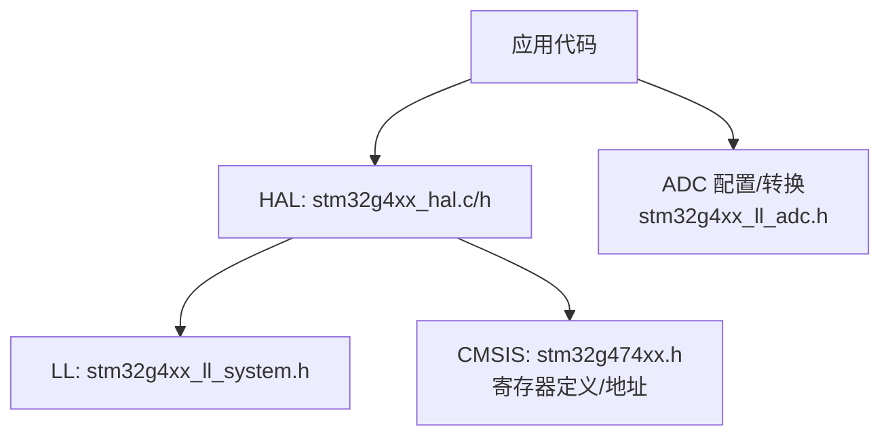
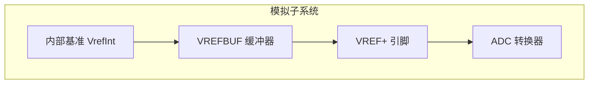
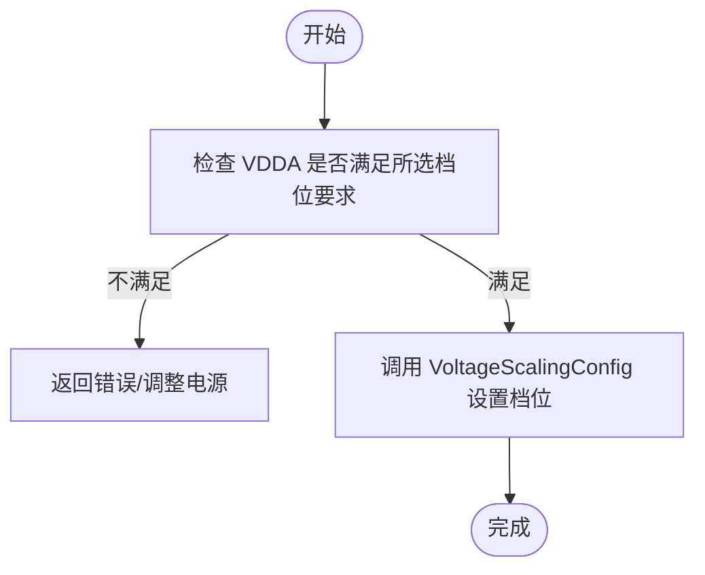
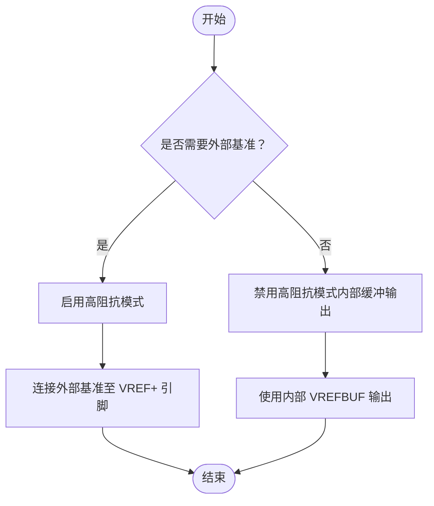
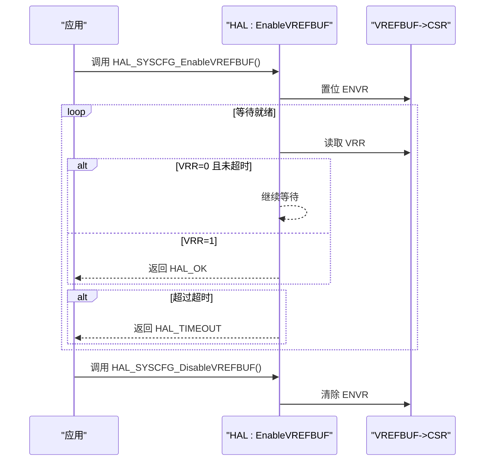
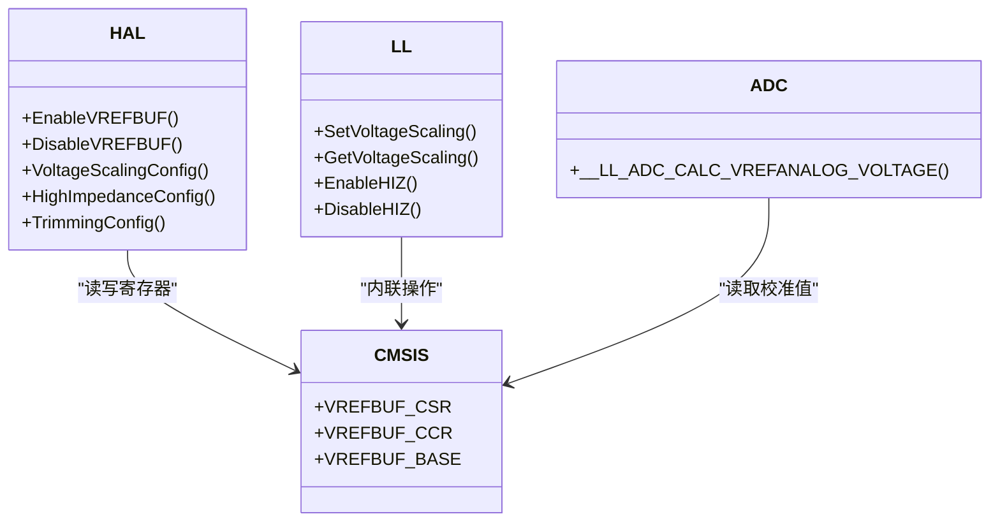
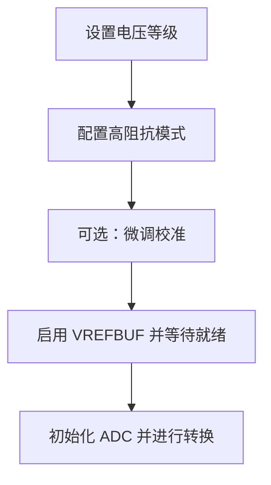

# VREFBUF电压基准缓冲器控制

<cite>
**本文引用的文件**   
- [stm32g4xx_hal.c](file://Drivers/STM32G4xx_HAL_Driver/Src/stm32g4xx_hal.c)
- [stm32g4xx_hal.h](file://Drivers/STM32G4xx_HAL_Driver/Inc/stm32g4xx_hal.h)
- [stm32g474xx.h](file://Drivers/CMSIS/Device/ST/STM32G4xx/Include/stm32g474xx.h)
- [stm32g4xx_ll_system.h](file://Drivers/STM32G4xx_HAL_Driver/Inc/stm32g4xx_ll_system.h)
- [stm32g4xx_ll_adc.h](file://Drivers/STM32G4xx_HAL_Driver/Inc/stm32g4xx_ll_adc.h)
</cite>

## 目录
1. [简介](#简介)
2. [项目结构](#项目结构)
3. [核心组件](#核心组件)
4. [架构总览](#架构总览)
5. [详细组件分析](#详细组件分析)
6. [依赖关系分析](#依赖关系分析)
7. [性能与功耗考虑](#性能与功耗考虑)
8. [故障排查指南](#故障排查指南)
9. [结论](#结论)
10. [附录：配置时序与最佳实践](#附录配置时序与最佳实践)

## 简介
本文件面向使用 STM32G4 系列 HAL 库的开发者，系统性讲解内部电压基准缓冲器（VREFBUF）模块的作用、工作原理与使用方法。重点覆盖以下方面：
- VREFBUF 的功能定位：为 ADC、比较器等模拟外设提供稳定、低噪声的内部电压参考源；支持多档输出电平调节与高阻抗模式切换。
- HAL 层 API 用法：启用/禁用、电压等级设置、高阻抗模式配置、校准微调等。
- 不同电压等级的适用场景与精度特性：2.048V、2.5V、2.9V 三档及其对 VDDA 的要求。
- 典型应用：ADC 高精度采样、外部基准源复用、温度传感器测量等。
- 高阻抗模式的使用策略：何时将 VREF+ 引脚作为外部基准输入，何时使用内部缓冲输出。
- 配置时序与功耗考量：启动等待、超时处理、关闭以节能等。
- 初学者入门与高级优化建议：从基础概念到 ADC 性能调优的最佳实践。

## 项目结构
与 VREFBUF 相关的代码主要分布在 HAL 驱动层与 CMSIS 设备头文件中：
- HAL 实现与函数声明：位于 stm32g4xx_hal.c 与 stm32g4xx_hal.h
- LL 层辅助接口：位于 stm32g4xx_ll_system.h
- 寄存器定义与地址映射：位于 stm32g474xx.h
- ADC 相关宏与计算工具：位于 stm32g4xx_ll_adc.h

图表来源
- [stm32g4xx_hal.c:642-727](file://Drivers/STM32G4xx_HAL_Driver/Src/stm32g4xx_hal.c#L642-L727)
- [stm32g4xx_hal.h:595-601](file://Drivers/STM32G4xx_HAL_Driver/Inc/stm32g4xx_hal.h#L595-L601)
- [stm32g474xx.h:16361-16379](file://Drivers/CMSIS/Device/ST/STM32G4xx/Include/stm32g474xx.h#L16361-L16379)
- [stm32g4xx_ll_system.h:1181-1226](file://Drivers/STM32G4xx_HAL_Driver/Inc/stm32g4xx_ll_system.h#L1181-L1226)
- [stm32g4xx_ll_adc.h:3382-3413](file://Drivers/STM32G4xx_HAL_Driver/Inc/stm32g4xx_ll_adc.h#L3382-L3413)

章节来源
- [stm32g4xx_hal.c:642-727](file://Drivers/STM32G4xx_HAL_Driver/Src/stm32g4xx_hal.c#L642-L727)
- [stm32g4xx_hal.h:595-601](file://Drivers/STM32G4xx_HAL_Driver/Inc/stm32g4xx_hal.h#L595-L601)
- [stm32g474xx.h:16361-16379](file://Drivers/CMSIS/Device/ST/STM32G4xx/Include/stm32g474xx.h#L16361-L16379)
- [stm32g4xx_ll_system.h:1181-1226](file://Drivers/STM32G4xx_HAL_Driver/Inc/stm32g4xx_ll_system.h#L1181-L1226)
- [stm32g4xx_ll_adc.h:3382-3413](file://Drivers/STM32G4xx_HAL_Driver/Inc/stm32g4xx_ll_adc.h#L3382-L3413)

## 核心组件
- VREFBUF 寄存器组
  - CSR：控制与状态寄存器，包含使能位、就绪标志、高阻模式位、电压等级选择位等。
  - CCR：校准与控制寄存器，包含微调码字段。
- HAL 层 API
  - 启用/禁用：HAL_SYSCFG_EnableVREFBUF()、HAL_SYSCFG_DisableVREFBUF()
  - 电压等级设置：HAL_SYSCFG_VREFBUF_VoltageScalingConfig()
  - 高阻抗模式：HAL_SYSCFG_VREFBUF_HighImpedanceConfig()
  - 校准微调：HAL_SYSCFG_VREFBUF_TrimmingConfig()
- LL 层辅助接口
  - LL_VREFBUF_SetVoltageScaling()、LL_VREFBUF_GetVoltageScaling()
  - LL_VREFBUF_EnableHIZ()、LL_VREFBUF_DisableHIZ()
- ADC 辅助宏
  - __LL_ADC_CALC_VREFANALOG_VOLTAGE(...)：基于内部 VrefInt 校准值换算实际 Vref+ 电压。

章节来源
- [stm32g474xx.h:16361-16379](file://Drivers/CMSIS/Device/ST/STM32G4xx/Include/stm32g474xx.h#L16361-L16379)
- [stm32g4xx_hal.h:595-601](file://Drivers/STM32G4xx_HAL_Driver/Inc/stm32g4xx_hal.h#L595-L601)
- [stm32g4xx_ll_system.h:1181-1226](file://Drivers/STM32G4xx_HAL_Driver/Inc/stm32g4xx_ll_system.h#L1181-L1226)
- [stm32g4xx_ll_adc.h:3382-3413](file://Drivers/STM32G4xx_HAL_Driver/Inc/stm32g4xx_ll_adc.h#L3382-L3413)

## 架构总览
下图展示了 VREFBUF 在系统中的作用位置以及与 ADC 的关系。VREFBUF 通过内部缓冲产生稳定的参考电压，可经 VREF+ 引脚输出供 ADC 使用，也可在高阻抗模式下让外部基准接入该引脚。

图表来源
- [stm32g474xx.h:16361-16379](file://Drivers/CMSIS/Device/ST/STM32G4xx/Include/stm32g474xx.h#L16361-L16379)
- [stm32g4xx_ll_adc.h:3382-3413](file://Drivers/STM32G4xx_HAL_Driver/Inc/stm32g4xx_ll_adc.h#L3382-L3413)

## 详细组件分析

### 1) 电压等级与输出调节
- 支持的三档输出：
  - 2.048V（要求 VDDA ≥ 2.4V）
  - 2.5V（要求 VDDA ≥ 2.8V）
  - 2.9V（要求 VDDA ≥ 3.15V）
- 对应宏定义：SYSCFG_VREFBUF_VOLTAGE_SCALE0/1/2
- 设置方法：调用 HAL_SYSCFG_VREFBUF_VoltageScalingConfig() 或 LL_VREFBUF_SetVoltageScaling()

图表来源
- [stm32g4xx_hal.c:642-661](file://Drivers/STM32G4xx_HAL_Driver/Src/stm32g4xx_hal.c#L642-L661)
- [stm32g4xx_hal.h:136-146](file://Drivers/STM32G4xx_HAL_Driver/Inc/stm32g4xx_hal.h#L136-L146)

章节来源
- [stm32g4xx_hal.c:642-661](file://Drivers/STM32G4xx_HAL_Driver/Src/stm32g4xx_hal.c#L642-L661)
- [stm32g4xx_hal.h:136-146](file://Drivers/STM32G4xx_HAL_Driver/Inc/stm32g4xx_hal.h#L136-L146)

### 2) 高阻抗模式与引脚连接策略
- 高阻抗模式：
  - 禁用：VREF+ 引脚内部连接到 VREFBUF 输出（用于内部基准输出）
  - 启用：VREF+ 引脚处于高阻态（用于外接外部基准源）
- 设置方法：HAL_SYSCFG_VREFBUF_HighImpedanceConfig() 或 LL_VREFBUF_EnableHIZ()/DisableHIZ()

图表来源
- [stm32g4xx_hal.c:663-677](file://Drivers/STM32G4xx_HAL_Driver/Src/stm32g4xx_hal.c#L663-L677)
- [stm32g4xx_ll_system.h:1181-1199](file://Drivers/STM32G4xx_HAL_Driver/Inc/stm32g4xx_ll_system.h#L1181-L1199)

章节来源
- [stm32g4xx_hal.c:663-677](file://Drivers/STM32G4xx_HAL_Driver/Src/stm32g4xx_hal.c#L663-L677)
- [stm32g4xx_ll_system.h:1181-1199](file://Drivers/STM32G4xx_HAL_Driver/Inc/stm32g4xx_ll_system.h#L1181-L1199)

### 3) 启用/禁用与时序
- 启用流程：
  - 设置 ENVR 位后，轮询 VRR 位直到置位，带超时保护。
  - 返回 HAL_OK 或 HAL_TIMEOUT。
- 禁用流程：
  - 清除 ENVR 位即可。

图表来源
- [stm32g4xx_hal.c:693-727](file://Drivers/STM32G4xx_HAL_Driver/Src/stm32g4xx_hal.c#L693-L727)
- [stm32g474xx.h:16361-16370](file://Drivers/CMSIS/Device/ST/STM32G4xx/Include/stm32g474xx.h#L16361-L16370)

章节来源
- [stm32g4xx_hal.c:693-727](file://Drivers/STM32G4xx_HAL_Driver/Src/stm32g4xx_hal.c#L693-L727)
- [stm32g474xx.h:16361-16370](file://Drivers/CMSIS/Device/ST/STM32G4xx/Include/stm32g474xx.h#L16361-L16370)

### 4) 校准与微调
- 微调范围：0x00–0x3F
- 设置方法：HAL_SYSCFG_VREFBUF_TrimmingConfig()
- 适用场景：根据批次差异或板级环境进行精细校准，提升长期稳定性与精度。

章节来源
- [stm32g4xx_hal.c:679-691](file://Drivers/STM32G4xx_HAL_Driver/Src/stm32g4xx_hal.c#L679-L691)
- [stm32g474xx.h:16377-16379](file://Drivers/CMSIS/Device/ST/STM32G4xx/Include/stm32g474xx.h#L16377-L16379)

### 5) 与 ADC 的配合与示例路径
- 使用内部基准：
  - 配置 VREFBUF 输出至 VREF+ 引脚（禁用高阻），并选择合适的电压等级。
  - 在 ADC 中选用 VREFINT 通道进行自校准或实时参考电压估算。
- 使用外部基准：
  - 启用高阻抗模式，将外部精密基准源接入 VREF+ 引脚。
  - 结合 ADC 的参考电压换算宏，提高测量精度。
- 参考宏路径：
  - 计算 Vref+ 电压：__LL_ADC_CALC_VREFANALOG_VOLTAGE(...)

章节来源
- [stm32g4xx_ll_adc.h:3382-3413](file://Drivers/STM32G4xx_HAL_Driver/Inc/stm32g4xx_ll_adc.h#L3382-L3413)

## 依赖关系分析
- HAL 层直接操作 VREFBUF 寄存器（CSR/CCR），并通过 CMSIS 定义的地址访问。
- LL 层提供内联函数封装常用操作，便于轻量级驱动或底层优化。
- ADC 辅助宏依赖生产时写入系统存储器的 VrefInt 校准值，用于换算实际 Vref+ 电压。

图表来源
- [stm32g4xx_hal.c:642-727](file://Drivers/STM32G4xx_HAL_Driver/Src/stm32g4xx_hal.c#L642-L727)
- [stm32g4xx_ll_system.h:1181-1226](file://Drivers/STM32G4xx_HAL_Driver/Inc/stm32g4xx_ll_system.h#L1181-L1226)
- [stm32g474xx.h:16361-16379](file://Drivers/CMSIS/Device/ST/STM32G4xx/Include/stm32g474xx.h#L16361-L16379)
- [stm32g4xx_ll_adc.h:3382-3413](file://Drivers/STM32G4xx_HAL_Driver/Inc/stm32g4xx_ll_adc.h#L3382-L3413)

章节来源
- [stm32g4xx_hal.c:642-727](file://Drivers/STM32G4xx_HAL_Driver/Src/stm32g4xx_hal.c#L642-L727)
- [stm32g4xx_ll_system.h:1181-1226](file://Drivers/STM32G4xx_HAL_Driver/Inc/stm32g4xx_ll_system.h#L1181-L1226)
- [stm32g474xx.h:16361-16379](file://Drivers/CMSIS/Device/ST/STM32G4xx/Include/stm32g474xx.h#L16361-L16379)
- [stm32g4xx_ll_adc.h:3382-3413](file://Drivers/STM32G4xx_HAL_Driver/Inc/stm32g4xx_ll_adc.h#L3382-L3413)

## 性能与功耗考虑
- 启动延迟：启用后需等待 VRR 置位，避免立即使用导致读数异常。
- 超时处理：若长时间未就绪，应返回错误并采取降级策略或重试。
- 功耗管理：
  - 仅在需要时启用 VREFBUF，减少静态功耗。
  - 高阻抗模式配合外部基准可降低内部缓冲负载。
- 噪声与稳定性：
  - 合理选择电压等级，确保 VDDA 满足最低要求。
  - 必要时进行微调校准，提升长期稳定性。

[本节为通用指导，无需特定文件引用]

## 故障排查指南
- 现象：启用后 ADC 读数不稳定或偏差大
  - 检查是否等待 VRR 就绪后再进行 ADC 转换。
  - 确认 VDDA 是否满足所选电压等级要求。
  - 验证高阻抗模式是否与外部基准连接匹配。
- 现象：启用超时
  - 检查时钟与电源是否正常。
  - 确认未与其他关键初始化冲突。
- 现象：外部基准接入无效
  - 确认已启用高阻抗模式。
  - 检查 VREF+ 引脚配置与走线质量。

章节来源
- [stm32g4xx_hal.c:693-727](file://Drivers/STM32G4xx_HAL_Driver/Src/stm32g4xx_hal.c#L693-L727)
- [stm32g4xx_hal.c:642-661](file://Drivers/STM32G4xx_HAL_Driver/Src/stm32g4xx_hal.c#L642-L661)
- [stm32g4xx_hal.c:663-677](file://Drivers/STM32G4xx_HAL_Driver/Src/stm32g4xx_hal.c#L663-L677)

## 结论
VREFBUF 为 STM32G4 提供了灵活而稳定的内部电压基准能力，配合 ADC 可实现高精度测量。通过合理的电压等级选择、高阻抗模式配置、启用时序管理与必要的微调校准，可在多种应用场景下获得优异的测量性能与功耗表现。对于电池供电或低功耗设计，建议在不需要时及时关闭 VREFBUF，并结合外部基准源进一步优化精度与功耗平衡。

[本节为总结性内容，无需特定文件引用]

## 附录：配置时序与最佳实践

### 推荐配置顺序
- 先设置电压等级（确保 VDDA 满足要求）。
- 根据需要配置高阻抗模式（内部缓冲输出或外部基准接入）。
- 可选：执行微调校准。
- 启用 VREFBUF，等待就绪标志。
- 再进行 ADC 初始化与转换。

图表来源
- [stm32g4xx_hal.c:642-727](file://Drivers/STM32G4xx_HAL_Driver/Src/stm32g4xx_hal.c#L642-L727)

### 代码示例路径（不含具体代码）
- 启用与配置示例：
  - 参考路径：[stm32g4xx_hal.c:642-727](file://Drivers/STM32G4xx_HAL_Driver/Src/stm32g4xx_hal.c#L642-L727)
- 高阻抗模式切换示例：
  - 参考路径：[stm32g4xx_hal.c:663-677](file://Drivers/STM32G4xx_HAL_Driver/Src/stm32g4xx_hal.c#L663-L677)
- ADC 参考电压换算示例：
  - 参考路径：[stm32g4xx_ll_adc.h:3382-3413](file://Drivers/STM32G4xx_HAL_Driver/Inc/stm32g4xx_ll_adc.h#L3382-L3413)

章节来源
- [stm32g4xx_hal.c:642-727](file://Drivers/STM32G4xx_HAL_Driver/Src/stm32g4xx_hal.c#L642-L727)
- [stm32g4xx_ll_adc.h:3382-3413](file://Drivers/STM32G4xx_HAL_Driver/Inc/stm32g4xx_ll_adc.h#L3382-L3413)