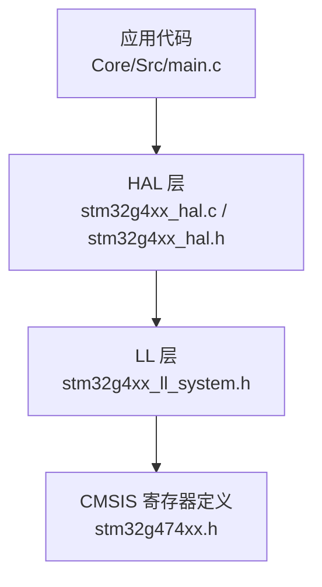
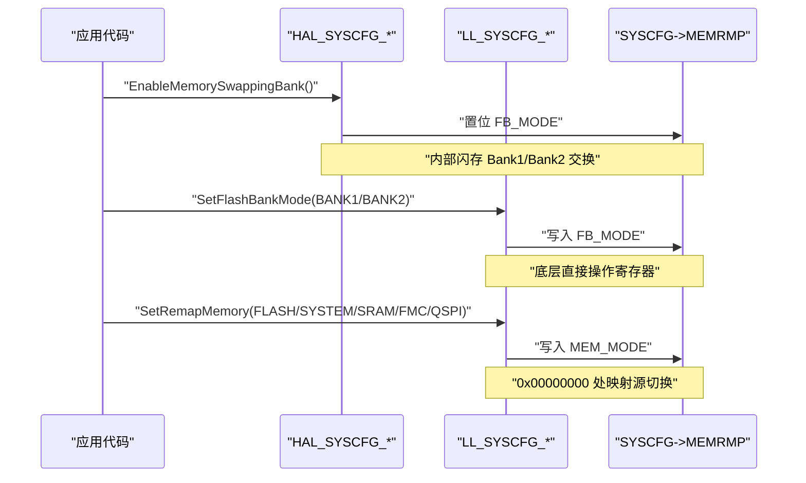
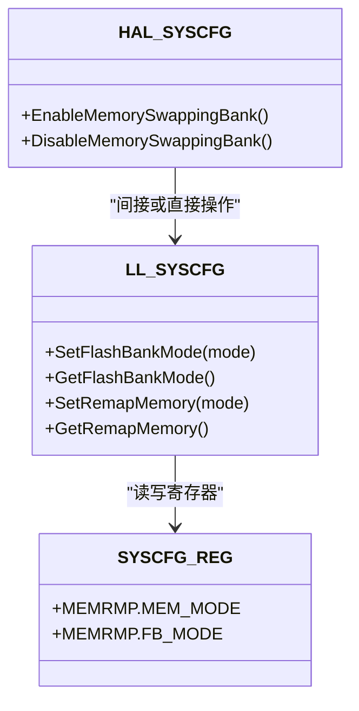

# 内存管理功能

<cite>
**本文引用的文件**
- [stm32g4xx_hal.h](file://Drivers/STM32G4xx_HAL_Driver/Inc/stm32g4xx_hal.h)
- [stm32g4xx_ll_system.h](file://Drivers/STM32G4xx_HAL_Driver/Inc/stm32g4xx_ll_system.h)
- [stm32g474xx.h](file://Drivers/CMSIS/Device/ST/STM32G4xx/Include/stm32g474xx.h)
- [stm32g4xx_hal.c](file://Drivers/STM32G4xx_HAL_Driver/Src/stm32g4xx_hal.c)
- [main.c](file://Core/Src/main.c)
</cite>

## 目录
1. [简介](#简介)
2. [项目结构](#项目结构)
3. [核心组件](#核心组件)
4. [架构总览](#架构总览)
5. [详细组件分析](#详细组件分析)
6. [依赖关系分析](#依赖关系分析)
7. [性能与优化建议](#性能与优化建议)
8. [故障排查指南](#故障排查指南)
9. [结论](#结论)
10. [附录：启动模式宏与寄存器位定义](#附录启动模式宏与寄存器位定义)

## 简介
本文件面向使用 STM32G4 系列 HAL/LL 库的开发者，系统性阐述 SYSCFG 模块提供的“内存映射切换”和“内部闪存双 Bank 交换”能力，覆盖主闪存、系统闪存、CCM SRAM、FMC、QuadSPI 等存储区域的启动映射选择；重点解析 HAL_SYSCFG_EnableMemorySwappingBank() 的工作原理、适用场景与限制条件，并给出 Bootloader、固件更新、多应用分区管理等典型实践路径。文档同时为初学者提供内存映射基础概念，为高级用户提供配置技巧与性能优化建议。

## 项目结构
本项目基于 STM32CubeMX 生成的工程骨架，SYSCFG 相关 API 与宏定义位于 HAL/LL 驱动层，设备寄存器位定义位于 CMSIS 头文件中。核心入口 main.c 展示了外设初始化流程，可作为在应用中调用 SYSCFG 功能的参考位置（例如在时钟与中断初始化之前进行必要的映射设置）。

图表来源
- [stm32g4xx_hal.c:580-640](file://Drivers/STM32G4xx_HAL_Driver/Src/stm32g4xx_hal.c#L580-L640)
- [stm32g4xx_hal.h:314-353](file://Drivers/STM32G4xx_HAL_Driver/Inc/stm32g4xx_hal.h#L314-L353)
- [stm32g4xx_ll_system.h:84-106](file://Drivers/STM32G4xx_HAL_Driver/Inc/stm32g4xx_ll_system.h#L84-L106)
- [stm32g474xx.h:14403-14413](file://Drivers/CMSIS/Device/ST/STM32G4xx/Include/stm32g474xx.h#L14403-L14413)

章节来源
- [main.c:219-255](file://Core/Src/main.c#L219-L255)

## 核心组件
- SYSCFG 内存重映射控制
  - 通过 SYSCFG_MEMRMP 寄存器的 MEM_MODE 字段选择 0x00000000 处的起始映射区域：主闪存、系统闪存、SRAM、FMC、QuadSPI。
  - 通过 __HAL_SYSCFG_REMAPMEMORY_* 宏或 LL_SYSCFG_SetRemapMemory 接口进行配置。
- 内部闪存双 Bank 交换
  - 通过 SYSCFG_MEMRMP 的 FB_MODE 位实现 Flash Bank1/Bank2 在 0x08000000 地址上的交换。
  - HAL 提供 HAL_SYSCFG_EnableMemorySwappingBank()/DisableMemorySwappingBank()；LL 提供 LL_SYSCFG_SetFlashBankMode()/GetFlashBankMode()。
- 启动模式读取
  - 通过 __HAL_SYSCFG_GET_BOOT_MODE() 可读取当前 0x00000000 处的映射源。
  - 配合 SYSCFG_BOOT_* 宏用于判断与应用分支逻辑。

章节来源
- [stm32g4xx_hal.h:62-76](file://Drivers/STM32G4xx_HAL_Driver/Inc/stm32g4xx_hal.h#L62-L76)
- [stm32g4xx_hal.h:314-353](file://Drivers/STM32G4xx_HAL_Driver/Inc/stm32g4xx_hal.h#L314-L353)
- [stm32g4xx_ll_system.h:84-106](file://Drivers/STM32G4xx_HAL_Driver/Inc/stm32g4xx_ll_system.h#L84-L106)
- [stm32g474xx.h:14403-14413](file://Drivers/CMSIS/Device/ST/STM32G4xx/Include/stm32g474xx.h#L14403-L14413)

## 架构总览
下图展示从应用到硬件寄存器的调用链路与数据流向，包括内存映射切换与 Bank 交换两条关键路径。

图表来源
- [stm32g4xx_hal.c:612-640](file://Drivers/STM32G4xx_HAL_Driver/Src/stm32g4xx_hal.c#L612-L640)
- [stm32g4xx_ll_system.h:393-405](file://Drivers/STM32G4xx_HAL_Driver/Inc/stm32g4xx_ll_system.h#L393-L405)
- [stm32g474xx.h:14403-14413](file://Drivers/CMSIS/Device/ST/STM32G4xx/Include/stm32g474xx.h#L14403-L14413)

## 详细组件分析

### 1) 内存映射切换（0x00000000 起始区）
- 支持区域
  - 主闪存（Main Flash）
  - 系统闪存（System Flash）
  - 嵌入式 SRAM（SRAM1）
  - FMC（外部存储器控制器，若设备支持）
  - QuadSPI（若设备支持）
- 配置方式
  - HAL 宏：__HAL_SYSCFG_REMAPMEMORY_FLASH/SYSTEMFLASH/SRAM/FMC/QUADSPI
  - LL 函数：LL_SYSCFG_SetRemapMemory(LL_SYSCFG_REMAP_*)
  - 读取当前映射：__HAL_SYSCFG_GET_BOOT_MODE()
- 适用场景
  - 从系统闪存执行内置引导程序
  - 调试时直接从 SRAM 运行
  - 从外部 QSPI/NOR 启动（需硬件连接与引脚复用正确）
- 注意事项
  - 切换后需确保目标区域的向量表、中断向量偏移、链接脚本地址一致
  - 某些映射仅在特定设备型号上可用（如 FMC/QSPI）

章节来源
- [stm32g4xx_hal.h:314-353](file://Drivers/STM32G4xx_HAL_Driver/Inc/stm32g4xx_hal.h#L314-L353)
- [stm32g4xx_ll_system.h:84-94](file://Drivers/STM32G4xx_HAL_Driver/Inc/stm32g4xx_ll_system.h#L84-L94)
- [stm32g474xx.h:14403-14409](file://Drivers/CMSIS/Device/ST/STM32G4xx/Include/stm32g474xx.h#L14403-L14409)

### 2) 内部闪存双 Bank 交换（0x08000000 起始区）
- 功能说明
  - 默认：Bank1 映射至 0x08000000，Bank2 映射至 0x08040000
  - 交换后：Bank2 映射至 0x08000000，Bank1 映射至 0x08040000
- 配置方式
  - HAL：HAL_SYSCFG_EnableMemorySwappingBank()/DisableMemorySwappingBank()
  - LL：LL_SYSCFG_SetFlashBankMode(LL_SYSCFG_BANKMODE_BANK1/BANK2)
- 适用场景
  - 双应用分区：一个应用常驻 Bank1，另一个驻 Bank2，运行时按策略切换
  - Bootloader 更新机制：Bootloader 驻 Bank1，用户应用驻 Bank2，更新完成后切换 Bank 启动新应用
- 限制与风险
  - 切换仅影响 0x08000000 起始的用户闪存映射，不影响 0x00000000 的启动映射
  - 切换后必须保证当前运行的代码与数据位于可访问区域，避免访问被交换后的非法地址
  - 切换期间应关闭可能触发 Flash 读冲突的操作（如中断中大量取指），必要时进入临界区

章节来源
- [stm32g4xx_hal.c:612-640](file://Drivers/STM32G4xx_HAL_Driver/Src/stm32g4xx_hal.c#L612-L640)
- [stm32g4xx_ll_system.h:98-106](file://Drivers/STM32G4xx_HAL_Driver/Inc/stm32g4xx_ll_system.h#L98-L106)
- [stm32g474xx.h:14411-14413](file://Drivers/CMSIS/Device/ST/STM32G4xx/Include/stm32g474xx.h#L14411-L14413)

### 3) HAL_SYSCFG_EnableMemorySwappingBank() 工作原理
- 行为
  - 设置 SYSCFG->MEMRMP 的 FB_MODE 位，使 Bank2 出现在 0x08000000
- 时序与一致性
  - 该操作为单寄存器写，原子性由总线保障
  - 切换后立即生效，CPU 后续对 0x08000000 的取指将命中另一 Bank
- 推荐用法
  - 在应用完成校验与准备后再切换
  - 切换前保存必要上下文，切换后恢复
  - 结合选项字节与链接脚本，确保向量表与中断向量偏移正确

章节来源
- [stm32g4xx_hal.c:612-625](file://Drivers/STM32G4xx_HAL_Driver/Src/stm32g4xx_hal.c#L612-L625)
- [stm32g474xx.h:14411-14413](file://Drivers/CMSIS/Device/ST/STM32G4xx/Include/stm32g474xx.h#L14411-L14413)

### 4) 启动模式宏定义与含义
- SYSCFG_BOOT_MAINFLASH：0x00000000 映射为主闪存
- SYSCFG_BOOT_SYSTEMFLASH：0x00000000 映射为系统闪存
- SYSCFG_BOOT_SRAM：0x00000000 映射为 SRAM
- SYSCFG_BOOT_FMC（视设备）：0x00000000 映射为 FMC 外部存储器
- SYSCFG_BOOT_QUADSPI（视设备）：0x00000000 映射为 QuadSPI
- 这些宏与 __HAL_SYSCFG_GET_BOOT_MODE() 返回值对应，可用于运行时分支

章节来源
- [stm32g4xx_hal.h:62-76](file://Drivers/STM32G4xx_HAL_Driver/Inc/stm32g4xx_hal.h#L62-L76)
- [stm32g4xx_hal.h:342-353](file://Drivers/STM32G4xx_HAL_Driver/Inc/stm32g4xx_hal.h#L342-L353)

### 5) 实际项目中的集成点
- 建议在 SystemClock_Config 之前或之后尽早完成映射配置，确保后续取指与中断向量正确
- 在 main.c 的初始化阶段插入映射配置，或在 Bootloader 跳转前完成切换
- 注意链接脚本与编译选项，确保不同应用的向量表与段地址符合预期

章节来源
- [main.c:219-255](file://Core/Src/main.c#L219-L255)

## 依赖关系分析
- HAL 层封装了 LL 层与寄存器操作
- LL 层提供轻量级内联函数，直接读写 SYSCFG 寄存器
- CMSIS 头文件提供寄存器位域定义，供 HAL/LL 使用

图表来源
- [stm32g4xx_hal.c:612-640](file://Drivers/STM32G4xx_HAL_Driver/Src/stm32g4xx_hal.c#L612-L640)
- [stm32g4xx_ll_system.h:376-405](file://Drivers/STM32G4xx_HAL_Driver/Inc/stm32g4xx_ll_system.h#L376-L405)
- [stm32g474xx.h:14403-14413](file://Drivers/CMSIS/Device/ST/STM32G4xx/Include/stm32g474xx.h#L14403-L14413)

## 性能与优化建议
- 切换时机
  - 在空闲时段切换，避免高负载取指路径
  - 切换前后禁用不必要的中断，减少取指抖动
- 缓存与预取
  - 切换后首次访问目标 Bank 可能出现指令缓存未命中，适当预热关键路径
- 双应用分区
  - 将频繁调用的热路径放在同一 Bank，降低切换频率
  - 使用只读常量与数据尽量共享，减少跨 Bank 访问
- 外部存储器映射
  - 使用 FMC/QSPI 作为启动源时，确保时钟与等待周期满足时序要求，避免启动失败

[本节为通用指导，不直接分析具体文件]

## 故障排查指南
- 现象：切换后无法启动或复位
  - 检查 0x00000000 映射是否正确（主闪存/系统闪存/SRAM/外部存储器）
  - 确认目标区域的向量表地址与中断向量偏移匹配
- 现象：切换 Bank 后程序崩溃
  - 确认当前运行代码是否位于可访问区域
  - 检查是否存在对已交换 Bank 的不当访问
- 现象：外部存储器启动失败
  - 核对引脚复用、外部存储器类型与时序参数
  - 验证供电与复位序列

章节来源
- [stm32g4xx_hal.h:314-353](file://Drivers/STM32G4xx_HAL_Driver/Inc/stm32g4xx_hal.h#L314-L353)
- [stm32g4xx_ll_system.h:84-106](file://Drivers/STM32G4xx_HAL_Driver/Inc/stm32g4xx_ll_system.h#L84-L106)

## 结论
SYSCFG 的内存映射与 Bank 交换能力为 STM32G4 提供了灵活的启动与运行期布局手段。通过合理设计 Bootloader、应用分区与切换策略，可实现安全的在线升级与多应用共存。使用时需严格对齐链接脚本、向量表与中断向量偏移，并在合适的时机进行切换，以获得稳定可靠的系统行为。

## 附录：启动模式宏与寄存器位定义
- 启动模式宏（用于 __HAL_SYSCFG_GET_BOOT_MODE() 返回值比较）
  - SYSCFG_BOOT_MAINFLASH
  - SYSCFG_BOOT_SYSTEMFLASH
  - SYSCFG_BOOT_SRAM
  - SYSCFG_BOOT_FMC（视设备）
  - SYSCFG_BOOT_QUADSPI（视设备）
- 内存映射宏（设置 0x00000000 映射）
  - __HAL_SYSCFG_REMAPMEMORY_FLASH
  - __HAL_SYSCFG_REMAPMEMORY_SYSTEMFLASH
  - __HAL_SYSCFG_REMAPMEMORY_SRAM
  - __HAL_SYSCFG_REMAPMEMORY_FMC（视设备）
  - __HAL_SYSCFG_REMAPMEMORY_QUADSPI（视设备）
- 寄存器位定义（SYSCFG_MEMRMP）
  - MEM_MODE：选择 0x00000000 映射源
  - FB_MODE：选择内部闪存 Bank1/Bank2 映射

章节来源
- [stm32g4xx_hal.h:62-76](file://Drivers/STM32G4xx_HAL_Driver/Inc/stm32g4xx_hal.h#L62-L76)
- [stm32g4xx_hal.h:314-353](file://Drivers/STM32G4xx_HAL_Driver/Inc/stm32g4xx_hal.h#L314-L353)
- [stm32g474xx.h:14403-14413](file://Drivers/CMSIS/Device/ST/STM32G4xx/Include/stm32g474xx.h#L14403-L14413)