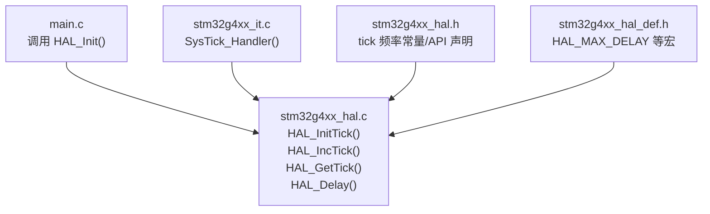
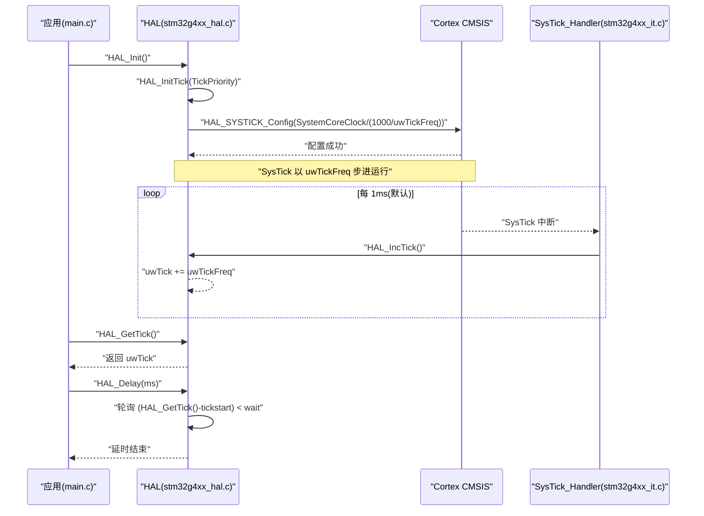
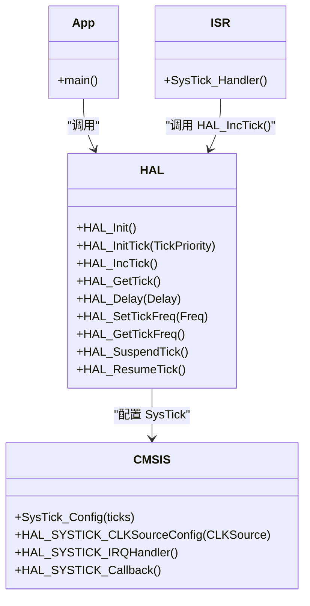

# 时间管理系统

<cite>
**本文引用的文件**   
- [Core/Src/main.c](file://Core/Src/main.c)
- [Core/Inc/main.h](file://Core/Inc/main.h)
- [Drivers/STM32G4xx_HAL_Driver/Src/stm32g4xx_hal.c](file://Drivers/STM32G4xx_HAL_Driver/Src/stm32g4xx_hal.c)
- [Drivers/STM32G4xx_HAL_Driver/Inc/stm32g4xx_hal.h](file://Drivers/STM32G4xx_HAL_Driver/Inc/stm32g4xx_hal.h)
- [Drivers/STM32G4xx_HAL_Driver/Inc/stm32g4xx_hal_def.h](file://Drivers/STM32G4xx_HAL_Driver/Inc/stm32g4xx_hal_def.h)
- [Core/Src/stm32g4xx_it.c](file://Core/Src/stm32g4xx_it.c)
- [Drivers/STM32G4xx_HAL_Driver/Src/stm32g4xx_hal_cortex.c](file://Drivers/STM32G4xx_HAL_Driver/Src/stm32g4xx_hal_cortex.c)
</cite>

## 目录
1. [简介](#简介)
2. [项目结构](#项目结构)
3. [核心组件](#核心组件)
4. [架构总览](#架构总览)
5. [详细组件分析](#详细组件分析)
6. [依赖关系分析](#依赖关系分析)
7. [性能与精度考量](#性能与精度考量)
8. [故障排查指南](#故障排查指南)
9. [结论](#结论)
10. [附录：常用API速查](#附录常用api速查)

## 简介
本文件面向使用 STM32 HAL 库的开发者，系统化讲解基于 SysTick 的 HAL 时间管理子系统。内容覆盖 tick 系统初始化、延时函数、时间获取、tick 频率配置（10Hz、100Hz、1KHz）对精度的影响与选择策略，以及 uwTick 全局变量在中断中的更新机制。文档同时提供从初学者到高级开发者的实践路径，包括高精度延时、超时处理、时间戳记录等常见场景的实现思路与注意事项。

## 项目结构
本项目为基于 STM32G4 的工程，时间管理相关代码主要位于 HAL 驱动层与应用入口之间：
- 应用入口 main.c 调用 HAL_Init() 完成系统级初始化，其中包含 tick 源配置。
- HAL 驱动层 stm32g4xx_hal.c 实现 HAL_InitTick()、HAL_IncTick()、HAL_GetTick()、HAL_Delay() 等核心 API。
- 中断服务程序 stm32g4xx_it.c 中 SysTick_Handler() 调用 HAL_IncTick() 推进时间基准。
- 头文件 stm32g4xx_hal.h 定义 tick 频率常量与 API 原型；stm32g4xx_hal_def.h 定义 HAL_MAX_DELAY 等公共宏。

图表来源
- [Core/Src/main.c:228-236](file://Core/Src/main.c#L228-L236)
- [Drivers/STM32G4xx_HAL_Driver/Src/stm32g4xx_hal.c:148-185](file://Drivers/STM32G4xx_HAL_Driver/Src/stm32g4xx_hal.c#L148-L185)
- [Core/Src/stm32g4xx_it.c:184-193](file://Core/Src/stm32g4xx_it.c#L184-L193)
- [Drivers/STM32G4xx_HAL_Driver/Inc/stm32g4xx_hal.h:46-52](file://Drivers/STM32G4xx_HAL_Driver/Inc/stm32g4xx_hal.h#L46-L52)
- [Drivers/STM32G4xx_HAL_Driver/Inc/stm32g4xx_hal_def.h:57](file://Drivers/STM32G4xx_HAL_Driver/Inc/stm32g4xx_hal_def.h#L57)

章节来源
- [Core/Src/main.c:228-236](file://Core/Src/main.c#L228-L236)
- [Drivers/STM32G4xx_HAL_Driver/Src/stm32g4xx_hal.c:148-185](file://Drivers/STM32G4xx_HAL_Driver/Src/stm32g4xx_hal.c#L148-L185)
- [Core/Src/stm32g4xx_it.c:184-193](file://Core/Src/stm32g4xx_it.c#L184-L193)
- [Drivers/STM32G4xx_HAL_Driver/Inc/stm32g4xx_hal.h:46-52](file://Drivers/STM32G4xx_HAL_Driver/Inc/stm32g4xx_hal.h#L46-L52)
- [Drivers/STM32G4xx_HAL_Driver/Inc/stm32g4xx_hal_def.h:57](file://Drivers/STM32G4xx_HAL_Driver/Inc/stm32g4xx_hal_def.h#L57)

## 核心组件
- HAL_Init()：系统初始化入口，内部调用 HAL_InitTick() 配置 SysTick 作为时间基准，并设置 NVIC 优先级分组。
- HAL_InitTick(TickPriority)：根据当前 SystemCoreClock 和 uwTickFreq 计算 SysTick 重装载值，启用 SysTick 中断并设置其优先级。
- HAL_IncTick()：在 SysTick 中断中被调用，按 uwTickFreq 步进 uwTick。
- HAL_GetTick()：返回当前 uwTick 值（单位毫秒）。
- HAL_Delay(Delay)：基于 uwTick 的最小阻塞延时实现，考虑了 uwTickFreq 带来的最小等待保障。
- HAL_SetTickFreq()/HAL_GetTickFreq()：运行时动态切换 tick 频率并重新配置 SysTick。
- HAL_SuspendTick()/HAL_ResumeTick()：挂起/恢复 SysTick 中断，用于临界区或低功耗场景。
- SysTick_Handler()：中断服务程序，直接调用 HAL_IncTick()。

章节来源
- [Drivers/STM32G4xx_HAL_Driver/Src/stm32g4xx_hal.c:148-185](file://Drivers/STM32G4xx_HAL_Driver/Src/stm32g4xx_hal.c#L148-L185)
- [Drivers/STM32G4xx_HAL_Driver/Src/stm32g4xx_hal.c:255-287](file://Drivers/STM32G4xx_HAL_Driver/Src/stm32g4xx_hal.c#L255-L287)
- [Drivers/STM32G4xx_HAL_Driver/Src/stm32g4xx_hal.c:322-336](file://Drivers/STM32G4xx_HAL_Driver/Src/stm32g4xx_hal.c#L322-L336)
- [Drivers/STM32G4xx_HAL_Driver/Src/stm32g4xx_hal.c:400-414](file://Drivers/STM32G4xx_HAL_Driver/Src/stm32g4xx_hal.c#L400-L414)
- [Drivers/STM32G4xx_HAL_Driver/Src/stm32g4xx_hal.c:351-387](file://Drivers/STM32G4xx_HAL_Driver/Src/stm32g4xx_hal.c#L351-L387)
- [Drivers/STM32G4xx_HAL_Driver/Src/stm32g4xx_hal.c:426-446](file://Drivers/STM32G4xx_HAL_Driver/Src/stm32g4xx_hal.c#L426-L446)
- [Core/Src/stm32g4xx_it.c:184-193](file://Core/Src/stm32g4xx_it.c#L184-L193)

## 架构总览
下图展示了从系统启动到时间推进的关键流程：main 调用 HAL_Init()，后者调用 HAL_InitTick() 配置 SysTick；随后 SysTick 周期性触发中断，进入 SysTick_Handler() 并调用 HAL_IncTick() 递增 uwTick；应用通过 HAL_GetTick() 读取时间，或通过 HAL_Delay() 进行阻塞延时。

图表来源
- [Core/Src/main.c:228-236](file://Core/Src/main.c#L228-L236)
- [Drivers/STM32G4xx_HAL_Driver/Src/stm32g4xx_hal.c:148-185](file://Drivers/STM32G4xx_HAL_Driver/Src/stm32g4xx_hal.c#L148-L185)
- [Drivers/STM32G4xx_HAL_Driver/Src/stm32g4xx_hal.c:255-287](file://Drivers/STM32G4xx_HAL_Driver/Src/stm32g4xx_hal.c#L255-L287)
- [Core/Src/stm32g4xx_it.c:184-193](file://Core/Src/stm32g4xx_it.c#L184-L193)
- [Drivers/STM32G4xx_HAL_Driver/Src/stm32g4xx_hal.c:322-336](file://Drivers/STM32G4xx_HAL_Driver/Src/stm32g4xx_hal.c#L322-L336)
- [Drivers/STM32G4xx_HAL_Driver/Src/stm32g4xx_hal.c:400-414](file://Drivers/STM32G4xx_HAL_Driver/Src/stm32g4xx_hal.c#L400-L414)

## 详细组件分析

### HAL_InitTick() 与 SysTick 配置
- 功能：依据 SystemCoreClock 与 uwTickFreq 计算 SysTick 重装载值，使中断周期为 1ms（默认），并设置 SysTick 中断优先级。
- 关键点：
  - 重装载值 = SystemCoreClock / (1000 / uwTickFreq)。当 uwTickFreq=1 时，中断周期为 1ms。
  - 若 TickPriority 无效则返回错误。
  - 该函数被标记为 __weak，允许用户自定义实现。

章节来源
- [Drivers/STM32G4xx_HAL_Driver/Src/stm32g4xx_hal.c:255-287](file://Drivers/STM32G4xx_HAL_Driver/Src/stm32g4xx_hal.c#L255-L287)

### HAL_IncTick() 与 uwTick 工作机制
- 功能：在每次 SysTick 中断中由 HAL_IncTick() 将 uwTick 增加 uwTickFreq。
- 数据流：
  - SysTick_Handler() -> HAL_IncTick() -> uwTick += uwTickFreq。
- 注意：
  - uwTick 是全局变量，类型 uint32_t，表示自启动以来的“毫秒计数”。
  - 由于采用无符号整数减法比较，天然支持溢出回绕。

章节来源
- [Core/Src/stm32g4xx_it.c:184-193](file://Core/Src/stm32g4xx_it.c#L184-L193)
- [Drivers/STM32G4xx_HAL_Driver/Src/stm32g4xx_hal.c:322-325](file://Drivers/STM32G4xx_HAL_Driver/Src/stm32g4xx_hal.c#L322-L325)

### HAL_GetTick() 与时间获取
- 功能：返回当前 uwTick 值，单位为毫秒。
- 使用建议：
  - 用于记录事件时间戳、计算相对时间差。
  - 在多线程/中断共享时需确保访问原子性（单核 ARM Cortex-M 上 32 位读通常原子）。

章节来源
- [Drivers/STM32G4xx_HAL_Driver/Src/stm32g4xx_hal.c:333-336](file://Drivers/STM32G4xx_HAL_Driver/Src/stm32g4xx_hal.c#L333-L336)

### HAL_Delay() 延时实现与最小等待保障
- 功能：阻塞式延时，基于 uwTick 轮询等待。
- 关键细节：
  - 为保证最小等待，当 Delay < HAL_MAX_DELAY 时，wait 会加上 uwTickFreq，避免极短延时因中断时机导致零等待。
  - 循环条件使用 (HAL_GetTick() - tickstart) < wait，利用无符号数特性安全处理溢出。
- 适用场景：简单任务调度、外设时序控制、调试打印间隔等。

章节来源
- [Drivers/STM32G4xx_HAL_Driver/Src/stm32g4xx_hal.c:400-414](file://Drivers/STM32G4xx_HAL_Driver/Src/stm32g4xx_hal.c#L400-L414)
- [Drivers/STM32G4xx_HAL_Driver/Inc/stm32g4xx_hal_def.h:57](file://Drivers/STM32G4xx_HAL_Driver/Inc/stm32g4xx_hal_def.h#L57)

### 运行时切换 tick 频率：HAL_SetTickFreq()/HAL_GetTickFreq()
- 功能：动态修改 uwTickFreq 并重新调用 HAL_InitTick() 生效。
- 典型用法：
  - 启动阶段使用 1KHz 以获得更细粒度时间分辨率。
  - 进入低功耗或空闲态后降频至 100Hz 或 10Hz 以降低中断开销。
- 约束：
  - 仅支持 10Hz、100Hz、1KHz 三种频率。
  - 切换失败需回滚 uwTickFreq。

章节来源
- [Drivers/STM32G4xx_HAL_Driver/Src/stm32g4xx_hal.c:351-387](file://Drivers/STM32G4xx_HAL_Driver/Src/stm32g4xx_hal.c#L351-L387)
- [Drivers/STM32G4xx_HAL_Driver/Inc/stm32g4xx_hal.h:46-52](file://Drivers/STM32G4xx_HAL_Driver/Inc/stm32g4xx_hal.h#L46-L52)

### 挂起/恢复 tick：HAL_SuspendTick()/HAL_ResumeTick()
- 功能：关闭/开启 SysTick 中断，从而暂停/恢复 uwTick 递增。
- 使用场景：
  - 需要严格临界区且不希望被 SysTick 打断。
  - 低功耗模式期间减少中断唤醒次数。

章节来源
- [Drivers/STM32G4xx_HAL_Driver/Src/stm32g4xx_hal.c:426-446](file://Drivers/STM32G4xx_HAL_Driver/Src/stm32g4xx_hal.c#L426-L446)

### SysTick 时钟源配置（可选）
- 可通过 HAL_SYSTICK_CLKSourceConfig() 选择 HCLK 或 HCLK/8 作为 SysTick 时钟源，影响定时精度与功耗。
- HAL_SYSTICK_IRQHandler()/HAL_SYSTICK_Callback() 提供回调扩展点。

章节来源
- [Drivers/STM32G4xx_HAL_Driver/Src/stm32g4xx_hal_cortex.c:376-416](file://Drivers/STM32G4xx_HAL_Driver/Src/stm32g4xx_hal_cortex.c#L376-L416)

## 依赖关系分析
- 模块耦合：
  - main.c 依赖 HAL_Init() 完成 tick 初始化。
  - stm32g4xx_it.c 的 SysTick_Handler() 依赖 HAL_IncTick()。
  - HAL 层依赖 CMSIS 的 SysTick_Config() 配置底层定时器。
- 外部依赖：
  - SystemCoreClock：由系统时钟配置决定，直接影响 SysTick 重装载值计算。
  - NVIC 优先级分组：HAL_Init() 设置为组 4，便于合理分配中断优先级。

图表来源
- [Core/Src/main.c:228-236](file://Core/Src/main.c#L228-L236)
- [Core/Src/stm32g4xx_it.c:184-193](file://Core/Src/stm32g4xx_it.c#L184-L193)
- [Drivers/STM32G4xx_HAL_Driver/Src/stm32g4xx_hal.c:148-185](file://Drivers/STM32G4xx_HAL_Driver/Src/stm32g4xx_hal.c#L148-L185)
- [Drivers/STM32G4xx_HAL_Driver/Src/stm32g4xx_hal.c:255-287](file://Drivers/STM32G4xx_HAL_Driver/Src/stm32g4xx_hal.c#L255-L287)
- [Drivers/STM32G4xx_HAL_Driver/Src/stm32g4xx_hal_cortex.c:376-416](file://Drivers/STM32G4xx_HAL_Driver/Src/stm32g4xx_hal_cortex.c#L376-L416)

章节来源
- [Core/Src/main.c:228-236](file://Core/Src/main.c#L228-L236)
- [Core/Src/stm32g4xx_it.c:184-193](file://Core/Src/stm32g4xx_it.c#L184-L193)
- [Drivers/STM32G4xx_HAL_Driver/Src/stm32g4xx_hal.c:148-185](file://Drivers/STM32G4xx_HAL_Driver/Src/stm32g4xx_hal.c#L148-L185)
- [Drivers/STM32G4xx_HAL_Driver/Src/stm32g4xx_hal.c:255-287](file://Drivers/STM32G4xx_HAL_Driver/Src/stm32g4xx_hal.c#L255-L287)
- [Drivers/STM32G4xx_HAL_Driver/Src/stm32g4xx_hal_cortex.c:376-416](file://Drivers/STM32G4xx_HAL_Driver/Src/stm32g4xx_hal_cortex.c#L376-L416)

## 性能与精度考量

### tick 频率对精度的影响与选择策略
- 1KHz（默认）：
  - 中断周期 1ms，uwTick 步进 1，适合大多数实时任务与通用延时。
  - 优点：时间分辨率高，延时误差小。
  - 缺点：中断开销较大，CPU 占用略高。
- 100Hz：
  - 中断周期 10ms，uwTick 步进 10。
  - 优点：降低中断频率，节省 CPU。
  - 缺点：延时最小步长增大，短时延精度下降。
- 10Hz：
  - 中断周期 100ms，uwTick 步进 100。
  - 优点：极低中断开销，适合低功耗空闲态。
  - 缺点：时间分辨率低，不适合精细延时。

选择建议：
- 启动/活跃期使用 1KHz，保证响应与精度。
- 空闲/低功耗阶段切换到 100Hz 或 10Hz，降低中断负载。
- 使用 HAL_SetTickFreq() 动态切换，并在切换前评估是否处于临界区或正在执行长时间操作。

章节来源
- [Drivers/STM32G4xx_HAL_Driver/Inc/stm32g4xx_hal.h:46-52](file://Drivers/STM32G4xx_HAL_Driver/Inc/stm32g4xx_hal.h#L46-L52)
- [Drivers/STM32G4xx_HAL_Driver/Src/stm32g4xx_hal.c:351-387](file://Drivers/STM32G4xx_HAL_Driver/Src/stm32g4xx_hal.c#L351-L387)

### HAL_Delay() 行为与最小等待
- 当 Delay 小于最大延时范围时，内部会额外加上 uwTickFreq，确保至少等待一个 tick 周期，避免极端情况下出现零等待。
- 对于极短延时需求，建议使用硬件定时器或 GPIO 翻转配合示波器验证实际延迟。

章节来源
- [Drivers/STM32G4xx_HAL_Driver/Src/stm32g4xx_hal.c:400-414](file://Drivers/STM32G4xx_HAL_Driver/Src/stm32g4xx_hal.c#L400-L414)

### 中断优先级与时序
- HAL_Init() 设置 NVIC 优先级分组为组 4，HAL_InitTick() 设置 SysTick 中断优先级。
- 若从外设 ISR 中调用 HAL_Delay()，必须确保 SysTick 中断优先级高于外设中断，否则会被阻塞。

章节来源
- [Drivers/STM32G4xx_HAL_Driver/Src/stm32g4xx_hal.c:148-185](file://Drivers/STM32G4xx_HAL_Driver/Src/stm32g4xx_hal.c#L148-L185)
- [Drivers/STM32G4xx_HAL_Driver/Src/stm32g4xx_hal.c:255-287](file://Drivers/STM32G4xx_HAL_Driver/Src/stm32g4xx_hal.c#L255-L287)

## 故障排查指南
- 现象：延时不准确或过短
  - 检查 uwTickFreq 是否正确配置，确认 HAL_InitTick() 返回值。
  - 确认 SystemCoreClock 与实际系统时钟一致。
- 现象：从 ISR 调用 HAL_Delay() 导致死锁
  - 调整 SysTick 中断优先级，使其高于当前外设中断。
- 现象：切换 tick 频率后行为异常
  - 确认切换前后未处于临界区；必要时先 HAL_SuspendTick()，再切换频率，最后 HAL_ResumeTick()。
- 现象：低功耗模式下时间不推进
  - 检查是否在低功耗模式禁用了 SysTick 或中断；必要时使用 HAL_SuspendTick()/HAL_ResumeTick() 控制。

章节来源
- [Drivers/STM32G4xx_HAL_Driver/Src/stm32g4xx_hal.c:255-287](file://Drivers/STM32G4xx_HAL_Driver/Src/stm32g4xx_hal.c#L255-L287)
- [Drivers/STM32G4xx_HAL_Driver/Src/stm32g4xx_hal.c:426-446](file://Drivers/STM32G4xx_HAL_Driver/Src/stm32g4xx_hal.c#L426-L446)

## 结论
HAL 时间管理以 SysTick 为核心，通过 HAL_InitTick() 配置中断周期，HAL_IncTick() 推进 uwTick，HAL_GetTick() 提供时间读取，HAL_Delay() 提供阻塞延时。通过 HAL_SetTickFreq() 可在运行时灵活切换 tick 频率，平衡精度与功耗。理解 uwTick 的无符号回绕特性与中断优先级关系，是实现稳定时间管理的关键。

## 附录：常用API速查
- HAL_Init()：系统初始化，内部调用 HAL_InitTick()。
- HAL_InitTick(TickPriority)：配置 SysTick 中断周期与优先级。
- HAL_IncTick()：中断中递增 uwTick。
- HAL_GetTick()：获取当前时间（毫秒）。
- HAL_Delay(ms)：阻塞延时。
- HAL_SetTickFreq(Freq)：动态设置 tick 频率（10Hz/100Hz/1KHz）。
- HAL_GetTickFreq()：查询当前 tick 频率。
- HAL_SuspendTick()/HAL_ResumeTick()：挂起/恢复 tick 中断。

章节来源
- [Drivers/STM32G4xx_HAL_Driver/Inc/stm32g4xx_hal.h:525-547](file://Drivers/STM32G4xx_HAL_Driver/Inc/stm32g4xx_hal.h#L525-L547)
- [Drivers/STM32G4xx_HAL_Driver/Src/stm32g4xx_hal.c:148-185](file://Drivers/STM32G4xx_HAL_Driver/Src/stm32g4xx_hal.c#L148-L185)
- [Drivers/STM32G4xx_HAL_Driver/Src/stm32g4xx_hal.c:255-287](file://Drivers/STM32G4xx_HAL_Driver/Src/stm32g4xx_hal.c#L255-L287)
- [Drivers/STM32G4xx_HAL_Driver/Src/stm32g4xx_hal.c:322-336](file://Drivers/STM32G4xx_HAL_Driver/Src/stm32g4xx_hal.c#L322-L336)
- [Drivers/STM32G4xx_HAL_Driver/Src/stm32g4xx_hal.c:400-414](file://Drivers/STM32G4xx_HAL_Driver/Src/stm32g4xx_hal.c#L400-L414)
- [Drivers/STM32G4xx_HAL_Driver/Src/stm32g4xx_hal.c:351-387](file://Drivers/STM32G4xx_HAL_Driver/Src/stm32g4xx_hal.c#L351-L387)
- [Drivers/STM32G4xx_HAL_Driver/Src/stm32g4xx_hal.c:426-446](file://Drivers/STM32G4xx_HAL_Driver/Src/stm32g4xx_hal.c#L426-L446)