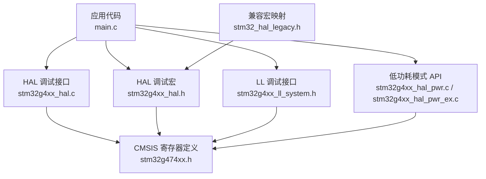
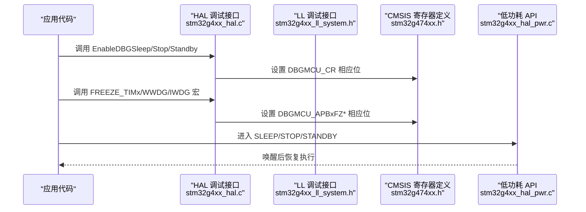
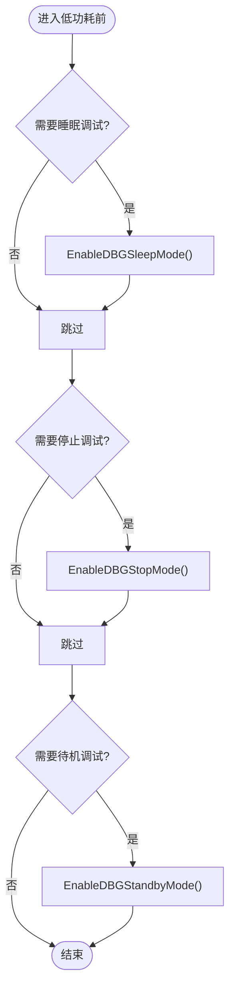
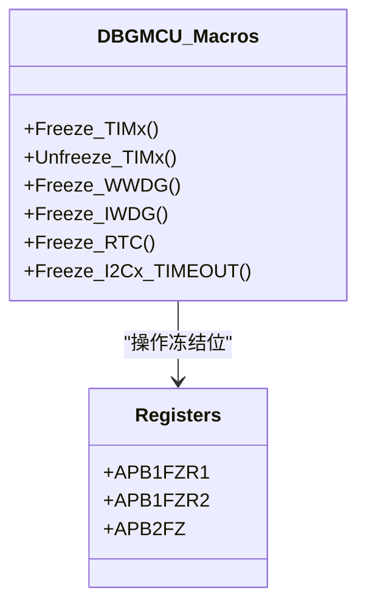
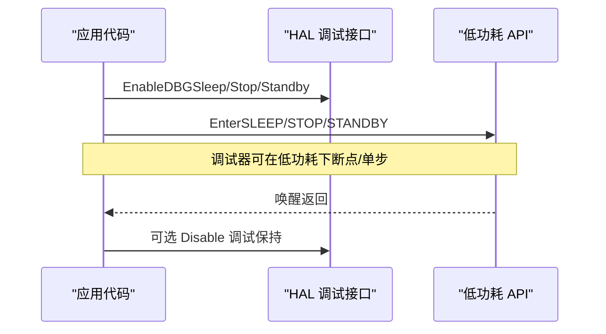
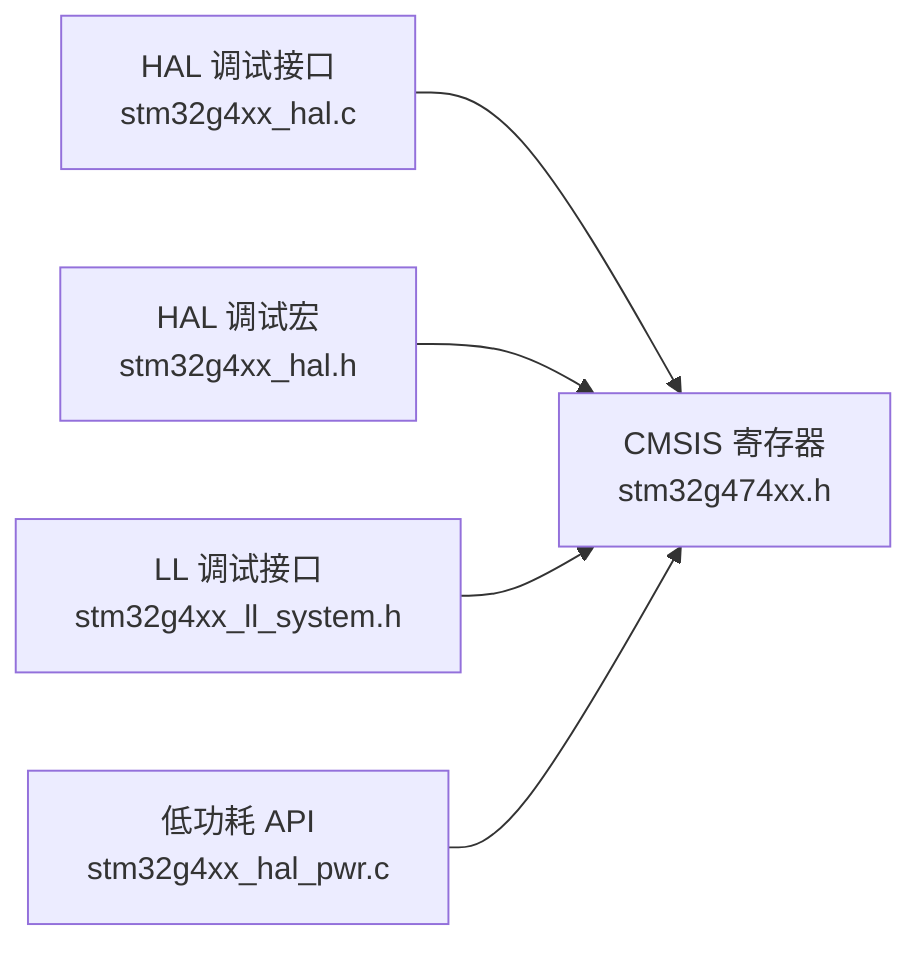

# 调试支持功能

<cite>
**本文引用的文件**
- [stm32g4xx_hal.c](file://Drivers/STM32G4xx_HAL_Driver/Src/stm32g4xx_hal.c)
- [stm32g4xx_hal.h](file://Drivers/STM32G4xx_HAL_Driver/Inc/stm32g4xx_hal.h)
- [stm32g4xx_ll_system.h](file://Drivers/STM32G4xx_HAL_Driver/Inc/stm32g4xx_ll_system.h)
- [stm32g474xx.h](file://Drivers/CMSIS/Device/ST/STM32G4xx/Include/stm32g474xx.h)
- [stm32_hal_legacy.h](file://Drivers/STM32G4xx_HAL_Driver/Inc/Legacy/stm32_hal_legacy.h)
- [stm32g4xx_hal_pwr.c](file://Drivers/STM32G4xx_HAL_Driver/Src/stm32g4xx_hal_pwr.c)
- [stm32g4xx_hal_pwr_ex.c](file://Drivers/STM32G4xx_HAL_Driver/Src/stm32g4xx_hal_pwr_ex.c)
- [stm32g4xx_hal_pwr.h](file://Drivers/STM32G4xx_HAL_Driver/Inc/stm32g4xx_hal_pwr.h)
</cite>

## 目录
1. [简介](#简介)
2. [项目结构](#项目结构)
3. [核心组件](#核心组件)
4. [架构总览](#架构总览)
5. [详细组件分析](#详细组件分析)
6. [依赖关系分析](#依赖关系分析)
7. [性能与功耗考量](#性能与功耗考量)
8. [故障排查指南](#故障排查指南)
9. [结论](#结论)
10. [附录：常用宏与函数速查](#附录常用宏与函数速查)

## 简介
本文件面向使用 STM32G4xx 系列 HAL 驱动的开发者，系统性说明 DBGMCU 模块提供的调试特性，重点覆盖在睡眠（SLEEP）、停止（STOP0/STOP1/STOP2）和待机（STANDBY）模式下保持调试能力的配置方法。文档包含：
- HAL 层调试接口使用方法：HAL_DBGMCU_EnableDBGSleepMode()、HAL_DBGMCU_EnableDBGStopMode()、HAL_DBGMCU_EnableDBGStandbyMode() 等
- 外设冻结宏的使用方法与适用场景：__HAL_DBGMCU_FREEZE_TIMx()、__HAL_DBGMCU_FREEZE_WWDG()/IWDG() 等
- 低功耗模式进入流程与调试保持的组合实践
- 初学者环境配置步骤与高级开发者的深度调试技巧

## 项目结构
与调试支持相关的代码主要分布在以下位置：
- HAL 调试函数实现：Drivers/STM32G4xx_HAL_Driver/Src/stm32g4xx_hal.c
- HAL 调试宏定义：Drivers/STM32G4xx_HAL_Driver/Inc/stm32g4xx_hal.h
- LL 层调试接口：Drivers/STM32G4xx_HAL_Driver/Inc/stm32g4xx_ll_system.h
- CMSIS 寄存器位定义：Drivers/CMSIS/Device/ST/STM32G4xx/Include/stm32g474xx.h
- 低功耗模式 API：Drivers/STM32G4xx_HAL_Driver/Src/stm32g4xx_hal_pwr.c 与 stm32g4xx_hal_pwr_ex.c
- 兼容性宏映射：Drivers/STM32G4xx_HAL_Driver/Inc/Legacy/stm32_hal_legacy.h

图表来源
- [stm32g4xx_hal.c:522-574](file://Drivers/STM32G4xx_HAL_Driver/Src/stm32g4xx_hal.c#L522-L574)
- [stm32g4xx_hal.h:199-312](file://Drivers/STM32G4xx_HAL_Driver/Inc/stm32g4xx_hal.h#L199-L312)
- [stm32g474xx.h:3123-3161](file://Drivers/CMSIS/Device/ST/STM32G4xx/Include/stm32g474xx.h#L3123-L3161)
- [stm32g4xx_ll_system.h:939-987](file://Drivers/STM32G4xx_HAL_Driver/Inc/stm32g4xx_ll_system.h#L939-L987)
- [stm32g4xx_hal_pwr.c:441-563](file://Drivers/STM32G4xx_HAL_Driver/Src/stm32g4xx_hal_pwr.c#L441-L563)
- [stm32g4xx_hal_pwr_ex.c:894-948](file://Drivers/STM32G4xx_HAL_Driver/Src/stm32g4xx_hal_pwr_ex.c#L894-L948)
- [stm32_hal_legacy.h:2248-2305](file://Drivers/STM32G4xx_HAL_Driver/Inc/Legacy/stm32_hal_legacy.h#L2248-L2305)

章节来源
- [stm32g4xx_hal.c:522-574](file://Drivers/STM32G4xx_HAL_Driver/Src/stm32g4xx_hal.c#L522-L574)
- [stm32g4xx_hal.h:199-312](file://Drivers/STM32G4xx_HAL_Driver/Inc/stm32g4xx_hal.h#L199-L312)
- [stm32g474xx.h:3123-3161](file://Drivers/CMSIS/Device/ST/STM32G4xx/Include/stm32g474xx.h#L3123-L3161)
- [stm32g4xx_ll_system.h:939-987](file://Drivers/STM32G4xx_HAL_Driver/Inc/stm32g4xx_ll_system.h#L939-L987)
- [stm32g4xx_hal_pwr.c:441-563](file://Drivers/STM32G4xx_HAL_Driver/Src/stm32g4xx_hal_pwr.c#L441-L563)
- [stm32g4xx_hal_pwr_ex.c:894-948](file://Drivers/STM32G4xx_HAL_Driver/Src/stm32g4xx_hal_pwr_ex.c#L894-L948)
- [stm32_hal_legacy.h:2248-2305](file://Drivers/STM32G4xx_HAL_Driver/Inc/Legacy/stm32_hal_legacy.h#L2248-L2305)

## 核心组件
- HAL 调试接口（睡眠/停止/待机）
  - 作用：在对应低功耗模式下允许调试器继续连接并断点运行
  - 关键函数：
    - HAL_DBGMCU_EnableDBGSleepMode()
    - HAL_DBGMCU_DisableDBGSleepMode()
    - HAL_DBGMCU_EnableDBGStopMode()
    - HAL_DBGMCU_DisableDBGStopMode()
    - HAL_DBGMCU_EnableDBGStandbyMode()
    - HAL_DBGMCU_DisableDBGStandbyMode()
- HAL 调试宏（外设冻结）
  - 作用：在调试时冻结定时器、看门狗、I2C 超时计数器等，避免调试过程中被外设打断或复位
  - 典型宏：
    - __HAL_DBGMCU_FREEZE_TIMx()/__HAL_DBGMCU_UNFREEZE_TIMx()
    - __HAL_DBGMCU_FREEZE_WWDG()/__HAL_DBGMCU_FREEZE_IWDG()
    - __HAL_DBGMCU_FREEZE_RTC()
    - __HAL_DBGMCU_FREEZE_I2Cx_TIMEOUT()
- LL 调试接口（底层等效）
  - LL_DBGMCU_EnableDBGSleepMode() 等
- CMSIS 寄存器位定义
  - DBGMCU_CR 的 DBG_SLEEP、DBG_STOP、DBG_STANDBY
  - DBGMCU_APBxFZ* 的外设冻结位
- 低功耗模式 API
  - HAL_PWR_EnterSLEEPMode()
  - HAL_PWR_EnterSTOPMode()
  - HAL_PWR_EnterSTANDBYMode()

章节来源
- [stm32g4xx_hal.c:522-574](file://Drivers/STM32G4xx_HAL_Driver/Src/stm32g4xx_hal.c#L522-L574)
- [stm32g4xx_hal.h:199-312](file://Drivers/STM32G4xx_HAL_Driver/Inc/stm32g4xx_hal.h#L199-L312)
- [stm32g4xx_ll_system.h:939-987](file://Drivers/STM32G4xx_HAL_Driver/Inc/stm32g4xx_ll_system.h#L939-L987)
- [stm32g474xx.h:3123-3161](file://Drivers/CMSIS/Device/ST/STM32G4xx/Include/stm32g474xx.h#L3123-L3161)
- [stm32g4xx_hal_pwr.c:441-563](file://Drivers/STM32G4xx_HAL_Driver/Src/stm32g4xx_hal_pwr.c#L441-L563)

## 架构总览
下图展示了从应用到低层寄存器的调用链路与数据流向。

图表来源
- [stm32g4xx_hal.c:522-574](file://Drivers/STM32G4xx_HAL_Driver/Src/stm32g4xx_hal.c#L522-L574)
- [stm32g4xx_hal.h:199-312](file://Drivers/STM32G4xx_HAL_Driver/Inc/stm32g4xx_hal.h#L199-L312)
- [stm32g474xx.h:3123-3161](file://Drivers/CMSIS/Device/ST/STM32G4xx/Include/stm32g474xx.h#L3123-L3161)
- [stm32g4xx_hal_pwr.c:441-563](file://Drivers/STM32G4xx_HAL_Driver/Src/stm32g4xx_hal_pwr.c#L441-L563)

## 详细组件分析

### 组件一：HAL 调试接口（睡眠/停止/待机）
- 功能要点
  - 在 SLEEP/STOP/STANDBY 模式下保持调试器连接能力，便于断点、单步、变量查看
  - 通过设置 DBGMCU_CR 中的对应位实现
- 关键函数与行为
  - HAL_DBGMCU_EnableDBGSleepMode()：开启睡眠模式调试保持
  - HAL_DBGMCU_EnableDBGStopMode()：开启停止模式调试保持
  - HAL_DBGMCU_EnableDBGStandbyMode()：开启待机模式调试保持
  - 对应的 Disable 函数用于关闭调试保持
- 使用建议
  - 在进入低功耗前启用调试保持；退出后可按需关闭以减小功耗
  - 若仅需调试特定模式，仅启用对应位即可

图表来源
- [stm32g4xx_hal.c:522-574](file://Drivers/STM32G4xx_HAL_Driver/Src/stm32g4xx_hal.c#L522-L574)

章节来源
- [stm32g4xx_hal.c:522-574](file://Drivers/STM32G4xx_HAL_Driver/Src/stm32g4xx_hal.c#L522-L574)

### 组件二：外设冻结宏（定时器、看门狗、RTC、I2C 超时等）
- 功能要点
  - 在调试暂停时冻结相关外设时钟或计数器，避免调试期间产生中断、溢出或复位
- 常用宏
  - 定时器：__HAL_DBGMCU_FREEZE_TIMx()/UNFREEZE_TIMx()
  - 看门狗：__HAL_DBGMCU_FREEZE_WWDG()/IWDG()
  - RTC：__HAL_DBGMCU_FREEZE_RTC()
  - I2C 超时：__HAL_DBGMCU_FREEZE_I2Cx_TIMEOUT()
- 适用场景
  - 在 STOP 模式下调试复杂时序逻辑时，冻结定时器可简化时序分析
  - 调试看门狗相关逻辑时，冻结 WWDG/IWDG 可防止意外复位
  - 调试 I2C 通信时，冻结超时有助于定位挂起问题

图表来源
- [stm32g4xx_hal.h:199-312](file://Drivers/STM32G4xx_HAL_Driver/Inc/stm32g4xx_hal.h#L199-L312)
- [stm32g474xx.h:3143-3161](file://Drivers/CMSIS/Device/ST/STM32G4xx/Include/stm32g474xx.h#L3143-L3161)

章节来源
- [stm32g4xx_hal.h:199-312](file://Drivers/STM32G4xx_HAL_Driver/Inc/stm32g4xx_hal.h#L199-L312)
- [stm32g474xx.h:3143-3161](file://Drivers/CMSIS/Device/ST/STM32G4xx/Include/stm32g474xx.h#L3143-L3161)

### 组件三：LL 层调试接口
- 提供与 HAL 同功能的底层接口，适用于对性能敏感或需最小化依赖的场景
- 示例：LL_DBGMCU_EnableDBGSleepMode() 等

章节来源
- [stm32g4xx_ll_system.h:939-987](file://Drivers/STM32G4xx_HAL_Driver/Inc/stm32g4xx_ll_system.h#L939-L987)

### 组件四：低功耗模式进入流程与调试保持组合
- 进入 SLEEP/STOP/STANDBY 的标准 API
  - HAL_PWR_EnterSLEEPMode(Regulator, Entry)
  - HAL_PWR_EnterSTOPMode(Regulator, Entry)
  - HAL_PWR_EnterSTANDBYMode()
- 组合策略
  - 先启用调试保持（按所需模式）
  - 再进入低功耗
  - 唤醒后根据需求关闭调试保持或保留

图表来源
- [stm32g4xx_hal.c:522-574](file://Drivers/STM32G4xx_HAL_Driver/Src/stm32g4xx_hal.c#L522-L574)
- [stm32g4xx_hal_pwr.c:441-563](file://Drivers/STM32G4xx_HAL_Driver/Src/stm32g4xx_hal_pwr.c#L441-L563)
- [stm32g4xx_hal_pwr_ex.c:894-948](file://Drivers/STM32G4xx_HAL_Driver/Src/stm32g4xx_hal_pwr_ex.c#L894-L948)

章节来源
- [stm32g4xx_hal_pwr.c:441-563](file://Drivers/STM32G4xx_HAL_Driver/Src/stm32g4xx_hal_pwr.c#L441-L563)
- [stm32g4xx_hal_pwr_ex.c:894-948](file://Drivers/STM32G4xx_HAL_Driver/Src/stm32g4xx_hal_pwr_ex.c#L894-L948)

### 组件五：兼容性宏映射
- Legacy 头文件提供旧版宏到新版宏的映射，便于迁移与维护
- 例如：__HAL_FREEZE_TIMx_DBGMCU → __HAL_DBGMCU_FREEZE_TIMx

章节来源
- [stm32_hal_legacy.h:2248-2305](file://Drivers/STM32G4xx_HAL_Driver/Inc/Legacy/stm32_hal_legacy.h#L2248-L2305)

## 依赖关系分析
- HAL 调试接口直接操作 DBGMCU_CR 位，依赖 CMSIS 寄存器定义
- 外设冻结宏操作 DBGMCU_APBxFZ* 寄存器，同样依赖 CMSIS 定义
- LL 接口与 HAL 接口并行存在，均指向同一组硬件位
- 低功耗 API 与调试保持相互独立，但常组合使用

图表来源
- [stm32g4xx_hal.c:522-574](file://Drivers/STM32G4xx_HAL_Driver/Src/stm32g4xx_hal.c#L522-L574)
- [stm32g4xx_hal.h:199-312](file://Drivers/STM32G4xx_HAL_Driver/Inc/stm32g4xx_hal.h#L199-L312)
- [stm32g4xx_ll_system.h:939-987](file://Drivers/STM32G4xx_HAL_Driver/Inc/stm32g4xx_ll_system.h#L939-L987)
- [stm32g474xx.h:3123-3161](file://Drivers/CMSIS/Device/ST/STM32G4xx/Include/stm32g474xx.h#L3123-L3161)
- [stm32g4xx_hal_pwr.c:441-563](file://Drivers/STM32G4xx_HAL_Driver/Src/stm32g4xx_hal_pwr.c#L441-L563)

章节来源
- [stm32g4xx_hal.c:522-574](file://Drivers/STM32G4xx_HAL_Driver/Src/stm32g4xx_hal.c#L522-L574)
- [stm32g4xx_hal.h:199-312](file://Drivers/STM32G4xx_HAL_Driver/Inc/stm32g4xx_hal.h#L199-L312)
- [stm32g4xx_ll_system.h:939-987](file://Drivers/STM32G4xx_HAL_Driver/Inc/stm32g4xx_ll_system.h#L939-L987)
- [stm32g474xx.h:3123-3161](file://Drivers/CMSIS/Device/ST/STM32G4xx/Include/stm32g474xx.h#L3123-L3161)
- [stm32g4xx_hal_pwr.c:441-563](file://Drivers/STM32G4xx_HAL_Driver/Src/stm32g4xx_hal_pwr.c#L441-L563)

## 性能与功耗考量
- 调试保持开启会增加功耗，尤其在 STOP/STANDBY 模式下仍维持调试链路
- 建议在调试阶段启用，产品发布或量产测试时关闭以减少功耗
- 冻结外设可减少调试期间的中断与溢出，提升调试稳定性，但对实际功耗影响取决于外设是否仍在运行

[本节为通用指导，不直接分析具体文件]

## 故障排查指南
- 无法在低功耗下断点
  - 确认已调用对应模式的 Enable 函数
  - 检查调试器与芯片连接状态及 SWD/JTAG 配置
- 调试时系统复位
  - 检查是否未冻结看门狗（WWDG/IWDG），必要时使用冻结宏
- 定时器行为异常
  - 在 STOP 模式下冻结定时器，避免计时漂移或溢出干扰
- I2C 通信卡死
  - 冻结 I2C 超时计数，便于定位总线挂起原因

章节来源
- [stm32g4xx_hal.h:199-312](file://Drivers/STM32G4xx_HAL_Driver/Inc/stm32g4xx_hal.h#L199-L312)
- [stm32g4xx_hal.c:522-574](file://Drivers/STM32G4xx_HAL_Driver/Src/stm32g4xx_hal.c#L522-L574)

## 结论
通过 HAL 调试接口与外设冻结宏的配合，可以在 SLEEP/STOP/STANDBY 模式下稳定地进行调试与分析。合理选择调试保持与冻结范围，既能提升调试效率，又能兼顾功耗与系统稳定性。对于生产环境，应在确保质量的前提下关闭不必要的调试特性以降低功耗。

[本节为总结性内容，不直接分析具体文件]

## 附录：常用宏与函数速查
- 调试保持（HAL）
  - HAL_DBGMCU_EnableDBGSleepMode()
  - HAL_DBGMCU_EnableDBGStopMode()
  - HAL_DBGMCU_EnableDBGStandbyMode()
  - 对应 Disable 函数
- 外设冻结（HAL 宏）
  - __HAL_DBGMCU_FREEZE_TIMx()/UNFREEZE_TIMx()
  - __HAL_DBGMCU_FREEZE_WWDG()/IWDG()
  - __HAL_DBGMCU_FREEZE_RTC()
  - __HAL_DBGMCU_FREEZE_I2Cx_TIMEOUT()
- 低功耗模式（HAL）
  - HAL_PWR_EnterSLEEPMode(Regulator, Entry)
  - HAL_PWR_EnterSTOPMode(Regulator, Entry)
  - HAL_PWR_EnterSTANDBYMode()

章节来源
- [stm32g4xx_hal.c:522-574](file://Drivers/STM32G4xx_HAL_Driver/Src/stm32g4xx_hal.c#L522-L574)
- [stm32g4xx_hal.h:199-312](file://Drivers/STM32G4xx_HAL_Driver/Inc/stm32g4xx_hal.h#L199-L312)
- [stm32g4xx_hal_pwr.c:441-563](file://Drivers/STM32G4xx_HAL_Driver/Src/stm32g4xx_hal_pwr.c#L441-L563)