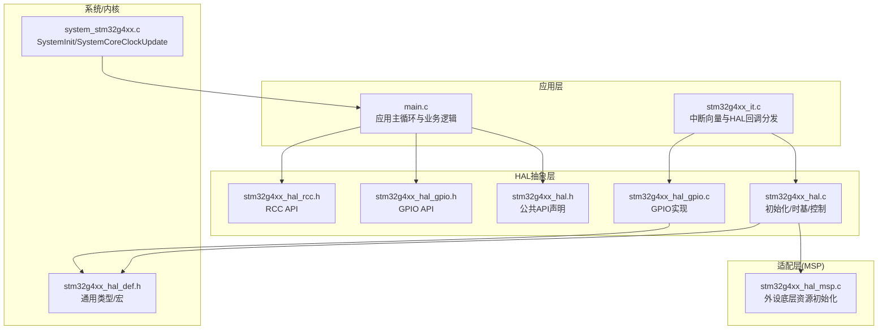
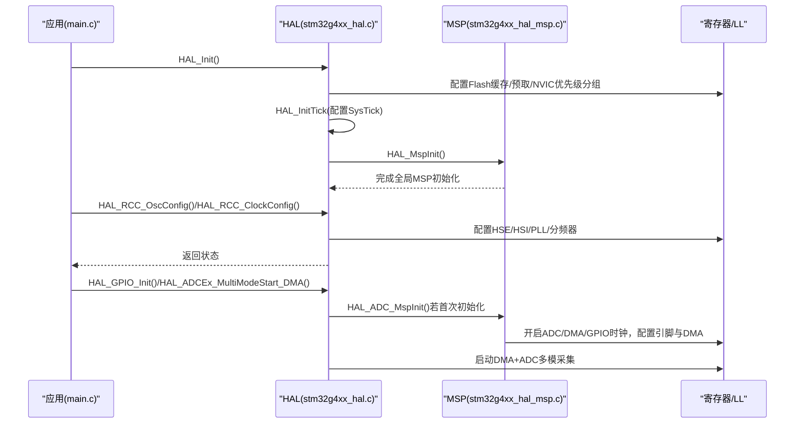
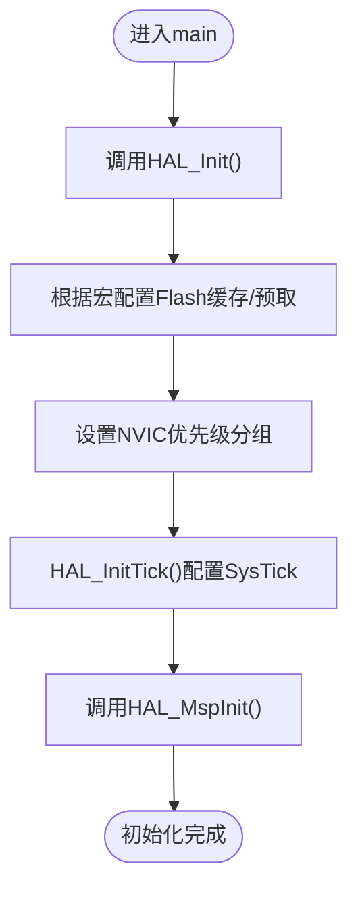
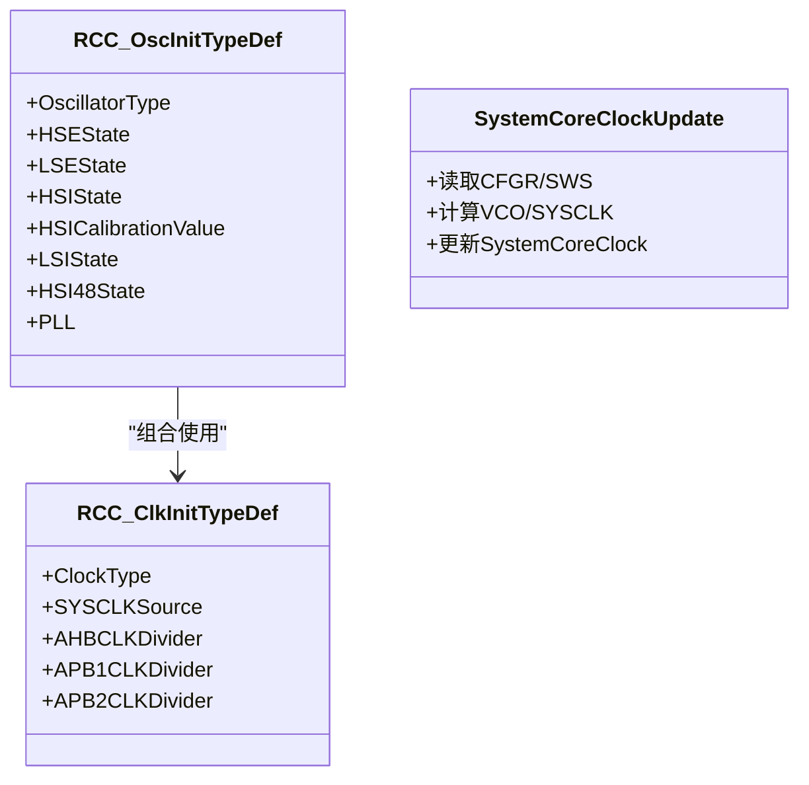
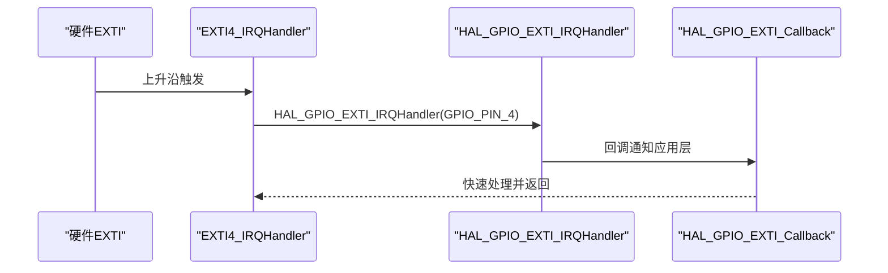
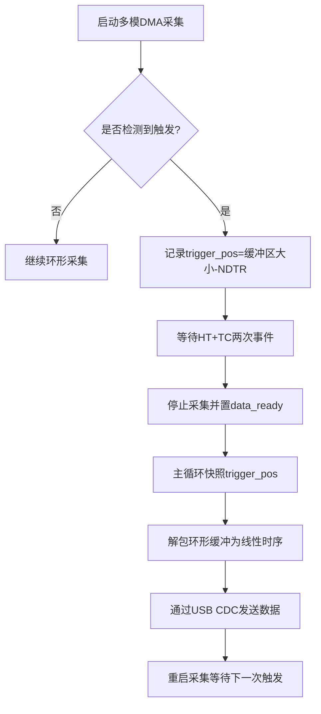
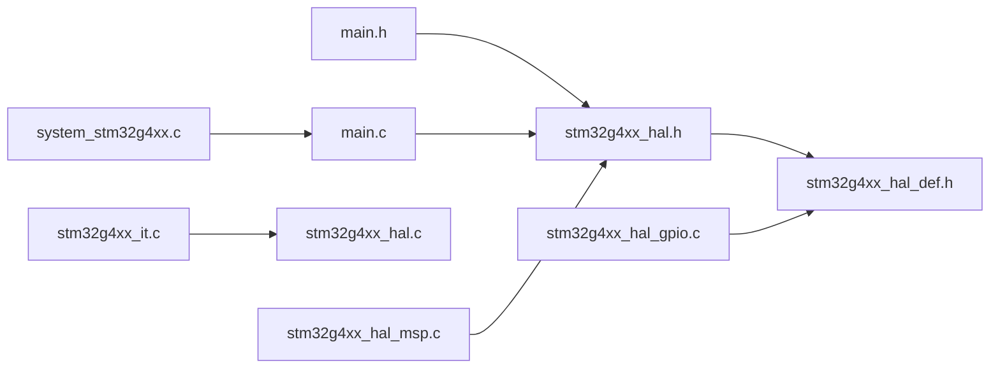

# STM32 HAL驱动库

<cite>
**本文引用的文件列表**
- [Core/Inc/main.h](file://Core/Inc/main.h)
- [Core/Src/main.c](file://Core/Src/main.c)
- [Core/Src/stm32g4xx_it.c](file://Core/Src/stm32g4xx_it.c)
- [Core/Src/system_stm32g4xx.c](file://Core/Src/system_stm32g4xx.c)
- [Drivers/STM32G4xx_HAL_Driver/Inc/stm32g4xx_hal.h](file://Drivers/STM32G4xx_HAL_Driver/Inc/stm32g4xx_hal.h)
- [Drivers/STM32G4xx_HAL_Driver/Inc/stm32g4xx_hal_def.h](file://Drivers/STM32G4xx_HAL_Driver/Inc/stm32g4xx_hal_def.h)
- [Drivers/STM32G4xx_HAL_Driver/Inc/stm32g4xx_hal_gpio.h](file://Drivers/STM32G4xx_HAL_Driver/Inc/stm32g4xx_hal_gpio.h)
- [Drivers/STM32G4xx_HAL_Driver/Inc/stm32g4xx_hal_rcc.h](file://Drivers/STM32G4xx_HAL_Driver/Inc/stm32g4xx_hal_rcc.h)
- [Drivers/STM32G4xx_HAL_Driver/Src/stm32g4xx_hal.c](file://Drivers/STM32G4xx_HAL_Driver/Src/stm32g4xx_hal.c)
- [Drivers/STM32G4xx_HAL_Driver/Src/stm32g4xx_hal_gpio.c](file://Drivers/STM32G4xx_HAL_Driver/Src/stm32g4xx_hal_gpio.c)
- [Core/Src/stm32g4xx_hal_msp.c](file://Core/Src/stm32g4xx_hal_msp.c)
</cite>

## 目录
1. [简介](#简介)
2. [项目结构](#项目结构)
3. [核心组件](#核心组件)
4. [架构总览](#架构总览)
5. [详细组件分析](#详细组件分析)
6. [依赖关系分析](#依赖关系分析)
7. [性能与功耗考量](#性能与功耗考量)
8. [故障排查指南](#故障排查指南)
9. [结论](#结论)
10. [附录：API速查与使用示例路径](#附录api速查与使用示例路径)

## 简介
本技术参考文档围绕STM32 HAL（硬件抽象层）驱动库，结合工程中的实际代码，系统阐述HAL的分层架构、模块组织、关键API与调用流程。文档面向初学者提供入门路径，同时为高级开发者提供底层定制与性能优化建议。重点覆盖：
- 分层架构：应用层、HAL抽象层、MSP适配层、LL/寄存器层
- 核心模块：系统初始化、时钟管理、GPIO控制、中断处理、DMA与ADC联动
- 关键API：函数原型、参数说明、返回值定义与使用示例路径
- 配置选项与编译宏：HAL使能、缓存/预取、Tick频率等
- 架构图与典型流程图：从main到外设的完整调用链

## 项目结构
该工程采用CubeMX生成的标准目录布局：
- Core：用户应用入口、系统初始化、中断服务程序、MSP适配
- Drivers/STM32G4xx_HAL_Driver：HAL驱动头文件与实现
- CMSIS：内核访问与设备定义
- USB_Device/Middlewares：USB CDC类栈（与本HAL文档无直接耦合）

图表来源
- [Core/Src/main.c:219-290](file://Core/Src/main.c#L219-L290)
- [Core/Src/stm32g4xx_it.c:184-228](file://Core/Src/stm32g4xx_it.c#L184-L228)
- [Drivers/STM32G4xx_HAL_Driver/Inc/stm32g4xx_hal.h:525-553](file://Drivers/STM32G4xx_HAL_Driver/Inc/stm32g4xx_hal.h#L525-L553)
- [Drivers/STM32G4xx_HAL_Driver/Src/stm32g4xx_hal.c:148-185](file://Drivers/STM32G4xx_HAL_Driver/Src/stm32g4xx_hal.c#L148-L185)
- [Drivers/STM32G4xx_HAL_Driver/Inc/stm32g4xx_hal_gpio.h:47-73](file://Drivers/STM32G4xx_HAL_Driver/Inc/stm32g4xx_hal_gpio.h#L47-L73)
- [Drivers/STM32G4xx_HAL_Driver/Src/stm32g4xx_hal_gpio.c:162-200](file://Drivers/STM32G4xx_HAL_Driver/Src/stm32g4xx_hal_gpio.c#L162-L200)
- [Drivers/STM32G4xx_HAL_Driver/Inc/stm32g4xx_hal_rcc.h:45-121](file://Drivers/STM32G4xx_HAL_Driver/Inc/stm32g4xx_hal_rcc.h#L45-L121)
- [Core/Src/system_stm32g4xx.c:181-272](file://Core/Src/system_stm32g4xx.c#L181-L272)
- [Core/Src/stm32g4xx_hal_msp.c:63-82](file://Core/Src/stm32g4xx_hal_msp.c#L63-L82)

章节来源
- [Core/Inc/main.h:29-31](file://Core/Inc/main.h#L29-L31)
- [Core/Src/main.c:219-290](file://Core/Src/main.c#L219-L290)
- [Core/Src/stm32g4xx_it.c:184-228](file://Core/Src/stm32g4xx_it.c#L184-L228)
- [Drivers/STM32G4xx_HAL_Driver/Inc/stm32g4xx_hal.h:525-553](file://Drivers/STM32G4xx_HAL_Driver/Inc/stm32g4xx_hal.h#L525-L553)
- [Drivers/STM32G4xx_HAL_Driver/Src/stm32g4xx_hal.c:148-185](file://Drivers/STM32G4xx_HAL_Driver/Src/stm32g4xx_hal.c#L148-L185)
- [Drivers/STM32G4xx_HAL_Driver/Inc/stm32g4xx_hal_gpio.h:47-73](file://Drivers/STM32G4xx_HAL_Driver/Inc/stm32g4xx_hal_gpio.h#L47-L73)
- [Drivers/STM32G4xx_HAL_Driver/Src/stm32g4xx_hal_gpio.c:162-200](file://Drivers/STM32G4xx_HAL_Driver/Src/stm32g4xx_hal_gpio.c#L162-L200)
- [Drivers/STM32G4xx_HAL_Driver/Inc/stm32g4xx_hal_rcc.h:45-121](file://Drivers/STM32G4xx_HAL_Driver/Inc/stm32g4xx_hal_rcc.h#L45-L121)
- [Core/Src/system_stm32g4xx.c:181-272](file://Core/Src/system_stm32g4xx.c#L181-L272)
- [Core/Src/stm32g4xx_hal_msp.c:63-82](file://Core/Src/stm32g4xx_hal_msp.c#L63-L82)

## 核心组件
- 系统初始化与时基
  - HAL_Init：配置Flash缓存/预取、NVIC优先级分组、SysTick时基，并回调HAL_MspInit
  - SysTick_Handler：每毫秒递增uwTick，HAL_Delay/HAL_GetTick基于此
- 时钟管理（RCC）
  - RCC_OscInitTypeDef/RCC_ClkInitTypeDef：振荡器与系统时钟配置结构体
  - SystemClock_Config：在工程中设置HSI/PLL/分频，切换SYSCLK
- GPIO控制
  - GPIO_InitTypeDef：引脚、模式、上下拉、速度、复用配置
  - HAL_GPIO_Init：按位配置OSPEEDR/OTYPER/AFR等寄存器
  - HAL_GPIO_EXTI_IRQHandler + HAL_GPIO_EXTI_Callback：中断触发回调机制
- 中断与DMA
  - stm32g4xx_it.c中统一转发至各HAL IRQHandler
  - DMA通道与外设Handle通过__HAL_LINKDMA绑定，支持半传输/全传输回调

章节来源
- [Drivers/STM32G4xx_HAL_Driver/Src/stm32g4xx_hal.c:148-185](file://Drivers/STM32G4xx_HAL_Driver/Src/stm32g4xx_hal.c#L148-L185)
- [Core/Src/stm32g4xx_it.c:184-193](file://Core/Src/stm32g4xx_it.c#L184-L193)
- [Drivers/STM32G4xx_HAL_Driver/Inc/stm32g4xx_hal_rcc.h:45-121](file://Drivers/STM32G4xx_HAL_Driver/Inc/stm32g4xx_hal_rcc.h#L45-L121)
- [Core/Src/main.c:296-337](file://Core/Src/main.c#L296-L337)
- [Drivers/STM32G4xx_HAL_Driver/Inc/stm32g4xx_hal_gpio.h:47-73](file://Drivers/STM32G4xx_HAL_Driver/Inc/stm32g4xx_hal_gpio.h#L47-L73)
- [Drivers/STM32G4xx_HAL_Driver/Src/stm32g4xx_hal_gpio.c:162-200](file://Drivers/STM32G4xx_HAL_Driver/Src/stm32g4xx_hal_gpio.c#L162-L200)
- [Core/Src/stm32g4xx_it.c:205-228](file://Core/Src/stm32g4xx_it.c#L205-L228)

## 架构总览
HAL采用“应用层—HAL抽象层—MSP适配层—LL/寄存器层”的分层设计：
- 应用层：main.c负责业务流程、状态机与数据通路
- HAL抽象层：提供跨系列一致的API（如HAL_GPIO_Init、HAL_ADCEx_MultiModeStart_DMA）
- MSP适配层：stm32g4xx_hal_msp.c集中实现外设相关的底层资源初始化（时钟、GPIO、DMA、NVIC）
- LL/寄存器层：由HAL内部通过宏或内联函数直接操作寄存器

图表来源
- [Drivers/STM32G4xx_HAL_Driver/Src/stm32g4xx_hal.c:148-185](file://Drivers/STM32G4xx_HAL_Driver/Src/stm32g4xx_hal.c#L148-L185)
- [Core/Src/stm32g4xx_hal_msp.c:63-82](file://Core/Src/stm32g4xx_hal_msp.c#L63-L82)
- [Core/Src/main.c:296-337](file://Core/Src/main.c#L296-L337)
- [Core/Src/stm32g4xx_hal_msp.c:92-185](file://Core/Src/stm32g4xx_hal_msp.c#L92-L185)

## 详细组件分析

### 系统初始化与时基（HAL_Init与SysTick）
- HAL_Init职责
  - 配置指令/数据缓存与预取（受编译宏控制）
  - 设置NVIC优先级分组
  - 初始化SysTick作为1ms时基
  - 调用HAL_MspInit进行平台级初始化
- SysTick中断
  - stm32g4xx_it.c中SysTick_Handler调用HAL_IncTick，驱动HAL_Delay/HAL_GetTick

图表来源
- [Drivers/STM32G4xx_HAL_Driver/Src/stm32g4xx_hal.c:148-185](file://Drivers/STM32G4xx_HAL_Driver/Src/stm32g4xx_hal.c#L148-L185)
- [Core/Src/stm32g4xx_it.c:184-193](file://Core/Src/stm32g4xx_it.c#L184-L193)

章节来源
- [Drivers/STM32G4xx_HAL_Driver/Src/stm32g4xx_hal.c:148-185](file://Drivers/STM32G4xx_HAL_Driver/Src/stm32g4xx_hal.c#L148-L185)
- [Core/Src/stm32g4xx_it.c:184-193](file://Core/Src/stm32g4xx_it.c#L184-L193)

### 时钟管理（RCC）
- 结构体
  - RCC_OscInitTypeDef：选择HSE/HSI/LSE/LSI/HSI48及PLL参数
  - RCC_ClkInitTypeDef：选择SYSCLK源与AHB/APB分频
- 工程用法
  - main.c中SystemClock_Config通过HAL_RCC_OscConfig与HAL_RCC_ClockConfig完成系统时钟配置
- 运行时更新
  - system_stm32g4xx.c提供SystemCoreClockUpdate，用于读取当前时钟树计算SystemCoreClock

图表来源
- [Drivers/STM32G4xx_HAL_Driver/Inc/stm32g4xx_hal_rcc.h:45-121](file://Drivers/STM32G4xx_HAL_Driver/Inc/stm32g4xx_hal_rcc.h#L45-L121)
- [Core/Src/system_stm32g4xx.c:230-272](file://Core/Src/system_stm32g4xx.c#L230-L272)

章节来源
- [Drivers/STM32G4xx_HAL_Driver/Inc/stm32g4xx_hal_rcc.h:45-121](file://Drivers/STM32G4xx_HAL_Driver/Inc/stm32g4xx_hal_rcc.h#L45-L121)
- [Core/Src/main.c:296-337](file://Core/Src/main.c#L296-L337)
- [Core/Src/system_stm32g4xx.c:230-272](file://Core/Src/system_stm32g4xx.c#L230-L272)

### GPIO控制与外部中断
- GPIO初始化
  - HAL_GPIO_Init依据GPIO_InitTypeDef配置模式、上下拉、速度与复用
- EXTI中断
  - stm32g4xx_it.c中EXTI4_IRQHandler调用HAL_GPIO_EXTI_IRQHandler，后者再回调HAL_GPIO_EXTI_Callback
- 工程实践
  - main.c中PA4配置为上升沿中断，回调中记录DMA剩余计数以定位触发位置

图表来源
- [Core/Src/stm32g4xx_it.c:205-214](file://Core/Src/stm32g4xx_it.c#L205-L214)
- [Core/Src/main.c:91-113](file://Core/Src/main.c#L91-L113)
- [Drivers/STM32G4xx_HAL_Driver/Inc/stm32g4xx_hal_gpio.h:168-197](file://Drivers/STM32G4xx_HAL_Driver/Inc/stm32g4xx_hal_gpio.h#L168-L197)

章节来源
- [Drivers/STM32G4xx_HAL_Driver/Src/stm32g4xx_hal_gpio.c:162-200](file://Drivers/STM32G4xx_HAL_Driver/Src/stm32g4xx_hal_gpio.c#L162-L200)
- [Core/Src/stm32g4xx_it.c:205-214](file://Core/Src/stm32g4xx_it.c#L205-L214)
- [Core/Src/main.c:91-113](file://Core/Src/main.c#L91-L113)

### ADC+DMA+中断协同（多模采集与触发重建）
- 初始化链路
  - MX_ADC1_Init/MX_ADC2_Init：配置ADC分辨率、对齐、连续转换、DMA请求、多模模式
  - HAL_ADC_MspInit：开启ADC12时钟、配置模拟引脚、初始化DMA并绑定Handle
- 运行期
  - HAL_ADCEx_MultiModeStart_DMA启动双ADC交错采样，DMA环形缓冲写入
  - DMA半传输/全传输回调统计事件数，达到阈值后停止采集并置标志
  - 主循环捕获触发位置快照，解包环形缓冲为线性时间轴，并通过USB CDC发送

图表来源
- [Core/Src/main.c:249-287](file://Core/Src/main.c#L249-L287)
- [Core/Src/main.c:119-131](file://Core/Src/main.c#L119-L131)
- [Core/Src/main.c:156-171](file://Core/Src/main.c#L156-L171)
- [Core/Src/stm32g4xx_hal_msp.c:127-148](file://Core/Src/stm32g4xx_hal_msp.c#L127-L148)
- [Core/Src/stm32g4xx_it.c:219-228](file://Core/Src/stm32g4xx_it.c#L219-L228)

章节来源
- [Core/Src/main.c:344-464](file://Core/Src/main.c#L344-L464)
- [Core/Src/stm32g4xx_hal_msp.c:92-185](file://Core/Src/stm32g4xx_hal_msp.c#L92-L185)
- [Core/Src/stm32g4xx_it.c:219-228](file://Core/Src/stm32g4xx_it.c#L219-L228)

## 依赖关系分析
- 头文件包含关系
  - main.h包含stm32g4xx_hal.h，从而引入HAL公共API
  - HAL模块包含stm32g4xx_hal_def.h，定义通用类型与宏
- 运行时依赖
  - HAL_Init依赖system_stm32g4xx.c提供的SystemCoreClock（默认HSI）
  - GPIO/ADC等外设初始化依赖MSP中对应的HAL_xxx_MspInit

图表来源
- [Core/Inc/main.h:29-31](file://Core/Inc/main.h#L29-L31)
- [Drivers/STM32G4xx_HAL_Driver/Inc/stm32g4xx_hal.h:28-30](file://Drivers/STM32G4xx_HAL_Driver/Inc/stm32g4xx_hal.h#L28-L30)
- [Drivers/STM32G4xx_HAL_Driver/Inc/stm32g4xx_hal_def.h:28-31](file://Drivers/STM32G4xx_HAL_Driver/Inc/stm32g4xx_hal_def.h#L28-L31)
- [Core/Src/main.c:20-21](file://Core/Src/main.c#L20-L21)
- [Core/Src/stm32g4xx_it.c:20-22](file://Core/Src/stm32g4xx_it.c#L20-L22)
- [Core/Src/stm32g4xx_hal_msp.c:20-21](file://Core/Src/stm32g4xx_hal_msp.c#L20-L21)
- [Core/Src/system_stm32g4xx.c:181-192](file://Core/Src/system_stm32g4xx.c#L181-L192)

章节来源
- [Core/Inc/main.h:29-31](file://Core/Inc/main.h#L29-L31)
- [Drivers/STM32G4xx_HAL_Driver/Inc/stm32g4xx_hal.h:28-30](file://Drivers/STM32G4xx_HAL_Driver/Inc/stm32g4xx_hal.h#L28-L30)
- [Drivers/STM32G4xx_HAL_Driver/Inc/stm32g4xx_hal_def.h:28-31](file://Drivers/STM32G4xx_HAL_Driver/Inc/stm32g4xx_hal_def.h#L28-L31)
- [Core/Src/main.c:20-21](file://Core/Src/main.c#L20-L21)
- [Core/Src/stm32g4xx_it.c:20-22](file://Core/Src/stm32g4xx_it.c#L20-L22)
- [Core/Src/stm32g4xx_hal_msp.c:20-21](file://Core/Src/stm32g4xx_hal_msp.c#L20-L21)
- [Core/Src/system_stm32g4xx.c:181-192](file://Core/Src/system_stm32g4xx.c#L181-L192)

## 性能与功耗考量
- 缓存与预取
  - HAL_Init根据INSTRUCTION_CACHE_ENABLE/DATA_CACHE_ENABLE/PREFETCH_ENABLE宏控制指令/数据缓存与预取，影响执行效率与功耗
- Tick频率
  - HAL_TICK_FREQ_*定义与uwTickFreq决定SysTick中断频率；降低Tick可省电但会影响延时精度
- 时钟树
  - 合理选择PLL源与分频，避免超频；对不需要的外设关闭时钟以降低功耗
- DMA与中断
  - 使用DMA环形缓冲减少CPU参与；在中断中仅做最小化处理（如记录位置、置标志），耗时任务放入主循环

章节来源
- [Drivers/STM32G4xx_HAL_Driver/Src/stm32g4xx_hal.c:156-166](file://Drivers/STM32G4xx_HAL_Driver/Src/stm32g4xx_hal.c#L156-L166)
- [Drivers/STM32G4xx_HAL_Driver/Inc/stm32g4xx_hal.h:49-52](file://Drivers/STM32G4xx_HAL_Driver/Inc/stm32g4xx_hal.h#L49-L52)
- [Core/Src/main.c:296-337](file://Core/Src/main.c#L296-L337)

## 故障排查指南
- 常见问题
  - 未正确初始化MSP导致外设无法工作：检查HAL_MspInit与对应HAL_xxx_MspInit是否被调用
  - 中断不触发：确认GPIO模式、EXTI线、NVIC优先级与使能
  - DMA数据错乱：检查DMA方向、地址增量、对齐方式与__HAL_LINKDMA绑定
- 调试手段
  - 使用Error_Handler断点定位失败路径
  - 在SysTick_Handler与外设中断中插入最小化日志（如LED翻转）验证路径
  - 使用HAL_GetTick/HAL_Delay辅助判断阻塞与超时问题

章节来源
- [Core/Src/main.c:530-539](file://Core/Src/main.c#L530-L539)
- [Core/Src/stm32g4xx_it.c:184-193](file://Core/Src/stm32g4xx_it.c#L184-L193)
- [Core/Src/stm32g4xx_it.c:205-228](file://Core/Src/stm32g4xx_it.c#L205-L228)
- [Core/Src/stm32g4xx_hal_msp.c:127-148](file://Core/Src/stm32g4xx_hal_msp.c#L127-L148)

## 结论
本仓库展示了STM32 HAL的典型使用方式：通过HAL_Init建立系统基础能力，借助MSP将外设底层资源与HAL解耦，配合中断与DMA构建高效的数据通路。理解分层架构与回调机制，有助于在不同STM32系列间迁移与扩展功能。

## 附录：API速查与使用示例路径
- 系统与时基
  - HAL_Init：[Drivers/STM32G4xx_HAL_Driver/Src/stm32g4xx_hal.c:148-185](file://Drivers/STM32G4xx_HAL_Driver/Src/stm32g4xx_hal.c#L148-L185)
  - HAL_IncTick/HAL_Delay/HAL_GetTick：[Drivers/STM32G4xx_HAL_Driver/Inc/stm32g4xx_hal.h:540-545](file://Drivers/STM32G4xx_HAL_Driver/Inc/stm32g4xx_hal.h#L540-L545)
- 时钟管理
  - RCC_OscInitTypeDef/RCC_ClkInitTypeDef：[Drivers/STM32G4xx_HAL_Driver/Inc/stm32g4xx_hal_rcc.h:45-121](file://Drivers/STM32G4xx_HAL_Driver/Inc/stm32g4xx_hal_rcc.h#L45-L121)
  - SystemClock_Config使用：[Core/Src/main.c:296-337](file://Core/Src/main.c#L296-L337)
- GPIO
  - GPIO_InitTypeDef：[Drivers/STM32G4xx_HAL_Driver/Inc/stm32g4xx_hal_gpio.h:47-73](file://Drivers/STM32G4xx_HAL_Driver/Inc/stm32g4xx_hal_gpio.h#L47-L73)
  - HAL_GPIO_Init：[Drivers/STM32G4xx_HAL_Driver/Src/stm32g4xx_hal_gpio.c:162-200](file://Drivers/STM32G4xx_HAL_Driver/Src/stm32g4xx_hal_gpio.c#L162-L200)
  - EXTI回调：[Core/Src/stm32g4xx_it.c:205-214](file://Core/Src/stm32g4xx_it.c#L205-L214), [Core/Src/main.c:91-113](file://Core/Src/main.c#L91-L113)
- ADC+DMA
  - ADC初始化与多模配置：[Core/Src/main.c:344-464](file://Core/Src/main.c#L344-L464)
  - ADC MSP（时钟/GPIO/DMA绑定）：[Core/Src/stm32g4xx_hal_msp.c:92-185](file://Core/Src/stm32g4xx_hal_msp.c#L92-L185)
  - DMA中断分发：[Core/Src/stm32g4xx_it.c:219-228](file://Core/Src/stm32g4xx_it.c#L219-L228)
- 通用类型与宏
  - HAL_StatusTypeDef/__HAL_LINKDMA/__HAL_RESET_HANDLE_STATE：[Drivers/STM32G4xx_HAL_Driver/Inc/stm32g4xx_hal_def.h:38-87](file://Drivers/STM32G4xx_HAL_Driver/Inc/stm32g4xx_hal_def.h#L38-87)