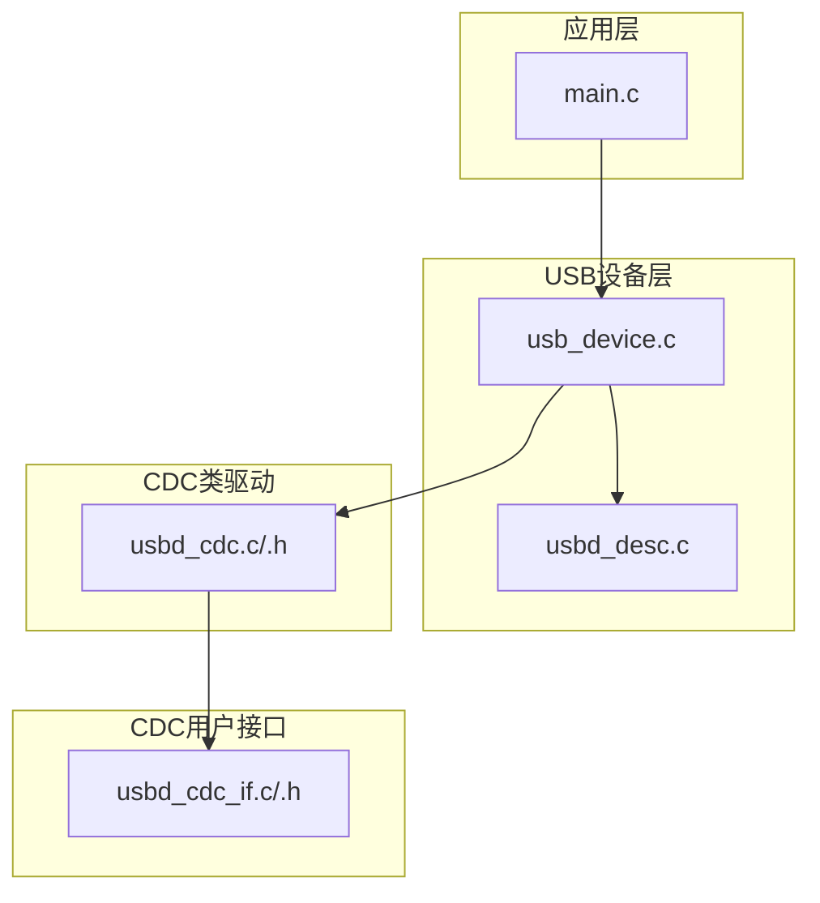
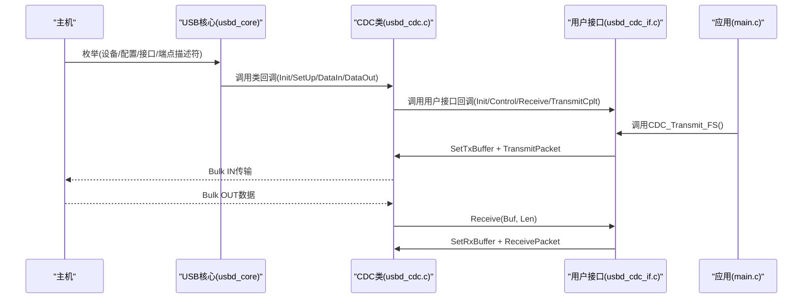
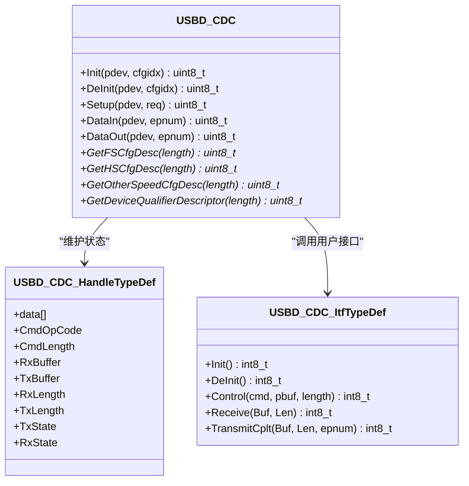
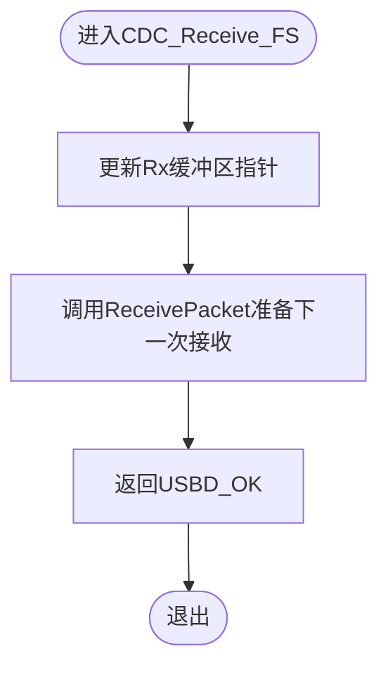
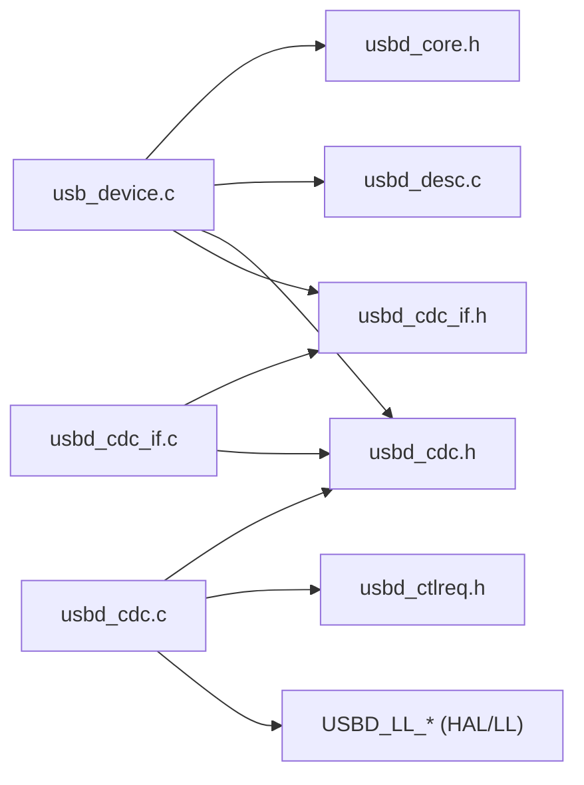
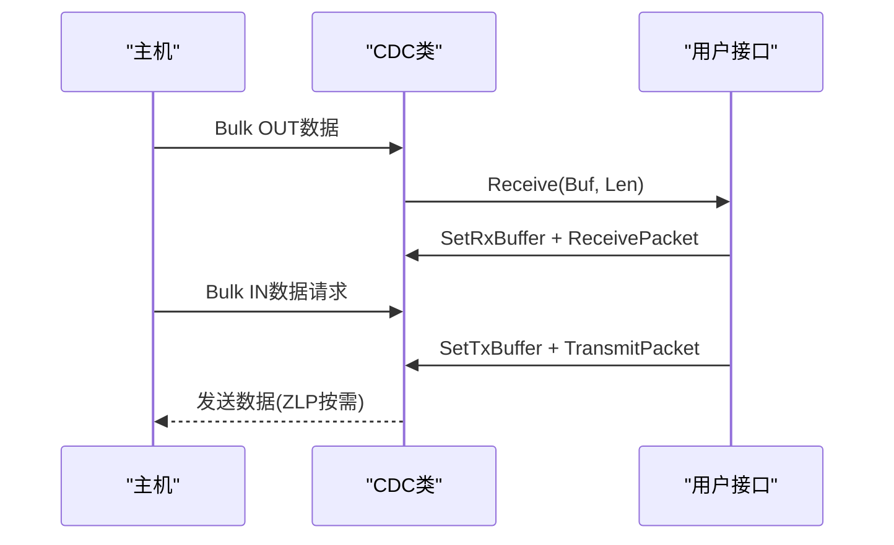

# CDC通信类

<cite>
**本文引用的文件**   
- [usbd_cdc_if.c](file://USB_Device/App/usbd_cdc_if.c)
- [usbd_cdc_if.h](file://USB_Device/App/usbd_cdc_if.h)
- [usbd_cdc.c](file://Middlewares/ST/STM32_USB_Device_Library/Class/CDC/Src/usbd_cdc.c)
- [usbd_cdc.h](file://Middlewares/ST/STM32_USB_Device_Library/Class/CDC/Inc/usbd_cdc.h)
- [usb_device.c](file://USB_Device/App/usb_device.c)
- [usbd_desc.c](file://USB_Device/App/usbd_desc.c)
- [main.c](file://Core/Src/main.c)
</cite>

## 目录
1. [简介](#简介)
2. [项目结构](#项目结构)
3. [核心组件](#核心组件)
4. [架构总览](#架构总览)
5. [详细组件分析](#详细组件分析)
6. [依赖关系分析](#依赖关系分析)
7. [性能与吞吐优化](#性能与吞吐优化)
8. [故障排查指南](#故障排查指南)
9. [结论](#结论)
10. [附录：协议与时序、数据包格式](#附录协议与时序数据包格式)

## 简介
本技术参考文档围绕STM32 USB设备库中的CDC（Communication Device Class）实现，面向需要基于虚拟串口进行主机-设备串行通信的开发者。文档从协议规范到代码实现逐层展开，重点解析usbd_cdc_if.c中的回调接口（如CDC_Transmit_FS()、CDC_Receive_FS()等），说明CDC类的配置项与参数设置（波特率、数据位、停止位、校验位等），并提供完整的数据收发流程、错误处理与异常恢复机制，以及底层时序与数据包格式说明，帮助读者快速掌握并扩展其他USB类。

## 项目结构
本项目采用分层组织方式：
- 应用层：Main循环与业务逻辑（main.c）
- USB设备抽象与应用绑定：设备初始化与类注册（usb_device.c）、描述符定义（usbd_desc.c）
- CDC类驱动：CDC类核心实现（usbd_cdc.c、usbd_cdc.h）
- CDC用户接口层：应用侧回调与缓冲区管理（usbd_cdc_if.c、usbd_cdc_if.h）

图表来源
- [usb_device.c:66-88](file://USB_Device/App/usb_device.c#L66-L88)
- [usbd_desc.c:132-141](file://USB_Device/App/usbd_desc.c#L132-L141)
- [usbd_cdc.c:140-156](file://Middlewares/ST/STM32_USB_Device_Library/Class/CDC/Src/usbd_cdc.c#L140-L156)
- [usbd_cdc_if.c:138-145](file://USB_Device/App/usbd_cdc_if.c#L138-L145)

章节来源
- [usb_device.c:66-88](file://USB_Device/App/usb_device.c#L66-L88)
- [usbd_desc.c:132-141](file://USB_Device/App/usbd_desc.c#L132-L141)
- [usbd_cdc.c:140-156](file://Middlewares/ST/STM32_USB_Device_Library/Class/CDC/Src/usbd_cdc.c#L140-L156)
- [usbd_cdc_if.c:138-145](file://USB_Device/App/usbd_cdc_if.c#L138-L145)

## 核心组件
- CDC类驱动（usbd_cdc.c/.h）
  - 提供CDC类枚举、端点管理、控制请求分发、IN/OUT数据传输、ZLP处理、回调钩子等能力。
  - 暴露API：USBD_CDC_RegisterInterface()、USBD_CDC_SetTxBuffer()、USBD_CDC_SetRxBuffer()、USBD_CDC_TransmitPacket()、USBD_CDC_ReceivePacket()。
- CDC用户接口（usbd_cdc_if.c/.h）
  - 实现USBD_CDC_ItfTypeDef回调表，包含Init/DeInit/Control/Receive/TransmitCplt五个钩子。
  - 提供对外发送接口CDC_Transmit_FS()，并在接收回调中重新准备接收端点以持续接收。
- 设备初始化与描述符（usb_device.c、usbd_desc.c）
  - 完成USB设备初始化、注册CDC类与用户接口、启动设备；提供设备/字符串/配置描述符。

章节来源
- [usbd_cdc.h:140-158](file://Middlewares/ST/STM32_USB_Device_Library/Class/CDC/Inc/usbd_cdc.h#L140-L158)
- [usbd_cdc.c:838-955](file://Middlewares/ST/STM32_USB_Device_Library/Class/CDC/Src/usbd_cdc.c#L838-L955)
- [usbd_cdc_if.c:138-145](file://USB_Device/App/usbd_cdc_if.c#L138-L145)
- [usb_device.c:66-88](file://USB_Device/App/usb_device.c#L66-L88)
- [usbd_desc.c:132-141](file://USB_Device/App/usbd_desc.c#L132-L141)

## 架构总览
CDC类在USB设备栈中的位置如下：
- 主机通过标准USB枚举发现CDC类（两个接口：控制接口+数据接口）。
- 控制接口使用中断端点用于ACM命令（如SET_LINE_CODING、GET_LINE_CODING等）。
- 数据接口使用Bulk IN/OUT端点进行实际数据收发。
- 应用通过CDC_Transmit_FS()发起发送，通过CDC_Receive_FS()回调处理接收数据。

图表来源
- [usb_device.c:66-88](file://USB_Device/App/usb_device.c#L66-L88)
- [usbd_cdc.c:467-542](file://Middlewares/ST/STM32_USB_Device_Library/Class/CDC/Src/usbd_cdc.c#L467-L542)
- [usbd_cdc.c:586-681](file://Middlewares/ST/STM32_USB_Device_Library/Class/CDC/Src/usbd_cdc.c#L586-L681)
- [usbd_cdc.c:690-749](file://Middlewares/ST/STM32_USB_Device_Library/Class/CDC/Src/usbd_cdc.c#L690-L749)
- [usbd_cdc_if.c:152-160](file://USB_Device/App/usbd_cdc_if.c#L152-L160)
- [usbd_cdc_if.c:261-268](file://USB_Device/App/usbd_cdc_if.c#L261-L268)
- [usbd_cdc_if.c:281-293](file://USB_Device/App/usbd_cdc_if.c#L281-L293)

## 详细组件分析

### CDC类驱动（usbd_cdc.c/.h）
- 端点与描述符
  - 定义控制端点（中断）、数据端点（Bulk IN/OUT）及FS/HS配置描述符。
  - 关键常量：CDC_IN_EP、CDC_OUT_EP、CDC_CMD_EP、CDC_DATA_FS_MAX_PACKET_SIZE、CDC_CMD_PACKET_SIZE等。
- 生命周期回调
  - Init：按速度打开端点、调用用户接口Init、初始化状态、预取下一个OUT包。
  - DeInit：关闭端点、释放资源、调用用户接口DeInit。
- 控制请求处理（Setup）
  - 对CLASS类型请求，将数据缓冲交由用户接口Control回调处理；对标准请求做基本响应。
- 数据传输
  - DataIn：处理IN端点完成，必要时发送ZLP，并触发TransmitCplt回调。
  - DataOut：获取接收长度，调用用户接口Receive回调。
- 公共API
  - RegisterInterface/SetTxBuffer/SetRxBuffer/TransmitPacket/ReceivePacket。

图表来源
- [usbd_cdc.c:140-156](file://Middlewares/ST/STM32_USB_Device_Library/Class/CDC/Src/usbd_cdc.c#L140-L156)
- [usbd_cdc.h:94-124](file://Middlewares/ST/STM32_USB_Device_Library/Class/CDC/Inc/usbd_cdc.h#L94-L124)
- [usbd_cdc.c:467-542](file://Middlewares/ST/STM32_USB_Device_Library/Class/CDC/Src/usbd_cdc.c#L467-L542)
- [usbd_cdc.c:586-681](file://Middlewares/ST/STM32_USB_Device_Library/Class/CDC/Src/usbd_cdc.c#L586-L681)
- [usbd_cdc.c:690-749](file://Middlewares/ST/STM32_USB_Device_Library/Class/CDC/Src/usbd_cdc.c#L690-L749)

章节来源
- [usbd_cdc.h:44-81](file://Middlewares/ST/STM32_USB_Device_Library/Class/CDC/Inc/usbd_cdc.h#L44-L81)
- [usbd_cdc.c:467-542](file://Middlewares/ST/STM32_USB_Device_Library/Class/CDC/Src/usbd_cdc.c#L467-L542)
- [usbd_cdc.c:586-681](file://Middlewares/ST/STM32_USB_Device_Library/Class/CDC/Src/usbd_cdc.c#L586-L681)
- [usbd_cdc.c:690-749](file://Middlewares/ST/STM32_USB_Device_Library/Class/CDC/Src/usbd_cdc.c#L690-L749)
- [usbd_cdc.c:838-955](file://Middlewares/ST/STM32_USB_Device_Library/Class/CDC/Src/usbd_cdc.c#L838-L955)

### CDC用户接口（usbd_cdc_if.c/.h）
- 回调表USBD_Interface_fops_FS
  - 指向CDC_Init_FS、CDC_DeInit_FS、CDC_Control_FS、CDC_Receive_FS、CDC_TransmitCplt_FS。
- 缓冲区
  - UserRxBufferFS/UserTxBufferFS大小由APP_RX_DATA_SIZE/APP_TX_DATA_SIZE定义。
- 关键函数
  - CDC_Init_FS：设置Tx/Rx缓冲区指针。
  - CDC_Control_FS：处理ACM控制命令（如SET_LINE_CODING、GET_LINE_CODING、SET_CONTROL_LINE_STATE等）。
  - CDC_Receive_FS：收到数据后更新Rx缓冲区并再次准备接收。
  - CDC_Transmit_FS：检查发送忙状态，设置Tx缓冲区并发起发送。
  - CDC_TransmitCplt_FS：发送完成回调，可用于后续操作或状态复位。

图表来源
- [usbd_cdc_if.c:261-268](file://USB_Device/App/usbd_cdc_if.c#L261-L268)
- [usbd_cdc.c:932-955](file://Middlewares/ST/STM32_USB_Device_Library/Class/CDC/Src/usbd_cdc.c#L932-L955)

章节来源
- [usbd_cdc_if.c:88-95](file://USB_Device/App/usbd_cdc_if.c#L88-L95)
- [usbd_cdc_if.c:138-145](file://USB_Device/App/usbd_cdc_if.c#L138-L145)
- [usbd_cdc_if.c:152-160](file://USB_Device/App/usbd_cdc_if.c#L152-L160)
- [usbd_cdc_if.c:180-244](file://USB_Device/App/usbd_cdc_if.c#L180-L244)
- [usbd_cdc_if.c:261-268](file://USB_Device/App/usbd_cdc_if.c#L261-L268)
- [usbd_cdc_if.c:281-293](file://USB_Device/App/usbd_cdc_if.c#L281-L293)
- [usbd_cdc_if.c:307-316](file://USB_Device/App/usbd_cdc_if.c#L307-L316)
- [usbd_cdc_if.h:51-54](file://USB_Device/App/usbd_cdc_if.h#L51-L54)

### 设备初始化与描述符（usb_device.c、usbd_desc.c）
- 初始化流程
  - USBD_Init：初始化USB设备核心与描述符。
  - USBD_RegisterClass：注册CDC类。
  - USBD_CDC_RegisterInterface：注册用户接口回调表。
  - USBD_Start：启动USB设备。
- 描述符
  - 设备描述符、字符串描述符、配置描述符（含CDC控制与数据接口、端点信息）。

章节来源
- [usb_device.c:66-88](file://USB_Device/App/usb_device.c#L66-L88)
- [usbd_desc.c:132-141](file://USB_Device/App/usbd_desc.c#L132-L141)
- [usbd_desc.c:147-167](file://USB_Device/App/usbd_desc.c#L147-L167)

### 应用示例与最佳实践（main.c）
- 典型用法
  - 在业务逻辑中调用CDC_Transmit_FS()发送数据。
  - 在CDC_Receive_FS()回调中处理接收到的数据，并立即调用USBD_CDC_ReceivePacket()继续接收。
- 注意事项
  - 避免在回调中进行耗时操作，尽量将数据处理移至主循环或任务队列。
  - 注意发送忙状态（USBD_BUSY）的处理与重试策略。

章节来源
- [main.c:25-27](file://Core/Src/main.c#L25-L27)
- [usbd_cdc_if.c:281-293](file://USB_Device/App/usbd_cdc_if.c#L281-L293)
- [usbd_cdc_if.c:261-268](file://USB_Device/App/usbd_cdc_if.c#L261-L268)

## 依赖关系分析
- 模块耦合
  - usb_device.c依赖usbd_core、usbd_desc、usbd_cdc、usbd_cdc_if。
  - usbd_cdc.c依赖usbd_cdc.h与usbd_ctlreq.h，并通过pUserData调用用户接口。
  - usbd_cdc_if.c依赖usbd_cdc_if.h与usbd_cdc.h，实现回调表。
- 外部依赖
  - HAL/LL层端点操作通过USBD_LL_*系列函数完成（由具体MCU HAL实现）。

图表来源
- [usb_device.c:23-27](file://USB_Device/App/usb_device.c#L23-L27)
- [usbd_cdc.c:59-61](file://Middlewares/ST/STM32_USB_Device_Library/Class/CDC/Src/usbd_cdc.c#L59-L61)
- [usbd_cdc_if.c:22-23](file://USB_Device/App/usbd_cdc_if.c#L22-L23)

章节来源
- [usb_device.c:23-27](file://USB_Device/App/usb_device.c#L23-L27)
- [usbd_cdc.c:59-61](file://Middlewares/ST/STM32_USB_Device_Library/Class/CDC/Src/usbd_cdc.c#L59-L61)
- [usbd_cdc_if.c:22-23](file://USB_Device/App/usbd_cdc_if.c#L22-L23)

## 性能与吞吐优化
- 端点包大小
  - FS模式最大包大小为64字节，HS为512字节。合理调整应用层打包策略以提升吞吐。
- ZLP处理
  - 当发送长度为端点最大包的整数倍时，需发送零长度包（ZLP）以结束传输。CDC类已自动处理。
- 发送忙状态
  - 若hcdc->TxState不为0，则返回BUSY。应用层应排队或延迟重试，避免丢包。
- 接收缓冲刷新
  - 在Receive回调中必须调用ReceivePacket以准备下一次接收，否则无法继续接收数据。

章节来源
- [usbd_cdc.h:57-66](file://Middlewares/ST/STM32_USB_Device_Library/Class/CDC/Inc/usbd_cdc.h#L57-L66)
- [usbd_cdc.c:702-722](file://Middlewares/ST/STM32_USB_Device_Library/Class/CDC/Src/usbd_cdc.c#L702-L722)
- [usbd_cdc.c:909-924](file://Middlewares/ST/STM32_USB_Device_Library/Class/CDC/Src/usbd_cdc.c#L909-L924)
- [usbd_cdc_if.c:261-268](file://USB_Device/App/usbd_cdc_if.c#L261-L268)

## 故障排查指南
- 现象：主机无法识别CDC虚拟串口
  - 检查设备描述符与配置描述符是否正确（类/子类/协议字段）。
  - 确认USBD_Init/USBD_RegisterClass/USBD_CDC_RegisterInterface/USBD_Start均返回OK。
- 现象：发送阻塞或无数据发出
  - 检查CDC_Transmit_FS返回值是否为BUSY；若是，等待或重试。
  - 确认TX缓冲区长度正确且非空。
- 现象：接收不到数据
  - 确保在CDC_Receive_FS回调末尾调用USBD_CDC_ReceivePacket()。
  - 检查Rx缓冲区指针是否有效。
- 现象：控制命令无效
  - 在CDC_Control_FS中实现SET_LINE_CODING/GET_LINE_CODING等命令处理。
  - 确认EP0 RxReady路径能正确转发数据至用户接口Control回调。

章节来源
- [usb_device.c:66-88](file://USB_Device/App/usb_device.c#L66-L88)
- [usbd_cdc_if.c:281-293](file://USB_Device/App/usbd_cdc_if.c#L281-L293)
- [usbd_cdc_if.c:261-268](file://USB_Device/App/usbd_cdc_if.c#L261-L268)
- [usbd_cdc.c:757-775](file://Middlewares/ST/STM32_USB_Device_Library/Class/CDC/Src/usbd_cdc.c#L757-L775)

## 结论
CDC类驱动提供了完整的虚拟串口实现，涵盖枚举、控制命令、数据收发与ZLP处理。应用层只需实现用户接口回调与缓冲区管理，即可快速构建稳定的USB CDC通信。通过理解回调链路与状态机，开发者可进一步优化吞吐、增强健壮性，并以此为参考扩展其他USB类。

## 附录：协议与时序、数据包格式

### CDC协议要点
- 接口结构
  - 控制接口：bInterfaceClass=0x02（Communication），bInterfaceSubClass=0x02（Abstract Control Model），bInterfaceProtocol=0x01（Common AT commands）。
  - 数据接口：bInterfaceClass=0x0A（CDC），无子类与协议。
- 端点
  - 控制端点：中断IN（CDC_CMD_EP），用于ACM命令。
  - 数据端点：Bulk IN/OUT（CDC_IN_EP/CDC_OUT_EP）。
- 功能描述符
  - Header、Call Management、ACM、Union等功能描述符声明了控制与数据接口的关联。

章节来源
- [usbd_cdc.c:277-354](file://Middlewares/ST/STM32_USB_Device_Library/Class/CDC/Src/usbd_cdc.c#L277-L354)

### Line Coding结构（波特率/停止位/校验/数据位）
- dwDTERate：比特率（bps）
- bCharFormat：停止位（0=1, 1=1.5, 2=2）
- bParityType：校验（0=None, 1=Odd, 2=Even, 3=Mark, 4=Space）
- bDataBits：数据位（5/6/7/8/16）

章节来源
- [usbd_cdc_if.c:205-221](file://USB_Device/App/usbd_cdc_if.c#L205-L221)
- [usbd_cdc.h:94-100](file://Middlewares/ST/STM32_USB_Device_Library/Class/CDC/Inc/usbd_cdc.h#L94-L100)

### 控制请求（ACM命令）
- SET_LINE_CODING / GET_LINE_CODING：设置/获取Line Coding
- SET_CONTROL_LINE_STATE：设置DTR/RTS等控制线状态
- SEND_BREAK / CLEAR_COMM_FEATURE / GET_COMM_FEATURE等

章节来源
- [usbd_cdc.h:72-81](file://Middlewares/ST/STM32_USB_Device_Library/Class/CDC/Inc/usbd_cdc.h#L72-L81)
- [usbd_cdc.c:586-681](file://Middlewares/ST/STM32_USB_Device_Library/Class/CDC/Src/usbd_cdc.c#L586-L681)

### 数据收发时序（简化）

图表来源
- [usbd_cdc.c:690-749](file://Middlewares/ST/STM32_USB_Device_Library/Class/CDC/Src/usbd_cdc.c#L690-L749)
- [usbd_cdc.c:899-924](file://Middlewares/ST/STM32_USB_Device_Library/Class/CDC/Src/usbd_cdc.c#L899-L924)
- [usbd_cdc.c:932-955](file://Middlewares/ST/STM32_USB_Device_Library/Class/CDC/Src/usbd_cdc.c#L932-L955)
- [usbd_cdc_if.c:261-268](file://USB_Device/App/usbd_cdc_if.c#L261-L268)
- [usbd_cdc_if.c:281-293](file://USB_Device/App/usbd_cdc_if.c#L281-L293)

### 数据包格式与端点包大小
- FS Bulk端点最大包大小：64字节
- HS Bulk端点最大包大小：512字节
- 控制端点包大小：8字节
- 当发送长度为端点最大包的整数倍时，需发送ZLP以结束传输。

章节来源
- [usbd_cdc.h:57-66](file://Middlewares/ST/STM32_USB_Device_Library/Class/CDC/Inc/usbd_cdc.h#L57-L66)
- [usbd_cdc.c:702-722](file://Middlewares/ST/STM32_USB_Device_Library/Class/CDC/Src/usbd_cdc.c#L702-L722)