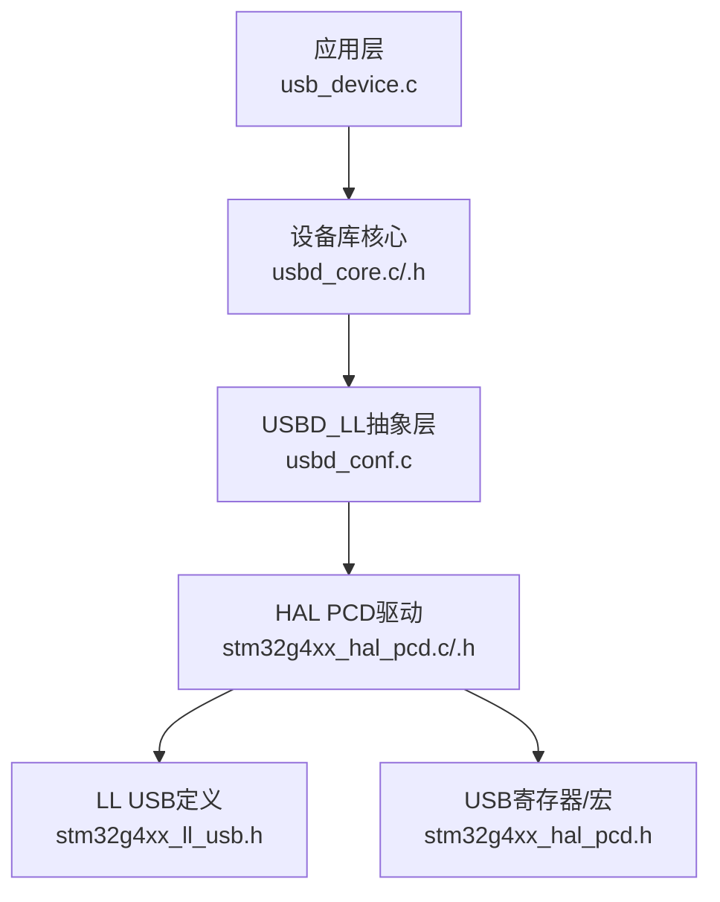
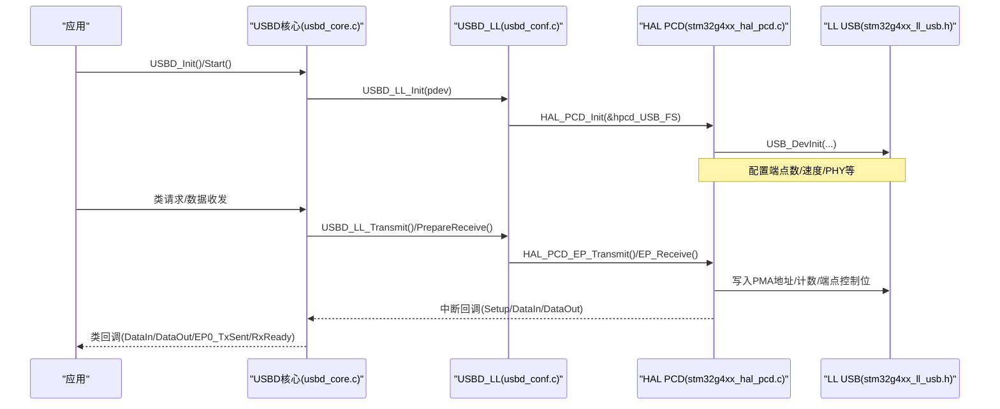
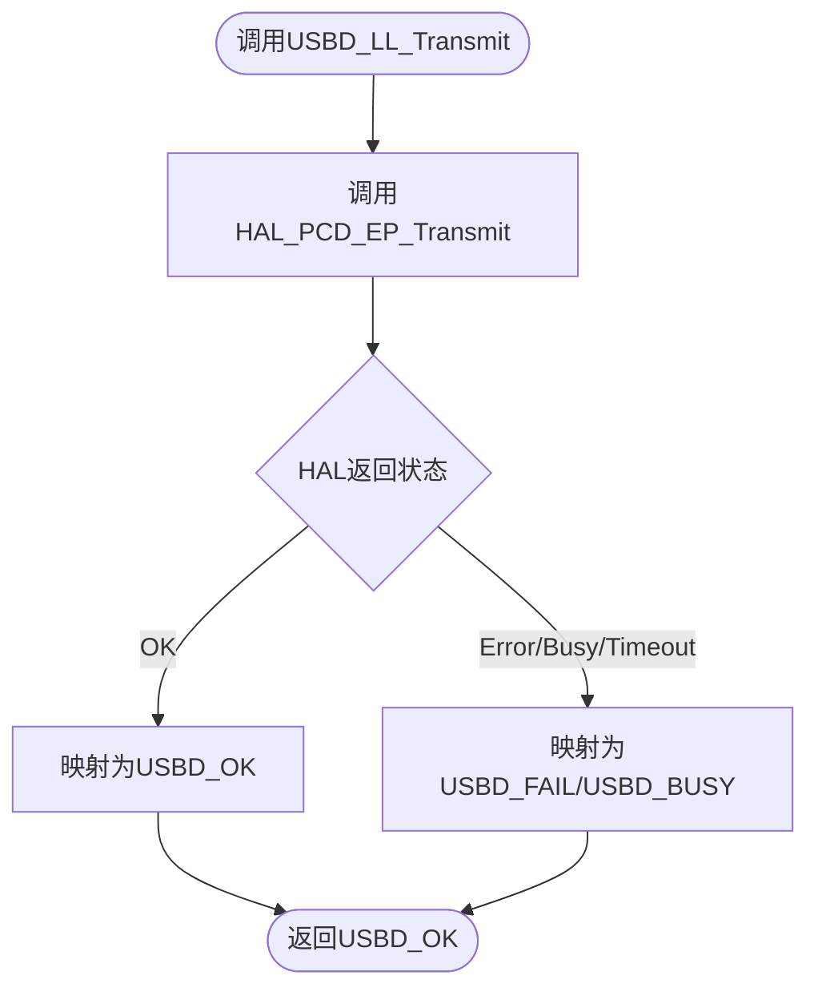
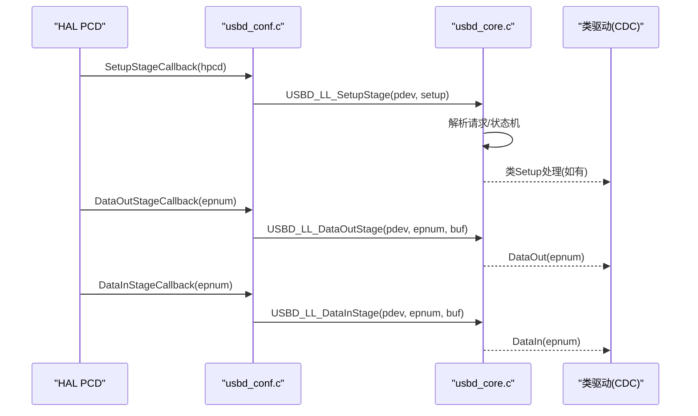

# USB底层驱动接口

<cite>
**本文引用的文件列表**   
- [usbd_conf.c](file://USB_Device/Target/usbd_conf.c)
- [usbd_conf.h](file://USB_Device/Target/usbd_conf.h)
- [usbd_def.h](file://Middlewares/ST/STM32_USB_Device_Library/Core/Inc/usbd_def.h)
- [usbd_core.c](file://Middlewares/ST/STM32_USB_Device_Library/Core/Src/usbd_core.c)
- [usbd_core.h](file://Middlewares/ST/STM32_USB_Device_Library/Core/Inc/usbd_core.h)
- [usb_device.c](file://USB_Device/App/usb_device.c)
- [stm32g4xx_hal_pcd.h](file://Drivers/STM32G4xx_HAL_Driver/Inc/stm32g4xx_hal_pcd.h)
- [stm32g4xx_ll_usb.h](file://Drivers/STM32G4xx_HAL_Driver/Inc/stm32g4xx_ll_usb.h)
- [stm32g4xx_hal_pcd.c](file://Drivers/STM32G4xx_HAL_Driver/Src/stm32g4xx_hal_pcd.c)
</cite>

## 目录
1. [简介](#简介)
2. [项目结构](#项目结构)
3. [核心组件](#核心组件)
4. [架构总览](#架构总览)
5. [详细组件分析](#详细组件分析)
6. [依赖关系分析](#依赖关系分析)
7. [性能与优化](#性能与优化)
8. [移植指南](#移植指南)
9. [故障排查](#故障排查)
10. [结论](#结论)

## 简介
本技术参考文档聚焦于USB设备栈的底层抽象层（USBD_LL）及其在STM32 G4系列上的具体实现。文档深入解释：
- USBD_LL抽象层的设计理念与硬件无关的USB操作接口
- usbd_conf.c中的底层驱动配置要点（时钟、中断、PMA端点缓冲等）
- 关键端点操作方法（如USBD_LL_OpenEP、USBD_LL_Transmit、USBD_LL_PrepareReceive）的实现路径
- 从HAL PCD到LL层的调用链路与寄存器访问方式
- 将USB底层驱动移植到新平台的步骤与要求
- 面向高级用户的性能优化与定制建议

## 项目结构
本项目采用分层组织：应用层通过MX_USB_Device_Init初始化并注册CDC类；中间件提供USB设备库核心与类实现；目标板适配层usbd_conf.c实现USBD_LL接口，桥接HAL PCD；HAL层封装外设寄存器与中断处理；LL层提供最小化的寄存器访问宏与类型定义。

图表来源
- [usb_device.c:66-88](file://USB_Device/App/usb_device.c#L66-L88)
- [usbd_core.c:89-122](file://Middlewares/ST/STM32_USB_Device_Library/Core/Src/usbd_core.c#L89-L122)
- [usbd_conf.c:394-452](file://USB_Device/Target/usbd_conf.c#L394-L452)
- [stm32g4xx_hal_pcd.c:127-215](file://Drivers/STM32G4xx_HAL_Driver/Src/stm32g4xx_hal_pcd.c#L127-L215)
- [stm32g4xx_ll_usb.h:54-76](file://Drivers/STM32G4xx_HAL_Driver/Inc/stm32g4xx_ll_usb.h#L54-L76)
- [stm32g4xx_hal_pcd.h:426-522](file://Drivers/STM32G4xx_HAL_Driver/Inc/stm32g4xx_hal_pcd.h#L426-L522)

章节来源
- [usb_device.c:66-88](file://USB_Device/App/usb_device.c#L66-L88)
- [usbd_core.c:89-122](file://Middlewares/ST/STM32_USB_Device_Library/Core/Src/usbd_core.c#L89-L122)
- [usbd_conf.c:394-452](file://USB_Device/Target/usbd_conf.c#L394-L452)
- [stm32g4xx_hal_pcd.c:127-215](file://Drivers/STM32G4xx_HAL_Driver/Src/stm32g4xx_hal_pcd.c#L127-L215)
- [stm32g4xx_ll_usb.h:54-76](file://Drivers/STM32G4xx_HAL_Driver/Inc/stm32g4xx_ll_usb.h#L54-L76)
- [stm32g4xx_hal_pcd.h:426-522](file://Drivers/STM32G4xx_HAL_Driver/Inc/stm32g4xx_hal_pcd.h#L426-L522)

## 核心组件
- USBD_HandleTypeDef：设备句柄，包含状态、端点表、描述符指针、类指针及指向底层驱动的pData。
- PCD_HandleTypeDef：HAL PCD句柄，包含实例、初始化参数、端点表、回调函数指针等。
- USB_CfgTypeDef：LL层USB实例初始化结构体，定义端点数、速度、PHY、SOF/LPM/低功耗等选项。
- USBD_ClassTypeDef：类接口函数表，用于控制与数据阶段回调。

这些结构贯穿上层应用、设备库核心、USBD_LL适配层与HAL PCD驱动，形成自顶向下的调用链。

章节来源
- [usbd_def.h:274-312](file://Middlewares/ST/STM32_USB_Device_Library/Core/Inc/usbd_def.h#L274-L312)
- [stm32g4xx_hal_pcd.h:95-140](file://Drivers/STM32G4xx_HAL_Driver/Inc/stm32g4xx_hal_pcd.h#L95-L140)
- [stm32g4xx_ll_usb.h:54-76](file://Drivers/STM32G4xx_HAL_Driver/Inc/stm32g4xx_ll_usb.h#L54-L76)

## 架构总览
USBD_LL作为“硬件无关”的抽象层，向上暴露统一的端点与设备管理API，向下通过HAL PCD驱动访问具体外设寄存器与中断。其职责包括：
- 初始化与启动/停止USB外设
- 打开/关闭/刷新端点，设置STALL/清除STALL
- 发送与接收数据
- 映射HAL PCD回调至USBD核心事件（Setup/DataIn/DataOut/SOF/Reset/Suspend/Resume等）

图表来源
- [usbd_core.c:89-122](file://Middlewares/ST/STM32_USB_Device_Library/Core/Src/usbd_core.c#L89-L122)
- [usbd_conf.c:394-452](file://USB_Device/Target/usbd_conf.c#L394-L452)
- [stm32g4xx_hal_pcd.c:127-215](file://Drivers/STM32G4xx_HAL_Driver/Src/stm32g4xx_hal_pcd.c#L127-L215)
- [stm32g4xx_ll_usb.h:191-200](file://Drivers/STM32G4xx_HAL_Driver/Inc/stm32g4xx_ll_usb.h#L191-L200)

## 详细组件分析

### USBD_LL抽象层设计与实现机制
- 设计目标：屏蔽不同MCU的USB外设差异，为上层提供统一API。
- 实现方式：在usbd_conf.c中实现USBD_LL_*系列函数，内部调用HAL_PCD_*完成实际外设操作。
- 回调桥接：HAL_PCD_SetupStageCallback/HAL_PCD_DataInStageCallback/HAL_PCD_DataOutStageCallback等回调中将pHandle转换为USBD_HandleTypeDef，再调用USBD_LL_*分发到核心。

章节来源
- [usbd_conf.c:131-144](file://USB_Device/Target/usbd_conf.c#L131-L144)
- [usbd_conf.c:152-186](file://USB_Device/Target/usbd_conf.c#L152-L186)
- [usbd_core.c:288-318](file://Middlewares/ST/STM32_USB_Device_Library/Core/Src/usbd_core.c#L288-L318)

### 底层驱动配置（usbd_conf.c）
- 时钟配置：在MSP初始化中配置USB时钟源为HSI48，并启用USB外设时钟。
- 中断优先级：设置USB_LP_IRQn优先级并启用中断。
- 端点PMA分配：使用HAL_PCDEx_PMAConfig为各端点分配单缓冲PMA地址。
- 低层初始化：填充PCD_HandleTypeDef，设置dev_endpoints=8、speed=FULL、phy_itface=EMBEDDED、SOF/LPM/低功耗等开关，然后调用HAL_PCD_Init与Start。
- 回调注册：按USE_HAL_PCD_REGISTER_CALLBACKS条件注册各类回调。

章节来源
- [usbd_conf.c:74-101](file://USB_Device/Target/usbd_conf.c#L74-L101)
- [usbd_conf.c:401-452](file://USB_Device/Target/usbd_conf.c#L401-L452)
- [usbd_conf.c:443-450](file://USB_Device/Target/usbd_conf.c#L443-L450)

### 端点底层操作方法详解
- USBD_LL_OpenEP：调用HAL_PCD_EP_Open，传入端点地址、类型与最大包长。
- USBD_LL_CloseEP/FlushEP/Stall/ClearStall：分别对应HAL_PCD_EP_Close/Flush/SetStall/ClrStall。
- USBD_LL_SetUSBAddress：调用HAL_PCD_SetAddress。
- USBD_LL_Transmit：调用HAL_PCD_EP_Transmit进行IN传输。
- USBD_LL_PrepareReceive：调用HAL_PCD_EP_Receive准备OUT接收。
- USBD_LL_GetRxDataSize：调用HAL_PCD_EP_GetRxCount获取已接收字节数。
- USBD_LL_IsStallEP：根据端点方向读取IN或OUT端点的is_stall标志。

图表来源
- [usbd_conf.c:643-653](file://USB_Device/Target/usbd_conf.c#L643-L653)
- [usbd_conf.c:774-797](file://USB_Device/Target/usbd_conf.c#L774-L797)

章节来源
- [usbd_conf.c:513-523](file://USB_Device/Target/usbd_conf.c#L513-L523)
- [usbd_conf.c:531-541](file://USB_Device/Target/usbd_conf.c#L531-L541)
- [usbd_conf.c:549-559](file://USB_Device/Target/usbd_conf.c#L549-L559)
- [usbd_conf.c:567-577](file://USB_Device/Target/usbd_conf.c#L567-L577)
- [usbd_conf.c:585-595](file://USB_Device/Target/usbd_conf.c#L585-L595)
- [usbd_conf.c:603-615](file://USB_Device/Target/usbd_conf.c#L603-L615)
- [usbd_conf.c:623-633](file://USB_Device/Target/usbd_conf.c#L623-L633)
- [usbd_conf.c:643-653](file://USB_Device/Target/usbd_conf.c#L643-L653)
- [usbd_conf.c:663-673](file://USB_Device/Target/usbd_conf.c#L663-L673)
- [usbd_conf.c:681-684](file://USB_Device/Target/usbd_conf.c#L681-L684)

### HAL PCD驱动与LL层交互
- HAL_PCD_Init：初始化端点表、调用USB_DevInit配置核心、可选激活LPM。
- HAL_PCD_Start/Stop：启动/停止设备。
- 端点操作：HAL_PCD_EP_Open/Transmit/Receive/SetStall/ClearStall/Flush/Abort等。
- 中断处理：HAL_PCD_IRQHandler调度EP ISR，触发相应回调。
- LL宏与寄存器访问：通过stm32g4xx_hal_pcd.h中的宏直接读写端点寄存器、PMA地址与计数。

章节来源
- [stm32g4xx_hal_pcd.c:127-215](file://Drivers/STM32G4xx_HAL_Driver/Src/stm32g4xx_hal_pcd.c#L127-L215)
- [stm32g4xx_hal_pcd.h:333-344](file://Drivers/STM32G4xx_HAL_Driver/Inc/stm32g4xx_hal_pcd.h#L333-L344)
- [stm32g4xx_hal_pcd.h:426-522](file://Drivers/STM32G4xx_HAL_Driver/Inc/stm32g4xx_hal_pcd.h#L426-L522)
- [stm32g4xx_ll_usb.h:191-200](file://Drivers/STM32G4xx_HAL_Driver/Inc/stm32g4xx_ll_usb.h#L191-L200)

### 回调链路与时序
- Setup阶段：HAL_PCD_SetupStageCallback -> USBD_LL_SetupStage -> 解析请求 -> 标准/类请求处理。
- Data OUT阶段：HAL_PCD_DataOutStageCallback -> USBD_LL_DataOutStage -> 类DataOut回调。
- Data IN阶段：HAL_PCD_DataInStageCallback -> USBD_LL_DataInStage -> 类DataIn回调。
- SOF/Reset/Suspend/Resume：各自回调映射到USBD_LL_SOF/Reset/Suspend/Resume。

图表来源
- [usbd_conf.c:131-186](file://USB_Device/Target/usbd_conf.c#L131-L186)
- [usbd_core.c:288-481](file://Middlewares/ST/STM32_USB_Device_Library/Core/Src/usbd_core.c#L288-L481)

### 内存管理与延迟
- USBD_static_malloc/free：静态内存分配与空释放，避免动态分配开销。
- USBD_Delay：基于HAL_Delay的毫秒级延时。

章节来源
- [usbd_conf.c:741-755](file://USB_Device/Target/usbd_conf.c#L741-L755)
- [usbd_conf.c:731-734](file://USB_Device/Target/usbd_conf.c#L731-L734)

## 依赖关系分析
- 应用层依赖设备库核心（usbd_core）。
- 设备库核心依赖USBD_LL抽象层（由usbd_conf.c实现）。
- USBD_LL依赖HAL PCD驱动（stm32g4xx_hal_pcd.c/.h）。
- HAL PCD依赖LL USB定义（stm32g4xx_ll_usb.h）与寄存器宏（stm32g4xx_hal_pcd.h）。

图表来源
- [usb_device.c:66-88](file://USB_Device/App/usb_device.c#L66-L88)
- [usbd_core.h:85-135](file://Middlewares/ST/STM32_USB_Device_Library/Core/Inc/usbd_core.h#L85-L135)
- [usbd_conf.c:394-452](file://USB_Device/Target/usbd_conf.c#L394-L452)
- [stm32g4xx_hal_pcd.h:221-344](file://Drivers/STM32G4xx_HAL_Driver/Inc/stm32g4xx_hal_pcd.h#L221-L344)
- [stm32g4xx_ll_usb.h:54-76](file://Drivers/STM32G4xx_HAL_Driver/Inc/stm32g4xx_ll_usb.h#L54-L76)

章节来源
- [usb_device.c:66-88](file://USB_Device/App/usb_device.c#L66-L88)
- [usbd_core.h:85-135](file://Middlewares/ST/STM32_USB_Device_Library/Core/Inc/usbd_core.h#L85-L135)
- [usbd_conf.c:394-452](file://USB_Device/Target/usbd_conf.c#L394-L452)
- [stm32g4xx_hal_pcd.h:221-344](file://Drivers/STM32G4xx_HAL_Driver/Inc/stm32g4xx_hal_pcd.h#L221-L344)
- [stm32g4xx_ll_usb.h:54-76](file://Drivers/STM32G4xx_HAL_Driver/Inc/stm32g4xx_ll_usb.h#L54-L76)

## 性能与优化
- 端点缓冲与PMA分配：合理划分PMA区域，避免重叠与碎片化，减少跨缓冲拷贝。
- 双缓冲模式：若需要更高吞吐，可考虑启用双缓冲（需评估内存占用与复杂度）。
- DMA使用：当前实现以CPU搬运为主，如需提升性能，可在HAL PCD层引入DMA通道，并确保数据对齐与缓存一致性。
- 中断优先级：确保USB中断优先级高于一般任务，降低时延抖动。
- 时钟稳定性：使用HSI48作为USB时钟源，保证全速通信的时序精度。

[本节为通用指导，不直接分析具体文件]

## 移植指南
将USB底层驱动移植到新平台需完成以下工作：

- 必需实现的USBD_LL接口函数
  - USBD_LL_Init / DeInit / Start / Stop
  - USBD_LL_OpenEP / CloseEP / FlushEP
  - USBD_LL_StallEP / ClearStallEP / IsStallEP
  - USBD_LL_SetUSBAddress
  - USBD_LL_Transmit / PrepareReceive / GetRxDataSize
  - USBD_LL_Delay
  - 可选：USBD_static_malloc/free

- 必需配置的HAL PCD回调
  - SetupStageCallback
  - DataInStageCallback / DataOutStageCallback
  - SOFCallback / ResetCallback / SuspendCallback / ResumeCallback
  - ConnectCallback / DisconnectCallback
  - ISOIN/ISOOUT Incomplete回调（按需）

- 硬件相关配置
  - 时钟：配置USB时钟源（例如HSI48），使能外设时钟
  - GPIO：复用USB引脚
  - NVIC：设置USB中断优先级并启用
  - PMA：为各端点分配TX/RX缓冲区地址（单缓冲或双缓冲）
  - PHY：选择嵌入式PHY或外部PHY

- 配置项说明
  - dev_endpoints：设备端点数量
  - speed：USB速度（FS/HS）
  - phy_itface：PHY接口类型
  - Sof_enable / low_power_enable / lpm_enable / battery_charging_enable：功能开关

- 典型流程
  - 在usbd_conf.c中实现MSP初始化（时钟/GPIO/NVIC）
  - 在USBD_LL_Init中填充PCD_HandleTypeDef并调用HAL_PCD_Init/Start
  - 注册所有必要回调
  - 为端点配置PMA地址
  - 在应用层调用USBD_Init/注册类/USBD_Start

章节来源
- [usbd_conf.c:74-101](file://USB_Device/Target/usbd_conf.c#L74-L101)
- [usbd_conf.c:394-452](file://USB_Device/Target/usbd_conf.c#L394-L452)
- [usbd_conf.c:443-450](file://USB_Device/Target/usbd_conf.c#L443-L450)
- [stm32g4xx_ll_usb.h:54-76](file://Drivers/STM32G4xx_HAL_Driver/Inc/stm32g4xx_ll_usb.h#L54-L76)
- [stm32g4xx_hal_pcd.h:333-344](file://Drivers/STM32G4xx_HAL_Driver/Inc/stm32g4xx_hal_pcd.h#L333-L344)

## 故障排查
- 无法枚举或频繁复位
  - 检查USB时钟源是否稳定（HSI48）
  - 确认中断优先级与使能
  - 核对端点PMA地址无冲突
- 数据收发异常
  - 验证端点类型与最大包长匹配
  - 检查IN/OUT缓冲区长度与对齐
  - 确认回调中正确调用USBD_LL_PrepareReceive重新准备接收
- LPM/低功耗问题
  - 确认low_power_enable/lpm_enable配置一致
  - 唤醒后恢复系统时钟与SCB寄存器状态

章节来源
- [usbd_conf.c:257-297](file://USB_Device/Target/usbd_conf.c#L257-L297)
- [usbd_conf.c:693-724](file://USB_Device/Target/usbd_conf.c#L693-L724)
- [usbd_conf.c:774-797](file://USB_Device/Target/usbd_conf.c#L774-L797)

## 结论
USBD_LL抽象层通过统一接口屏蔽了底层USB外设差异，结合HAL PCD驱动与LL层宏，实现了高效且可移植的设备栈。通过合理的时钟、中断与PMA配置，以及必要的回调实现，开发者可以在新平台上快速集成USB设备功能。对于高性能需求，可在HAL PCD层引入DMA与双缓冲策略，进一步优化吞吐与时延。