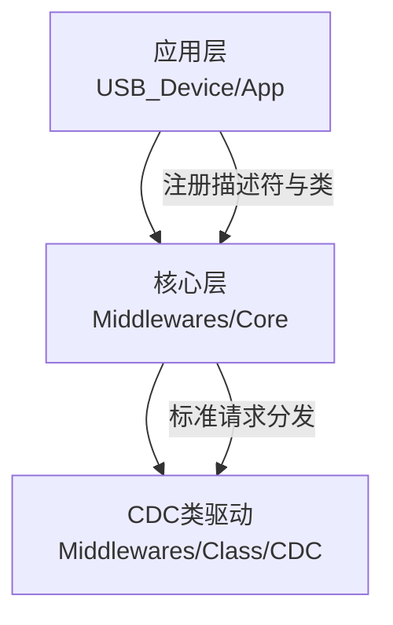
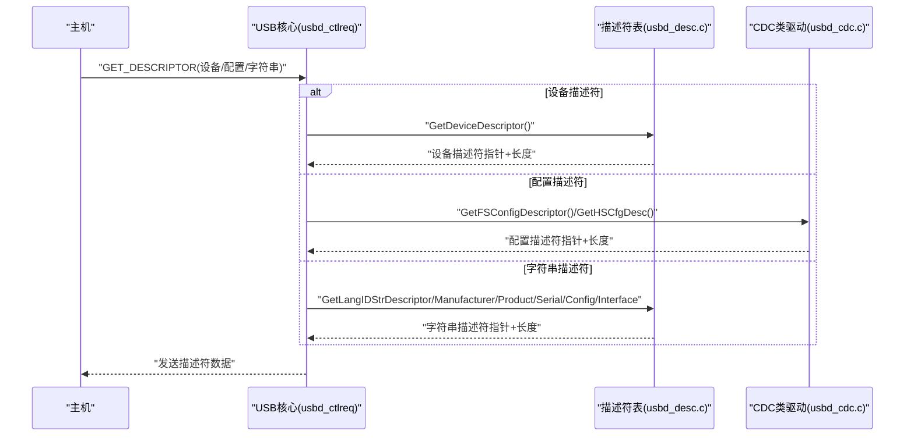
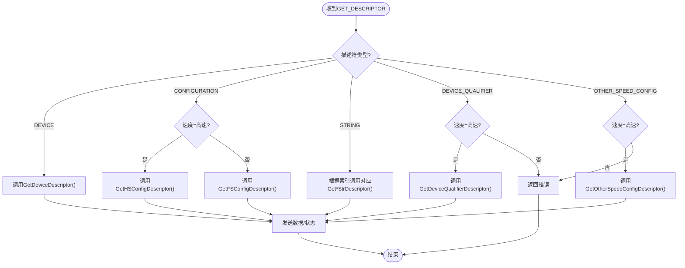
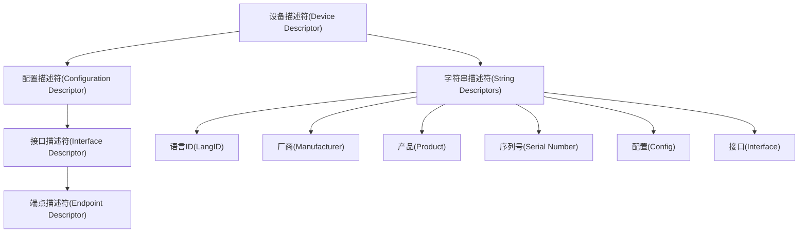
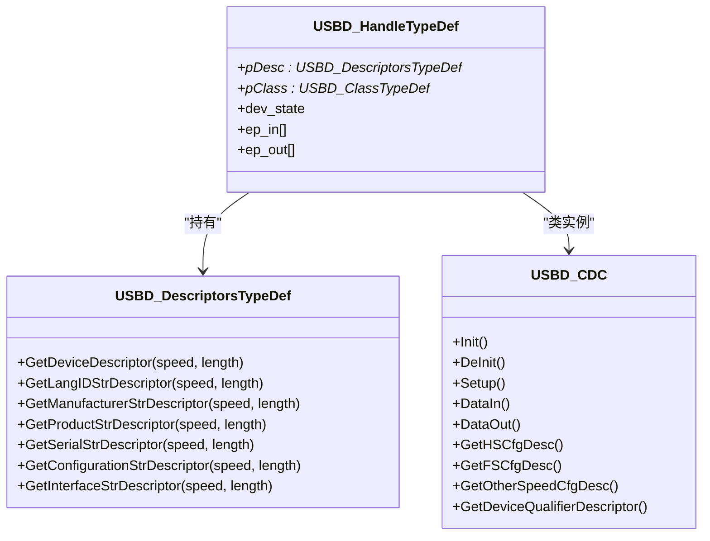

# USB描述符管理

<cite>
**本文引用的文件列表**
- [usbd_desc.c](file://USB_Device/App/usbd_desc.c)
- [usbd_desc.h](file://USB_Device/App/usbd_desc.h)
- [usb_device.c](file://USB_Device/App/usb_device.c)
- [usbd_def.h](file://Middlewares/ST/STM32_USB_Device_Library/Core/Inc/usbd_def.h)
- [usbd_ctlreq.c](file://Middlewares/ST/STM32_USB_Device_Library/Core/Src/usbd_ctlreq.c)
- [usbd_core.h](file://Middlewares/ST/STM32_USB_Device_Library/Core/Inc/usbd_core.h)
- [usbd_cdc.c](file://Middlewares/ST/STM32_USB_Device_Library/Class/CDC/Src/usbd_cdc.c)
</cite>

## 目录
1. [简介](#简介)
2. [项目结构](#项目结构)
3. [核心组件](#核心组件)
4. [架构总览](#架构总览)
5. [详细组件分析](#详细组件分析)
6. [依赖关系分析](#依赖关系分析)
7. [性能与兼容性考虑](#性能与兼容性考虑)
8. [故障排查指南](#故障排查指南)
9. [结论](#结论)
10. [附录：自定义与扩展指南](#附录自定义与扩展指南)

## 简介
本技术文档围绕USB设备描述符管理系统，聚焦于以下目标：
- 解释USB设备描述符、配置描述符、字符串描述符等核心概念与数据结构定义
- 详细说明 usbd_desc.c 中各类描述符的构建方法与配置项（如VID/PID、厂商信息、产品描述、序列号等）
- 说明描述符版本管理与兼容性策略
- 提供自定义描述符的添加与修改指南，包括多配置支持与动态描述符生成
- 给出USB描述符层次结构与枚举过程中的描述符请求处理流程
- 为开发者提供调试描述符问题的工具与方法，包括验证与兼容性测试建议

## 项目结构
本项目基于STM32 USB设备库，采用分层组织方式：
- 应用层：USB设备初始化与描述符实现位于 USB_Device/App 下
- 中间件层：USB设备核心与类驱动位于 Middlewares/ST/STM32_USB_Device_Library 下
- CDC类：通信设备类驱动包含CDC的配置描述符与接口定义

图表来源
- [usb_device.c:66-88](file://USB_Device/App/usb_device.c#L66-L88)
- [usbd_core.h:85-93](file://Middlewares/ST/STM32_USB_Device_Library/Core/Inc/usbd_core.h#L85-L93)
- [usbd_cdc.c:140-156](file://Middlewares/ST/STM32_USB_Device_Library/Class/CDC/Src/usbd_cdc.c#L140-L156)

章节来源
- [usb_device.c:66-88](file://USB_Device/App/usb_device.c#L66-L88)
- [usbd_core.h:85-93](file://Middlewares/ST/STM32_USB_Device_Library/Core/Inc/usbd_core.h#L85-L93)

## 核心组件
- 描述符表与回调函数集：USBD_DescriptorsTypeDef，用于向核心暴露设备描述符与各字符串描述符的获取函数
- 控制请求处理：usbd_ctlreq.c 中的 USBD_GetDescriptor 负责根据主机请求返回对应描述符
- CDC类驱动：提供高速/全速/其他速度下的配置描述符与端点定义
- 应用层初始化：将描述符表与CDC类注册到核心并启动USB设备

章节来源
- [usbd_def.h:256-271](file://Middlewares/ST/STM32_USB_Device_Library/Core/Inc/usbd_def.h#L256-L271)
- [usbd_ctlreq.c:380-578](file://Middlewares/ST/STM32_USB_Device_Library/Core/Src/usbd_ctlreq.c#L380-L578)
- [usbd_cdc.c:140-156](file://Middlewares/ST/STM32_USB_Device_Library/Class/CDC/Src/usbd_cdc.c#L140-L156)
- [usb_device.c:66-88](file://USB_Device/App/usb_device.c#L66-L88)

## 架构总览
USB设备在枚举过程中通过控制端点接收主机的标准请求。当主机请求描述符时，核心库调用应用层提供的描述符回调函数，返回相应数据。CDC类驱动提供不同速度下的配置描述符，供核心库在需要时返回。

图表来源
- [usbd_ctlreq.c:380-578](file://Middlewares/ST/STM32_USB_Device_Library/Core/Src/usbd_ctlreq.c#L380-L578)
- [usbd_desc.c:115-141](file://USB_Device/App/usbd_desc.c#L115-L141)
- [usbd_cdc.c:140-156](file://Middlewares/ST/STM32_USB_Device_Library/Class/CDC/Src/usbd_cdc.c#L140-L156)

## 详细组件分析

### 描述符类型与常量定义
- 描述符类型常量：设备、配置、字符串、接口、端点、设备限定符、其它速度配置、BOS等
- 字符串索引常量：语言ID、厂商、产品、序列号、配置、接口
- 最大包大小与端点类型常量：控制、等时、批量、中断
- 设备状态与端点状态常量：默认、已寻址、已配置、挂起；空闲、设置、数据阶段等

章节来源
- [usbd_def.h:114-122](file://Middlewares/ST/STM32_USB_Device_Library/Core/Inc/usbd_def.h#L114-L122)
- [usbd_def.h:85-90](file://Middlewares/ST/STM32_USB_Device_Library/Core/Inc/usbd_def.h#L85-L90)
- [usbd_def.h:158-161](file://Middlewares/ST/STM32_USB_Device_Library/Core/Inc/usbd_def.h#L158-L161)
- [usbd_def.h:142-156](file://Middlewares/ST/STM32_USB_Device_Library/Core/Inc/usbd_def.h#L142-L156)

### 描述符回调接口与句柄
- USBD_DescriptorsTypeDef：封装设备描述符与各字符串描述符的获取函数指针
- USBD_HandleTypeDef：设备上下文，包含描述符指针、类指针、端点数组、状态等
- 应用层通过USBD_Init将描述符表与设备速度传入核心

章节来源
- [usbd_def.h:256-271](file://Middlewares/ST/STM32_USB_Device_Library/Core/Inc/usbd_def.h#L256-L271)
- [usbd_def.h:285-312](file://Middlewares/ST/STM32_USB_Device_Library/Core/Inc/usbd_def.h#L285-L312)
- [usbd_core.h:85-88](file://Middlewares/ST/STM32_USB_Device_Library/Core/Inc/usbd_core.h#L85-L88)
- [usb_device.c:72-75](file://USB_Device/App/usb_device.c#L72-L75)

### 设备描述符构建（usbd_desc.c）
- 设备描述符字段：
  - bLength/bDescriptorType：长度与类型
  - bcdUSB：USB版本（示例为2.00）
  - bDeviceClass/bDeviceSubClass/bDeviceProtocol：设备类、子类、协议（示例为通信设备类）
  - bMaxPacketSize：端点0最大包大小（通常为64字节）
  - idVendor/idProduct：厂商与产品标识（由宏定义）
  - bcdDevice：设备版本
  - iManufacturer/iProduct/iSerialNumber：字符串索引
  - bNumConfigurations：配置数量
- 字符串描述符：
  - 语言ID描述符：固定格式，包含语言ID（例如中文简体）
  - 厂商/产品/配置/接口字符串：通过USBD_GetString转换为UTF-16LE
  - 序列号字符串：从芯片唯一ID生成，使用IntToUnicode填充
- 对齐要求：描述符缓冲区需按4字节对齐以适配DMA

章节来源
- [usbd_desc.c:147-167](file://USB_Device/App/usbd_desc.c#L147-L167)
- [usbd_desc.c:185-191](file://USB_Device/App/usbd_desc.c#L185-L191)
- [usbd_desc.c:248-259](file://USB_Device/App/usbd_desc.c#L248-L259)
- [usbd_desc.c:267-272](file://USB_Device/App/usbd_desc.c#L267-L272)
- [usbd_desc.c:280-294](file://USB_Device/App/usbd_desc.c#L280-L294)
- [usbd_desc.c:339-356](file://USB_Device/App/usbd_desc.c#L339-L356)
- [usbd_desc.c:365-384](file://USB_Device/App/usbd_desc.c#L365-L384)

### 配置描述符与CDC类（usbd_cdc.c）
- 配置描述符包含：
  - 配置头：总长度、接口数、配置值、iConfiguration索引、供电属性、最大功耗
  - 通信接口（ACM）：类/子类/协议、功能描述符（Header、Call Management、ACM、Union）
  - 数据接口：类为CDC，两个批量端点（IN/OUT）
  - 命令端点：中断传输，用于控制命令
- 支持高速/全速/其它速度三种配置描述符，分别定义在不同数组中
- 端点地址与包大小通过宏定义（CDC_CMD_EP、CDC_OUT_EP、CDC_IN_EP、CDC_DATA_FS_MAX_PACKET_SIZE等）

章节来源
- [usbd_cdc.c:159-254](file://Middlewares/ST/STM32_USB_Device_Library/Class/CDC/Src/usbd_cdc.c#L159-L254)
- [usbd_cdc.c:258-354](file://Middlewares/ST/STM32_USB_Device_Library/Class/CDC/Src/usbd_cdc.c#L258-L354)
- [usbd_cdc.c:356-450](file://Middlewares/ST/STM32_USB_Device_Library/Class/CDC/Src/usbd_cdc.c#L356-L450)

### 枚举过程中的描述符请求处理（usbd_ctlreq.c）
- 标准设备请求进入USBD_StdDevReq，根据bRequest分派
- GET_DESCRIPTOR分支：
  - 设备描述符：调用pDesc->GetDeviceDescriptor
  - 配置描述符：根据当前速度选择HS或FS配置描述符，并修正类型字段
  - 字符串描述符：根据wValue索引调用对应Get*StrDescriptor
  - 设备限定符/其它速度配置：仅在高速模式下有效
- 若未实现或参数非法，返回错误（STALL）

图表来源
- [usbd_ctlreq.c:380-578](file://Middlewares/ST/STM32_USB_Device_Library/Core/Src/usbd_ctlreq.c#L380-L578)

章节来源
- [usbd_ctlreq.c:100-154](file://Middlewares/ST/STM32_USB_Device_Library/Core/Src/usbd_ctlreq.c#L100-L154)
- [usbd_ctlreq.c:380-578](file://Middlewares/ST/STM32_USB_Device_Library/Core/Src/usbd_ctlreq.c#L380-L578)

### 描述符层次结构图

[此图为概念性结构示意，不直接映射具体代码文件]

## 依赖关系分析
- 应用层初始化：
  - MX_USB_Device_Init 调用 USBD_Init 注册描述符表与设备速度
  - 注册CDC类与接口操作函数
  - 启动USB核心
- 核心层：
  - 维护设备句柄与描述符指针
  - 处理标准请求，分发至描述符或类驱动
- CDC类驱动：
  - 提供配置描述符与端点定义
  - 响应类特定请求（不在本范围详述）

图表来源
- [usbd_def.h:256-271](file://Middlewares/ST/STM32_USB_Device_Library/Core/Inc/usbd_def.h#L256-L271)
- [usbd_def.h:285-312](file://Middlewares/ST/STM32_USB_Device_Library/Core/Inc/usbd_def.h#L285-L312)
- [usbd_cdc.c:140-156](file://Middlewares/ST/STM32_USB_Device_Library/Class/CDC/Src/usbd_cdc.c#L140-L156)

章节来源
- [usb_device.c:72-84](file://USB_Device/App/usb_device.c#L72-L84)
- [usbd_core.h:85-93](file://Middlewares/ST/STM32_USB_Device_Library/Core/Inc/usbd_core.h#L85-L93)

## 性能与兼容性考虑
- 端点0最大包大小：通常为64字节，影响控制传输效率
- 描述符对齐：确保4字节对齐以满足DMA需求
- 速度差异：高速模式可使用更大的数据包（如512字节），全速为64字节
- 电源与唤醒：自供电与远程唤醒标志位需在配置描述符中正确设置
- BOS与LPM：如需高级特性，需实现BOS描述符与相关回调

章节来源
- [usbd_def.h:138-140](file://Middlewares/ST/STM32_USB_Device_Library/Core/Inc/usbd_def.h#L138-L140)
- [usbd_def.h:60-66](file://Middlewares/ST/STM32_USB_Device_Library/Core/Inc/usbd_def.h#L60-L66)
- [usbd_def.h:56-58](file://Middlewares/ST/STM32_USB_Device_Library/Core/Inc/usbd_def.h#L56-L58)

## 故障排查指南
- 常见问题定位：
  - 主机无法识别设备：检查设备描述符中的VID/PID与类字段是否正确
  - 字符串乱码：确认字符串描述符是否为UTF-16LE编码，索引是否匹配
  - 配置失败：核对配置描述符总长度与实际一致，接口与端点数量正确
  - 端点不可用：检查端点地址与类型是否与CDC类定义一致
- 调试方法：
  - 使用USB抓包工具（如Wireshark USBPcap）捕获枚举过程，验证描述符内容
  - 在USBD_GetDescriptor中添加断点，观察请求类型与返回值
  - 校验描述符长度与对齐，避免DMA访问异常
- 兼容性测试：
  - 在不同操作系统（Windows/Linux/macOS）上验证设备识别与驱动加载
  - 测试高速/全速切换行为，确保各速度配置描述符完整

章节来源
- [usbd_ctlreq.c:380-578](file://Middlewares/ST/STM32_USB_Device_Library/Core/Src/usbd_ctlreq.c#L380-L578)
- [usbd_desc.c:280-294](file://USB_Device/App/usbd_desc.c#L280-L294)

## 结论
本项目的USB描述符管理遵循STM32 USB设备库的标准架构，应用层提供描述符与字符串，核心层处理标准请求，CDC类驱动提供配置描述符。通过合理配置设备描述符与字符串描述符，并确保配置描述符与端点定义符合CDC规范，可实现稳定的虚拟串口功能。针对多配置与动态描述符需求，可在描述符回调中实现条件逻辑与运行时生成。

## 附录：自定义与扩展指南

### 修改设备标识与信息
- 修改VID/PID：调整usbd_desc.c中的USBD_VID与USBD_PID宏定义
- 修改厂商/产品/配置/接口字符串：更新对应宏定义，确保字符串长度与索引一致
- 序列号生成：可替换Get_SerialNum的实现，使用外部存储或随机数

章节来源
- [usbd_desc.c:65-71](file://USB_Device/App/usbd_desc.c#L65-L71)
- [usbd_desc.c:339-356](file://USB_Device/App/usbd_desc.c#L339-L356)

### 增加新的字符串描述符
- 在描述符表中新增GetUserStrDescriptor回调（需启用USBD_CLASS_USER_STRING_DESC）
- 在usbd_ctlreq.c的字符串分支中处理新索引
- 确保字符串索引不与现有冲突

章节来源
- [usbd_def.h:265-271](file://Middlewares/ST/STM32_USB_Device_Library/Core/Inc/usbd_def.h#L265-L271)
- [usbd_ctlreq.c:494-522](file://Middlewares/ST/STM32_USB_Device_Library/Core/Src/usbd_ctlreq.c#L494-L522)

### 多配置支持
- 在设备描述符中设置bNumConfigurations为所需数量
- 为每个配置提供独立的配置描述符与类初始化逻辑
- 在USBD_SetConfig中实现配置的切换与资源管理

章节来源
- [usbd_def.h:52-54](file://Middlewares/ST/STM32_USB_Device_Library/Core/Inc/usbd_def.h#L52-L54)
- [usbd_ctlreq.c:629-710](file://Middlewares/ST/STM32_USB_Device_Library/Core/Src/usbd_ctlreq.c#L629-L710)

### 动态描述符生成
- 在描述符回调函数中根据运行状态或配置选项生成描述符数据
- 注意长度计算与内存对齐，避免越界与DMA问题
- 对于字符串描述符，建议使用USBD_GetString进行编码转换

章节来源
- [usbd_desc.c:248-259](file://USB_Device/App/usbd_desc.c#L248-L259)
- [usbd_desc.c:267-272](file://USB_Device/App/usbd_desc.c#L267-L272)