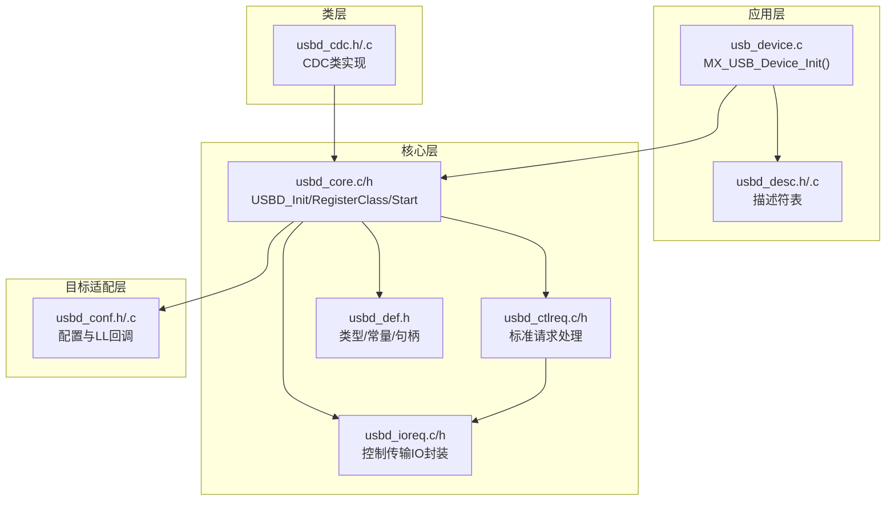
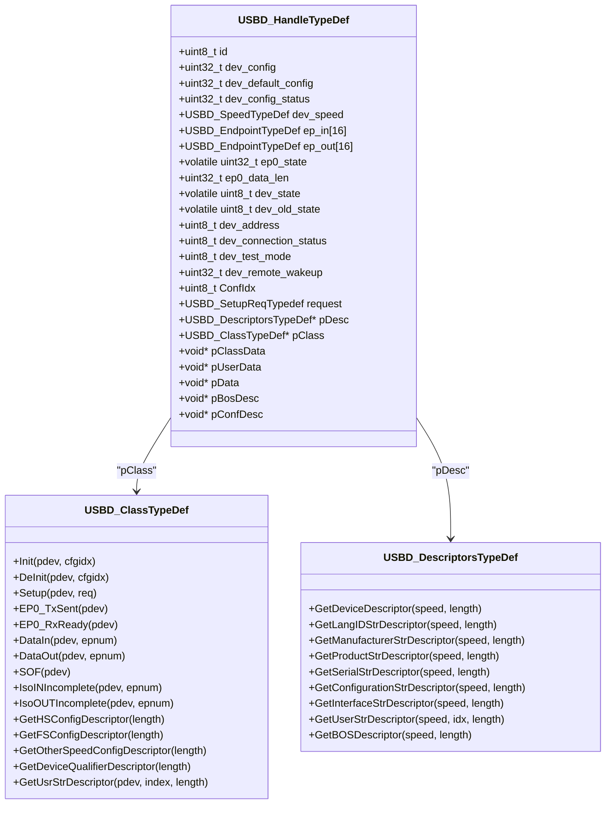
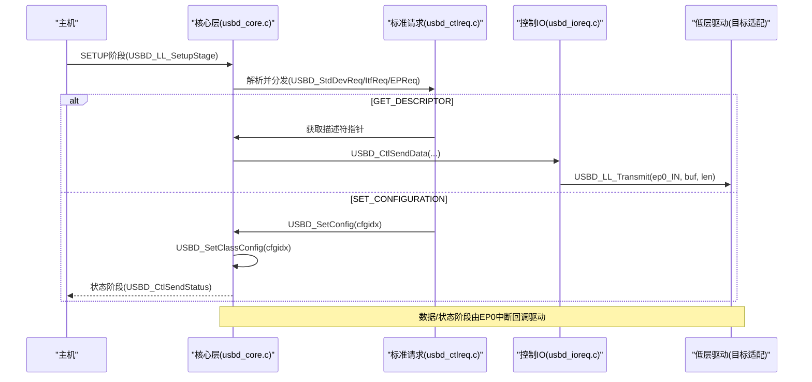
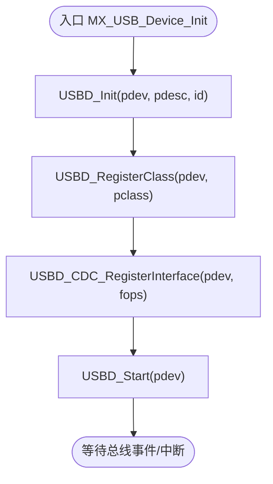
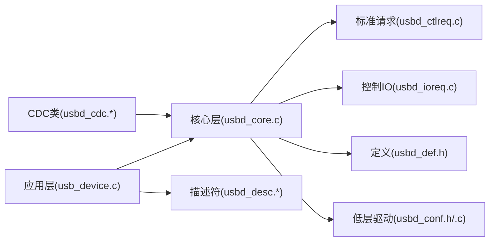

# USB核心层

<cite>
**本文引用的文件**   
- [usbd_core.h](file://Middlewares/ST/STM32_USB_Device_Library/Core/Inc/usbd_core.h)
- [usbd_core.c](file://Middlewares/ST/STM32_USB_Device_Library/Core/Src/usbd_core.c)
- [usbd_def.h](file://Middlewares/ST/STM32_USB_Device_Library/Core/Inc/usbd_def.h)
- [usbd_ctlreq.h](file://Middlewares/ST/STM32_USB_Device_Library/Core/Inc/usbd_ctlreq.h)
- [usbd_ctlreq.c](file://Middlewares/ST/STM32_USB_Device_Library/Core/Src/usbd_ctlreq.c)
- [usbd_ioreq.h](file://Middlewares/ST/STM32_USB_Device_Library/Core/Inc/usbd_ioreq.h)
- [usbd_ioreq.c](file://Middlewares/ST/STM32_USB_Device_Library/Core/Src/usbd_ioreq.c)
- [usb_device.h](file://USB_Device/App/usb_device.h)
- [usb_device.c](file://USB_Device/App/usb_device.c)
- [usbd_conf.h](file://USB_Device/Target/usbd_conf.h)
- [usbd_desc.h](file://USB_Device/App/usbd_desc.h)
- [usbd_cdc.h](file://Middlewares/ST/STM32_USB_Device_Library/Class/CDC/Inc/usbd_cdc.h)
</cite>

## 目录
1. [简介](#简介)
2. [项目结构](#项目结构)
3. [核心组件](#核心组件)
4. [架构总览](#架构总览)
5. [详细组件分析](#详细组件分析)
6. [依赖关系分析](#依赖关系分析)
7. [性能与资源考量](#性能与资源考量)
8. [故障排查指南](#故障排查指南)
9. [结论](#结论)
10. [附录：端点管理与自定义类开发指南](#附录端点管理与自定义类开发指南)

## 简介
本技术文档聚焦于STM32 USB设备库的“核心层”，系统阐述其架构设计、职责边界与关键流程，包括设备状态管理、枚举过程处理、配置管理、控制传输与端点管理等。文档面向希望深入理解并基于该核心层进行二次开发的工程师，提供从API使用到内部机制的全景说明，并给出流程图与状态转换图帮助快速定位问题与优化实现。

## 项目结构
本项目采用分层组织方式：
- 应用层（Application）：负责初始化调用、描述符定义、类接口注册等。
- 核心层（Core）：提供USBD核心API、标准请求处理、控制传输IO封装、端点抽象等。
- 类层（Class）：如CDC类，提供具体协议实现。
- 目标适配层（Target）：HAL/LL驱动适配与配置宏。



图表来源
- [usb_device.c:66-88](file://USB_Device/App/usb_device.c#L66-L88)
- [usbd_core.c:89-226](file://Middlewares/ST/STM32_USB_Device_Library/Core/Src/usbd_core.c#L89-L226)
- [usbd_ctlreq.c:100-154](file://Middlewares/ST/STM32_USB_Device_Library/Core/Src/usbd_ctlreq.c#L100-L154)
- [usbd_ioreq.c:87-198](file://Middlewares/ST/STM32_USB_Device_Library/Core/Src/usbd_ioreq.c#L87-L198)
- [usbd_def.h:274-312](file://Middlewares/ST/STM32_USB_Device_Library/Core/Inc/usbd_def.h#L274-L312)
- [usbd_conf.h:68-86](file://USB_Device/Target/usbd_conf.h#L68-L86)

章节来源
- [usb_device.c:66-88](file://USB_Device/App/usb_device.c#L66-L88)
- [usbd_core.h:85-135](file://Middlewares/ST/STM32_USB_Device_Library/Core/Inc/usbd_core.h#L85-L135)
- [usbd_def.h:274-312](file://Middlewares/ST/STM32_USB_Device_Library/Core/Inc/usbd_def.h#L274-L312)
- [usbd_conf.h:68-86](file://USB_Device/Target/usbd_conf.h#L68-L86)

## 核心组件
- USBD_HandleTypeDef：设备全局上下文，包含状态、端点表、描述符指针、类指针、用户数据等。
- USBD_ClassTypeDef：类回调接口，核心层通过它调用类的Init/DeInit/Setup/DataIn/DataOut/SOF等。
- USBD_DescriptorsTypeDef：描述符访问函数集合，供核心层在枚举时获取设备/配置/字符串/BOS等描述符。
- 核心API：USBD_Init、USBD_RegisterClass、USBD_Start、USBD_Stop、USBD_DeInit、USBD_SetClassConfig、USBD_ClrClassConfig。
- 低层接口（LL）：USBD_LL_*系列，由目标适配层实现，核心层通过它们操作硬件端点、收发数据、挂起/恢复等。
- 标准请求处理：USBD_StdDevReq、USBD_StdItfReq、USBD_StdEPReq，以及控制传输IO封装USBD_CtlSendData/USBD_CtlPrepareRx等。

章节来源
- [usbd_def.h:274-312](file://Middlewares/ST/STM32_USB_Device_Library/Core/Inc/usbd_def.h#L274-L312)
- [usbd_def.h:213-236](file://Middlewares/ST/STM32_USB_Device_Library/Core/Inc/usbd_def.h#L213-L236)
- [usbd_def.h:256-271](file://Middlewares/ST/STM32_USB_Device_Library/Core/Inc/usbd_def.h#L256-L271)
- [usbd_core.h:85-135](file://Middlewares/ST/STM32_USB_Device_Library/Core/Inc/usbd_core.h#L85-L135)
- [usbd_ctlreq.h:76-83](file://Middlewares/ST/STM32_USB_Device_Library/Core/Inc/usbd_ctlreq.h#L76-L83)
- [usbd_ioreq.h:80-96](file://Middlewares/ST/STM32_USB_Device_Library/Core/Inc/usbd_ioreq.h#L80-L96)

## 架构总览
核心层位于应用层与底层驱动之间，向上暴露稳定的API，向下屏蔽不同MCU的差异。核心层维护设备状态机，解析Setup阶段的标准请求，协调控制传输的数据/状态阶段，并在配置变更时调用类的Init/DeInit以打开/关闭端点。



图表来源
- [usbd_def.h:274-312](file://Middlewares/ST/STM32_USB_Device_Library/Core/Inc/usbd_def.h#L274-L312)
- [usbd_def.h:213-236](file://Middlewares/ST/STM32_USB_Device_Library/Core/Inc/usbd_def.h#L213-L236)
- [usbd_def.h:256-271](file://Middlewares/ST/STM32_USB_Device_Library/Core/Inc/usbd_def.h#L256-L271)

## 详细组件分析

### 设备句柄与生命周期
- 初始化：USBD_Init完成基础状态复位、描述符绑定、调用USBD_LL_Init。
- 注册类：USBD_RegisterClass将类指针与配置描述符缓存到句柄中。
- 启动：USBD_Start调用USBD_LL_Start开始监听总线事件。
- 停止/反初始化：USBD_Stop/USBD_DeInit释放类资源、关闭LL、复位状态。
- 重置：USBD_LL_Reset将设备置为默认状态，重新打开EP0 IN/OUT，清空配置。
- 挂起/恢复：USBD_LL_Suspend/Resume保存/恢复dev_state。

章节来源
- [usbd_core.c:89-122](file://Middlewares/ST/STM32_USB_Device_Library/Core/Src/usbd_core.c#L89-L122)
- [usbd_core.c:130-156](file://Middlewares/ST/STM32_USB_Device_Library/Core/Src/usbd_core.c#L130-L156)
- [usbd_core.c:165-194](file://Middlewares/ST/STM32_USB_Device_Library/Core/Src/usbd_core.c#L165-L194)
- [usbd_core.c:202-226](file://Middlewares/ST/STM32_USB_Device_Library/Core/Src/usbd_core.c#L202-L226)
- [usbd_core.c:490-524](file://Middlewares/ST/STM32_USB_Device_Library/Core/Src/usbd_core.c#L490-L524)
- [usbd_core.c:547-570](file://Middlewares/ST/STM32_USB_Device_Library/Core/Src/usbd_core.c#L547-L570)

### 枚举与标准请求处理
- Setup阶段：USBD_LL_SetupStage解析setup包，按接收者类型分发至设备/接口/端点标准请求处理器。
- 设备请求：USBD_StdDevReq处理GET_DESCRIPTOR、SET_ADDRESS、SET_CONFIGURATION、GET_STATUS、SET_FEATURE、CLEAR_FEATURE等。
- 接口请求：USBD_StdItfReq转发至类Setup或返回错误。
- 端点请求：USBD_StdEPReq处理STALL/CLEAR_STALL/GET_STATUS等。
- 控制传输IO：USBD_CtlSendData/USBD_CtlContinueSendData/USBD_CtlPrepareRx/USBD_CtlContinueRx/USBD_CtlSendStatus/USBD_CtlReceiveStatus封装EP0数据/状态阶段。



图表来源
- [usbd_core.c:288-318](file://Middlewares/ST/STM32_USB_Device_Library/Core/Src/usbd_core.c#L288-L318)
- [usbd_ctlreq.c:100-154](file://Middlewares/ST/STM32_USB_Device_Library/Core/Src/usbd_ctlreq.c#L100-L154)
- [usbd_ctlreq.c:380-578](file://Middlewares/ST/STM32_USB_Device_Library/Core/Src/usbd_ctlreq.c#L380-L578)
- [usbd_ctlreq.c:629-710](file://Middlewares/ST/STM32_USB_Device_Library/Core/Src/usbd_ctlreq.c#L629-L710)
- [usbd_ioreq.c:87-198](file://Middlewares/ST/STM32_USB_Device_Library/Core/Src/usbd_ioreq.c#L87-L198)

章节来源
- [usbd_core.c:288-318](file://Middlewares/ST/STM32_USB_Device_Library/Core/Src/usbd_core.c#L288-L318)
- [usbd_ctlreq.h:76-83](file://Middlewares/ST/STM32_USB_Device_Library/Core/Inc/usbd_ctlreq.h#L76-L83)
- [usbd_ioreq.h:80-96](file://Middlewares/ST/STM32_USB_Device_Library/Core/Inc/usbd_ioreq.h#L80-L96)

### 配置管理与类回调
- 设置配置：USBD_SetClassConfig调用类Init，类在此处打开非控制端点并准备接收。
- 清除配置：USBD_ClrClassConfig调用类DeInit，类关闭端点并释放资源。
- 类回调：Setup用于处理CLASS/VENDOR请求；DataIn/DataOut用于批量/中断/等时数据传输；EP0_TxSent/EP0_RxReady用于控制传输收尾。

章节来源
- [usbd_core.c:250-279](file://Middlewares/ST/STM32_USB_Device_Library/Core/Src/usbd_core.c#L250-L279)
- [usbd_def.h:213-236](file://Middlewares/ST/STM32_USB_Device_Library/Core/Inc/usbd_def.h#L213-L236)

### 设备状态机
设备状态在枚举过程中变化，核心层在多处更新dev_state：
- 初始：DEFAULT
- SET_ADDRESS后：ADDRESSED
- SET_CONFIGURATION成功：CONFIGURED
- 挂起：SUSPENDED
- 断开连接：回到DEFAULT

```mermaid
stateDiagram-v2
[*] --> DEFAULT
DEFAULT --> ADDRESSED : "SET_ADDRESS(地址!=0)"
ADDRESSED --> CONFIGURED : "SET_CONFIGURATION(非0)"
CONFIGURED --> ADDRESSED : "SET_CONFIGURATION(0)"
CONFIGURED --> SUSPENDED : "Suspend"
SUSPENDED --> CONFIGURED : "Resume"
CONFIGURED --> DEFAULT : "Reset/Disconnect"
ADDRESSED --> DEFAULT : "Reset/Disconnect"
```

图表来源
- [usbd_def.h:142-146](file://Middlewares/ST/STM32_USB_Device_Library/Core/Inc/usbd_def.h#L142-L146)
- [usbd_core.c:490-524](file://Middlewares/ST/STM32_USB_Device_Library/Core/Src/usbd_core.c#L490-L524)
- [usbd_core.c:547-570](file://Middlewares/ST/STM32_USB_Device_Library/Core/Src/usbd_core.c#L547-L570)
- [usbd_ctlreq.c:588-620](file://Middlewares/ST/STM32_USB_Device_Library/Core/Src/usbd_ctlreq.c#L588-L620)
- [usbd_ctlreq.c:629-710](file://Middlewares/ST/STM32_USB_Device_Library/Core/Src/usbd_ctlreq.c#L629-L710)

章节来源
- [usbd_def.h:142-146](file://Middlewares/ST/STM32_USB_Device_Library/Core/Inc/usbd_def.h#L142-L146)
- [usbd_core.c:490-524](file://Middlewares/ST/STM32_USB_Device_Library/Core/Src/usbd_core.c#L490-L524)
- [usbd_core.c:547-570](file://Middlewares/ST/STM32_USB_Device_Library/Core/Src/usbd_core.c#L547-L570)
- [usbd_ctlreq.c:588-620](file://Middlewares/ST/STM32_USB_Device_Library/Core/Src/usbd_ctlreq.c#L588-L620)
- [usbd_ctlreq.c:629-710](file://Middlewares/ST/STM32_USB_Device_Library/Core/Src/usbd_ctlreq.c#L629-L710)

### 初始化与启动流程（代码级）


图表来源
- [usb_device.c:66-88](file://USB_Device/App/usb_device.c#L66-L88)
- [usbd_core.c:89-122](file://Middlewares/ST/STM32_USB_Device_Library/Core/Src/usbd_core.c#L89-L122)
- [usbd_core.c:165-194](file://Middlewares/ST/STM32_USB_Device_Library/Core/Src/usbd_core.c#L165-L194)
- [usbd_core.c:202-206](file://Middlewares/ST/STM32_USB_Device_Library/Core/Src/usbd_core.c#L202-L206)

章节来源
- [usb_device.c:66-88](file://USB_Device/App/usb_device.c#L66-L88)
- [usbd_core.c:89-122](file://Middlewares/ST/STM32_USB_Device_Library/Core/Src/usbd_core.c#L89-L122)
- [usbd_core.c:165-194](file://Middlewares/ST/STM32_USB_Device_Library/Core/Src/usbd_core.c#L165-L194)
- [usbd_core.c:202-206](file://Middlewares/ST/STM32_USB_Device_Library/Core/Src/usbd_core.c#L202-L206)

## 依赖关系分析
- 应用层依赖核心层API与描述符表。
- 核心层依赖：
  - 描述符访问（应用层提供）。
  - 类回调（类层实现）。
  - 低层驱动（目标适配层实现）。
- 标准请求模块依赖控制IO封装。
- CDC类依赖核心层提供的通用API。



图表来源
- [usb_device.c:66-88](file://USB_Device/App/usb_device.c#L66-L88)
- [usbd_core.c:89-226](file://Middlewares/ST/STM32_USB_Device_Library/Core/Src/usbd_core.c#L89-L226)
- [usbd_ctlreq.c:100-154](file://Middlewares/ST/STM32_USB_Device_Library/Core/Src/usbd_ctlreq.c#L100-L154)
- [usbd_ioreq.c:87-198](file://Middlewares/ST/STM32_USB_Device_Library/Core/Src/usbd_ioreq.c#L87-L198)
- [usbd_def.h:274-312](file://Middlewares/ST/STM32_USB_Device_Library/Core/Inc/usbd_def.h#L274-L312)
- [usbd_conf.h:68-86](file://USB_Device/Target/usbd_conf.h#L68-L86)
- [usbd_cdc.h:140-158](file://Middlewares/ST/STM32_USB_Device_Library/Class/CDC/Inc/usbd_cdc.h#L140-L158)

章节来源
- [usb_device.c:66-88](file://USB_Device/App/usb_device.c#L66-L88)
- [usbd_core.c:89-226](file://Middlewares/ST/STM32_USB_Device_Library/Core/Src/usbd_core.c#L89-L226)
- [usbd_ctlreq.c:100-154](file://Middlewares/ST/STM32_USB_Device_Library/Core/Src/usbd_ctlreq.c#L100-L154)
- [usbd_ioreq.c:87-198](file://Middlewares/ST/STM32_USB_Device_Library/Core/Src/usbd_ioreq.c#L87-L198)
- [usbd_def.h:274-312](file://Middlewares/ST/STM32_USB_Device_Library/Core/Inc/usbd_def.h#L274-L312)
- [usbd_conf.h:68-86](file://USB_Device/Target/usbd_conf.h#L68-L86)
- [usbd_cdc.h:140-158](file://Middlewares/ST/STM32_USB_Device_Library/Class/CDC/Inc/usbd_cdc.h#L140-L158)

## 性能与资源考量
- 控制传输分片：核心层根据ep0_data_len与maxpacket计算剩余长度，必要时发送ZLP，避免主机侧粘包。
- 端点缓冲对齐：在高带宽模式下DMA相关变量需4字节对齐，确保高效传输。
- 描述符选择：根据当前速度选择FS/HS配置描述符，减少冗余。
- 调试输出：通过USBD_DEBUG_LEVEL控制日志级别，生产环境建议关闭以减少开销。

章节来源
- [usbd_ioreq.c:87-198](file://Middlewares/ST/STM32_USB_Device_Library/Core/Src/usbd_ioreq.c#L87-L198)
- [usbd_def.h:363-384](file://Middlewares/ST/STM32_USB_Device_Library/Core/Inc/usbd_def.h#L363-L384)
- [usbd_ctlreq.c:405-416](file://Middlewares/ST/STM32_USB_Device_Library/Core/Src/usbd_ctlreq.c#L405-L416)
- [usbd_conf.h:112-134](file://USB_Device/Target/usbd_conf.h#L112-L134)

## 故障排查指南
- 初始化失败：检查USBD_Init返回值，确认描述符指针有效、LL初始化成功。
- 枚举卡住：查看设备状态是否停留在DEFAULT/ADDRESSED，确认SET_ADDRESS/SET_CONFIGURATION路径。
- 控制传输异常：核对EP0状态机（DATA_IN/DATA_OUT/STATUS），检查ZLP发送逻辑。
- 类回调未触发：确认已正确注册类与接口，且设备处于CONFIGURED状态。
- 端点STALL：检查SET_FEATURE/CLEAR_FEATURE处理，确认端点地址合法性。

章节来源
- [usbd_core.c:89-122](file://Middlewares/ST/STM32_USB_Device_Library/Core/Src/usbd_core.c#L89-L122)
- [usbd_ctlreq.c:588-620](file://Middlewares/ST/STM32_USB_Device_Library/Core/Src/usbd_ctlreq.c#L588-L620)
- [usbd_ctlreq.c:629-710](file://Middlewares/ST/STM32_USB_Device_Library/Core/Src/usbd_ctlreq.c#L629-L710)
- [usbd_ioreq.c:87-198](file://Middlewares/ST/STM32_USB_Device_Library/Core/Src/usbd_ioreq.c#L87-L198)

## 结论
USB设备核心层通过清晰的层次划分与稳定的API，将枚举、配置、控制传输与端点管理抽象化，使上层应用与类实现得以专注于业务逻辑。掌握设备状态机、标准请求处理与控制传输流程，是正确使用与扩展该库的关键。

## 附录：端点管理与自定义类开发指南

### 端点管理API
- 打开端点：USBD_LL_OpenEP(pdev, ep_addr, ep_type, ep_mps)
- 关闭端点：USBD_LL_CloseEP(pdev, ep_addr)
- 刷新端点：USBD_LL_FlushEP(pdev, ep_addr)
- 置STALL：USBD_LL_StallEP(pdev, ep_addr)
- 清除STALL：USBD_LL_ClearStallEP(pdev, ep_addr)
- 设置设备地址：USBD_LL_SetUSBAddress(pdev, dev_addr)
- 发送数据：USBD_LL_Transmit(pdev, ep_addr, pbuf, size)
- 准备接收：USBD_LL_PrepareReceive(pdev, ep_addr, pbuf, size)
- 查询STALL：USBD_LL_IsStallEP(pdev, ep_addr)
- 读取接收长度：USBD_LL_GetRxDataSize(pdev, ep_addr)
- 延时：USBD_LL_Delay(ms)

章节来源
- [usbd_core.h:117-135](file://Middlewares/ST/STM32_USB_Device_Library/Core/Inc/usbd_core.h#L117-L135)

### 控制传输辅助API
- 发送数据：USBD_CtlSendData(pdev, pbuf, len)
- 继续发送：USBD_CtlContinueSendData(pdev, pbuf, len)
- 准备接收：USBD_CtlPrepareRx(pdev, pbuf, len)
- 继续接收：USBD_CtlContinueRx(pdev, pbuf, len)
- 发送状态阶段：USBD_CtlSendStatus(pdev)
- 接收状态阶段：USBD_CtlReceiveStatus(pdev)
- 获取接收计数：USBD_GetRxCount(pdev, ep_addr)

章节来源
- [usbd_ioreq.h:80-96](file://Middlewares/ST/STM32_USB_Device_Library/Core/Inc/usbd_ioreq.h#L80-L96)
- [usbd_ioreq.c:87-210](file://Middlewares/ST/STM32_USB_Device_Library/Core/Src/usbd_ioreq.c#L87-L210)

### 自定义类开发要点
- 实现USBD_ClassTypeDef回调：至少提供Init/DeInit/Setup/DataIn/DataOut。
- 描述符：提供GetFSConfigDescriptor/GetHSConfigDescriptor等，返回完整配置描述符链。
- 端点分配：在类Init中打开所需端点，并调用USBD_LL_PrepareReceive准备接收。
- 数据流：在DataIn/DataOut中调用USBD_LL_Transmit/USBD_LL_PrepareReceive推进数据。
- 控制命令：在Setup中处理CLASS/VENDOR请求，必要时使用USBD_CtlSendData/USBD_CtlPrepareRx。

章节来源
- [usbd_def.h:213-236](file://Middlewares/ST/STM32_USB_Device_Library/Core/Inc/usbd_def.h#L213-L236)
- [usbd_def.h:256-271](file://Middlewares/ST/STM32_USB_Device_Library/Core/Inc/usbd_def.h#L256-L271)
- [usbd_core.c:250-279](file://Middlewares/ST/STM32_USB_Device_Library/Core/Src/usbd_core.c#L250-L279)
- [usbd_core.c:328-390](file://Middlewares/ST/STM32_USB_Device_Library/Core/Src/usbd_core.c#L328-L390)
- [usbd_core.c:399-481](file://Middlewares/ST/STM32_USB_Device_Library/Core/Src/usbd_core.c#L399-L481)