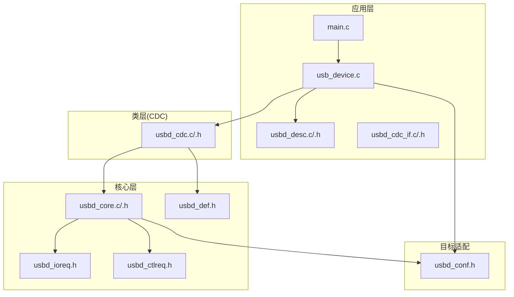
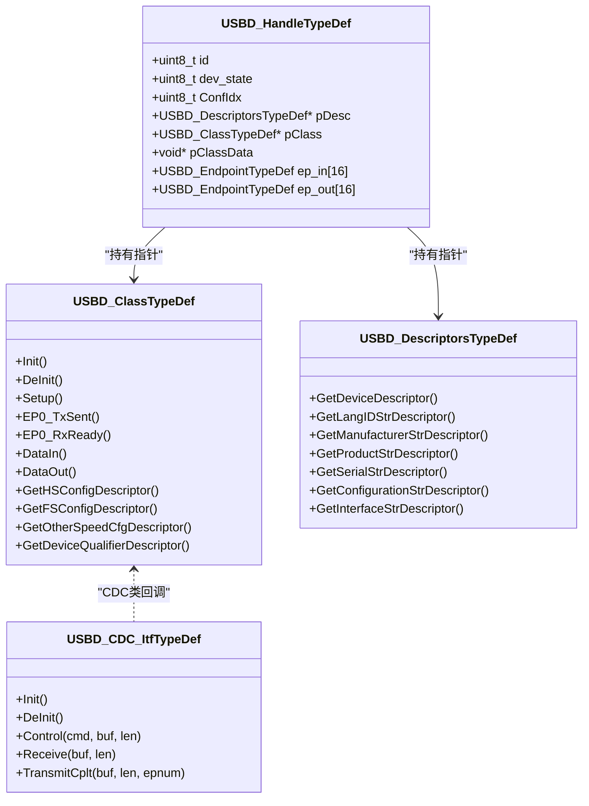
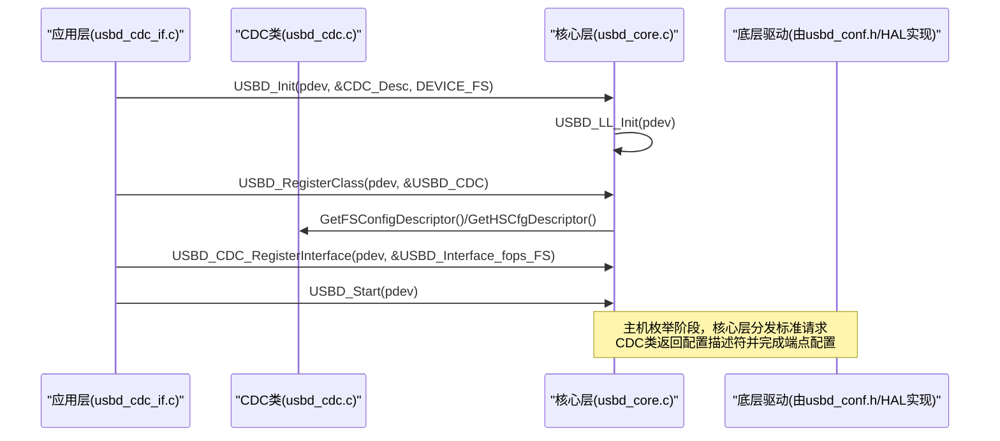
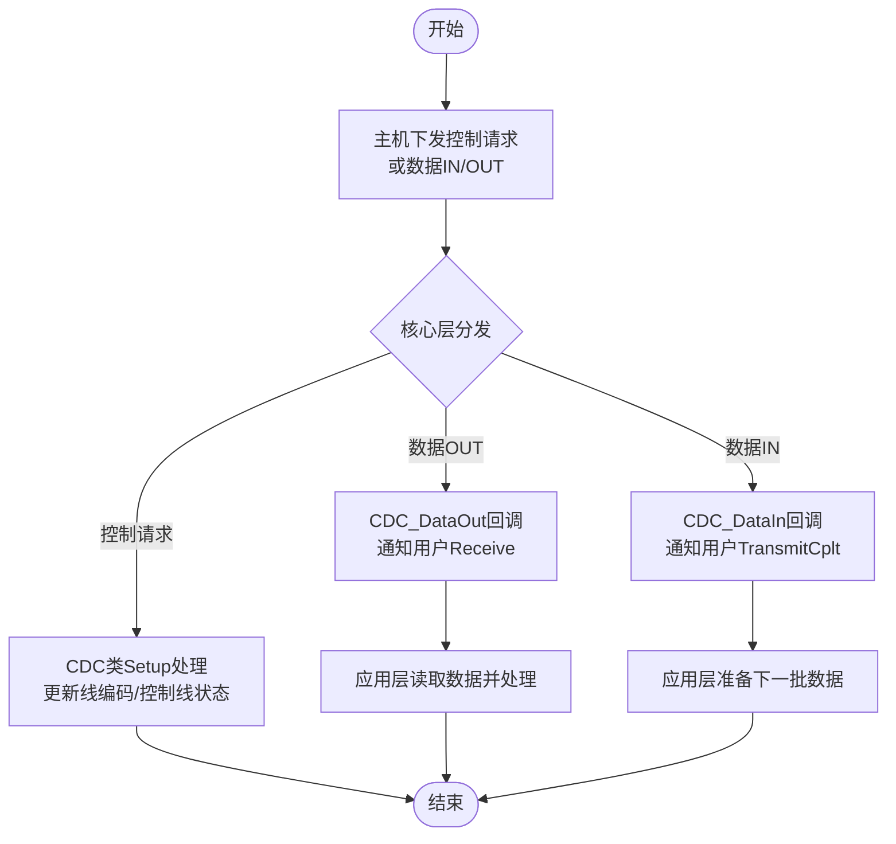
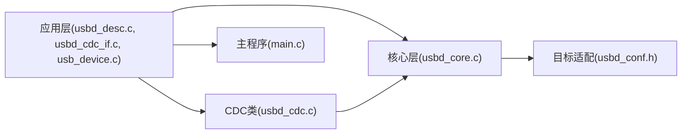

# USB设备中间件

<cite>
**本文引用的文件**   
- [usbd_def.h](file://Middlewares/ST/STM32_USB_Device_Library/Core/Inc/usbd_def.h)
- [usbd_core.h](file://Middlewares/ST/STM32_USB_Device_Library/Core/Inc/usbd_core.h)
- [usbd_ioreq.h](file://Middlewares/ST/STM32_USB_Device_Library/Core/Inc/usbd_ioreq.h)
- [usbd_ctlreq.h](file://Middlewares/ST/STM32_USB_Device_Library/Core/Inc/usbd_ctlreq.h)
- [usbd_core.c](file://Middlewares/ST/STM32_USB_Device_Library/Core/Src/usbd_core.c)
- [usbd_cdc.h](file://Middlewares/ST/STM32_USB_Device_Library/Class/CDC/Inc/usbd_cdc.h)
- [usbd_cdc.c](file://Middlewares/ST/STM32_USB_Device_Library/Class/CDC/Src/usbd_cdc.c)
- [usbd_desc.h](file://USB_Device/App/usbd_desc.h)
- [usbd_desc.c](file://USB_Device/App/usbd_desc.c)
- [usbd_cdc_if.h](file://USB_Device/App/usbd_cdc_if.h)
- [usbd_cdc_if.c](file://USB_Device/App/usbd_cdc_if.c)
- [usb_device.c](file://USB_Device/App/usb_device.c)
- [main.c](file://Core/Src/main.c)
- [usbd_conf.h](file://USB_Device/Target/usbd_conf.h)
</cite>

## 目录
1. [简介](#简介)
2. [项目结构](#项目结构)
3. [核心组件](#核心组件)
4. [架构总览](#架构总览)
5. [详细组件分析](#详细组件分析)
6. [依赖关系分析](#依赖关系分析)
7. [性能与资源考量](#性能与资源考量)
8. [故障排查指南](#故障排查指南)
9. [结论](#结论)
10. [附录：API使用指南](#附录api使用指南)

## 简介
本技术参考文档围绕ST USB设备中间件（STM32 USB Device Library）展开，面向基于STM32G4的USB CDC虚拟串口应用。文档深入解释三层架构（核心层、类层、应用层）的职责分离；阐述USB协议栈实现原理（描述符管理、端点配置、数据传输机制）；详解CDC类的实现细节（控制接口、数据接口、通信命令与数据流）；并提供关键API的使用指南与开发建议，辅以架构图与数据流图，帮助初学者快速上手，并为高级开发者提供扩展自定义类与协议的指导。

## 项目结构
本项目采用分层组织方式：
- 核心库（Middlewares/ST/STM32_USB_Device_Library/Core）：定义通用类型、状态机、请求分发、IO封装等。
- 类库（Middlewares/ST/STM32_USB_Device_Library/Class/CDC）：实现CDC类枚举、描述符、请求处理与数据收发。
- 应用层（USB_Device/App）：描述符表、CDC用户回调、设备初始化流程。
- 目标适配（USB_Device/Target）：底层HAL适配、内存与调试宏定义。
- 主程序（Core/Src/main.c）：系统初始化、业务逻辑与CDC数据收发示例。

图表来源
- [usb_device.c:66-88](file://USB_Device/App/usb_device.c#L66-L88)
- [usbd_cdc.c:140-156](file://Middlewares/ST/STM32_USB_Device_Library/Class/CDC/Src/usbd_cdc.c#L140-L156)
- [usbd_core.c:89-122](file://Middlewares/ST/STM32_USB_Device_Library/Core/Src/usbd_core.c#L89-L122)
- [usbd_conf.h:62-134](file://USB_Device/Target/usbd_conf.h#L62-L134)

章节来源
- [usb_device.c:66-88](file://USB_Device/App/usb_device.c#L66-L88)
- [usbd_core.c:89-122](file://Middlewares/ST/STM32_USB_Device_Library/Core/Src/usbd_core.c#L89-L122)
- [usbd_conf.h:62-134](file://USB_Device/Target/usbd_conf.h#L62-L134)

## 核心组件
- 核心层（Core）
  - 设备句柄与状态机：USBD_HandleTypeDef、设备状态、端点状态、请求上下文等。
  - 标准请求处理：设备/接口/端点标准请求解析与响应。
  - IO抽象：控制通道与批量/中断端点的发送/接收封装。
  - 低层驱动接口：端点打开/关闭、STALL、地址设置、传输调度等。
- 类层（CDC）
  - 枚举与描述符：通信接口+数据接口的配置描述符。
  - 控制命令：线编码、控制线状态等ACM命令处理。
  - 数据路径：IN/OUT端点的数据缓冲与回调。
- 应用层（App）
  - 描述符表：厂商、产品、序列号等字符串与设备描述符。
  - CDC用户回调：注册接收/发送完成回调，绑定用户缓冲区。
  - 初始化流程：核心初始化、类注册、接口回调注册、启动。

章节来源
- [usbd_def.h:172-312](file://Middlewares/ST/STM32_USB_Device_Library/Core/Inc/usbd_def.h#L172-L312)
- [usbd_core.h:85-135](file://Middlewares/ST/STM32_USB_Device_Library/Core/Inc/usbd_core.h#L85-L135)
- [usbd_cdc.h:94-160](file://Middlewares/ST/STM32_USB_Device_Library/Class/CDC/Inc/usbd_cdc.h#L94-L160)
- [usbd_desc.h:107-141](file://USB_Device/App/usbd_desc.h#L107-L141)
- [usbd_cdc_if.h:93-113](file://USB_Device/App/usbd_cdc_if.h#L93-L113)

## 架构总览
USB设备中间件采用“核心-类-应用”三层解耦设计：
- 核心层负责通用协议栈与生命周期管理，向上暴露统一API，向下通过LL接口对接具体MCU外设。
- 类层实现特定USB类（如CDC），提供描述符与请求/数据回调，并通过核心层提供的API进行枚举与数据传输。
- 应用层组装描述符、注册类与用户回调，并调用核心API完成设备初始化与运行。

图表来源
- [usbd_def.h:213-312](file://Middlewares/ST/STM32_USB_Device_Library/Core/Inc/usbd_def.h#L213-L312)
- [usbd_cdc.h:102-160](file://Middlewares/ST/STM32_USB_Device_Library/Class/CDC/Inc/usbd_cdc.h#L102-L160)

## 详细组件分析

### 核心层（Core）
- 职责
  - 设备生命周期：初始化、停止、复位、挂起/恢复、连接/断开事件。
  - 标准请求分发：设备/接口/端点标准请求解析与响应。
  - 端点管理：打开/关闭、STALL/清STALL、地址设置、最大包长。
  - 数据传输：控制通道与数据通道的发送/接收封装。
  - 类钩子：在合适时机回调类的Init/DeInit/Setup/DataIn/DataOut等。
- 关键数据结构
  - USBD_HandleTypeDef：设备全局上下文，包含状态、端点表、描述符与类指针。
  - USBD_SetupReqTypedef：控制请求参数。
  - USBD_DescriptorsTypeDef：描述符获取函数表。
  - USBD_ClassTypeDef：类回调函数表。
- 关键API
  - 初始化与启动：USBD_Init、USBD_RegisterClass、USBD_Start。
  - 端点操作：USBD_LL_OpenEP、USBD_LL_Transmit、USBD_LL_PrepareReceive。
  - 控制通道：USBD_CtlSendData、USBD_CtlPrepareRx、USBD_CtlSendStatus。
  - 请求处理：USBD_StdDevReq、USBD_StdItfReq、USBD_StdEPReq。

章节来源
- [usbd_core.h:85-135](file://Middlewares/ST/STM32_USB_Device_Library/Core/Inc/usbd_core.h#L85-L135)
- [usbd_core.c:89-122](file://Middlewares/ST/STM32_USB_Device_Library/Core/Src/usbd_core.c#L89-L122)
- [usbd_ioreq.h:80-96](file://Middlewares/ST/STM32_USB_Device_Library/Core/Inc/usbd_ioreq.h#L80-L96)
- [usbd_ctlreq.h:76-83](file://Middlewares/ST/STM32_USB_Device_Library/Core/Inc/usbd_ctlreq.h#L76-L83)
- [usbd_def.h:172-312](file://Middlewares/ST/STM32_USB_Device_Library/Core/Inc/usbd_def.h#L172-L312)

### 类层（CDC）
- 职责
  - 枚举：提供通信接口（ACM）和数据接口的配置描述符。
  - 控制命令：支持SET_LINE_CODING、GET_LINE_CODING、SET_CONTROL_LINE_STATE等。
  - 数据路径：维护IN/OUT端点缓冲与状态，触发用户回调。
- 关键数据结构
  - USBD_CDC_HandleTypeDef：CDC内部状态（Tx/Rx缓冲、长度、状态）。
  - USBD_CDC_ItfTypeDef：用户侧回调接口（Init/DeInit/Control/Receive/TransmitCplt）。
- 关键API
  - 类注册：USBD_RegisterClass(&USBD_CDC)。
  - 用户回调注册：USBD_CDC_RegisterInterface(&USBD_Interface_fops_FS)。
  - 数据收发：USBD_CDC_SetTxBuffer、USBD_CDC_SetRxBuffer、USBD_CDC_TransmitPacket、USBD_CDC_ReceivePacket。
- 端点分配
  - 命令端点（IN）：用于ACM控制命令。
  - 数据端点（IN/OUT）：用于用户数据双向传输。

图表来源
- [usb_device.c:66-88](file://USB_Device/App/usb_device.c#L66-L88)
- [usbd_cdc.c:140-156](file://Middlewares/ST/STM32_USB_Device_Library/Class/CDC/Src/usbd_cdc.c#L140-L156)
- [usbd_core.c:165-194](file://Middlewares/ST/STM32_USB_Device_Library/Core/Src/usbd_core.c#L165-L194)

章节来源
- [usbd_cdc.h:44-160](file://Middlewares/ST/STM32_USB_Device_Library/Class/CDC/Inc/usbd_cdc.h#L44-L160)
- [usbd_cdc.c:140-156](file://Middlewares/ST/STM32_USB_Device_Library/Class/CDC/Src/usbd_cdc.c#L140-L156)

### 应用层（App）
- 描述符管理
  - 设备描述符：厂商ID、产品ID、版本、支持的配置数等。
  - 字符串描述符：语言ID、制造商、产品、序列号、配置、接口。
  - 配置描述符：由CDC类提供，应用层仅暴露设备级描述符。
- CDC用户回调
  - 初始化时设置TX/RX缓冲指针与长度。
  - 接收回调中读取数据并处理。
  - 发送完成后回调可用于再次准备下一次发送。
- 初始化流程
  - 调用MX_USB_Device_Init完成核心初始化、类注册、接口回调注册与启动。

章节来源
- [usbd_desc.c:132-141](file://USB_Device/App/usbd_desc.c#L132-L141)
- [usbd_cdc_if.c:138-145](file://USB_Device/App/usbd_cdc_if.c#L138-L145)
- [usb_device.c:66-88](file://USB_Device/App/usb_device.c#L66-L88)

### CDC类实现细节与数据流
- 控制命令流程（以SET_LINE_CODING为例）
  - 主机通过控制端点下发SET_LINE_CODING请求。
  - 核心层解析后回调CDC类的Setup处理。
  - CDC类将线编码信息保存到内部结构，并返回成功状态。
- 数据收发流程
  - OUT方向：主机发送数据到数据OUT端点，核心层回调CDC_DataOut，CDC类通知用户回调Receive，应用层从缓冲读取数据。
  - IN方向：应用层调用CDC_Transmit_FS准备数据，CDC类调用核心层发送，完成后回调TransmitCplt，应用层可继续准备下一批数据。

图表来源
- [usbd_cdc.c:102-113](file://Middlewares/ST/STM32_USB_Device_Library/Class/CDC/Src/usbd_cdc.c#L102-L113)
- [usbd_cdc_if.c:180-200](file://USB_Device/App/usbd_cdc_if.c#L180-L200)

章节来源
- [usbd_cdc.h:72-81](file://Middlewares/ST/STM32_USB_Device_Library/Class/CDC/Inc/usbd_cdc.h#L72-L81)
- [usbd_cdc_if.c:152-160](file://USB_Device/App/usbd_cdc_if.c#L152-L160)

### 端点配置与数据传输机制
- 端点类型
  - 控制端点（EP0）：用于标准请求与类特定请求。
  - 批量端点（Bulk）：CDC数据端点，适合不定长数据。
  - 中断端点（Interrupt）：CDC命令端点，小体积周期性控制。
- 端点管理API
  - 打开/关闭：USBD_LL_OpenEP、USBD_LL_CloseEP。
  - 传输：USBD_LL_Transmit（IN）、USBD_LL_PrepareReceive（OUT）。
  - 状态：USBD_LL_StallEP、USBD_LL_ClearStallEP、USBD_LL_IsStallEP。
- 控制通道API
  - 发送数据：USBD_CtlSendData、USBD_CtlContinueSendData。
  - 接收数据：USBD_CtlPrepareRx、USBD_CtlContinueRx。
  - 状态阶段：USBD_CtlSendStatus、USBD_CtlReceiveStatus。

章节来源
- [usbd_core.h:117-135](file://Middlewares/ST/STM32_USB_Device_Library/Core/Inc/usbd_core.h#L117-L135)
- [usbd_ioreq.h:80-96](file://Middlewares/ST/STM32_USB_Device_Library/Core/Inc/usbd_ioreq.h#L80-L96)

### 描述符管理与枚举过程
- 描述符表
  - 设备描述符：定义设备能力、VID/PID、端点0大小等。
  - 字符串描述符：语言ID、制造商、产品、序列号、配置、接口。
  - 配置描述符：由CDC类提供，包含通信接口与数据接口及其端点。
- 枚举流程
  - 主机请求设备描述符→字符串描述符→配置描述符→设置配置。
  - 核心层根据pDesc函数表动态获取描述符，CDC类提供配置描述符。

章节来源
- [usbd_desc.c:132-167](file://USB_Device/App/usbd_desc.c#L132-L167)
- [usbd_cdc.c:159-200](file://Middlewares/ST/STM32_USB_Device_Library/Class/CDC/Src/usbd_cdc.c#L159-L200)

## 依赖关系分析
- 模块耦合
  - 应用层依赖核心层API与CDC类API。
  - CDC类依赖核心层API与定义。
  - 核心层依赖底层驱动接口（由usbd_conf.h与HAL实现）。
- 外部依赖
  - HAL与LL：GPIO、DMA、ADC等在应用中与CDC结合使用。
  - 内存与调试：usbd_conf.h重定向malloc/free/memset/memcpy/delay与日志宏。

图表来源
- [usb_device.c:66-88](file://USB_Device/App/usb_device.c#L66-L88)
- [usbd_cdc.c:140-156](file://Middlewares/ST/STM32_USB_Device_Library/Class/CDC/Src/usbd_cdc.c#L140-L156)
- [usbd_conf.h:96-134](file://USB_Device/Target/usbd_conf.h#L96-L134)

章节来源
- [usbd_conf.h:96-134](file://USB_Device/Target/usbd_conf.h#L96-L134)
- [main.c:1-200](file://Core/Src/main.c#L1-L200)

## 性能与资源考量
- 端点包长与吞吐
  - FS模式下数据端点最大包长为64字节，合理设置应用层缓冲与批量发送策略以提升吞吐。
- 缓冲与内存对齐
  - CDC内部缓冲按32位对齐，避免DMA访问问题；确保应用层缓冲满足对齐要求。
- 中断与实时性
  - 控制端点为中断类型，应保证回调处理尽量短小，避免阻塞。
- 低功耗特性
  - 可通过LPM相关宏启用低功耗模式，但需确保唤醒路径正确。

章节来源
- [usbd_cdc.h:57-66](file://Middlewares/ST/STM32_USB_Device_Library/Class/CDC/Inc/usbd_cdc.h#L57-L66)
- [usbd_cdc.h:112-124](file://Middlewares/ST/STM32_USB_Device_Library/Class/CDC/Inc/usbd_cdc.h#L112-L124)
- [usbd_conf.h:76-78](file://USB_Device/Target/usbd_conf.h#L76-L78)

## 故障排查指南
- 常见问题
  - 枚举失败：检查描述符是否正确、VID/PID是否冲突、配置描述符长度是否匹配。
  - 无法接收数据：确认已调用USBD_CDC_ReceivePacket准备接收，且用户回调Receive被正确实现。
  - 发送卡住：检查TransmitCplt回调是否再次准备发送，避免端点STALL未清除。
- 定位方法
  - 开启调试日志：调整USBD_DEBUG_LEVEL，观察错误与调试输出。
  - 断点与状态：查看设备状态（默认/已寻址/已配置）、端点状态（空闲/STALL）。
  - 抓包工具：使用USB分析仪验证描述符与请求交互是否符合规范。

章节来源
- [usbd_conf.h:112-134](file://USB_Device/Target/usbd_conf.h#L112-L134)
- [usbd_def.h:142-156](file://Middlewares/ST/STM32_USB_Device_Library/Core/Inc/usbd_def.h#L142-L156)

## 结论
ST USB设备中间件通过清晰的三层架构实现了高内聚、低耦合的USB设备开发体验。核心层屏蔽底层差异，类层提供标准化类实现，应用层专注业务逻辑与描述符定制。对于CDC虚拟串口应用，开发者仅需关注描述符与用户回调，即可快速构建稳定可靠的USB通信链路。

## 附录：API使用指南

### 设备初始化与启动
- 步骤
  - 调用USBD_Init初始化核心并传入描述符表。
  - 调用USBD_RegisterClass注册CDC类。
  - 调用USBD_CDC_RegisterInterface注册用户回调。
  - 调用USBD_Start启动设备。
- 参考路径
  - [usb_device.c:66-88](file://USB_Device/App/usb_device.c#L66-L88)

章节来源
- [usb_device.c:66-88](file://USB_Device/App/usb_device.c#L66-L88)

### 描述符配置
- 设备描述符
  - 设置VID/PID、版本、端点0大小、字符串索引等。
- 字符串描述符
  - 语言ID、制造商、产品、序列号、配置、接口字符串。
- 配置描述符
  - 由CDC类提供，包含通信接口与数据接口及端点。
- 参考路径
  - [usbd_desc.c:132-167](file://USB_Device/App/usbd_desc.c#L132-L167)
  - [usbd_cdc.c:159-200](file://Middlewares/ST/STM32_USB_Device_Library/Class/CDC/Src/usbd_cdc.c#L159-L200)

章节来源
- [usbd_desc.c:132-167](file://USB_Device/App/usbd_desc.c#L132-L167)
- [usbd_cdc.c:159-200](file://Middlewares/ST/STM32_USB_Device_Library/Class/CDC/Src/usbd_cdc.c#L159-L200)

### 数据收发（CDC）
- 初始化缓冲
  - 在CDC_Init_FS中设置TX/RX缓冲指针与长度。
- 接收数据
  - 在CDC_Receive_FS中读取数据并处理。
- 发送数据
  - 调用CDC_Transmit_FS准备数据，在CDC_TransmitCplt_FS中继续准备下一批。
- 参考路径
  - [usbd_cdc_if.c:152-160](file://USB_Device/App/usbd_cdc_if.c#L152-L160)
  - [usbd_cdc_if.c:180-200](file://USB_Device/App/usbd_cdc_if.c#L180-L200)

章节来源
- [usbd_cdc_if.c:152-160](file://USB_Device/App/usbd_cdc_if.c#L152-L160)
- [usbd_cdc_if.c:180-200](file://USB_Device/App/usbd_cdc_if.c#L180-L200)

### 控制命令（CDC ACM）
- 常用命令
  - SET_LINE_CODING、GET_LINE_CODING、SET_CONTROL_LINE_STATE。
- 处理位置
  - 在CDC_Control_FS中根据命令码进行处理。
- 参考路径
  - [usbd_cdc.h:72-81](file://Middlewares/ST/STM32_USB_Device_Library/Class/CDC/Inc/usbd_cdc.h#L72-L81)
  - [usbd_cdc_if.c:180-200](file://USB_Device/App/usbd_cdc_if.c#L180-L200)

章节来源
- [usbd_cdc.h:72-81](file://Middlewares/ST/STM32_USB_Device_Library/Class/CDC/Inc/usbd_cdc.h#L72-L81)
- [usbd_cdc_if.c:180-200](file://USB_Device/App/usbd_cdc_if.c#L180-L200)

### 端点与IO操作（扩展自定义类）
- 端点管理
  - 打开/关闭端点、设置STALL、清除STALL。
- 数据传输
  - 控制通道：发送/接收数据与状态阶段。
  - 数据通道：IN发送、OUT接收。
- 参考路径
  - [usbd_core.h:117-135](file://Middlewares/ST/STM32_USB_Device_Library/Core/Inc/usbd_core.h#L117-L135)
  - [usbd_ioreq.h:80-96](file://Middlewares/ST/STM32_USB_Device_Library/Core/Inc/usbd_ioreq.h#L80-L96)

章节来源
- [usbd_core.h:117-135](file://Middlewares/ST/STM32_USB_Device_Library/Core/Inc/usbd_core.h#L117-L135)
- [usbd_ioreq.h:80-96](file://Middlewares/ST/STM32_USB_Device_Library/Core/Inc/usbd_ioreq.h#L80-L96)