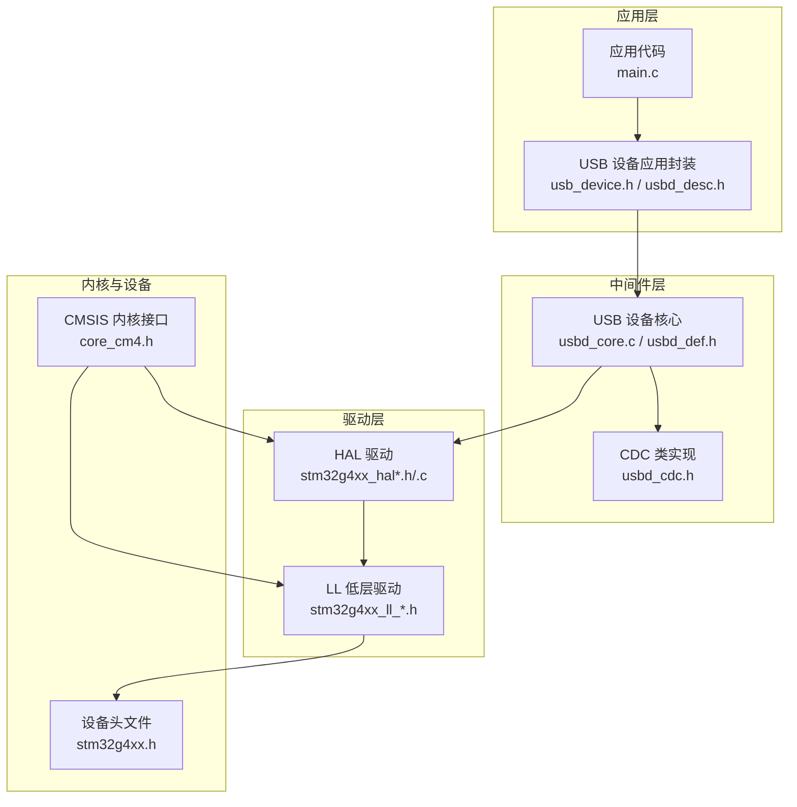
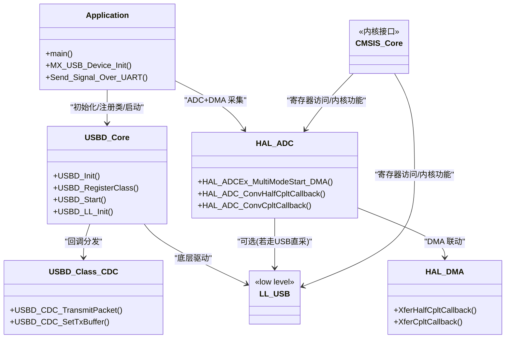
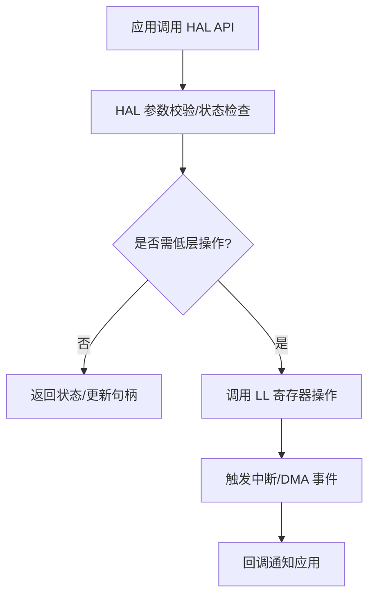
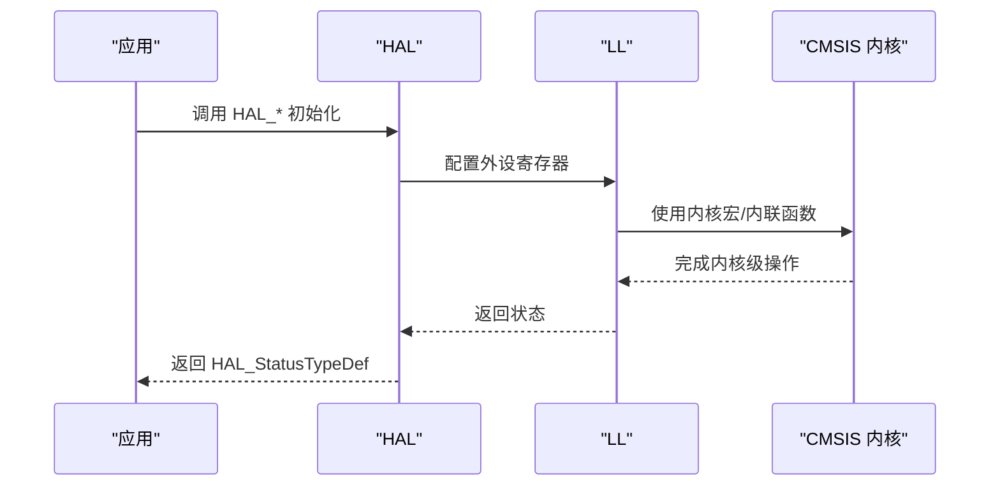
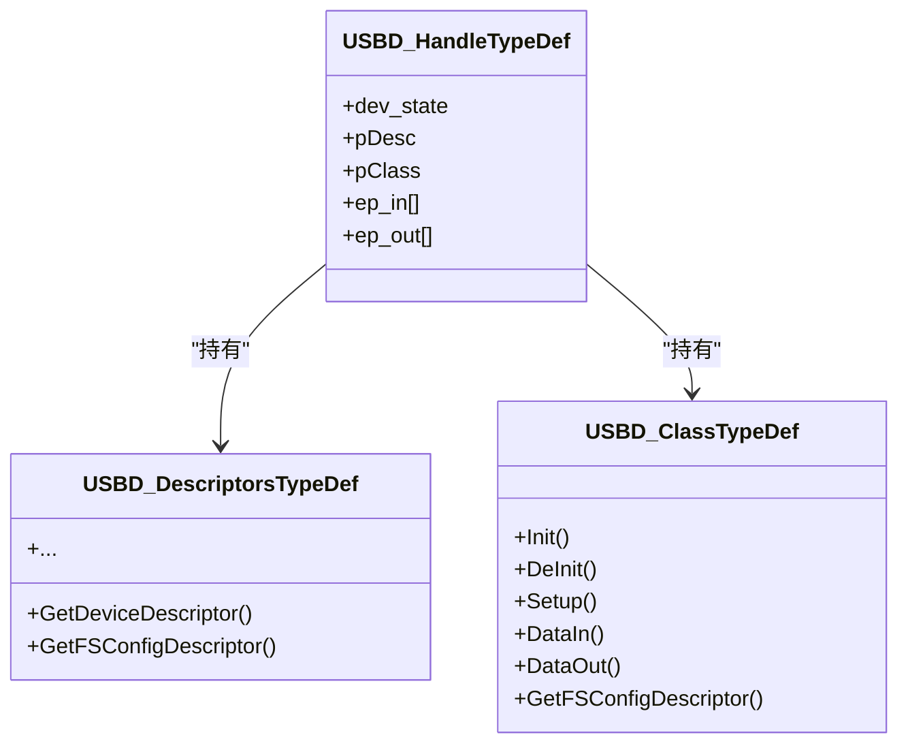
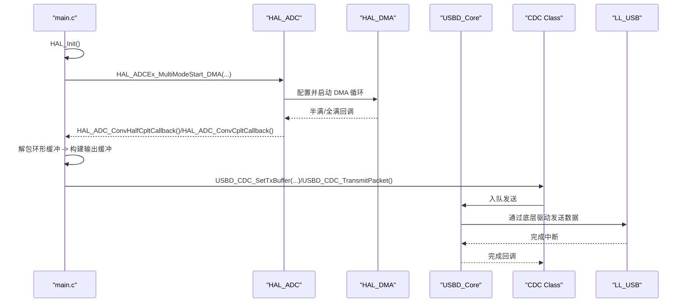
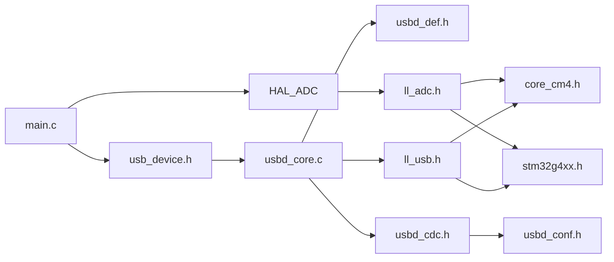

# 驱动程序和中间件

<cite>
**本文引用的文件**   
- [main.c](file://Core/Src/main.c)
- [main.h](file://Core/Inc/main.h)
- [stm32g4xx_hal_conf.h](file://Core/Inc/stm32g4xx_hal_conf.h)
- [stm32g4xx_hal.h](file://Drivers/STM32G4xx_HAL_Driver/Inc/stm32g4xx_hal.h)
- [stm32g4xx_hal_def.h](file://Drivers/STM32G4xx_HAL_Driver/Inc/stm32g4xx_hal_def.h)
- [stm32g4xx_hal.c](file://Drivers/STM32G4xx_HAL_Driver/Src/stm32g4xx_hal.c)
- [stm32g4xx_hal_adc.h](file://Drivers/STM32G4xx_HAL_Driver/Inc/stm32g4xx_hal_adc.h)
- [stm32g4xx_ll_adc.h](file://Drivers/STM32G4xx_HAL_Driver/Inc/stm32g4xx_ll_adc.h)
- [stm32g4xx_ll_usb.h](file://Drivers/STM32G4xx_HAL_Driver/Inc/stm32g4xx_ll_usb.h)
- [stm32g4xx_ll_dma.h](file://Drivers/STM32G4xx_HAL_Driver/Inc/stm32g4xx_ll_dma.h)
- [core_cm4.h](file://Drivers/CMSIS/Include/core_cm4.h)
- [stm32g4xx.h](file://Drivers/CMSIS/Device/ST/STM32G4xx/Include/stm32g4xx.h)
- [usbd_core.c](file://Middlewares/ST/STM32_USB_Device_Library/Core/Src/usbd_core.c)
- [usbd_def.h](file://Middlewares/ST/STM32_USB_Device_Library/Core/Inc/usbd_def.h)
- [usbd_cdc.h](file://Middlewares/ST/STM32_USB_Device_Library/Class/CDC/Inc/usbd_cdc.h)
- [usb_device.h](file://USB_Device/App/usb_device.h)
- [usbd_desc.h](file://USB_Device/App/usbd_desc.h)
- [usbd_conf.h](file://USB_Device/Target/usbd_conf.h)
</cite>

## 目录
1. [简介](#简介)
2. [项目结构](#项目结构)
3. [核心组件](#核心组件)
4. [架构总览](#架构总览)
5. [详细组件分析](#详细组件分析)
6. [依赖关系分析](#依赖关系分析)
7. [性能考虑](#性能考虑)
8. [故障排查指南](#故障排查指南)
9. [结论](#结论)
10. [附录](#附录)

## 简介
本技术参考文档围绕 STM32 HAL 驱动库与 ST USB 设备中间件，系统阐述其分层架构、CMSIS 核心接口使用方式、USB 设备库的三层组织（核心层、类层、应用层），并提供关键 API 的使用指南、配置选项与扩展机制说明。文档同时包含架构图与调用流程图，帮助初学者快速上手，并为高级开发者提供底层定制与性能优化建议。

## 项目结构
本项目采用典型的 CubeMX 工程布局：
- Core：应用入口与系统初始化（main.c、中断与 MSP）
- Drivers：CMSIS 内核与设备定义、HAL 驱动与 LL 低层驱动
- Middlewares：ST USB 设备库（Core + CDC 类）
- USB_Device：应用侧 USB 设备封装、描述符与目标适配

图表来源
- [main.c:1-120](file://Core/Src/main.c#L1-L120)
- [usb_device.h:60-104](file://USB_Device/App/usb_device.h#L60-L104)
- [usbd_core.c:80-200](file://Middlewares/ST/STM32_USB_Device_Library/Core/Src/usbd_core.c#L80-L200)
- [usbd_def.h:280-313](file://Middlewares/ST/STM32_USB_Device_Library/Core/Inc/usbd_def.h#L280-L313)
- [usbd_cdc.h:140-160](file://Middlewares/ST/STM32_USB_Device_Library/Class/CDC/Inc/usbd_cdc.h#L140-L160)
- [stm32g4xx_hal.h:1-60](file://Drivers/STM32G4xx_HAL_Driver/Inc/stm32g4xx_hal.h#L1-L60)
- [stm32g4xx_ll_usb.h:1-60](file://Drivers/STM32G4xx_HAL_Driver/Inc/stm32g4xx_ll_usb.h#L1-L60)
- [core_cm4.h:160-200](file://Drivers/CMSIS/Include/core_cm4.h#L160-L200)
- [stm32g4xx.h:110-140](file://Drivers/CMSIS/Device/ST/STM32G4xx/Include/stm32g4xx.h#L110-L140)

章节来源
- [main.c:219-290](file://Core/Src/main.c#L219-L290)
- [usb_device.h:72-80](file://USB_Device/App/usb_device.h#L72-L80)
- [usbd_core.c:82-122](file://Middlewares/ST/STM32_USB_Device_Library/Core/Src/usbd_core.c#L82-L122)
- [usbd_def.h:285-312](file://Middlewares/ST/STM32_USB_Device_Library/Core/Inc/usbd_def.h#L285-L312)
- [usbd_cdc.h:140-160](file://Middlewares/ST/STM32_USB_Device_Library/Class/CDC/Inc/usbd_cdc.h#L140-L160)
- [stm32g4xx_hal.h:1-60](file://Drivers/STM32G4xx_HAL_Driver/Inc/stm32g4xx_hal.h#L1-L60)
- [stm32g4xx_ll_usb.h:1-60](file://Drivers/STM32G4xx_HAL_Driver/Inc/stm32g4xx_ll_usb.h#L1-L60)
- [core_cm4.h:160-200](file://Drivers/CMSIS/Include/core_cm4.h#L160-L200)
- [stm32g4xx.h:110-140](file://Drivers/CMSIS/Device/ST/STM32G4xx/Include/stm32g4xx.h#L110-L140)

## 核心组件
- HAL 通用初始化与时间基准：HAL_Init() 负责 Flash 预取/缓存、NVIC 优先级分组、SysTick 时基与 Msp 回调初始化。
- ADC/DMA 采集链路：通过 HAL_ADCEx_MultiModeStart_DMA 启动双 ADC 交错采样，DMA 循环写入环形缓冲，触发回调处理数据打包与传输。
- USB 设备栈：USBD_Init/USBD_RegisterClass/USBD_Start 完成设备栈初始化、类绑定与启动；CDC 类提供虚拟串口收发接口。
- 配置与适配：usbd_conf.h 提供内存、延时、调试等宏映射；usbd_desc.h 暴露描述符函数指针集合；usb_device.h 封装 MX_USB_Device_Init 供应用调用。

章节来源
- [stm32g4xx_hal.c:148-185](file://Drivers/STM32G4xx_HAL_Driver/Src/stm32g4xx_hal.c#L148-L185)
- [main.c:248-287](file://Core/Src/main.c#L248-L287)
- [usbd_core.c:82-200](file://Middlewares/ST/STM32_USB_Device_Library/Core/Src/usbd_core.c#L82-L200)
- [usbd_cdc.h:140-160](file://Middlewares/ST/STM32_USB_Device_Library/Class/CDC/Inc/usbd_cdc.h#L140-L160)
- [usbd_conf.h:90-135](file://USB_Device/Target/usbd_conf.h#L90-L135)
- [usbd_desc.h:100-125](file://USB_Device/App/usbd_desc.h#L100-L125)
- [usb_device.h:72-80](file://USB_Device/App/usb_device.h#L72-L80)

## 架构总览
下图展示从应用到内核的分层交互关系，以及 USB 设备栈在中间件中的位置。

图表来源
- [main.c:219-290](file://Core/Src/main.c#L219-L290)
- [usbd_core.c:82-200](file://Middlewares/ST/STM32_USB_Device_Library/Core/Src/usbd_core.c#L82-L200)
- [usbd_cdc.h:140-160](file://Middlewares/ST/STM32_USB_Device_Library/Class/CDC/Inc/usbd_cdc.h#L140-L160)
- [stm32g4xx_hal_adc.h:1-120](file://Drivers/STM32G4xx_HAL_Driver/Inc/stm32g4xx_hal_adc.h#L1-L120)
- [stm32g4xx_ll_usb.h:1-60](file://Drivers/STM32G4xx_HAL_Driver/Inc/stm32g4xx_ll_usb.h#L1-L60)
- [core_cm4.h:160-200](file://Drivers/CMSIS/Include/core_cm4.h#L160-L200)

## 详细组件分析

### HAL 驱动分层架构与职责
- 抽象层（HAL）：面向外设的统一 API，屏蔽具体寄存器差异，提供初始化、控制、状态查询与回调机制。典型如 ADC、DMA、RCC、GPIO 等模块。
- 适配层（MSP/Target）：用户或模板实现的硬件相关初始化（时钟、引脚、中断优先级、DMA 通道绑定等）。
- 驱动层（LL）：直接操作寄存器的轻量级驱动，用于高性能路径或精细控制。

图表来源
- [stm32g4xx_hal_def.h:38-109](file://Drivers/STM32G4xx_HAL_Driver/Inc/stm32g4xx_hal_def.h#L38-L109)
- [stm32g4xx_hal.c:148-185](file://Drivers/STM32G4xx_HAL_Driver/Src/stm32g4xx_hal.c#L148-L185)
- [stm32g4xx_hal_adc.h:1-120](file://Drivers/STM32G4xx_HAL_Driver/Inc/stm32g4xx_hal_adc.h#L1-L120)

章节来源
- [stm32g4xx_hal_def.h:38-109](file://Drivers/STM32G4xx_HAL_Driver/Inc/stm32g4xx_hal_def.h#L38-L109)
- [stm32g4xx_hal.c:148-185](file://Drivers/STM32G4xx_HAL_Driver/Src/stm32g4xx_hal.c#L148-L185)
- [stm32g4xx_hal_adc.h:1-120](file://Drivers/STM32G4xx_HAL_Driver/Inc/stm32g4xx_hal_adc.h#L1-L120)

### CMSIS 核心接口使用方法
- 寄存器访问宏：SET_BIT/CLEAR_BIT/MODIFY_REG/WRITE_REG/READ_REG 等，便于原子或组合式位操作。
- 内核功能：Systick/NVIC/FPU/MPU 相关宏与内联函数，由 core_cm4.h 暴露。
- 设备选择与版本：stm32g4xx.h 中按器件系列选择头文件并定义版本常量。

图表来源
- [stm32g4xx.h:170-200](file://Drivers/CMSIS/Device/ST/STM32G4xx/Include/stm32g4xx.h#L170-L200)
- [core_cm4.h:160-200](file://Drivers/CMSIS/Include/core_cm4.h#L160-L200)
- [stm32g4xx_hal.c:148-185](file://Drivers/STM32G4xx_HAL_Driver/Src/stm32g4xx_hal.c#L148-L185)

章节来源
- [stm32g4xx.h:170-200](file://Drivers/CMSIS/Device/ST/STM32G4xx/Include/stm32g4xx.h#L170-L200)
- [core_cm4.h:160-200](file://Drivers/CMSIS/Include/core_cm4.h#L160-L200)
- [stm32g4xx_hal.c:148-185](file://Drivers/STM32G4xx_HAL_Driver/Src/stm32g4xx_hal.c#L148-L185)

### ST USB 设备库架构设计（核心层/类层/应用层）
- 核心层（Core）：管理设备状态机、端点、描述符请求与类回调分发，提供 USBD_Init/RegisterClass/Start 等 API。
- 类层（Class）：以 CDC 为例，实现特定协议的数据与控制端点行为，暴露 USBD_CDC_TransmitPacket/SetTxBuffer 等接口。
- 应用层（App/Target）：提供描述符、类接口回调、目标适配（内存/延时/调试）与设备初始化封装。

图表来源
- [usbd_def.h:285-312](file://Middlewares/ST/STM32_USB_Device_Library/Core/Inc/usbd_def.h#L285-L312)
- [usbd_def.h:213-236](file://Middlewares/ST/STM32_USB_Device_Library/Core/Inc/usbd_def.h#L213-L236)
- [usbd_def.h:256-271](file://Middlewares/ST/STM32_USB_Device_Library/Core/Inc/usbd_def.h#L256-L271)

章节来源
- [usbd_def.h:285-312](file://Middlewares/ST/STM32_USB_Device_Library/Core/Inc/usbd_def.h#L285-L312)
- [usbd_def.h:213-236](file://Middlewares/ST/STM32_USB_Device_Library/Core/Inc/usbd_def.h#L213-L236)
- [usbd_def.h:256-271](file://Middlewares/ST/STM32_USB_Device_Library/Core/Inc/usbd_def.h#L256-L271)

### 关键 API 使用指南（含原型/参数/返回值）
- HAL_Init
  - 原型：HAL_StatusTypeDef HAL_Init(void)
  - 作用：初始化 Flash 缓存/预取、NVIC 优先级分组、SysTick 时基，并调用 HAL_MspInit。
  - 返回值：HAL_OK/HAL_ERROR。
  - 参考：[stm32g4xx_hal.c:148-185](file://Drivers/STM32G4xx_HAL_Driver/Src/stm32g4xx_hal.c#L148-L185)

- HAL_ADCEx_MultiModeStart_DMA
  - 原型：HAL_StatusTypeDef HAL_ADCEx_MultiModeStart_DMA(ADC_HandleTypeDef* hadc, uint32_t* pData, uint32_t Length)
  - 作用：启动多模式（主从）ADC 转换并通过 DMA 将结果写入 pData。
  - 参数：hadc 为 ADC 句柄；pData 为 DMA 目标缓冲；Length 为样本数。
  - 返回值：HAL_OK/HAL_ERROR/HAL_BUSY/HAL_TIMEOUT。
  - 参考：[stm32g4xx_hal_adc.h:1-120](file://Drivers/STM32G4xx_HAL_Driver/Inc/stm32g4xx_hal_adc.h#L1-L120)

- HAL_ADC_ConvHalfCpltCallback / HAL_ADC_ConvCpltCallback
  - 原型：void HAL_ADC_ConvHalfCpltCallback(ADC_HandleTypeDef* hadc)
  - 作用：DMA 半满/全满回调，用于数据处理与流控。
  - 参考：[main.c:136-149](file://Core/Src/main.c#L136-L149)

- USBD_Init
  - 原型：USBD_StatusTypeDef USBD_Init(USBD_HandleTypeDef *pdev, USBD_DescriptorsTypeDef *pdesc, uint8_t id)
  - 作用：初始化 USB 设备栈，设置描述符与初始状态，调用底层 USBD_LL_Init。
  - 返回值：USBD_OK/USBD_FAIL 等。
  - 参考：[usbd_core.c:82-122](file://Middlewares/ST/STM32_USB_Device_Library/Core/Src/usbd_core.c#L82-L122)

- USBD_RegisterClass
  - 原型：USBD_StatusTypeDef USBD_RegisterClass(USBD_HandleTypeDef *pdev, USBD_ClassTypeDef *pclass)
  - 作用：将类驱动与设备核心关联，获取配置描述符。
  - 参考：[usbd_core.c:159-194](file://Middlewares/ST/STM32_USB_Device_Library/Core/Src/usbd_core.c#L159-L194)

- USBD_CDC_TransmitPacket / USBD_CDC_SetTxBuffer
  - 原型：uint8_t USBD_CDC_TransmitPacket(USBD_HandleTypeDef *pdev); uint8_t USBD_CDC_SetTxBuffer(USBD_HandleTypeDef *pdev, uint8_t *pbuff, uint32_t length)
  - 作用：设置发送缓冲区并触发一次 CDC IN 数据包发送。
  - 参考：[usbd_cdc.h:149-158](file://Middlewares/ST/STM32_USB_Device_Library/Class/CDC/Inc/usbd_cdc.h#L149-L158)

- MX_USB_Device_Init
  - 原型：void MX_USB_Device_Init(void)
  - 作用：应用侧 USB 设备初始化封装，内部调用 USBD_Init/RegisterClass/Start 等。
  - 参考：[usb_device.h:72-80](file://USB_Device/App/usb_device.h#L72-L80)

章节来源
- [stm32g4xx_hal.c:148-185](file://Drivers/STM32G4xx_HAL_Driver/Src/stm32g4xx_hal.c#L148-L185)
- [stm32g4xx_hal_adc.h:1-120](file://Drivers/STM32G4xx_HAL_Driver/Inc/stm32g4xx_hal_adc.h#L1-L120)
- [main.c:136-149](file://Core/Src/main.c#L136-L149)
- [usbd_core.c:82-122](file://Middlewares/ST/STM32_USB_Device_Library/Core/Src/usbd_core.c#L82-L122)
- [usbd_core.c:159-194](file://Middlewares/ST/STM32_USB_Device_Library/Core/Src/usbd_core.c#L159-L194)
- [usbd_cdc.h:149-158](file://Middlewares/ST/STM32_USB_Device_Library/Class/CDC/Inc/usbd_cdc.h#L149-L158)
- [usb_device.h:72-80](file://USB_Device/App/usb_device.h#L72-L80)

### 驱动库配置选项与扩展机制
- USB 设备配置（usbd_conf.h）
  - 接口/配置数量、字符串长度、调试级别、LPM 支持、自供电等宏。
  - 内存/延时/日志宏映射至 HAL 或自定义实现。
  - 参考：[usbd_conf.h:66-135](file://USB_Device/Target/usbd_conf.h#L66-L135)

- 描述符与类接口（usbd_desc.h / usbd_cdc_if.h）
  - 描述符函数指针集合 USBD_DescriptorsTypeDef 由应用实现并注入核心。
  - CDC 类接口 USBD_CDC_ItfTypeDef 提供 Init/Control/Receive/TransmitCplt 回调钩子。
  - 参考：[usbd_desc.h:100-125](file://USB_Device/App/usbd_desc.h#L100-L125)、[usbd_cdc.h:102-125](file://Middlewares/ST/STM32_USB_Device_Library/Class/CDC/Inc/usbd_cdc.h#L102-L125)

- HAL 扩展（MSP）
  - HAL_MspInit 在 HAL_Init 中被调用，用于外设时钟、引脚、中断等硬件相关初始化。
  - 参考：[stm32g4xx_hal.c:178-180](file://Drivers/STM32G4xx_HAL_Driver/Src/stm32g4xx_hal.c#L178-L180)

章节来源
- [usbd_conf.h:66-135](file://USB_Device/Target/usbd_conf.h#L66-L135)
- [usbd_desc.h:100-125](file://USB_Device/App/usbd_desc.h#L100-L125)
- [usbd_cdc.h:102-125](file://Middlewares/ST/STM32_USB_Device_Library/Class/CDC/Inc/usbd_cdc.h#L102-L125)
- [stm32g4xx_hal.c:178-180](file://Drivers/STM32G4xx_HAL_Driver/Src/stm32g4xx_hal.c#L178-L180)

### 数据采集与 USB 传输流程（序列图）

图表来源
- [main.c:248-287](file://Core/Src/main.c#L248-L287)
- [main.c:136-149](file://Core/Src/main.c#L136-L149)
- [usbd_cdc.h:149-158](file://Middlewares/ST/STM32_USB_Device_Library/Class/CDC/Inc/usbd_cdc.h#L149-L158)
- [usbd_core.c:82-122](file://Middlewares/ST/STM32_USB_Device_Library/Core/Src/usbd_core.c#L82-L122)
- [stm32g4xx_ll_usb.h:1-60](file://Drivers/STM32G4xx_HAL_Driver/Inc/stm32g4xx_ll_usb.h#L1-L60)

## 依赖关系分析
- 应用对 HAL 与 USB 设备封装的依赖清晰，USB 核心通过函数指针与类接口解耦。
- HAL 依赖 LL 进行寄存器级操作，LL 依赖 CMSIS 内核接口与设备头文件。
- USB 配置宏集中管理，降低耦合度，便于移植与裁剪。

图表来源
- [main.c:219-290](file://Core/Src/main.c#L219-L290)
- [usb_device.h:60-104](file://USB_Device/App/usb_device.h#L60-L104)
- [usbd_core.c:82-200](file://Middlewares/ST/STM32_USB_Device_Library/Core/Src/usbd_core.c#L82-L200)
- [usbd_def.h:280-313](file://Middlewares/ST/STM32_USB_Device_Library/Core/Inc/usbd_def.h#L280-L313)
- [usbd_cdc.h:140-160](file://Middlewares/ST/STM32_USB_Device_Library/Class/CDC/Inc/usbd_cdc.h#L140-L160)
- [usbd_conf.h:90-135](file://USB_Device/Target/usbd_conf.h#L90-L135)
- [stm32g4xx_ll_adc.h:1-60](file://Drivers/STM32G4xx_HAL_Driver/Inc/stm32g4xx_ll_adc.h#L1-L60)
- [stm32g4xx_ll_usb.h:1-60](file://Drivers/STM32G4xx_HAL_Driver/Inc/stm32g4xx_ll_usb.h#L1-L60)
- [core_cm4.h:160-200](file://Drivers/CMSIS/Include/core_cm4.h#L160-L200)
- [stm32g4xx.h:110-140](file://Drivers/CMSIS/Device/ST/STM32G4xx/Include/stm32g4xx.h#L110-L140)

章节来源
- [main.c:219-290](file://Core/Src/main.c#L219-L290)
- [usb_device.h:60-104](file://USB_Device/App/usb_device.h#L60-L104)
- [usbd_core.c:82-200](file://Middlewares/ST/STM32_USB_Device_Library/Core/Src/usbd_core.c#L82-L200)
- [usbd_def.h:280-313](file://Middlewares/ST/STM32_USB_Device_Library/Core/Inc/usbd_def.h#L280-L313)
- [usbd_cdc.h:140-160](file://Middlewares/ST/STM32_USB_Device_Library/Class/CDC/Inc/usbd_cdc.h#L140-L160)
- [usbd_conf.h:90-135](file://USB_Device/Target/usbd_conf.h#L90-L135)
- [stm32g4xx_ll_adc.h:1-60](file://Drivers/STM32G4xx_HAL_Driver/Inc/stm32g4xx_ll_adc.h#L1-L60)
- [stm32g4xx_ll_usb.h:1-60](file://Drivers/STM32G4xx_HAL_Driver/Inc/stm32g4xx_ll_usb.h#L1-L60)
- [core_cm4.h:160-200](file://Drivers/CMSIS/Include/core_cm4.h#L160-L200)
- [stm32g4xx.h:110-140](file://Drivers/CMSIS/Device/ST/STM32G4xx/Include/stm32g4xx.h#L110-L140)

## 性能考虑
- DMA 循环缓冲与半满/全满回调结合，减少 CPU 干预，提高吞吐。
- 批量组装输出缓冲后一次性发送，降低 USB 端点队列压力。
- 合理配置 CDC 端点最大包长与时序参数，匹配主机期望速率。
- 使用 LL 路径替代 HAL 热点路径，可进一步降低开销（需谨慎评估可维护性）。

## 故障排查指南
- HAL 错误处理：统一进入 Error_Handler，必要时挂起中断并定位问题。
- USB 调试日志：通过 usbd_conf.h 的 USBD_UsrLog/USBD_ErrLog/USBD_DbgLog 分级输出。
- 回调未触发：检查 DMA/ADC 中断优先级与使能、回调函数是否被覆盖、端点配置是否正确。
- 描述符不生效：确认 USBD_DescriptorsTypeDef 已正确注入且 GetFSConfigDescriptor 返回有效指针。

章节来源
- [main.c:530-539](file://Core/Src/main.c#L530-L539)
- [usbd_conf.h:112-135](file://USB_Device/Target/usbd_conf.h#L112-L135)
- [usbd_core.c:82-122](file://Middlewares/ST/STM32_USB_Device_Library/Core/Src/usbd_core.c#L82-L122)

## 结论
本仓库展示了基于 HAL 与 ST USB 设备中间件的完整开发范式：上层应用聚焦业务逻辑，中间件提供稳定可靠的协议栈，驱动层通过 HAL/LL 分层兼顾易用性与性能。遵循本文档的分层理念与最佳实践，可在保证可维护性的前提下实现高效稳定的嵌入式系统。

## 附录
- 入门建议
  - 先跑通 HAL_Init 与最小外设（LED/UART），再引入 ADC+DMA 采集。
  - 使用 MX_USB_Device_Init 快速搭建 USB 设备，逐步替换描述符与类接口。
- 进阶定制
  - 通过 usbd_conf.h 调整内存与调试策略。
  - 在热点路径使用 LL 直接操作寄存器，注意对齐与原子性要求。
  - 利用回调与标志位实现异步流水线，避免阻塞主循环。